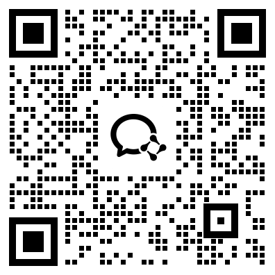

# コントリビューターガイド

_SWIFT への PR、バグ報告、ドキュメントの補足、その他さまざまな形でのコントリビューションを歓迎します！_

## 目次
- [行動規範](#-行動規範)
- [コントリビューションの流れ](#-コントリビューションの流れ)
- [ハードウェアサポート](#-ハードウェアサポート)

## 📖 行動規範
[行動規範のドキュメント](./CODE_OF_CONDUCT.md)を参照してください。

## 🔁 コントリビューションの流れ
### 私たちが求めているもの
- 新しい技術や新しいモデル: SWIFT は、より多くのオープンソースのモデルやデータセット、あるいは私たちがまだ着目できていない新しい技術のサポートを必要としています。ご興味があれば PR を送ってください。
- 技術の普及: 技術の普及にご興味があれば、任意のウェブサイトでチュートリアル、ドキュメント、動画を作成していただき、そのリンクをお送りください。
- コミュニティへの貢献: SWIFT に関連する技術記事を執筆して投稿していただけます。レビューを経て承認されたものは、ModelScope の公式アカウント（知乎、WeChat など）にあなたの名前を明記して公開します。

### インセンティブ
- ModelScope コミュニティを代表して、無私の貢献への感謝としてコントリビューターに電子証明書を発行します。
- ModelScope コミュニティに関連するささやかな記念品を贈呈します。
- 開発期間中は A10 の計算リソースを無償で提供します。詳細は[ハードウェアサポート](#-ハードウェアサポート)のセクションを参照してください。

### PR（Pull Request）の提出

機能開発はすべて、GitHub 上で Fork したうえで PR を送る形で行います。
1. Fork: [ms-swift](https://github.com/modelscope/ms-swift) のページにアクセスし、**Fork ボタン**をクリックします。完了すると、あなたの個人組織配下に SWIFT のコードリポジトリが複製されます。
2. Clone: 手順 1 で生成されたコードリポジトリをローカルに clone し、開発用に**新しいブランチを作成**します。開発中は適宜 **Sync Fork ボタン**をクリックして `main` ブランチと同期し、コードが古くなって競合が発生するのを防いでください。
3. PR の提出: 開発とテストが完了したら、コードをリモートブランチに push します。GitHub の **Pull Requests ページ**で新しい PR を作成し、あなたのコードのブランチをソースブランチ、`modelscope/ms-swift:main` ブランチをターゲットブランチとして選択します。

4. 説明の記載: レビュアーが変更内容を把握できるように、PR には適切な機能説明を記載する必要があります。
5. レビュー: マージされるコードは簡潔かつ効率的であることが望ましいため、いくつか質問を投げかけて議論する場合があります。レビューで指摘される事項はコードそのものに向けられたものであり、あなた個人に向けられたものではないことにご留意ください。すべての指摘事項について議論・解決されると、あなたのコードは承認されます。

### コーディング規約と開発方針
SWIFT には変数の命名規則と開発方針があります。開発の際は可能な限りこれらの方針に従ってください。
1. 変数名はアンダースコアで区切り、クラス名は各単語の先頭を大文字にします。
2. Python のインデントはすべてタブではなく半角スペース 4 つを使用します。
3. よく知られたオープンソースライブラリを選び、クローズドソースのライブラリや不安定なオープンソースライブラリの使用は避け、既存コードの重複も避けてください。

PR を提出すると、SWIFT では 2 種類のテストが実行されます。
- Code Lint Test: 静的なコード規約チェックのテストです。あらかじめローカルで code lint を実行しておいてください。
```shell
pip install pre-commit # swift フォルダ内で実行
pre-commit run --all-files # すべてのチェックが成功するまで、pre-commit が報告するエラーを修正してください
```
- CI Tests: スモークテストとユニットテストです。次のセクションを参照してください。

### CI テストの実行
PR を提出する前に、新機能のスモークテストやさまざまなエッジケースのユニットテストなど、開発したコードがテストケースで保護されていることを確認してください。レビュアーもコードレビューの際にこの点に注目します。同時に、専用のサービスが CI テストを実行してすべてのテストケースを実行し、テストケースが通過して初めてコードをマージできます。

## ✅ ハードウェアサポート

ModelScope は開発者に対して A10 GPU の計算リソースを無償で提供しています。詳細は [ModelScope Notebook](https://modelscope.cn/my/mynotebook) を参照してください。

ms-swift 学習 WeChat グループ:

<p align="left">

</p>
