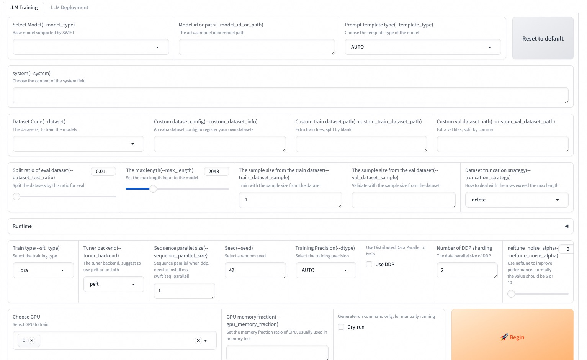

# SWIFT (Scalable lightWeight Infrastructure for Fine-Tuning)

<p align="center">
    <br>
    
    <br>
<p>
<p align="center">
<a href="https://modelscope.cn/home">ModelScope Community Website</a>
<br>
        <a href="README_CN.md">中文</a> &nbsp ｜ &nbsp English &nbsp
</p>

<p align="center">


<a href="https://github.com/modelscope/modelscope/"></a>
<a href="https://pypi.org/project/ms-swift/"></a>
<a href="https://github.com/modelscope/swift/blob/main/LICENSE"></a>
<a href="https://pepy.tech/project/ms-swift"></a>
<a href="https://github.com/modelscope/swift/pulls"></a>
</p>

<p align="center">
<a href="https://trendshift.io/repositories/6427" target="_blank"></a>
</p>

## 📖 Table of Contents
- [Introduction](#-introduction)
- [News](#-news)
- [Installation](#%EF%B8%8F-installation)
- [Getting Started](#-getting-started)
- [Documentation](#-documentation)
- [License](#-License)
- [Citation](#-citation)
- [WeChat Group](#-Wechat-Group)

## 📝 Introduction
SWIFT supports training, inference, evaluation and deployment of **300+ LLMs and 50+ MLLMs** (multimodal large models). Developers can directly apply our framework to their own research and production environments to realize the complete workflow from model training and evaluation to application. In addition to supporting the lightweight training solutions provided by [PEFT](https://github.com/huggingface/peft), we also provide a complete **Adapters library** to support the latest training techniques such as NEFTune, LoRA+, LLaMA-PRO, etc. This adapter library can be used directly in your own custom workflow without our training scripts.

To facilitate use by users unfamiliar with deep learning, we provide a Gradio web-ui for controlling training and inference, as well as accompanying deep learning courses and best practices for beginners.

Additionally, we are expanding capabilities for other modalities. Currently, we support full-parameter training and LoRA training for AnimateDiff.

SWIFT has rich documentations for users, please check [here](https://github.com/modelscope/swift/tree/main/docs/source_en/LLM/index.md).

SWIFT web-ui is available both on [Huggingface space](https://huggingface.co/spaces/tastelikefeet/swift) and [ModelScope studio](https://www.modelscope.cn/studios/iic/Scalable-lightWeight-Infrastructure-for-Fine-Tuning/summary), please feel free to try!

## 🎉 News
- 2024.07.08: Support internlm-xcomposer2_5-7b-chat. You can check the best practice [here](docs/source_en/Multi-Modal/internlm-xcomposer2-best-practice.md).
- 2024.07.06: Support for the llava-next-video series models: llava-next-video-7b-instruct, llava-next-video-7b-32k-instruct, llava-next-video-7b-dpo-instruct, llava-next-video-34b-instruct. You can refer to [llava-video best practice](docs/source_en/Multi-Modal/llava-video-best-practice.md) for more information.
- 2024.07.06: Support internvl2 series: internvl2-2b, internvl2-4b, internvl2-8b, internvl2-26b.
- 2024.07.06: Support codegeex4-9b-chat.
- 2024.07.04: Support internlm2_5-7b series: internlm2_5-7b, internlm2_5-7b-chat, internlm2_5-7b-chat-1m.
- 2024.07.02: Support for using vLLM for accelerating inference and deployment of multimodal large models such as the llava series and phi3-vision models. You can refer to the [Multimodal & vLLM Inference Acceleration Documentation](docs/source_en/Multi-Modal/vllm-inference-acceleration.md) for more information.
- 2024.07.02: Support for `llava1_6-vicuna-7b-instruct`, `llava1_6-vicuna-13b-instruct` and other llava-hf models. For best practices, refer to [here](docs/source_en/Multi-Modal/llava-best-practice.md).
- 🔥2024.06.29: Support [eval-scope](https://github.com/modelscope/eval-scope)&[open-compass](https://github.com/open-compass/opencompass) for evaluation! Now we have supported over 50 eval datasets like `BoolQ, ocnli, humaneval, math, ceval, mmlu, gsk8k, ARC_e`, please check our [Eval Doc](https://github.com/modelscope/swift/blob/main/docs/source_en/LLM/LLM-eval.md) to begin! Next sprint we will support Multi-modal and Agent evaluation, remember to follow us : )
- 🔥2024.06.28: Support for **Florence** series model! See [document](docs/source_en/Multi-Modal/florence-best-pratice.md)
- 🔥2024.06.28: Support for Gemma2 series models: gemma2-9b, gemma2-9b-instruct, gemma2-27b, gemma2-27b-instruct.
- 🔥2024.06.18: Supports **DeepSeek-Coder-v2** series model! Use model_type `deepseek-coder-v2-instruct` and `deepseek-coder-v2-lite-instruct` to begin.
- 🔥2024.06.16: Supports **KTO** and **CPO** training! See [document](https://github.com/modelscope/swift/blob/main/docs/source_en/LLM/Human-Preference-Alignment-Training-Documentation.md) to start training!
- 2024.06.11: Support for tool-calling agent deployment that conform to the OpenAI interface.You can refer to [Agent deployment best practice](https://github.com/modelscope/swift/blob/main/docs/source_en/LLM/Agent-deployment-best-practice.md)
- 🔥2024.06.07: Support **Qwen2** series LLM, including Base and Instruct models of 0.5B, 1.5B, 7B, and 72B, as well as corresponding quantized versions gptq-int4, gptq-int8, and awq-int4. The best practice for self-cognition fine-tuning, inference and deployment of Qwen2-72B-Instruct using dual-card 80GiB A100 can be found [here](https://github.com/modelscope/swift/issues/1092).
- 🔥2024.06.05: Support for **glm4** series LLM and glm4v-9b-chat MLLM. You can refer to [glm4v best practice](docs/source_en/Multi-Modal/glm4v-best-practice.md).
- 🔥2024.06.01: Supports **SimPO** training! See [document](https://github.com/modelscope/swift/blob/main/docs/source_en/LLM/SimPO.md) to start training!
- 🔥2024.06.01: Support for deploying large multimodal models, please refer to the [Multimodal Deployment Documentation](docs/source_en/Multi-Modal/mutlimodal-deployment.md) for more information.
- 2024.05.31: Supports Mini-Internvl model, Use model_type `mini-internvl-chat-2b-v1_5` and `mini-internvl-chat-4b-v1_5`to train.
<details><summary>More</summary>

- 2024.05.24: Supports Phi3-vision model, Use model_type `phi3-vision-128k-instruct` to train.
- 2024.05.22: Supports DeepSeek-V2-Lite series models, model_type are `deepseek-v2-lite` and `deepseek-v2-lite-chat`
- 2024.05.22: Supports TeleChat-12B-v2 model with quantized version, model_type are `telechat-12b-v2` and `telechat-12b-v2-gptq-int4`
- 🔥2024.05.21: Inference and fine-tuning support for MiniCPM-Llama3-V-2_5 are now available. For more details, please refer to [minicpm-v-2.5 Best Practice](docs/source/Multi-Modal/minicpm-v-2.5最佳实践.md).
- 🔥2024.05.20: Support for inferencing and fine-tuning cogvlm2-llama3-chinese-chat-19B, cogvlm2-llama3-chat-19B. you can refer to [cogvlm2 Best Practice](docs/source_en/Multi-Modal/cogvlm2-best-practice.md).
- 🔥2024.05.17: Support peft=0.11.0. Meanwhile support 3 new tuners: `BOFT`, `Vera` and `Pissa`. use `--sft_type boft/vera` to use BOFT or Vera, use `--init_lora_weights pissa` with `--sft_type lora` to use Pissa.
- 2024.05.16: Supports Llava-Next (Stronger) series models. For best practice, you can refer to [here](https://github.com/modelscope/swift/tree/main/docs/source_en/Multi-Modal/llava-best-practice.md).
- 🔥2024.05.13: Support Yi-1.5 series models，use `--model_type yi-1_5-9b-chat` to begin!
- 2024.05.11: Support for qlora training and quantized inference using [hqq](https://github.com/mobiusml/hqq) and [eetq](https://github.com/NetEase-FuXi/EETQ). For more information, see the [LLM Quantization Documentation](https://github.com/modelscope/swift/tree/main/docs/source_en/LLM/LLM-quantization.md).
- 2024.05.10: Support split a sequence to multiple GPUs to reduce memory usage. Use this feature by `pip install .[seq_parallel]`, then add `--sequence_parallel_size n` to your DDP script to begin!
- 2024.05.08: Support DeepSeek-V2-Chat model, you can refer to [this script](https://github.com/modelscope/swift/blob/main/examples/pytorch/llm/scripts/deepseek-v2-chat/lora_ddp_ds3/sft.sh).Support InternVL-Chat-V1.5-Int8 model, for best practice, you can refer to [here](https://github.com/modelscope/swift/tree/main/docs/source_en/Multi-Modal/internvl-best-practice.md).
- 🔥2024.05.07: Supoprts **ORPO** training! See [document](https://github.com/modelscope/swift/blob/main/docs/source_en/LLM/ORPO.md) to start training!
- 2024.05.07: Supports Llava-Llama3 model from xtuner，model_type is `llava-llama-3-8b-v1_1`.
- 2024.04.29: Supports inference and fine-tuning of InternVL-Chat-V1.5 model. For best practice, you can refer to [here](https://github.com/modelscope/swift/tree/main/docs/source_en/Multi-Modal/internvl-best-practice.md).
- 🔥2024.04.26: Support **LISA** and **unsloth** training! Specify `--lisa_activated_layers=2` to use LISA(to reduce the memory cost to 30 percent!), specify `--tuner_backend unsloth` to use unsloth to train a huge model(full or lora) with lesser memory(30 percent or lesser) and faster speed(5x)!
- 🔥2024.04.26: Support the fine-tuning and inference of Qwen1.5-110B and Qwen1.5-110B-Chat model, use [this script](https://github.com/modelscope/swift/blob/main/examples/pytorch/llm/scripts/qwen1half_110b_chat/lora_ddp_ds/sft.sh) to start training!
- 2024.04.24: Support for inference and fine-tuning of Phi3 series models. Including: [phi3-4b-4k-instruct](examples/pytorch/llm/scripts/phi3_4b_4k_instruct/lora), phi3-4b-128k-instruct.
- 2024.04.22: Support for inference, fine-tuning, and deployment of **chinese-llama-alpaca-2** series models. This includes：chinese-llama-2-1.3b, chinese-llama-2-7b, chinese-llama-2-13b, chinese-alpaca-2-1.3b, chinese-alpaca-2-7b and chinese-alpaca-2-13b along with their corresponding 16k and 64k long text versions.
- 2024.04.22: Support for inference and fine-tuning of Llama3 GPTQ-Int4, GPTQ-Int8, and AWQ series models. Support for inference and fine-tuning of chatglm3-6b-128k, Openbuddy-Llama3.
- 2024.04.20: Support for inference, fine-tuning, and deployment of **Atom** series models. This includes: Atom-7B and Atom-7B-Chat. use [this script](https://github.com/modelscope/swift/blob/main/examples/pytorch/llm/scripts/atom_7b_chat/lora/sft.sh) to train.
- 2024.04.19: Support for single-card, DDP, ZeRO2, and ZeRO3 training and inference with NPU, please refer to [NPU Inference and Fine-tuning Best Practice](docs/source_en/LLM/NPU-best-practice.md).
- 2024.04.19: Support for inference, fine-tuning, and deployment of **Llama3** series models. This includes: Llama-3-8B, Llama-3-8B-Instruct, Llama-3-70B, and Llama-3-70B-Instruct. use [this script](https://github.com/modelscope/swift/blob/main/examples/pytorch/llm/scripts/llama3_8b_instruct/lora/sft.sh) to train.
- 2024.04.18: Supported models: wizardlm2-7b-awq, wizardlm2-8x22b, yi-6b-chat-awq, yi-6b-chat-int8, yi-34b-chat-awq, yi-34b-chat-int8. Supported `--deepspeed zero3-offload` and provided default zero3-offload configuration file for zero3+cpu offload usage.
- 2024.04.18: Supported compatibility with HuggingFace ecosystem using the environment variable `USE_HF`, switching to use models and datasets from HF. Please refer to the [HuggingFace ecosystem compatibility documentation](https://github.com/modelscope/swift/tree/main/docs/source_en/LLM/Compat-HF.md).
- 2024.04.17: Support the evaluation for OpenAI standard interfaces. Check the [parameter documentation](docs/source_en/LLM/Command-line-parameters.md#eval-parameters) for details.
- 🔥2024.04.17: Support **CodeQwen1.5-7B** series: CodeQwen1.5-7B, CodeQwen1.5-7B-Chat,CodeQwen1.5-7B-Chat-AWQ, use [this script](https://github.com/modelscope/swift/blob/main/examples/pytorch/llm/scripts/codeqwen1half_7b_chat/lora/sft.sh) to train.
- 2024.04.16: Supports inference and fine-tuning of llava-v1.6-34b model. For best practice, you can refer to [here](https://github.com/modelscope/swift/tree/main/docs/source_en/Multi-Modal/llava-best-practice.md).
- 2024.04.13: Support the fine-tuning and inference of Mixtral-8x22B-v0.1 model, use [this script](https://github.com/modelscope/swift/blob/main/examples/pytorch/llm/scripts/mixtral_moe_8x22b_v1/lora_ddp_ds/sft.sh) to start training!
- 2024.04.13: Support the newly launched **MiniCPM** series: MiniCPM-V-2.0、MiniCPM-2B-128k、MiniCPM-MoE-8x2B and MiniCPM-1B.use [this script](https://github.com/modelscope/swift/blob/main/examples/pytorch/llm/scripts/minicpm_moe_8x2b/lora_ddp/sft.sh) to start training!
- 🔥2024.04.11: Support Model Evaluation with MMLU/ARC/CEval datasets(also user custom eval datasets) with one command! Check [this documentation](docs/source_en/LLM/LLM-eval.md) for details. Meanwhile, we support a trick way to do multiple ablation experiments, check [this documentation](docs/source_en/LLM/LLM-exp.md) to use.
- 🔥2024.04.11: Support **c4ai-command-r** series: c4ai-command-r-plus, c4ai-command-r-v01, use [this script](https://github.com/modelscope/swift/blob/main/examples/pytorch/llm/scripts/c4ai_command_r_plus/lora_mp/sft.sh) to train.
- 2024.04.10: Use SWIFT to fine-tune the qwen-7b-chat model to enhance its function call capabilities, and combine it with [Modelscope-Agent](https://github.com/modelscope/modelscope-agent) for best practices, which can be found [here](https://github.com/modelscope/swift/tree/main/docs/source_en/LLM/Agent-best-practice.md#Usage-with-Modelscope_Agent).
- 🔥2024.04.09: Support ruozhiba dataset. Search `ruozhiba` in [this documentation](docs/source_en/LLM/Supported-models-datasets.md) to begin training!
- 2024.04.08: Support the fine-tuning and inference of XVERSE-MoE-A4.2B model, use [this script](https://github.com/modelscope/swift/blob/main/examples/pytorch/llm/scripts/xverse_moe_a4_2b/lora/sft.sh) to start training!
- 2024.04.04: Support **QLoRA+FSDP** to train a 70B model with two 24G memory GPUs, use [this script](https://github.com/modelscope/swift/blob/main/examples/pytorch/llm/scripts/llama2_70b_chat/qlora_fsdp/sft.sh) to train.
- 🔥2024.04.03: Support **Qwen1.5-32B** series: Qwen1.5-32B, Qwen1.5-32B-Chat, Qwen1.5-32B-Chat-GPTQ-Int4.use [this script](https://github.com/modelscope/swift/blob/main/examples/pytorch/llm/scripts/qwen1half_32b_chat/lora_mp/sft.sh) to start training!
- 🔥2024.04.02: Support the fine-tuning and inference of Mengzi3-13B-Base model, use [this script](https://github.com/modelscope/swift/blob/main/examples/pytorch/llm/scripts/mengzi3_13b_base/lora_ddp_ds/sft.sh) to start training!
- 🔥2024.04.01: Support **dbrx** series: dbrx-base and dbrx-instruct, use [this script](https://github.com/modelscope/swift/blob/main/examples/pytorch/llm/scripts/dbrx-instruct/lora_mp/sft.sh) to start training!
- 🔥2024.03.29: Support **Qwen1.5-MoE** series: Qwen1.5-MoE-A2.7B, Qwen1.5-MoE-A2.7B-Chat, Qwen1.5-MoE-A2.7B-Chat-GPTQ-Int4.
- 🔥2024.03.29: Support the fine-tuning and inference of **Grok-1** 300B MoE, please view details [here](https://github.com/modelscope/swift/tree/main/docs/source_en/LLM/Grok-1-best-practice.md).
- 🔥2024.03.25: Supports inference and fine-tuning of TeleChat-7b and TeleChat-12b model, use [this script](https://github.com/modelscope/swift/blob/main/examples/pytorch/llm/scripts/telechat_12b/lora/sft.sh) to start training!
- 🔥2024.03.20: Supports inference and fine-tuning for the **llava** series. For best practice, you can refer to [here](https://github.com/modelscope/swift/tree/main/docs/source_en/Multi-Modal/llava-best-practice.md).
- 🔥2024.03.12: Support inference and fine-tuning for **deepseek-vl** series. Best practices can be found [here](docs/source_en/Multi-Modal/deepseek-vl-best-practice.md).
- 🔥2024.03.11: Support [GaLore](https://arxiv.org/abs/2403.03507) for effectively reducing memory usage to 1/2 of the original in full-parameter training.
- 🔥2024.03.10: [End-to-end best practices](docs/source_en/LLM/Qwen1.5-best-practice.md) from fine-tuning to deployment for Qwen1.5-7B-Chat and Qwen1.5-72B-Chat.
- 🔥2024.03.09: Support training and inference of MAMBA model, use [this script](https://github.com/modelscope/swift/blob/main/examples/pytorch/llm/scripts/mamba-1.4b/lora/sft.sh) to start training!
- 2024.03.09: Support training and inference of AQLM quantized model, use [this script](https://github.com/modelscope/swift/blob/main/examples/pytorch/llm/scripts/llama2_7b_aqlm_2bit_1x16/lora/sft.sh) to start training!
- 2024.03.06: Support training and inference of AWQ quantized model, use [this Qwen1.5-AWQ model script](https://github.com/modelscope/swift/blob/main/examples/pytorch/llm/scripts/qwen1half_7b_chat_awq/lora/sft.sh) to start training, and support training and inference of [yi-9b](https://github.com/modelscope/swift/blob/main/examples/pytorch/llm/scripts/yi_9b/lora_zero3).
- 🔥2024.02.29: Support [LLaMA PRO](https://arxiv.org/pdf/2401.02415.pdf), simply use [this script](https://github.com/modelscope/swift/blob/main/examples/pytorch/llm/scripts/yi_6b_chat/llamapro/sft.sh) to start training.
- 🔥2024.02.29: Support [LoRA+](https://arxiv.org/pdf/2402.12354.pdf), simply use [this script](https://github.com/modelscope/swift/blob/main/examples/pytorch/llm/scripts/yi_6b_chat/lorap/sft.sh) to start training.
- 2024.02.25: Support `swift export` to quantize models using **AWQ/GPTQ** and push to ModelScope Hub. See documentation: [LLM Quantization](docs/source_en/LLM/LLM-quantization.md).
- 2024.02.22: Support gemma series: gemma-2b, [gemma-2b-instruct](https://github.com/modelscope/swift/tree/main/examples/pytorch/llm/scripts/gemma_2b_instruct), gemma-7b, gemma-7b-instruct.
- 2024.02.16: Support deepseek-math series: deepseek-math-7b, deepseek-math-7b-instruct, deepseek-math-7b-chat.
- 🔥2024.02.05: Support **Qwen1.5** series models, see [model list](https://github.com/modelscope/swift/blob/main/docs/source/LLM/%E6%94%AF%E6%8C%81%E7%9A%84%E6%A8%A1%E5%9E%8B%E5%92%8C%E6%95%B0%E6%8D%AE%E9%9B%86.md#%E6%A8%A1%E5%9E%8B) for all supported Qwen1.5 models. Provide fine-tuning scripts for [qwen1half-7b-chat](https://github.com/modelscope/swift/tree/main/examples/pytorch/llm/scripts/qwen1half_7b_chat), [qwen1half-7b-chat-int8](https://github.com/modelscope/swift/tree/main/examples/pytorch/llm/scripts/qwen1half_7b_chat_int8).
- 2024.02.05: Support training of diffusion models such as **SDXL**, **SD**, **ControlNet**, as well as **DreamBooth** training. See corresponding [training scripts](https://github.com/modelscope/swift/tree/main/examples/pytorch/sdxl/scripts) for details.
- 2024.02.01: Support minicpm series: [minicpm-2b-sft-chat](https://github.com/modelscope/swift/tree/main/examples/pytorch/llm/scripts/minicpm_2b_sft_chat), minicpm-2b-chat.
- 🔥2024.02.01: Support dataset mixing to reduce **catastrophic forgetting**. Use `--train_dataset_mix_ratio 2.0` to enable training! We also open sourced the general knowledge dataset [ms-bench](https://www.modelscope.cn/datasets/iic/ms_bench/summary).
- 🔥2024.02.01: Support Agent training! Agent training algorithm is derived from this [paper](https://arxiv.org/pdf/2309.00986.pdf). We also added [ms-agent](https://www.modelscope.cn/datasets/iic/ms_agent/summary), a high-quality agent dataset. Use [this script](https://github.com/modelscope/swift/blob/main/examples/pytorch/llm/scripts/qwen_7b_chat/lora/sft.sh) to start Agent training!
- 🔥2024.02.01: Support adding SFT loss in DPO training to reduce repetitive generation caused by KL divergence loss.
- 2024.02.01: Support using AdaLoRA and IA3 adapters in training.
- 2024.02.01: Support `--merge_lora` parameter in AnimateDiff training.
- 2024.01.30: Support [internlm-xcomposer2-7b-chat](https://github.com/modelscope/swift/tree/main/examples/pytorch/llm/scripts/internlm_xcomposer2_7b_chat).
- 🔥2024.01.30: Support [ZeRO-3](https://github.com/modelscope/swift/tree/main/examples/pytorch/llm/scripts/qwen_14b_chat/full_ddp_zero3/), simply specify `--deepspeed default-zero3`.
- 2024.01.29: Support internlm2-math series: internlm2-math-7b, internlm2-math-7b-chat, internlm2-math-20b, internlm2-math-20b-chat.
- 🔥2024.01.26: Support [yi-vl-6b-chat](https://github.com/modelscope/swift/tree/main/examples/pytorch/llm/scripts/yi_vl_6b_chat), yi-vl-34b-chat.
- 2024.01.24: Support codefuse-codegeex2-6b-chat, codefuse-qwen-14b-chat.
- 2024.01.23: Support orion series: orion-14b, [orion-14b-chat](https://github.com/modelscope/swift/tree/main/examples/pytorch/llm/scripts/orion_14b_chat).
- 2024.01.20: Support [xverse-13b-256k](https://github.com/modelscope/swift/tree/main/examples/pytorch/llm/scripts/xverse_13b_256k), xverse-65b-v2, xverse-65b-chat.
- 🔥2024.01.17: Support internlm2 series: internlm2-7b-base, internlm2-7b, [internlm2-7b-sft-chat](https://github.com/modelscope/swift/tree/main/examples/pytorch/llm/scripts/internlm2_7b_sft_chat), internlm2-7b-chat, internlm2-20b-base, internlm2-20b, internlm2-20b-sft-chat, internlm2-20b-chat.
- 2024.01.15: Support yuan series: yuan2-2b-instruct, [yuan2-2b-janus-instruct](https://github.com/modelscope/swift/tree/main/examples/pytorch/llm/scripts/yuan2_2b_janus_instruct), yuan2-51b-instruct, yuan2-102b-instruct.
- 🔥2024.01.12: Support **deepseek-moe** series: deepseek-moe-16b, [deepseek-moe-16b-chat](https://github.com/modelscope/swift/tree/main/examples/pytorch/llm/scripts/deepseek_moe_16b_chat).
- 🔥2024.01.04: Support **VLLM deployment**, compatible with **OpenAI API** style, see [VLLM Inference Acceleration and Deployment](https://github.com/modelscope/swift/blob/main/docs/source_en/LLM/VLLM-inference-acceleration-and-deployment.md#Deployment) for details.
- 2024.01.04: Update [Benchmark](https://github.com/modelscope/swift/blob/main/docs/source/LLM/Benchmark.md) for convenient viewing of training speed and memory usage of different models.
- 🔥2023.12.29: Support web-ui for sft training and inference, use `swift web-ui` after installing ms-swift to start.
- 🔥2023.12.29: Support DPO RLHF (Reinforcement Learning from Human Feedback) and three datasets for this task: AI-ModelScope/stack-exchange-paired, AI-ModelScope/hh-rlhf and AI-ModelScope/hh_rlhf_cn. See [documentation](https://github.com/modelscope/swift/blob/main/docs/source_en/LLM/DPO.md) to start training!
- 🔥2023.12.28: Support SCEdit! This tuner can significantly reduce memory usage in U-Net and support low-memory controllable image generation (replacing ControlNet), read the section below to learn more.
- 2023.12.23: Support [codegeex2-6b](https://github.com/modelscope/swift/tree/main/examples/pytorch/llm/scripts/codegeex2_6b).
- 2023.12.19: Support [phi2-3b](https://github.com/modelscope/swift/tree/main/examples/pytorch/llm/scripts/phi2_3b).
- 2023.12.18: Support VLLM for inference acceleration.
- 2023.12.15: Support deepseek, deepseek-coder series: deepseek-7b, deepseek-7b-chat, deepseek-67b, deepseek-67b-chat, openbuddy-deepseek-67b-chat, deepseek-coder-1_3b, deepseek-coder-1_3b-instruct, deepseek-coder-6_7b, deepseek-coder-6_7b-instruct, deepseek-coder-33b, deepseek-coder-33b-instruct.
- 2023.12.13: Support mistral-7b-instruct-v2, [mixtral-moe-7b](https://github.com/modelscope/swift/tree/main/examples/pytorch/llm/scripts/mixtral_7b_moe), [mixtral-moe-7b-instruct](https://github.com/modelscope/swift/tree/main/examples/pytorch/llm/scripts/mixtral_7b_moe_instruct).
- 2023.12.09: Support `freeze_parameters` parameter as a compromise between lora and full-parameter training. Corresponding sh can be found in [full_freeze_ddp](https://github.com/modelscope/swift/tree/main/examples/pytorch/llm/scripts/qwen_7b_chat/full_freeze_ddp). Support `disable_tqdm`, `lazy_tokenize`, `preprocess_num_proc` parameters, see [command line arguments](https://github.com/modelscope/swift/blob/main/docs/source/LLM/%E5%91%BD%E4%BB%A4%E8%A1%8C%E5%8F%82%E6%95%B0.md) for details.
- 2023.12.08: Support [sus-34b-chat](https://github.com/modelscope/swift/tree/main/examples/pytorch/llm/scripts/sus_34b_chat), support yi-6b-200k, yi-34b-200k.
- 2023.12.07: Support [Multi-Node DDP training](https://github.com/modelscope/swift/blob/main/docs/source/LLM/LLM%E5%BE%AE%E8%B0%83%E6%96%87%E6%A1%A3.md#%E4%BD%BF%E7%94%A8cli).
- 2023.12.05: Support models: zephyr-7b-beta-chat, openbuddy-zephyr-7b-chat. Support datasets: hc3-zh, hc3-en.
- 🔥2023.12.02: [Self-cognition fine-tuning best practices](docs/source_en/LLM/Self-cognition-best-practice.md), **10 minutes to fine-tune a large model for self-cognition**, create your own unique large model.
- 🔥2023.11.30: Support training and inference of **qwen-1_8b**, **qwen-72b**, **qwen-audio** series models. Corresponding sh scripts can be found in [qwen_1_8b_chat](https://github.com/modelscope/swift/tree/main/examples/pytorch/llm/scripts/qwen_1_8b_chat), [qwen_72b_chat](https://github.com/modelscope/swift/tree/main/examples/pytorch/llm/scripts/qwen_72b_chat), [qwen_audio_chat](https://github.com/modelscope/swift/tree/main/examples/pytorch/llm/scripts/qwen_audio_chat)
- 🔥2023.11.29: Support training and inference of **AnimateDiff**
- 🔥2023.11.24: Support **yi-34b-chat**, **codefuse-codellama-34b-chat** models. Corresponding sh scripts can be found in [yi_34b_chat](https://github.com/modelscope/swift/tree/main/examples/pytorch/llm/scripts/yi_34b_chat), [codefuse_codellama_34b_chat](https://github.com/modelscope/swift/tree/main/examples/pytorch/llm/scripts/codefuse_codellama_34b_chat).
- 🔥2023.11.18: Support **tongyi-finance-14b** series models: tongyi-finance-14b, tongyi-finance-14b-chat, tongyi-finance-14b-chat-int4. Corresponding sh scripts can be found in [tongyi_finance_14b_chat_int4](https://github.com/modelscope/swift/tree/main/examples/pytorch/llm/scripts/tongyi_finance_14b_chat_int4).
- 2023.11.16: Support **flash attn** for more models: qwen series, qwen-vl series, llama series, openbuddy series, mistral series, yi series, ziya series. Please use `use_flash_attn` parameter.
- 🔥2023.11.11: Support **NEFTune**, simply use `Swift.prepare_model(model, NEFTuneConfig())` to enable.
- 🔥2023.11.11: Support training and inference by **command line** and inference by **Web-UI**, see `Usage with Swift CLI` section below for details.
- 🔥2023.11.10: Support **bluelm** series models: bluelm-7b, bluelm-7b-chat, bluelm-7b-32k, bluelm-7b-chat-32k. Corresponding sh scripts can be found in [bluelm_7b_chat](https://github.com/modelscope/swift/tree/main/examples/pytorch/llm/scripts/bluelm_7b_chat).
- 🔥2023.11.08: Support training and inference of **xverse-65b** model, script at [xverse_65b](https://github.com/modelscope/swift/tree/main/examples/pytorch/llm/scripts/xverse_65b).
- 🔥2023.11.07: Support training and inference of **yi-6b**, **yi-34b** models, scripts at [yi_6b](https://github.com/modelscope/swift/tree/main/examples/pytorch/llm/scripts/yi_6b), [yi_34b](https://github.com/modelscope/swift/tree/main/examples/pytorch/llm/scripts/yi_34b).
- 🔥2023.10.30: Support two new tuners: **QA-LoRA** and **LongLoRA**.
- 🔥2023.10.30: Support editing models using **ROME** (Rank One Model Editing) to infuse new knowledge into models without training!
- 2023.10.30: Support **skywork-13b** series models: skywork-13b, skywork-13b-chat. Corresponding sh scripts can be found in [skywork_13b](https://github.com/modelscope/swift/tree/main/examples/pytorch/llm/scripts/skywork_13b).
- 🔥2023.10.27: Support **chatglm3** series models: chatglm3-6b-base, chatglm3-6b, chatglm3-6b-32k. Corresponding sh scripts can be found in [chatglm3_6b](https://github.com/modelscope/swift/tree/main/examples/pytorch/llm/scripts/chatglm3_6b).
- 🔥2023.10.17: Support SFT of **int4**, **int8** models: qwen-7b-chat-int4, qwen-14b-chat-int4, qwen-vl-chat-int4, baichuan2-7b-chat-int4, baichuan2-13b-chat-int4, qwen-7b-chat-int8, qwen-14b-chat-int8.
- 2023.10.15: Support **ziya2-13b** series models: ziya2-13b, ziya2-13b-chat.
- 2023.10.12: Support **mistral-7b** series models: openbuddy-mistral-7b-chat, mistral-7b, mistral-7b-instruct.
- 🔥2023.10.07: Support **DeepSpeed ZeRO-2**, enabling lora (not just qlora) to run DDP on dual A10 cards.
- 2023.10.04: Support more math, law, SQL, code domain datasets: blossom-math-zh, school-math-zh, text2sql-en, sql-create-context-en, lawyer-llama-zh, tigerbot-law-zh, leetcode-python-en.
- 🔥2023.09.25: Support **qwen-14b** series: qwen-14b, qwen-14b-chat.
- 2023.09.18: Support **internlm-20b** series: internlm-20b, internlm-20b-chat.
- 2023.09.12: Support **MP+DDP** to accelerate full-parameter training.
- 2023.09.05: Support **openbuddy-llama2-70b-chat**.
- 2023.09.03: Support **baichuan2** series: baichuan2-7b, baichuan2-7b-chat, baichuan2-13b, baichuan2-13b-chat.
</details>

## 🛠️ Installation

SWIFT runs in the Python environment. Please ensure your Python version is higher than 3.8.

- Method 1: Install SWIFT using pip command:

```shell
# Full capabilities
pip install 'ms-swift[all]' -U
# LLM only
pip install 'ms-swift[llm]' -U
# AIGC only
pip install 'ms-swift[aigc]' -U
# Adapters only
pip install ms-swift -U
```

- Method 2: Install SWIFT through source code (convenient for running training and inference scripts), please run the following commands:

```shell
git clone https://github.com/modelscope/swift.git
cd swift
pip install -e '.[llm]'
```

SWIFT depends on torch>=1.13, recommend torch>=2.0.0.

- Method 3: Use SWIFT in our Docker image

```shell
# China-Hangzhou image
docker pull registry.cn-hangzhou.aliyuncs.com/modelscope-repo/modelscope:ubuntu22.04-cuda12.1.0-py310-torch2.1.2-tf2.14.0-1.13.1
# US-west image
docker pull registry.us-west-1.aliyuncs.com/modelscope-repo/modelscope:ubuntu22.04-cuda12.1.0-py310-torch2.1.2-tf2.14.0-1.13.1
```

## 🚀 Getting Started

This section introduces basic usage, see the [Documentation](#-documentation) section for more ways to use.

### Web-UI

Web-UI is a gradio-based interface for **zero-threshold** training and deployment. It is easy to use and perfectly supports multi-GPU training and deployment:

```shell
SWIFT_UI_LANG=en swift web-ui
```



### Training

#### Training Scripts
You can refer to the following scripts to customize your own training script.

- full: [qwen1half-7b-chat](https://github.com/modelscope/swift/tree/main/examples/pytorch/llm/scripts/qwen1half_7b_chat/full) (A100), [qwen-7b-chat](https://github.com/modelscope/swift/tree/main/examples/pytorch/llm/scripts/qwen_7b_chat/full_mp) (2\*A100)
- full+ddp+zero2: [qwen-7b-chat](https://github.com/modelscope/swift/tree/main/examples/pytorch/llm/scripts/qwen_7b_chat/full_ddp_zero2) (4\*A100)
- full+ddp+zero3: [qwen-14b-chat](https://github.com/modelscope/swift/tree/main/examples/pytorch/llm/scripts/qwen_14b_chat/full_ddp_zero3) (4\*A100)
- lora: [chatglm3-6b](https://github.com/modelscope/swift/tree/main/examples/pytorch/llm/scripts/chatglm3_6b/lora) (3090), [baichuan2-13b-chat](https://github.com/modelscope/swift/tree/main/examples/pytorch/llm/scripts/baichuan2_13b_chat/lora_mp) (2\*3090), [yi-34b-chat](https://github.com/modelscope/swift/tree/main/examples/pytorch/llm/scripts/yi_34b_chat/lora) (A100), [qwen-72b-chat](https://github.com/modelscope/swift/tree/main/examples/pytorch/llm/scripts/qwen_72b_chat/lora_mp) (2\*A100)
- lora+ddp: [chatglm3-6b](https://github.com/modelscope/swift/tree/main/examples/pytorch/llm/scripts/chatglm3_6b/lora_ddp) (2\*3090)
- lora+ddp+zero3: [qwen-14b-chat](https://github.com/modelscope/swift/tree/main/examples/pytorch/llm/scripts/qwen_14b_chat/lora_ddp_zero3) (4\*3090), [qwen-72b-chat](https://github.com/modelscope/swift/tree/main/examples/pytorch/llm/scripts/qwen_72b_chat/lora_ddp_zero3) (4\*A100)
- qlora(gptq-int4): [qwen-7b-chat-int4](https://github.com/modelscope/swift/tree/main/examples/pytorch/llm/scripts/qwen_7b_chat_int4/qlora) (3090)
- qlora(gptq-int8): [qwen1half-7b-chat-int8](https://github.com/modelscope/swift/tree/main/examples/pytorch/llm/scripts/qwen1half_7b_chat_int8/qlora) (3090)
- qlora(bnb-int4): [qwen-7b-chat](https://github.com/modelscope/swift/tree/main/examples/pytorch/llm/scripts/qwen_7b_chat/qlora) (3090)


#### Supported Training Processes

| Training Process | Training Method                                                               |
|------------------|-------------------------------------------------------------------------------|
| Pretraining      | Text Generation                                                               |
| Fine-tuning      | Single-turn/Multi-turn<br>Agent Training/Self-cognition<br>Multi-modal Vision/Multi-modal Speech|
| Human Alignment  | DPO<br>ORPO<br>SimPO                                                          |
| Text-to-Image    | DreamBooth, etc.                                                              |
| Text-to-Video    | -                                                                             |

#### Single GPU Training

Start single GPU fine-tuning with the following command:

LoRA:
```shell
# Experimental Environment: A100
# GPU Memory Requirement: 20GB
# Runtime: 3.1 hours
CUDA_VISIBLE_DEVICES=0 \
swift sft \
    --model_type qwen1half-7b-chat \
    --dataset blossom-math-zh \
    --num_train_epochs 5 \
    --sft_type lora \
    --output_dir output \
    --eval_steps 200 \
```

Full-parameter:
```shell
# Experimental Environment: A100
# GPU Memory Requirement: 80GB
# Runtime: 2.5 hours
CUDA_VISIBLE_DEVICES=0 \
swift sft \
    --model_type qwen1half-7b-chat \
    --dataset blossom-math-zh \
    --num_train_epochs 5 \
    --sft_type full \
    --output_dir output \
    --eval_steps 500 \
```


#### Model Parallel Training


```shell
# Experimental Environment: 2 * A100
# GPU Memory Requirement: 10GB + 13GB
# Runtime: 3.4 hours
CUDA_VISIBLE_DEVICES=0,1 \
swift sft \
    --model_type qwen1half-7b-chat \
    --dataset blossom-math-zh \
    --num_train_epochs 5 \
    --sft_type lora \
    --output_dir output \
```

#### Data Parallel Training

```shell
# Experimental Environment: 4 * A100
# GPU Memory Requirement: 4 * 30GB
# Runtime: 0.8 hours
NPROC_PER_NODE=4 \
CUDA_VISIBLE_DEVICES=0,1,2,3 \
swift sft \
    --model_type qwen1half-7b-chat \
    --dataset blossom-math-zh \
    --num_train_epochs 5 \
    --sft_type lora \
    --output_dir output \
```

Combining Model Parallelism and Data Parallelism:
```shell
# Experimental Environment: 4 * A100
# GPU Memory Requirement: 2*14GB + 2*18GB
# Runtime: 1.7 hours
NPROC_PER_NODE=2 \
CUDA_VISIBLE_DEVICES=0,1,2,3 \
swift sft \
    --model_type qwen1half-7b-chat \
    --dataset blossom-math-zh \
    --num_train_epochs 5 \
    --sft_type lora \
    --output_dir output \
```

#### Deepspeed Training
Deepspeed supports training of quantized GPTQ and AWQ models.

ZeRO2:
```shell
# Experimental Environment: 4 * A100
# GPU Memory Requirement: 4 * 21GB
# Runtime: 0.9 hours
NPROC_PER_NODE=4 \
CUDA_VISIBLE_DEVICES=0,1,2,3 \
swift sft \
    --model_type qwen1half-7b-chat \
    --dataset blossom-math-zh \
    --num_train_epochs 5 \
    --sft_type lora \
    --output_dir output \
    --deepspeed default-zero2 \
```

ZeRO3:
```shell
# Experimental Environment: 4 * A100
# GPU Memory Requirement: 4 * 19GB
# Runtime: 3.2 hours
NPROC_PER_NODE=4 \
CUDA_VISIBLE_DEVICES=0,1,2,3 \
swift sft \
    --model_type qwen1half-7b-chat \
    --dataset blossom-math-zh \
    --num_train_epochs 5 \
    --sft_type lora \
    --output_dir output \
    --deepspeed default-zero3 \
```

ZeRO3-Offload:
```shell
# Experimental Environment: 4 * A100
# GPU Memory Requirement: 4 * 12GB
# Runtime: 60 hours
NPROC_PER_NODE=4 \
CUDA_VISIBLE_DEVICES=0,1,2,3 \
swift sft \
    --model_id_or_path AI-ModelScope/WizardLM-2-8x22B \
    --dataset blossom-math-zh \
    --num_train_epochs 5 \
    --sft_type lora \
    --output_dir output \
    --deepspeed zero3-offload \
```


#### Multi-node Multi-GPU
```shell
# If multiple machines share a disk, please additionally specify `--save_on_each_node false`.
# node0
CUDA_VISIBLE_DEVICES=0,1,2,3,4,5,6,7 \
NNODES=2 \
NODE_RANK=0 \
MASTER_ADDR=127.0.0.1 \
NPROC_PER_NODE=8 \
swift sft \
    --model_type qwen1half-32b-chat \
    --sft_type full \
    --dataset blossom-math-zh \
    --output_dir output \
    --deepspeed default-zero3 \

# node1
CUDA_VISIBLE_DEVICES=0,1,2,3,4,5,6,7 \
NNODES=2 \
NODE_RANK=1 \
MASTER_ADDR=xxx.xxx.xxx.xxx \
NPROC_PER_NODE=8 \
swift sft \
    --model_type qwen1half-32b-chat \
    --sft_type full \
    --dataset blossom-math-zh \
    --output_dir output \
    --deepspeed default-zero3 \
```

##### AliYun-DLC multi-node training
In DLC product, WORLD_SIZE is the node number, RANK is the node index, this is different from the definition of torchrun.

```shell
NNODES=$WORLD_SIZE \
NODE_RANK=$RANK \
swift sft \
    --model_type qwen1half-32b-chat \
    --sft_type full \
    --dataset blossom-math-zh \
    --output_dir output \
    --deepspeed default-zero3
```


### Inference
Original model:
```shell
CUDA_VISIBLE_DEVICES=0 swift infer --model_type qwen1half-7b-chat
# use VLLM
CUDA_VISIBLE_DEVICES=0 swift infer --model_type qwen1half-7b-chat \
    --infer_backend vllm --max_model_len 8192
```

LoRA fine-tuned:
```shell
CUDA_VISIBLE_DEVICES=0 swift infer --ckpt_dir xxx/checkpoint-xxx --load_dataset_config true
# use VLLM
CUDA_VISIBLE_DEVICES=0 swift infer \
    --ckpt_dir xxx/checkpoint-xxx --load_dataset_config true \
    --merge_lora true --infer_backend vllm --max_model_len 8192
```

### Evaluation

Original model:
```shell
# We recommend using vLLM for acceleration (arc evaluated in half a minute)
CUDA_VISIBLE_DEVICES=0 swift eval --model_type qwen1half-7b-chat \
    --eval_dataset ARC_e --infer_backend vllm
```

LoRA fine-tuned:
```shell
CUDA_VISIBLE_DEVICES=0 swift eval --ckpt_dir xxx/checkpoint-xxx \
    --eval_dataset ARC_e --infer_backend vllm \
    --merge_lora true \
```

### Quantization

Original model:
```shell
CUDA_VISIBLE_DEVICES=0 swift export --model_type qwen1half-7b-chat \
    --quant_bits 4 --quant_method awq
```

LoRA fine-tuned:
```shell
CUDA_VISIBLE_DEVICES=0 swift export \
    --ckpt_dir xxx/checkpoint-xxx --load_dataset_config true \
    --quant_method awq --quant_bits 4 \
    --merge_lora true \
```

### Deployment
The client uses the OpenAI API for invocation, for details refer to the [LLM deployment documentation](https://github.com/modelscope/swift/blob/main/docs/source_en/LLM/VLLM-inference-acceleration-and-deployment.md).

Original model:
```shell
CUDA_VISIBLE_DEVICES=0 swift deploy --model_type qwen1half-7b-chat
# 使用VLLM加速
CUDA_VISIBLE_DEVICES=0 swift deploy --model_type qwen1half-7b-chat \
    --infer_backend vllm --max_model_len 8192
```

LoRA fine-tuned:
```shell
CUDA_VISIBLE_DEVICES=0 swift deploy --ckpt_dir xxx/checkpoint-xxx
# 使用VLLM加速
CUDA_VISIBLE_DEVICES=0 swift deploy \
    --ckpt_dir xxx/checkpoint-xxx --merge_lora true \
    --infer_backend vllm --max_model_len 8192
```

### Supported Models
The complete list of supported models and datasets can be found at [Supported Models and Datasets List](docs/source_en/LLM/Supported-models-datasets.md).

#### LLMs

| Model Type                                     | Model Introduction                                                     | Language           | Model Size                             | Model Type                                 |
|------------------------------------------------|------------------------------------------------------------------------|--------------------|----------------------------------------|------------------------------------------- |
| Qwen<br>Qwen1.5<br>Qwen2                            | [Tongyi Qwen 1.0 and 1.5 series models](https://github.com/QwenLM)  | Chinese<br>English    | 0.5B-110B<br>including quantized versions | base model<br>chat model<br>MoE model<br>code model                      |
| ChatGLM2<br>ChatGLM3<br>Codegeex2<br>GLM4<br>Codegeex4           | [Zhipu ChatGLM series models](https://github.com/THUDM)               | Chinese<br>English    | 6B-9B                                     | base model<br>chat model<br>code model<br>long text model  |
| Baichuan<br>Baichuan2                             | [Baichuan 1 and Baichuan 2](https://github.com/baichuan-inc)           | Chinese<br>English    | 7B-13B<br>including quantized versions             | base model<br>chat model                       |
| Yuan2                                          | [Langchao Yuan series models](https://github.com/IEIT-Yuan)             | Chinese<br>English    | 2B-102B                                | instruct model                                 |
| XVerse                                         | [XVerse series models](https://github.com/xverse-ai)                    | Chinese<br>English    | 7B-65B                                 | base model<br>chat model<br>long text model<br>MoE model                |
| LLaMA2                                         | [LLaMA2 series models](https://github.com/facebookresearch/llama)       | English            | 7B-70B<br>including quantized versions   | base model<br>chat model                       |
| LLaMA3                   | [LLaMA3 series models](https://github.com/meta-llama/llama3)  | English       | 8B-70B<br>including quantized versions      | base model<br>chat model              |
| Mistral<br>Mixtral                            | [Mistral series models](https://github.com/mistralai/mistral-src)       | English            | 7B-22B     | base model<br>instruct model<br>MoE model                     |
| Yi<br>Yi1.5                                      | [01AI's YI series models](https://github.com/01-ai)                     | Chinese<br>English    | 6B-34B<br>including quantized             | base model<br>chat model<br>long text model            |
| InternLM<br>InternLM2<br>InternLM2-Math<br>InternLM2.5         | [Pujiang AI Lab InternLM series models](https://github.com/InternLM/InternLM) | Chinese<br>English | 1.8B-20B                            | base model<br>chat model<br>math model            |
| DeepSeek<br>DeepSeek-MoE<br>DeepSeek-Coder<br>DeepSeek-Math<br>DeepSeek-V2<br>DeepSeek-Coder-V2          | [DeepSeek series models](https://github.com/deepseek-ai)       | Chinese<br>English    | 1.3B-236B                               | base model<br>chat model<br>MoE model<br>code model<br>math model |
| MAMBA                                          | [MAMBA temporal convolution model](https://github.com/state-spaces/mamba) | English          | 130M-2.8B                              | base model                                 |
| Gemma<br>Gemma2                                     | [Google Gemma series models](https://github.com/google/gemma_pytorch)   | English            | 2B-27B                                  | base model<br>instruct model                       |
| MiniCPM                                        | [OpenBmB MiniCPM series models](https://github.com/OpenBMB/MiniCPM)     | Chinese<br>English    | 2B-3B                                  | chat model<br>MoE model                                 |
| OpenBuddy                                      | [OpenBuddy series models](https://github.com/OpenBuddy/OpenBuddy)       | Chinese<br>English    | 7B-70B                                 | base model<br>chat model                       |
| Orion                                          | [OrionStar AI series models](https://github.com/OrionStarAI)            | Chinese<br>English    | 14B                                    | base model<br>chat model                       |
| BlueLM                                         | [VIVO BlueLM large model](https://github.com/vivo-ai-lab/BlueLM)        | Chinese<br>English    | 7B                                     | base model<br>chat model                       |
| Ziya2                                          | [Fengshenbang series models](https://github.com/IDEA-CCNL/Fengshenbang-LM) | Chinese<br>English  | 13B                                    | base model<br>chat model                       |
| Skywork                                        | [Skywork series models](https://github.com/SkyworkAI/Skywork) | Chinese<br>English    | 13B                                    | base model<br>chat model                       |
| Zephyr                                         | Zephyr series models based on Mistral                                  | English            | 7B                                     | chat model                                 |
| PolyLM                                         | [Tongyi Lab self-developed PolyLM series models](https://github.com/DAMO-NLP-MT/PolyLM) | Multilingual | 13B                                 | base model                                 |
| SeqGPT                                         | [Tongyi Lab self-developed text understanding model for information extraction and text classification](https://github.com/Alibaba-NLP/SeqGPT) | Chinese | 560M                               | semantic understanding model                |
| SUS                                            | [Southern University of Science and Technology model fine-tuned on YI](https://github.com/SUSTech-IDEA/SUS-Chat) | Chinese<br>English | 34B                              | chat model                                 |
| Tongyi-Finance                                 | [Tongyi finance series models](https://github.com/QwenLM/Qwen)          | Chinese<br>English    | 14B                                    | base model<br>chat model<br>financial model        |
| CodeFuse-CodeLLaMA<br>CodeFuse-Codegeex2<br>CodeFuse-Qwen | [Ant CodeFuse series models](https://github.com/codefuse-ai)        | Chinese<br>English    | 6B-34B                                 | chat model<br>code model                      |
| phi2/phi3                                | Microsoft's PHI series models    | English            | 3B/4B                               | base model<br>instruct model<br>code model      |
| Grok | [X-ai](https://github.com/xai-org/grok-1) | English | 300B | base model |
| TeleChat | [Tele-AI](https://github.com/Tele-AI/Telechat) | Chinese<br>English | 7B-12B | chat model |
| dbrx | [databricks](https://github.com/databricks/dbrx) | English | 132B | base model<br>chat model  |
| mengzi3 | [Langboat](https://github.com/Langboat/Mengzi3) | Chinese<br>English | 13B | base model  |
| c4ai-command-r | [c4ai](https://cohere.com/command) | Multilingual | 35B-104B | chat model  |
| WizardLM2 | [WizardLM2 series models](https://github.com/nlpxucan/WizardLM) | English | 7B-8x22B<br>including quantized versions | chat model<br>MoE model |
| Atom | [Atom](https://github.com/LlamaFamily/Llama-Chinese) | Chinese | 7B| base model<br>chat model|
| Chinese-LLaMA-Alpaca-2 | [Chinese-LLaMA-Alpaca-2](https://github.com/ymcui/Chinese-LLaMA-Alpaca-2) | Chinese | 1.3B-13B| base model<br>chat model<br>long text model |
| Chinese-LLaMA-Alpaca-3 | [Chinese-LLaMA-Alpaca-3](https://github.com/ymcui/Chinese-LLaMA-Alpaca-3) | Chinese | 8B| base model<br>chat model|
| ModelScope-Agent | [ModelScope Agent series models](https://github.com/modelscope/modelscope-agent) | Chinese | 7B-14B| agent model |

#### MLLMs

| Model Type         | Model Introduction                                                           | Language           | Model Size                         | Model Type         |
|------------------|------------------------------------------------------------------------|--------------------|-------------------|------------------- |
| Qwen-VL            | [Tongyi Qwen vision model](https://github.com/QwenLM)                        | Chinese<br>English | 7B<br>including quantized versions | base model<br>chat model |
| Qwen-Audio         | [Tongyi Qwen speech model](https://github.com/QwenLM)                        | Chinese<br>English | 7B                                 | base model<br>chat model |
| YI-VL              | [01AI's YI series vision models](https://github.com/01-ai)                   | Chinese<br>English | 6B-34B                             | chat model         |
| XComposer2<br>XComposer2.5         | [Pujiang AI Lab InternLM vision model](https://github.com/InternLM/InternLM-XComposer) | Chinese<br>English | 7B                                 | chat model         |
| DeepSeek-VL        | [DeepSeek series vision models](https://github.com/deepseek-ai)              | Chinese<br>English | 1.3B-7B                            | chat model         |
| MiniCPM-V<br>MiniCPM-V-2<br>MiniCPM-V-2_5  | [OpenBmB MiniCPM vision model](https://github.com/OpenBMB/MiniCPM) | Chinese<br>English | 3B-9B            | chat model          |
| CogVLM<br>CogVLM2<br>CogAgent<br>GLM4V | [Zhipu ChatGLM visual QA and Agent model](https://github.com/THUDM/)         | Chinese<br>English | 9B-19B                            | chat model         |
| Llava1.5<br>Llava1.6           | [Llava series models](https://github.com/haotian-liu/LLaVA)                  | English            | 7B-34B                             | chat model |
| Llava-Next<br>Llava-Next-Video             | [Llava-Next series models](https://github.com/LLaVA-VL/LLaVA-NeXT)                  | Chinese<br>English | 7B-110B                             | chat model |
| mPLUG-Owl          | [mPLUG-Owl series models](https://github.com/X-PLUG/mPLUG-Owl)               | English            | 11B                                | chat model |
| InternVL<br>Mini-Internvl<br>Internvl2           | [InternVL](https://github.com/OpenGVLab/InternVL)                            | Chinese<br>English | 2B-25.5B<br>including quantized version                              | chat model |
| Llava-llama3       | [xtuner](https://huggingface.co/xtuner/llava-llama-3-8b-v1_1-transformers)   | English            | 8B                                 | chat model |
| Phi3-Vision                                      | Microsoft                        | English            | 4B              | chat model |
| PaliGemma                                  | Google              | English | 3B              | chat model |
| Florence                                  | Microsoft              | English | 0.23B-0.77B             | chat model |


#### Diffusion Models

| Model Type          | Model Introduction                                                    | Language | Model Type        |
|---------------------|----------------------------------------------------------------------|----------|------------------ |
| AnimateDiff         | [AnimateDiff animation model](https://github.com/guoyww/AnimateDiff) | English  | text-to-video     |
| SD1.5/SD2.0/SDXL    | [StabilityAI series diffusion models](https://github.com/Stability-AI) | English | text-to-image    |

### Supported Open Source Datasets

| Dataset Type | Training Task  | Documentation                                                                                                                                                                                                                                                                                                        |
|--------------|:---------------|--------------------------------------------------------------- |
| General      | Fine-tuning    | 🔥ruozhiba, 🔥ms-bench, 🔥alpaca-en(gpt4), 🔥alpaca-zh(gpt4), multi-alpaca, instinwild, cot-en, cot-zh, firefly-zh, instruct-en, gpt4all-en, sharegpt, tulu-v2-sft-mixture, wikipedia-zh, open-orca, sharegpt-gpt4, deepctrl-sft, coig-cqia. |
| Agent        | Fine-tuning    | 🔥ms-agent, 🔥ms-agent-for-agentfabric, ms-agent-multirole, 🔥toolbench-for-alpha-umi, damo-agent-zh, damo-agent-zh-mini, agent-instruct-all-en.                    |
| General      | Human Alignment | hh-rlhf, 🔥hh-rlhf-cn, stack-exchange-paired.                            |
| Code         | Fine-tuning    | code-alpaca-en, 🔥leetcode-python-en, 🔥codefuse-python-en, 🔥codefuse-evol-instruction-zh.    |
| Medical      | Fine-tuning    | medical-en, medical-zh, 🔥disc-med-sft-zh.               |
| Legal        | Fine-tuning    | lawyer-llama-zh, tigerbot-law-zh, 🔥disc-law-sft-zh.               |
| Math         | Fine-tuning    | 🔥blossom-math-zh, school-math-zh, open-platypus-en.                      |
| SQL          | Fine-tuning    | text2sql-en, 🔥sql-create-context-en.                                    |
| Text Generation | Fine-tuning | 🔥advertise-gen-zh, 🔥dureader-robust-zh.                            |
| Classification | Fine-tuning  | cmnli-zh, 🔥jd-sentiment-zh, 🔥hc3-zh, 🔥hc3-en.           |
| Quantization Assist | Quantization | pileval.  |
| Other        | Fine-tuning    | finance-en, poetry-zh, webnovel-zh, generated-chat-zh, cls-fudan-news-zh, ner-jave-zh.   |
| Vision       | Fine-tuning    | coco-en, 🔥coco-en-mini, coco-en-2, coco-en-2-mini, capcha-images.         |
| Audio        | Fine-tuning    | aishell1-zh, 🔥aishell1-zh-mini.       |

### Supported Technologies

| Technology Name                                              |
| ------------------------------------------------------------ |
| 🔥LoRA: [LORA: LOW-RANK ADAPTATION OF LARGE LANGUAGE MODELS](https://arxiv.org/abs/2106.09685) |
| 🔥LoRA+: [LoRA+: Efficient Low Rank Adaptation of Large Models](https://arxiv.org/pdf/2402.12354.pdf) |
| 🔥GaLore:[GaLore: Memory-Efficient LLM Training by Gradient Low-Rank Projection](https://arxiv.org/abs/2403.03507) |
| 🔥LISA: [LISA: Layerwise Importance Sampling for Memory-Efficient Large Language Model Fine-Tuning](https://arxiv.org/abs/2403.17919) |
| 🔥UnSloth: https://github.com/unslothai/unsloth               |
| 🔥LLaMA PRO: [LLAMA PRO: Progressive LLaMA with Block Expansion](https://arxiv.org/pdf/2401.02415.pdf) |
| 🔥SCEdit: [SCEdit: Efficient and Controllable Image Diffusion Generation via Skip Connection Editing](https://arxiv.org/abs/2312.11392)  < [arXiv](https://arxiv.org/abs/2312.11392)  \ |
| 🔥NEFTune: [Noisy Embeddings Improve Instruction Finetuning](https://arxiv.org/abs/2310.05914) |
| LongLoRA: [Efficient Fine-tuning of Long-Context Large Language Models](https://arxiv.org/abs/2309.12307) |
| Adapter: [Parameter-Efficient Transfer Learning for NLP](http://arxiv.org/abs/1902.00751) |
| Vision Prompt Tuning: [Visual Prompt Tuning](https://arxiv.org/abs/2203.12119) |
| Side: [Side-Tuning: A Baseline for Network Adaptation via Additive Side Networks](https://arxiv.org/abs/1912.13503) |
| Res-Tuning: [Res-Tuning: A Flexible and Efficient Tuning Paradigm via Unbinding Tuner from Backbone](https://arxiv.org/abs/2310.19859)  < [arXiv](https://arxiv.org/abs/2310.19859)  \ |
| Tuners provided by [PEFT](https://github.com/huggingface/peft), such as IA3, AdaLoRA, etc. |

### Supported Hardware

| Hardware Environment           | Notes                                           |
|--------------------------------|-------------------------------------------------|
| CPU                            |                                                 |
| RTX 20/30/40 series, etc.      | After 30 series, BF16 and FlashAttn can be used |
| Computing cards T4/V100, etc.  | BF16 and FlashAttn not supported                |
| Computing cards A10/A100, etc. | Support BF16 and FlashAttn                      |
| Huawei Ascend NPU              |                                                 |

### Environment variables

- DATASET_ENABLE_CACHE: Enable cache when preprocess dataset, you can use `1/True` or `0/False`, default `False`
- WEBUI_SHARE: Share your web-ui, you can use `1/True` or `0/False`, default `False`
- SWIFT_UI_LANG: web-ui language, you can use `en` or `zh`, default `zh`
- WEBUI_SERVER: web-ui host ip，`0.0.0.0` for all routes，`127.0.0.1` for local network only. Default `127.0.0.1`
- WEBUI_PORT: web-ui port
- USE_HF: Use huggingface endpoint or ModelScope endpoint to download models and datasets. you can use `1/True` or `0/False`, default `False`
- FORCE_REDOWNLOAD: Force to re-download the dataset

Other variables like `CUDA_VISIBLE_DEVICES` are also supported, which are not listed here.


## 📃 Documentation

### Documentation Compiling

```shell
make docs
# Check docs/build/html/index.html in web-browser
```

### User Guide

| Document Name                                                |
| ------------------------------------------------------------ |
| [Using Web-UI](docs/source_en/GetStarted/Web-ui.md)          |
| [Using Tuners](docs/source_en/GetStarted/Tuners.md)          |
| [LLM Inference](docs/source_en/LLM/LLM-inference.md)         |
| [LLM Fine-tuning](docs/source_en/LLM/LLM-fine-tuning.md)     |
| [LLM Evaluation](docs/source_en/LLM/LLM-eval.md)     |
| [LLM Quantization](docs/source_en/LLM/LLM-quantization.md)   |
| [LLM Deployment](docs/source_en/LLM/VLLM-inference-acceleration-and-deployment.md) |
| [AnimateDiff Training](docs/source_en/AIGC/AnimateDiff-train-infer.md) |
| [Human Preference Alignment Training Documentation](docs/source_en/LLM/Human-Preference-Alignment-Training-Documentation.md) |

### Reference Documentation
| Document Name                                                |
| ------------------------------------------------------------ |
| [Command Line Arguments](docs/source_en/LLM/Command-line-parameters.md) |
| [Supported Models and Datasets List](docs/source_en/LLM/Supported-models-datasets.md) |
| [Customizing New Models and Datasets](docs/source_en/LLM/Customization.md) |
| [Runtime Speed and Memory Benchmark](docs/source_en/LLM/Benchmark.md) |


### Best Practices

| Best Practices Name                                                |
| ------------------------------------------------------------ |
| [Agent Fine-Tuning Best Practice](docs/source_en/LLM/Agent-fine-tuning-best-practice.md) |
| [Agent Deployment Best Practice](docs/source_en/LLM/Agent-deployment-best-practice.md) |
| [Self-Cognition Fine-Tuning Best Practice](docs/source_en/LLM/Self-cognition-best-practice.md) |
|  [Qwen1.5 Best Practice](docs/source_en/LLM/Qwen1.5-best-practice.md) |
|  [Multi-Modal Model Training Best Practice](docs/source_en/Multi-Modal/index.md) |
|  [NPU Best Practice](docs/source_en/LLM/NPU-best-practice.md) |
| [DPO Human Alignment Training](docs/source_en/LLM/DPO.md)   |
| [ORPO Human Alignment Training](docs/source_en/LLM/ORPO.md)   |
| [SimPO Human Alignment Training](docs/source_en/LLM/SimPO.md)   |


### Deep Learning Tutorials

| Tutorial Name                                                |
|-------------------------------------------------------------- |
| [Introduction to Deep Learning](https://github.com/modelscope/modelscope-classroom/blob/main/LLM-tutorial/A.%E6%B7%B1%E5%BA%A6%E5%AD%A6%E4%B9%A0%E5%85%A5%E9%97%A8%E4%BB%8B%E7%BB%8D.md) |
| [Large Model Basics](https://github.com/modelscope/modelscope-classroom/blob/main/LLM-tutorial/B.%E9%AD%94%E6%90%AD%E7%A4%BE%E5%8C%BA%E5%92%8CLLM%E5%A4%A7%E6%A8%A1%E5%9E%8B%E5%9F%BA%E7%A1%80%E7%9F%A5%E8%AF%86.md) |
| [Prompt Engineering](https://github.com/modelscope/modelscope-classroom/blob/main/LLM-tutorial/C.%E6%8F%90%E7%A4%BA%E8%AF%8D%E5%B7%A5%E7%A8%8B-prompt%20engineering.md) |
| [Transformer Architecture Introduction](https://github.com/modelscope/modelscope-classroom/blob/main/LLM-tutorial/D.Transformer%E7%BB%93%E6%9E%84.md) |
| [Training Technique Selection](https://github.com/modelscope/modelscope-classroom/blob/main/LLM-tutorial/E.%E6%8A%80%E6%9C%AF%E9%80%89%E5%9E%8B.md) |
| [Data Preprocessing](https://github.com/modelscope/modelscope-classroom/blob/main/LLM-tutorial/F.%E6%95%B0%E6%8D%AE%E9%A2%84%E5%A4%84%E7%90%86.md) |
| [Quantization](https://github.com/modelscope/modelscope-classroom/blob/main/LLM-tutorial/G.%E9%87%8F%E5%8C%96.md) |
| [Training](https://github.com/modelscope/modelscope-classroom/blob/main/LLM-tutorial/H.%E8%AE%AD%E7%BB%83.md) |
| [Inference](https://github.com/modelscope/modelscope-classroom/blob/main/LLM-tutorial/I.LLM%E5%92%8C%E5%A4%9A%E6%A8%A1%E6%80%81%E6%A8%A1%E5%9E%8B%E9%AB%98%E6%95%88%E6%8E%A8%E7%90%86%E5%AE%9E%E8%B7%B5.md) |
| [Deployment](https://github.com/modelscope/modelscope-classroom/blob/main/LLM-tutorial/J.%E9%83%A8%E7%BD%B2.md) |
| [Evaluation](https://github.com/modelscope/modelscope-classroom/blob/main/LLM-tutorial/K.%E5%A4%A7%E6%A8%A1%E5%9E%8B%E8%87%AA%E5%8A%A8%E8%AF%84%E4%BC%B0%E7%90%86%E8%AE%BA%E5%92%8C%E5%AE%9E%E6%88%98--LLM%20Automatic%20Evaluation.md) |

## 🏛 License

This framework is licensed under the [Apache License (Version 2.0)](https://github.com/modelscope/modelscope/blob/master/LICENSE). For models and datasets, please refer to the original resource page and follow the corresponding License.

## 📎 Citation

```bibtex
@Misc{swift,
  title = {SWIFT:Scalable lightWeight Infrastructure for Fine-Tuning},
  author = {The ModelScope Team},
  howpublished = {\url{https://github.com/modelscope/swift}},
  year = {2024}
}
```

## ☎ Wechat Group

You can contact us and communicate with us by adding our WeChat group:

<p align="left">

</p>

## Star History

[](https://star-history.com/#modelscope/swift&Date)
