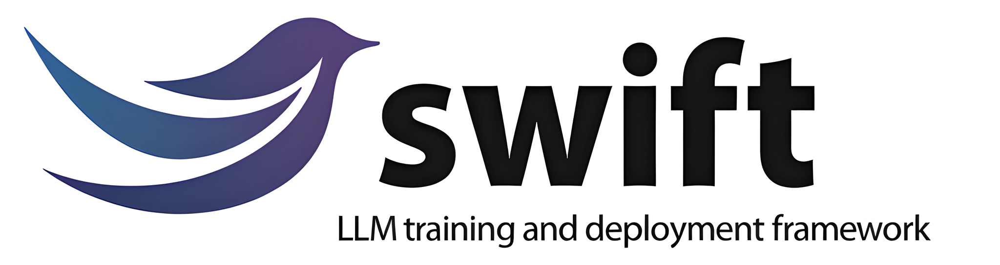
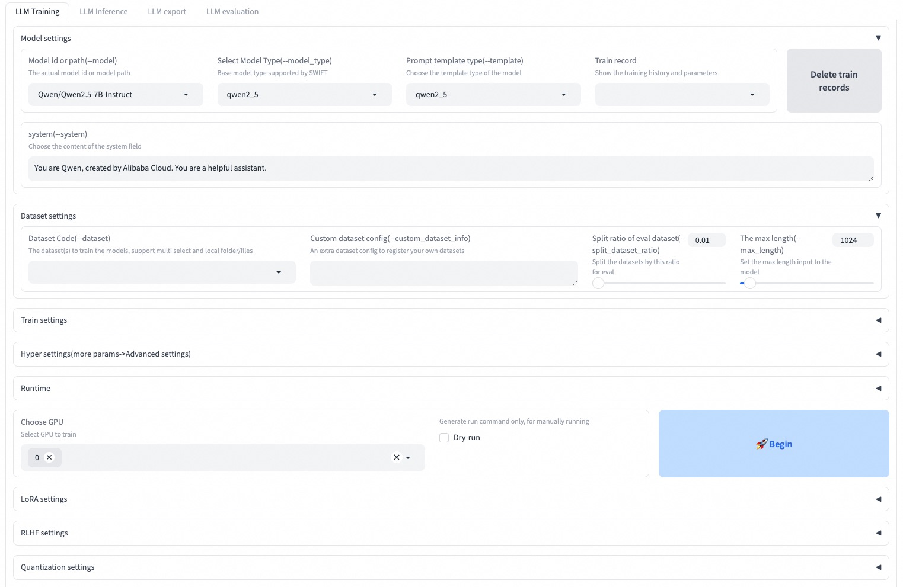

# SWIFT (Scalable lightWeight Infrastructure for Fine-Tuning)

<p align="center">
    <br>
    
    <br>
<p>
<p align="center">
<a href="https://modelscope.cn/home">ModelScope Community Website</a>
<br>
        <a href="README_CN.md">中文</a> &nbsp ｜ &nbsp English &nbsp
</p>

<p align="center">


<a href="https://github.com/modelscope/modelscope/"></a>
<a href="https://pypi.org/project/ms-swift/"></a>
<a href="https://github.com/modelscope/swift/blob/main/LICENSE"></a>
<a href="https://pepy.tech/project/ms-swift"></a>
<a href="https://github.com/modelscope/swift/pulls"></a>
</p>

<p align="center">
<a href="https://trendshift.io/repositories/6427" target="_blank"></a>
</p>

<p align="center">
        <a href="https://arxiv.org/abs/2408.05517">Paper</a> &nbsp ｜ <a href="https://swift.readthedocs.io/en/latest/">English Documentation</a> &nbsp ｜ &nbsp <a href="https://swift.readthedocs.io/zh-cn/latest/">中文文档</a> &nbsp
</p>
<p align="center">
        <a href="https://swift2x-en.readthedocs.io/en/latest/">Swift2.x En Doc</a> &nbsp ｜ &nbsp <a href="https://swift2x.readthedocs.io/zh-cn/latest/">Swift2.x中文文档</a> &nbsp
</p>


## 📖 Table of Contents
- [Groups](#-Groups)
- [Introduction](#-introduction)
- [News](#-news)
- [Installation](#%EF%B8%8F-installation)
- [Quick Start](#-quick-Start)
- [Usage](#-Usage)
- [License](#-License)
- [Citation](#-citation)


## ☎ Groups

You can contact us and communicate with us by adding our group:


[Discord Group](https://discord.com/invite/D27yfEFVz5)              |  WeChat Group
:-------------------------:|:-------------------------:
  |  


## 📝 Introduction
🍲 ms-swift is an official framework provided by the ModelScope community for fine-tuning and deploying large language models and multi-modal large models. It currently supports the training (pre-training, fine-tuning, human alignment), inference, evaluation, quantization, and deployment of over 400 large models and 100+ multi-modal large models. These large language models (LLMs) include models such as Qwen2.5, Llama3.2, GLM4, Internlm2.5, Yi1.5, Mistral, DeepSeek, Baichuan2, Gemma2, and TeleChat2. The multi-modal LLMs include models such as Qwen2-VL, Qwen2-Audio, Llama3.2-Vision, Llava, InternVL2.5, MiniCPM-V-2.6, GLM4v, Xcomposer2.5, Yi-VL, DeepSeek-VL2, Phi3.5-Vision, and GOT-OCR2.

🍔 In addition, ms-swift gathers the latest training technologies, including LoRA, QLoRA, Llama-Pro, LongLoRA, GaLore, Q-GaLore, LoRA+, LISA, DoRA, FourierFt, ReFT, UnSloth, and Liger. ms-swift supports accelerating the inference, evaluation, and deployment modules using vLLM and LMDeploy. To help researchers and developers fine-tune and apply large models more easily, ms-swift also provides a Gradio-based Web-UI interface and a wealth of best practices.

**Why choose ms-swift?**

- 🍎 **Model Types**: Supports 400+ large language models and **100+ multi-modal large models** and all-to-all models, **providing a comprehensive solution from training to deployment**.
- **Dataset Types**: Comes with 150+ pre-training, fine-tuning, human alignment, multi-modal datasets, and supports custom datasets.
- **Hardware Support**: Compatible with CPU, RTX series, T4/V100, A10/A100/H100, Ascend NPU, etc.
- 🍊 **Lightweight Training**: Supports lightweight fine-tuning methods like LoRA, QLoRA, DoRA, LoRA+, ReFT, RS-LoRA, LLaMAPro, Adapter, GaLore, Q-Galore, LISA, UnSloth, Liger-Kernel.
- **Distributed Training**: Supports distributed data parallel (DDP), device_map simple model parallelism, DeepSpeed ZeRO2/ZeRO3, FSDP, and other distributed training techniques.
- **Quantization Training**: Supports training quantized models like BNB, AWQ, GPTQ, AQLM, HQQ, EETQ.
- **RLHF Training**: Supports human alignment training methods such as DPO, CPO, SimPO, ORPO, KTO, RM for both pure text and multi-modal large models.
- 🍓 **Multi-Modal Training**: Supports training on different modalities like images, videos, and audio, for tasks like VQA, captioning, OCR, and grounding.
- **Interface Training**: Provides capabilities for training, inference, evaluation, quantization through an interface, completing the whole large model pipeline.
- **Plugin and Extension**: Supports custom model and dataset extensions, as well as customization of components like loss, metric, trainer, loss-scale, callback, optimizer.
- 🍉 **Toolbox Capabilities**: Offers not only training support for large models and multi-modal large models but also covers the entire process of inference, evaluation, quantization, and deployment.
- **Inference Acceleration**: Supports inference acceleration engines like PyTorch, vLLM, LmDeploy, and provides OpenAI API for accelerating inference, deployment, and evaluation modules.
- **Model Evaluation**: Uses EvalScope as the evaluation backend and supports evaluation on 100+ datasets for both pure text and multi-modal models.
- **Model Quantization**: Supports AWQ, GPTQ, and BNB quantized exports, with models that can use vLLM/LmDeploy for inference acceleration and continue training.


## 🎉 News

- 🎁 2024.12.04: **SWIFT3.0** major version update. Please check the [Release Notes and Changes](https://swift.readthedocs.io/en/latest/Instruction/ReleaseNote3.0.html).
- 🎉 2024.08.12: The SWIFT paper has been published on arXiv, and you can read it [here](https://arxiv.org/abs/2408.05517).
- 🔥 2024.08.05: Support for using [evalscope](https://github.com/modelscope/evalscope/) as a backend for evaluating large models and multimodal models.
- 🔥 2024.07.29: Support for using [vllm](https://github.com/vllm-project/vllm) and [lmdeploy](https://github.com/InternLM/lmdeploy) to accelerate inference for large models and multimodal models. When performing infer/deploy/eval, you can specify `--infer_backend vllm/lmdeploy`.
- 🔥 2024.07.24: Support for human preference alignment training for multimodal large models, including DPO/ORPO/SimPO/CPO/KTO/RM.
- 🔥 2024.02.01: Support for Agent training! The training algorithm is derived from [this paper](https://arxiv.org/pdf/2309.00986.pdf).


## 🛠️ Installation
To install using pip:
```shell
pip install ms-swift -U
```

To install from source:
```shell
# pip install git+https://github.com/modelscope/ms-swift.git

git clone https://github.com/modelscope/ms-swift.git
cd ms-swift
pip install -e .
```

## 🚀 Quick Start

10 minutes of self-cognition fine-tuning of Qwen2.5-7B-Instruct on a single 3090 GPU:

### Command Line Interface

```shell
# 22GB
CUDA_VISIBLE_DEVICES=0 \
swift sft \
    --model Qwen/Qwen2.5-7B-Instruct \
    --train_type lora \
    --dataset AI-ModelScope/alpaca-gpt4-data-zh#500 \
              AI-ModelScope/alpaca-gpt4-data-en#500 \
              swift/self-cognition#500 \
    --torch_dtype bfloat16 \
    --num_train_epochs 1 \
    --per_device_train_batch_size 1 \
    --per_device_eval_batch_size 1 \
    --learning_rate 1e-4 \
    --lora_rank 8 \
    --lora_alpha 32 \
    --target_modules all-linear \
    --gradient_accumulation_steps 16 \
    --eval_steps 50 \
    --save_steps 50 \
    --save_total_limit 2 \
    --logging_steps 5 \
    --max_length 2048 \
    --output_dir output \
    --system 'You are a helpful assistant.' \
    --warmup_ratio 0.05 \
    --dataloader_num_workers 4 \
    --model_author swift \
    --model_name swift-robot
```

After training is complete, use the following command to perform inference with the trained weights. The `--adapters` option should be replaced with the last checkpoint folder generated from the training. Since the adapters folder contains the parameter files from the training, there is no need to specify `--model` or `--system` separately.

```shell
# Using an interactive command line for inference.
CUDA_VISIBLE_DEVICES=0 \
swift infer \
    --adapters output/vx-xxx/checkpoint-xxx \
    --stream true

# merge-lora and use vLLM for inference acceleration
CUDA_VISIBLE_DEVICES=0 \
swift infer \
    --adapters output/vx-xxx/checkpoint-xxx \
    --stream true \
    --merge_lora true \
    --infer_backend vllm \
    --max_model_len 8192
```

### Web-UI
The Web-UI is a **zero-threshold** training and deployment interface solution based on Gradio interface technology. For more details, you can check [here](https://swift.readthedocs.io/en/latest/GetStarted/Web-UI.html).

```shell
SWIFT_UI_LANG=en swift web-ui
```



### Using Python

ms-swift also supports training and inference using Python. Below is pseudocode for training and inference. For more details, you can refer to [here](https://github.com/modelscope/ms-swift/tree/main/examples/notebook).

Training:

```python
# Retrieve the model and template, and add a trainable LoRA module
model, tokenizer = get_model_tokenizer(model_id_or_path, ...)
template = get_template(model.model_meta.template, tokenizer, ...)
model = Swift.prepare_model(model, lora_config)

# Download and load the dataset, and encode the text into tokens
train_dataset, val_dataset = load_dataset(dataset_id_or_path, ...)
train_dataset = EncodePreprocessor(template=template)(train_dataset, num_proc=num_proc)
val_dataset = EncodePreprocessor(template=template)(val_dataset, num_proc=num_proc)

# Train the model
trainer = Seq2SeqTrainer(
    model=model,
    args=training_args,
    data_collator=template.data_collator,
    train_dataset=train_dataset,
    eval_dataset=val_dataset,
    template=template,
)
trainer.train()
```
Inference:

```python
# Perform inference using the native PyTorch engine
engine = PtEngine(model_id_or_path, adapters=[lora_checkpoint])
infer_request = InferRequest(messages=[{'role': 'user', 'content': 'who are you?'}])
request_config = RequestConfig(max_tokens=max_new_tokens, temperature=temperature)

resp_list = engine.infer([infer_request], request_config)
print(f'response: {resp_list[0].choices[0].message.content}')
```

## ✨ Usage
Here is the simplest example of training to deployment using ms-swift. For more details, you can check the [examples](https://github.com/modelscope/ms-swift/tree/main/examples).

|   Useful Links |
| ------ |
|   [Command Line Parameters](https://swift.readthedocs.io/en/latest/Instruction/Command-line-parameters.html)   |
|   [Supported Models and Datasets](https://swift.readthedocs.io/en/latest/Instruction/Supported-models-and-datasets.html)   |
|   [Custom Models](https://swift.readthedocs.io/en/latest/Customization/Custom-model.html), [Custom Datasets](https://swift.readthedocs.io/en/latest/Customization/Custom-dataset.html)   |
|   [LLM Tutorial](https://github.com/modelscope/modelscope-classroom/tree/main/LLM-tutorial)   |

### Training

Pre-training:
```shell
# 8*A100
NPROC_PER_NODE=8 \
CUDA_VISIBLE_DEVICES=0,1,2,3,4,5,6,7 \
swift pt \
    --model Qwen/Qwen2.5-7B \
    --dataset swift/chinese-c4 \
    --streaming true \
    --train_type full \
    --deepspeed zero2 \
    --output_dir output \
    --max_steps 100000 \
    ...
```

Fine-tuning:
```shell
CUDA_VISIBLE_DEVICES=0 swift sft \
    --model Qwen/Qwen2.5-7B-Instruct \
    --dataset AI-ModelScope/alpaca-gpt4-data-en \
    --train_type lora \
    --output_dir output \
    ...
```

RLHF:
```shell
CUDA_VISIBLE_DEVICES=0 swift rlhf \
    --rlhf_type dpo \
    --model Qwen/Qwen2.5-7B-Instruct \
    --dataset hjh0119/shareAI-Llama3-DPO-zh-en-emoji:en \
    --train_type lora \
    --output_dir output \
    ...
```


### Inference
```shell
CUDA_VISIBLE_DEVICES=0 swift infer \
    --model Qwen/Qwen2.5-7B-Instruct \
    --stream true \
    --infer_backend pt

# LoRA
CUDA_VISIBLE_DEVICES=0 swift infer \
    --model Qwen/Qwen2.5-7B-Instruct \
    --adapters swift/test_lora \
    --stream true \
    --infer_backend pt \
    --temperature 0
```

### Deployment
```shell
CUDA_VISIBLE_DEVICES=0 swift deploy \
    --model Qwen/Qwen2.5-7B-Instruct \
    --infer_backend vllm
```

### Evaluation
```shell
CUDA_VISIBLE_DEVICES=0 swift eval \
    --model Qwen/Qwen2.5-7B-Instruct \
    --infer_backend lmdeploy \
    --eval_dataset ARC_c
```

### Quantization
```shell
CUDA_VISIBLE_DEVICES=0 swift export \
    --model Qwen/Qwen2.5-7B-Instruct \
    --quant_bits 4 --quant_method awq \
    --dataset AI-ModelScope/alpaca-gpt4-data-zh \
    --output_dir Qwen2.5-7B-Instruct-AWQ
```

## 🏛 License

This framework is licensed under the [Apache License (Version 2.0)](https://github.com/modelscope/modelscope/blob/master/LICENSE). For models and datasets, please refer to the original resource page and follow the corresponding License.

## 📎 Citation

```bibtex
@misc{zhao2024swiftascalablelightweightinfrastructure,
      title={SWIFT:A Scalable lightWeight Infrastructure for Fine-Tuning},
      author={Yuze Zhao and Jintao Huang and Jinghan Hu and Xingjun Wang and Yunlin Mao and Daoze Zhang and Zeyinzi Jiang and Zhikai Wu and Baole Ai and Ang Wang and Wenmeng Zhou and Yingda Chen},
      year={2024},
      eprint={2408.05517},
      archivePrefix={arXiv},
      primaryClass={cs.CL},
      url={https://arxiv.org/abs/2408.05517},
}
```

## Star History

[](https://star-history.com/#modelscope/ms-swift&Date)
