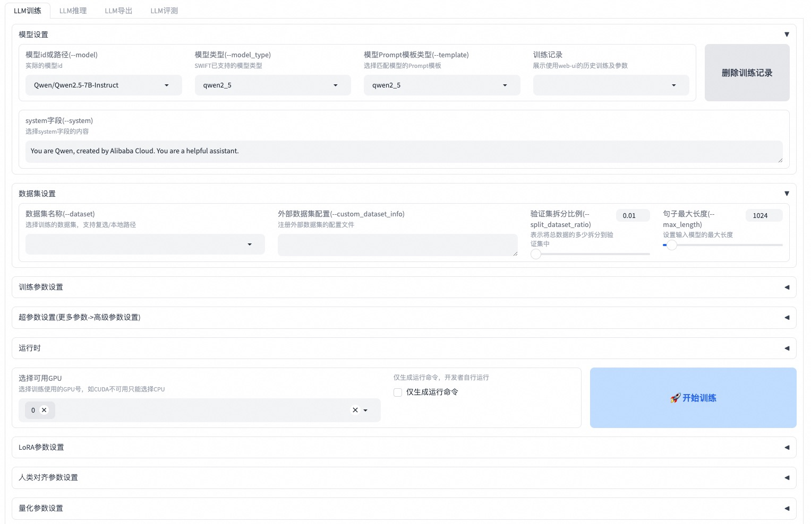

# SWIFT (Scalable lightWeight Infrastructure for Fine-Tuning)

<p align="center">
    <br>
    
    <br>
<p>
<p align="center">
<a href="https://modelscope.cn/home">魔搭社区官网</a>
<br>
        中文&nbsp ｜ &nbsp<a href="README.md">English</a>&nbsp
</p>


<p align="center">


<a href="https://github.com/modelscope/modelscope/"></a>
<a href="https://pypi.org/project/ms-swift/"></a>
<a href="https://github.com/modelscope/ms-swift/blob/main/LICENSE"></a>
<a href="https://pepy.tech/project/ms-swift"></a>
<a href="https://github.com/modelscope/ms-swift/pulls"></a>
</p>

<p align="center">
<a href="https://trendshift.io/repositories/6427" target="_blank"></a>
</p>

<p align="center">
        <a href="https://arxiv.org/abs/2408.05517">论文</a> &nbsp ｜ <a href="https://swift.readthedocs.io/en/latest/">English Documentation</a> &nbsp ｜ &nbsp <a href="https://swift.readthedocs.io/zh-cn/latest/">中文文档</a> &nbsp
</p>

##  📖 目录
- [用户群](#-用户群)
- [简介](#-简介)
- [新闻](#-新闻)
- [安装](#%EF%B8%8F-安装)
- [快速开始](#-快速开始)
- [如何使用](#-如何使用)
- [License](#-license)
- [引用](#-引用)

## ☎ 用户群

请扫描下面的二维码来加入我们的交流群：

[Discord Group](https://discord.com/invite/D27yfEFVz5)              |  微信群
:-------------------------:|:-------------------------:
  |  

## 📝 简介
🍲 **ms-swift**是魔搭社区提供的大模型与多模态大模型微调部署框架，现已支持600+纯文本大模型与300+多模态大模型的训练（预训练、微调、人类对齐）、推理、评测、量化与部署。其中大模型包括：Qwen3、Qwen3-Next、InternLM3、GLM4.5、Mistral、DeepSeek-R1、Llama4等模型，多模态大模型包括：Qwen3-VL、Qwen3-Omni、Llava、InternVL3.5、MiniCPM-V-4、Ovis2.5、GLM4.5-V、DeepSeek-VL2等模型。

🍔 除此之外，ms-swift汇集了最新的训练技术，包括集成Megatron并行技术，包括TP、PP、CP、EP等为训练提供加速，以及众多GRPO算法族强化学习的算法，包括：GRPO、DAPO、GSPO、SAPO、CISPO、RLOO、Reinforce++等提升模型智能。ms-swift支持广泛的训练任务，包括DPO、KTO、RM、CPO、SimPO、ORPO等偏好学习算法，以及Embedding、Reranker、序列分类任务。ms-swift提供了大模型训练全链路的支持，包括使用vLLM、SGLang和LMDeploy对推理、评测、部署模块提供加速，以及使用GPTQ、AWQ、BNB、FP8技术对大模型进行量化。

**为什么选择ms-swift？**
- 🍎 **模型类型**：支持**600+纯文本大模型**、**300+多模态大模型**以及All-to-All全模态模型训练到部署全流程，热门模型Day0支持。
- **数据集类型**：内置150+预训练、微调、人类对齐、多模态等各种任务数据集，并支持自定义数据集，用户只需准备数据集即可一键训练。
- **硬件支持**：支持A10/A100/H100、RTX系列、T4/V100、CPU、MPS以及国产硬件Ascend NPU等。
- **轻量训练**：支持了LoRA、QLoRA、DoRA、LoRA+、LLaMAPro、LongLoRA、LoRA-GA、ReFT、RS-LoRA、Adapter、LISA等轻量微调方式。
- **量化训练**：支持对BNB、AWQ、GPTQ、AQLM、HQQ、EETQ量化模型进行训练，7B模型训练只需9GB训练资源。
- **显存优化**: GaLore、Q-Galore、UnSloth、Liger-Kernel、Flash-Attention 2/3 以及 **Ulysses和Ring-Attention序列并行技术**支持，降低长文本训练显存占用。
- **分布式训练**：支持分布式数据并行（DDP）、device_map简易模型并行、DeepSpeed ZeRO2 ZeRO3、FSDP/FSDP2以及Megatron等分布式训练技术。
- 🍓 **多模态训练**：支持多模态packing技术提升训练速度100%+，支持文本、图像、视频和语音混合模态数据训练，支持vit/aligner/llm单独控制。
- **Agent训练**：支持Agent template，准备一套数据集可用于不同模型的训练。
- 🍊 **训练任务**：支持预训练和指令微调，以及DPO、GKD、KTO、RM、CPO、SimPO、ORPO等训练任务，支持**Embedding/Reranker**和序列分类任务。
- 🥥 **Megatron并行技术**：提供TP/PP/SP/CP/ETP/EP/VPP并行策略，**MoE模型加速可达10倍**。支持250+纯文本大模型和100+多模态大模型的全参数和LoRA训练方法。支持CPT/SFT/GRPO/DPO/KTO/RM训练任务。
- 🍉 **强化学习**：内置**丰富GRPO族算法**，包括GRPO、DAPO、GSPO、SAPO、CISPO、CHORD、RLOO、Reinforce++等，支持同步和异步vLLM引擎推理加速，可使用插件拓展奖励函数、多轮推理调度器以及环境等。
- **全链路能力**：覆盖训练、推理、评测、量化和部署全流程。
- **界面训练**：提供使用Web-UI界面的方式进行训练、推理、评测、量化，完成大模型的全链路。
- **推理加速**：支持Transformers、vLLM、SGLang和LmDeploy推理加速引擎，并提供OpenAI接口，为推理、部署和评测模块提供加速。
- **模型评测**：以EvalScope作为评测后端，支持100+评测数据集对纯文本和多模态模型进行评测。
- **模型量化**：支持AWQ、GPTQ、FP8和BNB的量化导出，导出的模型支持使用vLLM/SGLang/LmDeploy推理加速。

## 🎉 新闻
- 🎁 2026.01.15: **ms-swift v4.0**大版本更新进行中，建议使用稳定分支[release/3.12](https://github.com/modelscope/ms-swift/tree/release/3.12)，您的建议可以在[这个issue](https://github.com/modelscope/ms-swift/issues/7250)中反馈给我们，感谢您的支持。
- 🎁 2025.11.14: Megatron GRPO现已支持！查看[文档](./docs/source/Megatron-SWIFT/GRPO.md)和[示例](examples/megatron/grpo)。
- 🎁 2025.11.04: 支持[Mcore-Bridge](docs/source/Megatron-SWIFT/Mcore-Bridge.md)，使Megatron训练像transformers一样简单易用。
- 🎁 2025.10.28: Ray [已支持](docs/source/Instruction/Ray.md)。
- 🎁 2025.09.07: 支持CHORD训练算法，请查看[文档](docs/source/Instruction/GRPO/AdvancedResearch/CHORD.md)。
- 🎁 2025.09.06: Ulysses现已支持与ring-attention结合使用，使得输入序列可以被切分成任意数量的块（不再受限于num_heads），命令参数仍然是`--sequence_parallel_size N`。
- 🎁 2025.09.02: Megatron-SWIFT支持多模态模型训练。文档参考[这里](./docs/source/Megatron-SWIFT/Mcore-Bridge.md)。
- 🎁 2025.08.12: 支持在SFT训练中使用[Dynamic Fine-Tuning](https://arxiv.org/abs/2508.05629)(DFT)，使用参数 `--enable_dft_loss true`。训练脚本参考[这里](https://github.com/modelscope/ms-swift/blob/main/examples/train/full/dft.sh)
- 🎁 2025.07.09: Megatron-SWIFT支持LoRA训练。相比ms-swift，在MoE模型提速显著。训练脚本参考[这里](https://github.com/modelscope/ms-swift/blob/main/examples/megatron/lora)。
- 🎁 2025.06.23: 支持Reranker模型训练，训练脚本参考[这里](https://github.com/modelscope/ms-swift/blob/main/examples/train/reranker/train_reranker.sh)。
- 🎁 2025.06.15: 支持对纯文本大模型和多模态模型进行GKD训练。训练脚本参考这里：[纯文本](https://github.com/modelscope/ms-swift/blob/main/examples/train/rlhf/gkd), [多模态](https://github.com/modelscope/ms-swift/blob/main/examples/train/multimodal/rlhf/gkd)。

<details><summary>更多</summary>

- 🎁 2025.06.11: 支持使用Megatron并行技术进行RLHF训练，训练脚本参考[这里](https://github.com/modelscope/ms-swift/tree/main/examples/megatron/rlhf)。
- 🎁 2025.05.29: 支持pt、sft、dpo、grpo的序列并行，具体请查看[脚本](https://github.com/modelscope/ms-swift/tree/main/examples/train/sequence_parallel)。
- 🎁 2025.05.11: GRPO中的奖励模型支持自定义处理逻辑，GenRM的例子参考[这里](./docs/source/Instruction/GRPO/DeveloperGuide/reward_model.md)。
- 🎁 2025.04.15: ms-swift论文已经被AAAI 2025接收，论文地址在[这里](https://ojs.aaai.org/index.php/AAAI/article/view/35383)。
- 🎁 2025.03.23: 支持了多轮GRPO，用于构建多轮对话场景的训练(例如agent tool calling)，请查看[文档](docs/source/Instruction/GRPO/DeveloperGuide/multi_turn.md)。
- 🎁 2025.03.16: 支持了Megatron的并行技术进行训练，请查看[Megatron-SWIFT训练文档](https://swift.readthedocs.io/zh-cn/latest/Megatron-SWIFT/Quick-start.html)。
- 🎁 2025.03.15: 支持纯文本和多模态模型的embedding模型的微调，请查看[训练脚本](examples/train/embedding)。
- 🎁 2025.03.05: 支持GRPO的hybrid模式，4GPU(4*80G)训练72B模型的脚本参考[这里](examples/train/grpo/internal/vllm_72b_4gpu.sh)。同时支持vllm的tensor并行，训练脚本参考[这里](examples/train/grpo/internal)。
- 🎁 2025.02.21: GRPO算法支持使用LMDeploy，训练脚本参考[这里](examples/train/grpo/internal/full_lmdeploy.sh)。此外测试了GRPO算法的性能，使用一些tricks使训练速度提高到300%。WanDB表格请查看[这里](https://wandb.ai/tastelikefeet/grpo_perf_test?nw=nwuseryuzezyz)。
- 🎁 2025.02.21: 支持`swift sample`命令。强化微调脚本参考[这里](docs/source/Instruction/Reinforced-Fine-tuning.md)，大模型API蒸馏采样脚本参考[这里](examples/sampler/distill/distill.sh)。
- 🔥 2025.02.12: 支持GRPO (Group Relative Policy Optimization) 训练算法，文档参考[这里](docs/source/Instruction/GRPO/GetStarted/GRPO.md)。
- 🎁 2024.12.04: **ms-swift3.0**大版本更新。请查看[发布说明和更改](docs/source/Instruction/ReleaseNote3.0.md)。
- 🎉 2024.08.12: ms-swift论文已经发布到arXiv上，可以点击[这里](https://arxiv.org/abs/2408.05517)阅读。
- 🔥 2024.08.05: 支持使用[evalscope](https://github.com/modelscope/evalscope/)作为后端进行大模型和多模态模型的评测。
- 🔥 2024.07.29: 支持使用[vllm](https://github.com/vllm-project/vllm), [lmdeploy](https://github.com/InternLM/lmdeploy)对大模型和多模态大模型进行推理加速，在infer/deploy/eval时额外指定`--infer_backend vllm/lmdeploy`即可。
- 🔥 2024.07.24: 支持对多模态大模型进行人类偏好对齐训练，包括DPO/ORPO/SimPO/CPO/KTO/RM/PPO。
- 🔥 2024.02.01: 支持Agent训练！训练算法源自这篇[论文](https://arxiv.org/pdf/2309.00986.pdf)。
</details>

## 🛠️ 安装
使用pip进行安装：
```shell
pip install ms-swift -U
```

从源代码安装：
```shell
# pip install git+https://github.com/modelscope/ms-swift.git

git clone https://github.com/modelscope/ms-swift.git
cd ms-swift
# main分支为swift4.x。若安装swift3.x，请运行以下命令
# git checkout release/3.12
pip install -e .
```

运行环境：

|              | 范围           | 推荐                  | 备注                 |
|--------------|--------------|---------------------|--------------------|
| python       | >=3.9        | 3.10/3.11            |                    |
| cuda         |              | cuda12              | 使用cpu、npu、mps则无需安装 |
| torch        | >=2.0        | 2.8.0/2.9.0           |                    |
| transformers | >=4.33       | 4.57.6              |                    |
| modelscope   | >=1.23       |                     |                    |
| peft         | >=0.11,<0.19 |                     |                    |
| flash_attn   |              | 2.8.3/3.0.0b1 |                    |
| trl          | >=0.15,<0.25 | 0.24.0              | RLHF               |
| deepspeed    | >=0.14       | 0.17.6              | 训练                 |
| vllm         | >=0.5.1      | 0.11.0/0.13.0        | 推理/部署              |
| sglang       | >=0.4.6      | 0.5.5.post3         | 推理/部署              |
| lmdeploy     | >=0.5   | 0.10.1                 | 推理/部署              |
| evalscope    | >=1.0       |                     | 评测                 |
| gradio       |              | 5.32.1              | Web-UI/App         |

更多可选依赖可以参考[这里](https://github.com/modelscope/ms-swift/blob/main/requirements/install_all.sh)。


## 🚀 快速开始

**10分钟**在单卡3090上对Qwen2.5-7B-Instruct进行自我认知微调：

### 命令行（推荐）
```shell
# 22GB
CUDA_VISIBLE_DEVICES=0 \
swift sft \
    --model Qwen/Qwen2.5-7B-Instruct \
    --tuner_type lora \
    --dataset 'AI-ModelScope/alpaca-gpt4-data-zh#500' \
              'AI-ModelScope/alpaca-gpt4-data-en#500' \
              'swift/self-cognition#500' \
    --torch_dtype bfloat16 \
    --num_train_epochs 1 \
    --per_device_train_batch_size 1 \
    --per_device_eval_batch_size 1 \
    --learning_rate 1e-4 \
    --lora_rank 8 \
    --lora_alpha 32 \
    --target_modules all-linear \
    --gradient_accumulation_steps 16 \
    --eval_steps 50 \
    --save_steps 50 \
    --save_total_limit 2 \
    --logging_steps 5 \
    --max_length 2048 \
    --output_dir output \
    --system 'You are a helpful assistant.' \
    --warmup_ratio 0.05 \
    --dataloader_num_workers 4 \
    --model_author swift \
    --model_name swift-robot
```

小贴士：
- 如果要使用自定义数据集进行训练，你可以参考[这里](https://swift.readthedocs.io/zh-cn/latest/Customization/Custom-dataset.html)组织数据集格式，并指定`--dataset <dataset_path>`。
- `--model_author`和`--model_name`参数只有当数据集中包含`swift/self-cognition`时才生效。
- 如果要使用其他模型进行训练，你只需要修改`--model <model_id/model_path>`即可。
- 默认使用ModelScope进行模型和数据集的下载。如果要使用HuggingFace，指定`--use_hf true`即可。

训练完成后，使用以下命令对训练后的权重进行推理：
- 这里的`--adapters`需要替换成训练生成的last checkpoint文件夹。由于adapters文件夹中包含了训练的参数文件`args.json`，因此不需要额外指定`--model`，`--system`，swift会自动读取这些参数。如果要关闭此行为，可以设置`--load_args false`。

```shell
# 使用交互式命令行进行推理
CUDA_VISIBLE_DEVICES=0 \
swift infer \
    --adapters output/vx-xxx/checkpoint-xxx \
    --stream true \
    --temperature 0 \
    --max_new_tokens 2048

# merge-lora并使用vLLM进行推理加速
CUDA_VISIBLE_DEVICES=0 \
swift infer \
    --adapters output/vx-xxx/checkpoint-xxx \
    --stream true \
    --merge_lora true \
    --infer_backend vllm \
    --vllm_max_model_len 8192 \
    --temperature 0 \
    --max_new_tokens 2048
```

最后，使用以下命令将模型推送到ModelScope：
```shell
CUDA_VISIBLE_DEVICES=0 \
swift export \
    --adapters output/vx-xxx/checkpoint-xxx \
    --push_to_hub true \
    --hub_model_id '<your-model-id>' \
    --hub_token '<your-sdk-token>' \
    --use_hf false
```

### Web-UI

Web-UI是基于gradio界面技术的**零门槛**训练、部署界面方案，具体可以查看[这里](https://swift.readthedocs.io/zh-cn/latest/GetStarted/Web-UI.html)。

```shell
swift web-ui
```


### 使用Python
ms-swift也支持使用python的方式进行训练和推理。下面给出训练和推理的**伪代码**，具体可以查看[这里](https://github.com/modelscope/ms-swift/blob/main/examples/notebook/qwen2_5-self-cognition/self-cognition-sft.ipynb)。

训练：
```python
from peft import LoraConfig, get_peft_model
from swift import get_model_processor, get_template, load_dataset, EncodePreprocessor
from swift.trainers import Seq2SeqTrainer, Seq2SeqTrainingArguments
# 获取模型和template，并加入可训练的LoRA模块
model, tokenizer = get_model_processor(model_id_or_path, ...)
template = get_template(tokenizer, ...)
lora_config = LoraConfig(...)
model = get_peft_model(model, lora_config)

# 下载并载入数据集，并将文本encode成tokens
train_dataset, val_dataset = load_dataset(dataset_id_or_path, ...)
train_dataset = EncodePreprocessor(template=template)(train_dataset, num_proc=num_proc)
val_dataset = EncodePreprocessor(template=template)(val_dataset, num_proc=num_proc)

# 进行训练
training_args = Seq2SeqTrainingArguments(...)
trainer = Seq2SeqTrainer(
    model=model,
    args=training_args,
    template=template,
    train_dataset=train_dataset,
    eval_dataset=val_dataset,
)
trainer.train()
```

推理：
```python
from swift import TransformersEngine, InferRequest, RequestConfig
# 使用原生 transformers 引擎进行推理
engine = TransformersEngine(model_id_or_path, adapters=[lora_checkpoint])
infer_request = InferRequest(messages=[{'role': 'user', 'content': 'who are you?'}])
request_config = RequestConfig(max_tokens=max_new_tokens, temperature=temperature)

resp_list = engine.infer([infer_request], request_config)
print(f'response: {resp_list[0].choices[0].message.content}')
```

## ✨ 如何使用

这里给出使用ms-swift进行训练到部署的最简示例，具体可以查看[examples](https://github.com/modelscope/ms-swift/tree/main/examples)。

- 若想使用其他模型或者数据集（含多模态模型和数据集），你只需要修改`--model`指定对应模型的id或者path，修改`--dataset`指定对应数据集的id或者path即可。
- 默认使用ModelScope进行模型和数据集的下载。如果要使用HuggingFace，指定`--use_hf true`即可。

|   常用链接 |
| ------ |
|   [🔥命令行参数](https://swift.readthedocs.io/zh-cn/latest/Instruction/Command-line-parameters.html)   |
|   [Megatron-SWIFT](https://swift.readthedocs.io/zh-cn/latest/Megatron-SWIFT/Quick-start.html)   |
|   [GRPO](https://swift.readthedocs.io/zh-cn/latest/Instruction/GRPO/GetStarted/GRPO.html)   |
|   [支持的模型和数据集](https://swift.readthedocs.io/zh-cn/latest/Instruction/Supported-models-and-datasets.html)   |
|   [自定义模型](https://swift.readthedocs.io/zh-cn/latest/Customization/Custom-model.html), [🔥自定义数据集](https://swift.readthedocs.io/zh-cn/latest/Customization/Custom-dataset.html)   |
|   [大模型教程](https://github.com/modelscope/modelscope-classroom/tree/main/LLM-tutorial)   |

### 训练
支持的训练方法：

| 方法   | 全参数 | LoRA                                                                                        | QLoRA | Deepspeed | 多机 | 多模态                                                                                          |
| ------ | ------ |---------------------------------------------------------------------------------------------| ----- | ------ | ------ |----------------------------------------------------------------------------------------------|
| [预训练](https://github.com/modelscope/ms-swift/blob/main/examples/train/pretrain) | ✅ | ✅                                                                                           | ✅ | ✅ | ✅ | ✅                                                                                            |
| [指令监督微调](https://github.com/modelscope/ms-swift/blob/main/examples/train/lora_sft.sh) | [✅](https://github.com/modelscope/ms-swift/blob/main/examples/train/full/train.sh) | ✅            | [✅](https://github.com/modelscope/ms-swift/tree/main/examples/train/qlora) | [✅](https://github.com/modelscope/ms-swift/tree/main/examples/train/multi-gpu/deepspeed) | [✅](https://github.com/modelscope/ms-swift/tree/main/examples/train/multi-node) | [✅](https://github.com/modelscope/ms-swift/tree/main/examples/train/multimodal)              |
| [GRPO](https://github.com/modelscope/ms-swift/blob/main/examples/train/grpo) | ✅ | ✅                                                                                           | ✅ | ✅ | ✅ | ✅                                                                                            |
| [GKD](https://github.com/modelscope/ms-swift/blob/main/examples/train/rlhf/gkd) | ✅ | ✅           | ✅ | ✅ | ✅ | [✅](https://github.com/modelscope/ms-swift/blob/main/examples/train/multimodal/rlhf/gkd)  |
| [PPO](https://github.com/modelscope/ms-swift/blob/main/examples/train/rlhf/ppo) | ✅ | ✅            | ✅ | ✅ | ✅ | ❌                                                                                            |
| [DPO](https://github.com/modelscope/ms-swift/blob/main/examples/train/rlhf/dpo) | ✅ | ✅            | ✅ | ✅ | ✅ | [✅](https://github.com/modelscope/ms-swift/blob/main/examples/train/multimodal/rlhf/dpo)  |
| [KTO](https://github.com/modelscope/ms-swift/blob/main/examples/train/rlhf/kto.sh) | ✅ | ✅            | ✅ | ✅ | ✅ | [✅](https://github.com/modelscope/ms-swift/blob/main/examples/train/multimodal/rlhf/kto.sh)  |
| [奖励模型](https://github.com/modelscope/ms-swift/blob/main/examples/train/rlhf/rm.sh) | ✅ | ✅             | ✅ | ✅ | ✅ | ✅                                                                                            |
| [CPO](https://github.com/modelscope/ms-swift/blob/main/examples/train/rlhf/cpo.sh) | ✅ | ✅            | ✅ | ✅ | ✅ | ✅                                                                                            |
| [SimPO](https://github.com/modelscope/ms-swift/blob/main/examples/train/rlhf/simpo.sh) | ✅ | ✅          | ✅ | ✅| ✅ | ✅                                                                                            |
| [ORPO](https://github.com/modelscope/ms-swift/blob/main/examples/train/rlhf/orpo.sh) | ✅ | ✅           | ✅ | ✅ | ✅ | ✅                                                                                            |
| [Embedding](https://github.com/modelscope/ms-swift/blob/main/examples/train/embedding) | ✅ | ✅ | ✅ | ✅ | ✅ | ✅  |
| [Reranker](https://github.com/modelscope/ms-swift/tree/main/examples/train/reranker) | ✅ | ✅ | ✅ | ✅ | ✅ | ✅ |
| [序列分类](https://github.com/modelscope/ms-swift/blob/main/examples/train/seq_cls) | ✅ | ✅ | ✅ | ✅ | ✅ | ✅ |


预训练：
```shell
# 8*A100
NPROC_PER_NODE=8 \
CUDA_VISIBLE_DEVICES=0,1,2,3,4,5,6,7 \
swift pt \
    --model Qwen/Qwen2.5-7B \
    --dataset swift/chinese-c4 \
    --streaming true \
    --tuner_type full \
    --deepspeed zero2 \
    --output_dir output \
    --max_steps 10000 \
    ...
```

微调：
```shell
CUDA_VISIBLE_DEVICES=0 swift sft \
    --model Qwen/Qwen2.5-7B-Instruct \
    --dataset AI-ModelScope/alpaca-gpt4-data-zh \
    --tuner_type lora \
    --output_dir output \
    ...
```

RLHF：
```shell
CUDA_VISIBLE_DEVICES=0 swift rlhf \
    --rlhf_type dpo \
    --model Qwen/Qwen2.5-7B-Instruct \
    --dataset hjh0119/shareAI-Llama3-DPO-zh-en-emoji \
    --tuner_type lora \
    --output_dir output \
    ...
```

### Megatron-SWIFT

ms-swift支持使用Megatron并行技术加速训练，包括大规模集群训练和MoE模型训练。以下为支持的训练方法：

| 方法   | 全参数 | LoRA | MoE | 多模态 | FP8 |
| ------ | ------ | ---- | ----- | ----- | ----- |
| 预训练 | ✅ | ✅| ✅ | ✅ | ✅ |
| [指令监督微调](https://github.com/modelscope/ms-swift/tree/main/examples/megatron) | ✅ | ✅| ✅ | ✅ | ✅ |
| [GRPO](https://github.com/modelscope/ms-swift/tree/main/examples/megatron/grpo) | ✅ | ✅| ✅ | ✅ | ✅ |
| [DPO](https://github.com/modelscope/ms-swift/tree/main/examples/megatron/rlhf/dpo) | ✅ | ✅| ✅ | ✅ | ✅ |
| [KTO](https://github.com/modelscope/ms-swift/tree/main/examples/megatron/rlhf/kto) | ✅ | ✅| ✅ | ✅ | ✅ |
| [RM](https://github.com/modelscope/ms-swift/tree/main/examples/megatron/rlhf/rm) | ✅ | ✅| ✅ | ✅ | ✅ |
| [Embedding](https://github.com/modelscope/ms-swift/tree/main/examples/megatron/embedding) | ✅ | ✅| ✅ | ✅ | ✅ |
| [Reranker](https://github.com/modelscope/ms-swift/tree/main/examples/megatron/reranker) | ✅ | ✅| ✅ | ✅ | ✅ |
| [序列分类](https://github.com/modelscope/ms-swift/tree/main/examples/megatron/seq_cls) | ✅ | ✅| ✅ | ✅ | ✅ |


```shell
NPROC_PER_NODE=2 CUDA_VISIBLE_DEVICES=0,1 megatron sft \
    --model Qwen/Qwen2.5-7B-Instruct \
    --load_safetensors true \
    --save_safetensors true \
    --dataset AI-ModelScope/alpaca-gpt4-data-zh \
    --tuner_type lora \
    --save output \
    ...
```

### 强化学习

ms-swift支持丰富GRPO族算法：

| 方法   | 全参数 | LoRA | 多模态   | 多机 |
| ------ | ------ | ---- | ----- | ----- |
| [GRPO](https://swift.readthedocs.io/zh-cn/latest/Instruction/GRPO/GetStarted/GRPO.html) | ✅ | ✅| ✅ | ✅ |
| [DAPO](https://swift.readthedocs.io/zh-cn/latest/Instruction/GRPO/AdvancedResearch/DAPO.html) | ✅ | ✅| ✅ | ✅ |
| [GSPO](https://swift.readthedocs.io/zh-cn/latest/Instruction/GRPO/AdvancedResearch/GSPO.html) | ✅ | ✅| ✅ | ✅ |
| [SAPO](https://swift.readthedocs.io/zh-cn/latest/Instruction/GRPO/AdvancedResearch/SAPO.html) | ✅ | ✅| ✅ | ✅ |
| [CISPO](https://swift.readthedocs.io/zh-cn/latest/Instruction/GRPO/AdvancedResearch/CISPO.html) | ✅ | ✅| ✅ | ✅ |
| [CHORD](https://swift.readthedocs.io/zh-cn/latest/Instruction/GRPO/AdvancedResearch/CHORD.html) | ✅ | ✅| ✅ | ✅ |
| [RLOO](https://swift.readthedocs.io/zh-cn/latest/Instruction/GRPO/AdvancedResearch/RLOO.html) |  ✅ | ✅| ✅ | ✅ |
| [Reinforce++](https://swift.readthedocs.io/zh-cn/latest/Instruction/GRPO/AdvancedResearch/REINFORCEPP.html) | ✅ | ✅| ✅ | ✅ |

```shell
CUDA_VISIBLE_DEVICES=0,1,2,3 NPROC_PER_NODE=4 \
swift rlhf \
    --rlhf_type grpo \
    --model Qwen/Qwen2.5-7B-Instruct \
    --tuner_type lora \
    --use_vllm true \
    --vllm_mode colocate \
    --dataset AI-MO/NuminaMath-TIR#10000 \
    --output_dir output \
    ...
```

### 推理
```shell
CUDA_VISIBLE_DEVICES=0 swift infer \
    --model Qwen/Qwen2.5-7B-Instruct \
    --stream true \
    --infer_backend transformers \
    --max_new_tokens 2048

# LoRA
CUDA_VISIBLE_DEVICES=0 swift infer \
    --model Qwen/Qwen2.5-7B-Instruct \
    --adapters swift/test_lora \
    --stream true \
    --infer_backend transformers \
    --temperature 0 \
    --max_new_tokens 2048
```

### 界面推理
```shell
CUDA_VISIBLE_DEVICES=0 swift app \
    --model Qwen/Qwen2.5-7B-Instruct \
    --stream true \
    --infer_backend transformers \
    --max_new_tokens 2048 \
    --lang zh
```

### 部署
```shell
CUDA_VISIBLE_DEVICES=0 swift deploy \
    --model Qwen/Qwen2.5-7B-Instruct \
    --infer_backend vllm
```

### 采样
```shell
CUDA_VISIBLE_DEVICES=0 swift sample \
    --model LLM-Research/Meta-Llama-3.1-8B-Instruct \
    --sampler_engine transformers \
    --num_return_sequences 5 \
    --dataset AI-ModelScope/alpaca-gpt4-data-zh#5
```

### 评测
```shell
CUDA_VISIBLE_DEVICES=0 swift eval \
    --model Qwen/Qwen2.5-7B-Instruct \
    --infer_backend lmdeploy \
    --eval_backend OpenCompass \
    --eval_dataset ARC_c
```

### 量化
```shell
CUDA_VISIBLE_DEVICES=0 swift export \
    --model Qwen/Qwen2.5-7B-Instruct \
    --quant_bits 4 --quant_method awq \
    --dataset AI-ModelScope/alpaca-gpt4-data-zh \
    --output_dir Qwen2.5-7B-Instruct-AWQ
```

### 推送模型
```shell
swift export \
    --model <model-path> \
    --push_to_hub true \
    --hub_model_id '<model-id>' \
    --hub_token '<sdk-token>'
```


## 🏛 License

本框架使用[Apache License (Version 2.0)](https://github.com/modelscope/modelscope/blob/master/LICENSE)进行许可。模型和数据集请查看原资源页面并遵守对应License。

## 📎 引用

```bibtex
@misc{zhao2024swiftascalablelightweightinfrastructure,
      title={SWIFT:A Scalable lightWeight Infrastructure for Fine-Tuning},
      author={Yuze Zhao and Jintao Huang and Jinghan Hu and Xingjun Wang and Yunlin Mao and Daoze Zhang and Zeyinzi Jiang and Zhikai Wu and Baole Ai and Ang Wang and Wenmeng Zhou and Yingda Chen},
      year={2024},
      eprint={2408.05517},
      archivePrefix={arXiv},
      primaryClass={cs.CL},
      url={https://arxiv.org/abs/2408.05517},
}
```

## Star History

[](https://star-history.com/#modelscope/ms-swift&Date)
