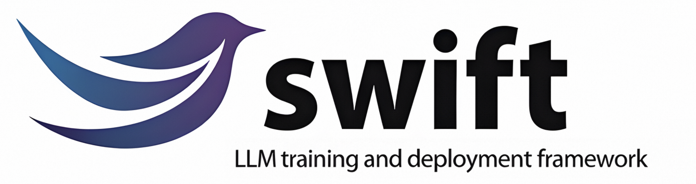
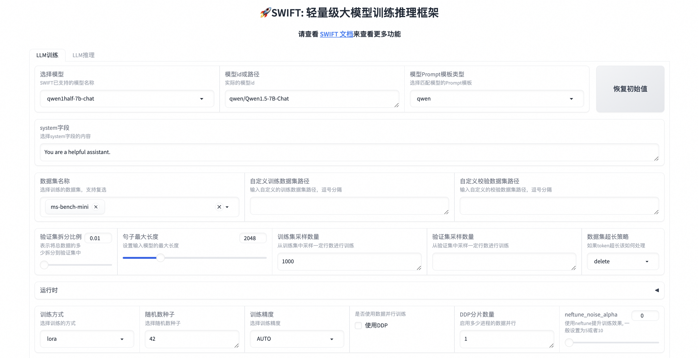

# SWIFT (Scalable lightWeight Infrastructure for Fine-Tuning)

<p align="center">
    <br>
    
    <br>
<p>
<p align="center">
<a href="https://modelscope.cn/home">魔搭社区官网</a>
<br>
        中文&nbsp ｜ &nbsp<a href="README.md">English</a>&nbsp
</p>


<p align="center">


<a href="https://github.com/modelscope/modelscope/"></a>
<a href="https://pypi.org/project/ms-swift/"></a>
<a href="https://github.com/modelscope/swift/blob/main/LICENSE"></a>
<a href="https://pepy.tech/project/ms-swift"></a>
<a href="https://github.com/modelscope/swift/pulls"></a>
</p>

<p align="center">
<a href="https://trendshift.io/repositories/6427" target="_blank"></a>
</p>

<p align="center">
        <a href="https://arxiv.org/abs/2408.05517">论文</a> &nbsp ｜ <a href="https://swift.readthedocs.io/en/latest/">English Documentation</a> &nbsp ｜ &nbsp <a href="https://swift.readthedocs.io/zh-cn/latest/">中文文档</a> &nbsp
</p>
<p align="center">
        <a href="https://swift2x-en.readthedocs.io/en/latest/">Swift2.x En Doc</a> &nbsp ｜ &nbsp <a href="https://swift2x.readthedocs.io/zh-cn/latest/">Swift2.x中文文档</a> &nbsp
</p>


##  📖 目录
- [用户群](#-用户群)
- [简介](#-简介)
- [新闻](#-新闻)
- [安装](#%EF%B8%8F-安装)
- [快速开始](#-快速开始)
- [如何使用](#-如何使用)
- [License](#-license)
- [引用](#-引用)

## ☎ 用户群

请扫描下面的二维码来加入我们的交流群：

[Discord Group](https://discord.com/invite/D27yfEFVz5)              |  微信群
:-------------------------:|:-------------------------:
  |  

## 📝 简介
🍲 ms-swift是魔搭社区提供的大模型与多模态大模型微调部署框架，现已支持450+大模型与150+多模态大模型的训练（预训练、微调、人类对齐）、推理、评测、量化与部署。其中大模型包括：Qwen2.5、Llama3.3、GLM4、Internlm2.5、Yi1.5、Mistral、DeepSeek2.5、Baichuan2、Gemma2、TeleChat2等模型，多模态大模型包括：Qwen2-VL、Qwen2-Audio、Llama3.2-Vision、Llava、InternVL2.5、MiniCPM-V-2.6、GLM4v、Xcomposer2.5、Yi-VL、DeepSeek-VL2、Phi3.5-Vision、GOT-OCR2等模型。

🍔 除此之外，ms-swift汇集了最新的训练技术，包括LoRA、QLoRA、Llama-Pro、LongLoRA、GaLore、Q-GaLore、LoRA+、LISA、DoRA、FourierFt、ReFT、UnSloth、和Liger等。ms-swift支持使用vLLM和LMDeploy对推理、评测和部署模块进行加速，并支持使用GPTQ、AWQ、BNB等技术对大模型和多模态大模型进行量化。为了帮助研究者和开发者更轻松地微调和应用大模型，ms-swift还提供了基于Gradio的Web-UI界面及丰富的最佳实践。

**为什么选择ms-swift？**
- 🍎 **模型类型**：支持400+纯文本大模型、**150+多模态大模型**，All-to-All全模态模型的**训练到部署全流程**。
- **数据集类型**：内置150+预训练、微调、人类对齐、多模态等各种类型的数据集，并支持自定义数据集。
- **硬件支持**：CPU、RTX系列、T4/V100、A10/A100/H100、Ascend NPU等。
- 🍊 **轻量训练**：支持了LoRA、QLoRA、DoRA、LoRA+、ReFT、RS-LoRA、LLaMAPro、Adapter、GaLore、Q-Galore、LISA、UnSloth、Liger-Kernel等轻量微调方式。
- **分布式训练**：支持分布式数据并行（DDP）、device_map简易模型并行、DeepSpeed ZeRO2 ZeRO3、FSDP等分布式训练技术。
- **量化训练**：支持对BNB、AWQ、GPTQ、AQLM、HQQ、EETQ量化模型进行训练。
- **RLHF训练**：支持纯文本大模型和多模态大模型的DPO、CPO、SimPO、ORPO、KTO、RM、PPO等人类对齐训练方法。
- 🍓 **多模态训练**：支持对图像、视频和语音不同模态模型进行训练，支持VQA、Caption、OCR、Grounding任务的训练。
- **界面训练**：以界面的方式提供训练、推理、评测、量化的能力，完成大模型的全链路。
- **插件化与拓展**：支持自定义模型和数据集拓展，支持对loss、metric、trainer、loss-scale、callback、optimizer等组件进行自定义。
- 🍉 **工具箱能力**：不仅提供大模型和多模态大模型的训练支持，还涵盖其推理、评测、量化和部署全流程。
- **推理加速**：支持PyTorch、vLLM、LmDeploy推理加速引擎，并提供OpenAI接口，为推理、部署和评测模块提供加速。
- **模型评测**：以EvalScope作为评测后端，支持100+评测数据集对纯文本和多模态模型进行评测。
- **模型量化**：支持AWQ、GPTQ和BNB的量化导出，导出的模型支持使用vLLM/LmDeploy推理加速，并支持继续训练。

## 🎉 新闻
- 🎁 2024.12.04: **SWIFT3.0**大版本更新. 请查看[发布说明和更改](https://swift.readthedocs.io/zh-cn/latest/Instruction/ReleaseNote3.0.html)。
- 🎉 2024.08.12: SWIFT论文已经发布到arXiv上，可以点击[这里](https://arxiv.org/abs/2408.05517)阅读。
- 🔥 2024.08.05: 支持使用[evalscope](https://github.com/modelscope/evalscope/)作为后端进行大模型和多模态模型的评测。
- 🔥 2024.07.29: 支持使用[vllm](https://github.com/vllm-project/vllm), [lmdeploy](https://github.com/InternLM/lmdeploy)对大模型和多模态大模型进行推理加速，在infer/deploy/eval时额外指定`--infer_backend vllm/lmdeploy`即可。
- 🔥 2024.07.24: 支持对多模态大模型进行人类偏好对齐训练，包括DPO/ORPO/SimPO/CPO/KTO/RM/PPO。
- 🔥 2024.02.01: 支持Agent训练！训练算法源自这篇[论文](https://arxiv.org/pdf/2309.00986.pdf)。

## 🛠️ 安装
使用pip进行安装：
```shell
pip install ms-swift -U
```

从源代码安装：
```shell
# pip install git+https://github.com/modelscope/ms-swift.git

git clone https://github.com/modelscope/ms-swift.git
cd ms-swift
pip install -e .
```

## 🚀 快速开始

**10分钟**在单卡3090上对Qwen2.5-7B-Instruct进行自我认知微调：

### 命令行
```shell
# 22GB
CUDA_VISIBLE_DEVICES=0 \
swift sft \
    --model Qwen/Qwen2.5-7B-Instruct \
    --train_type lora \
    --dataset 'AI-ModelScope/alpaca-gpt4-data-zh#500' \
              'AI-ModelScope/alpaca-gpt4-data-en#500' \
              'swift/self-cognition#500' \
    --torch_dtype bfloat16 \
    --num_train_epochs 1 \
    --per_device_train_batch_size 1 \
    --per_device_eval_batch_size 1 \
    --learning_rate 1e-4 \
    --lora_rank 8 \
    --lora_alpha 32 \
    --target_modules all-linear \
    --gradient_accumulation_steps 16 \
    --eval_steps 50 \
    --save_steps 50 \
    --save_total_limit 5 \
    --logging_steps 5 \
    --max_length 2048 \
    --output_dir output \
    --system 'You are a helpful assistant.' \
    --warmup_ratio 0.05 \
    --dataloader_num_workers 4 \
    --model_author swift \
    --model_name swift-robot
```

训练完成后，使用以下命令对训练后的权重进行推理，这里的`--adapters`替换成训练生成的last checkpoint文件夹. 由于adapters文件夹中包含了训练的参数文件，因此不需要额外指定`--model`, `--system`.

```shell
# 使用交互式命令行进行推理
CUDA_VISIBLE_DEVICES=0 \
swift infer \
    --adapters output/vx-xxx/checkpoint-xxx \
    --stream true \
    --temperature 0 \
    --max_new_tokens 2048

# merge-lora并使用vLLM进行推理加速
CUDA_VISIBLE_DEVICES=0 \
swift infer \
    --adapters output/vx-xxx/checkpoint-xxx \
    --stream true \
    --merge_lora true \
    --infer_backend vllm \
    --max_model_len 8192 \
    --temperature 0 \
    --max_new_tokens 2048
```

### Web-UI

Web-UI是基于gradio界面技术的**零门槛**训练、部署界面方案，具体可以查看[这里](https://swift.readthedocs.io/zh-cn/latest/GetStarted/Web-UI.html)。

```shell
swift web-ui
```


### 使用Python
ms-swift也支持使用python的方式进行训练和推理。下面给出训练和推理的**伪代码**，具体可以查看[这里](https://github.com/modelscope/ms-swift/tree/main/examples/notebook)。

训练：
```python
# 获取模型和template，并加入可训练的LoRA模块
model, tokenizer = get_model_tokenizer(model_id_or_path, ...)
template = get_template(model.model_meta.template, tokenizer, ...)
model = Swift.prepare_model(model, lora_config)

# 下载并载入数据集，并将文本encode成tokens
train_dataset, val_dataset = load_dataset(dataset_id_or_path, ...)
train_dataset = EncodePreprocessor(template=template)(train_dataset, num_proc=num_proc)
val_dataset = EncodePreprocessor(template=template)(val_dataset, num_proc=num_proc)

# 进行训练
trainer = Seq2SeqTrainer(
    model=model,
    args=training_args,
    data_collator=template.data_collator,
    train_dataset=train_dataset,
    eval_dataset=val_dataset,
    template=template,
)
trainer.train()
```

推理：
```python
# 使用原生pytorch引擎进行推理
engine = PtEngine(model_id_or_path, adapters=[lora_checkpoint])
infer_request = InferRequest(messages=[{'role': 'user', 'content': 'who are you?'}])
request_config = RequestConfig(max_tokens=max_new_tokens, temperature=temperature)

resp_list = engine.infer([infer_request], request_config)
print(f'response: {resp_list[0].choices[0].message.content}')
```

## ✨ 如何使用

这里给出使用ms-swift进行训练到部署到最简示例，具体可以查看[examples](https://github.com/modelscope/ms-swift/tree/main/examples).

|   常用链接 |
| ------ |
|   [命令行参数](https://swift.readthedocs.io/zh-cn/latest/Instruction/%E5%91%BD%E4%BB%A4%E8%A1%8C%E5%8F%82%E6%95%B0.html)   |
|   [支持的模型和数据集](https://swift.readthedocs.io/zh-cn/latest/Instruction/%E6%94%AF%E6%8C%81%E7%9A%84%E6%A8%A1%E5%9E%8B%E5%92%8C%E6%95%B0%E6%8D%AE%E9%9B%86.html)   |
|   [自定义模型](https://swift.readthedocs.io/zh-cn/latest/Customization/%E8%87%AA%E5%AE%9A%E4%B9%89%E6%A8%A1%E5%9E%8B.html), [自定义数据集](https://swift.readthedocs.io/zh-cn/latest/Customization/%E8%87%AA%E5%AE%9A%E4%B9%89%E6%95%B0%E6%8D%AE%E9%9B%86.html)   |
|   [大模型教程](https://github.com/modelscope/modelscope-classroom/tree/main/LLM-tutorial)   |

### 训练

预训练：
```shell
# 8*A100
NPROC_PER_NODE=8 \
CUDA_VISIBLE_DEVICES=0,1,2,3,4,5,6,7 \
swift pt \
    --model Qwen/Qwen2.5-7B \
    --dataset swift/chinese-c4 \
    --streaming true \
    --train_type full \
    --deepspeed zero2 \
    --output_dir output \
    --max_steps 100000 \
    ...
```

微调：
```shell
CUDA_VISIBLE_DEVICES=0 swift sft \
    --model Qwen/Qwen2.5-7B-Instruct \
    --dataset AI-ModelScope/alpaca-gpt4-data-zh \
    --train_type lora \
    --output_dir output \
    ...
```

RLHF：
```shell
CUDA_VISIBLE_DEVICES=0 swift rlhf \
    --rlhf_type dpo \
    --model Qwen/Qwen2.5-7B-Instruct \
    --dataset hjh0119/shareAI-Llama3-DPO-zh-en-emoji \
    --train_type lora \
    --output_dir output \
    ...
```


### 推理
```shell
CUDA_VISIBLE_DEVICES=0 swift infer \
    --model Qwen/Qwen2.5-7B-Instruct \
    --stream true \
    --infer_backend pt \
    --max_new_tokens 2048

# LoRA
CUDA_VISIBLE_DEVICES=0 swift infer \
    --model Qwen/Qwen2.5-7B-Instruct \
    --adapters swift/test_lora \
    --stream true \
    --infer_backend pt \
    --temperature 0 \
    --max_new_tokens 2048
```

### 界面推理
```shell
CUDA_VISIBLE_DEVICES=0 swift app \
    --model Qwen/Qwen2.5-7B-Instruct \
    --stream true \
    --infer_backend pt \
    --max_new_tokens 2048 \
    --lang zh
```

### 部署
```shell
CUDA_VISIBLE_DEVICES=0 swift deploy \
    --model Qwen/Qwen2.5-7B-Instruct \
    --infer_backend vllm
```

### 评测
```shell
CUDA_VISIBLE_DEVICES=0 swift eval \
    --model Qwen/Qwen2.5-7B-Instruct \
    --infer_backend lmdeploy \
    --eval_dataset ARC_c
```

### 量化
```shell
CUDA_VISIBLE_DEVICES=0 swift export \
    --model Qwen/Qwen2.5-7B-Instruct \
    --quant_bits 4 --quant_method awq \
    --dataset AI-ModelScope/alpaca-gpt4-data-zh \
    --output_dir Qwen2.5-7B-Instruct-AWQ
```


## 🏛 License

本框架使用[Apache License (Version 2.0)](https://github.com/modelscope/modelscope/blob/master/LICENSE)进行许可。模型和数据集请查看原资源页面并遵守对应License。

## 📎 引用

```bibtex
@misc{zhao2024swiftascalablelightweightinfrastructure,
      title={SWIFT:A Scalable lightWeight Infrastructure for Fine-Tuning},
      author={Yuze Zhao and Jintao Huang and Jinghan Hu and Xingjun Wang and Yunlin Mao and Daoze Zhang and Zeyinzi Jiang and Zhikai Wu and Baole Ai and Ang Wang and Wenmeng Zhou and Yingda Chen},
      year={2024},
      eprint={2408.05517},
      archivePrefix={arXiv},
      primaryClass={cs.CL},
      url={https://arxiv.org/abs/2408.05517},
}
```

## Star History

[](https://star-history.com/#modelscope/ms-swift&Date)
