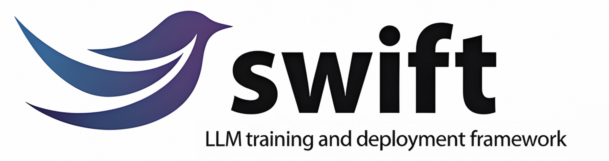
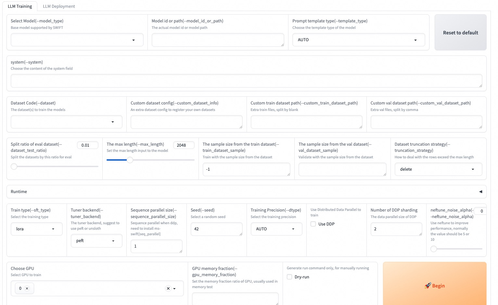

# SWIFT (Scalable lightWeight Infrastructure for Fine-Tuning)

<p align="center">
    <br>
    
    <br>
<p>
<p align="center">
<a href="https://modelscope.cn/home">ModelScope コミュニティ公式サイト</a>
<br>
        <a href="README_CN.md">中文</a> &nbsp ｜ &nbsp <a href="README.md">English</a> &nbsp ｜ &nbsp 日本語 &nbsp
</p>

<p align="center">


<a href="https://github.com/modelscope/modelscope/"></a>
<a href="https://pypi.org/project/ms-swift/"></a>
<a href="https://github.com/modelscope/ms-swift/blob/main/LICENSE"></a>
<a href="https://pepy.tech/project/ms-swift"></a>
<a href="https://github.com/modelscope/ms-swift/pulls"></a>
</p>

<p align="center">
<a href="https://trendshift.io/repositories/11937" target="_blank"></a>
</p>

<p align="center">
        <a href="https://arxiv.org/abs/2408.05517">論文</a> &nbsp ｜ <a href="https://swift.readthedocs.io/en/latest/">English Documentation</a> &nbsp ｜ &nbsp <a href="https://swift.readthedocs.io/zh-cn/latest/">中文文档</a> &nbsp
</p>

## 📖 目次
- [ユーザーグループ](#-ユーザーグループ)
- [はじめに](#-はじめに)
- [ニュース](#-ニュース)
- [インストール](#%EF%B8%8F-インストール)
- [クイックスタート](#-クイックスタート)
- [使い方](#-使い方)
- [License](#-license)
- [引用](#-引用)


## ☎ ユーザーグループ

以下のグループに参加して、私たちに問い合わせたり交流したりできます：


[Discord Group](https://discord.gg/yeN59wxjwe)              |  WeChat グループ
:-------------------------:|:-------------------------:
  |  


## 📝 はじめに
🍲 **ms-swift** は、ModelScope コミュニティが提供する大規模モデルおよびマルチモーダル大規模モデルのファインチューニング・デプロイフレームワークです。現在、600 以上のテキスト大規模モデルと 400 以上のマルチモーダル大規模モデルについて、学習（事前学習、ファインチューニング、人間のアライメント）、推論、評価、量子化、デプロイをサポートしています。大規模モデルには Qwen3、Qwen3.5、InternLM3、GLM4.5、Mistral、DeepSeek-R1、Llama4 などが含まれます。マルチモーダル大規模モデルには Qwen3-VL、Qwen3-Omni、Kimi-K3、Llava、InternVL3.5、MiniCPM-V-4、Ovis2.5、GLM4.5-V、DeepSeek-VL2 などが含まれます。

🍔 さらに ms-swift は最新の学習技術を統合しています。学習を高速化する TP、PP、CP、EP などの Megatron 並列化技術に加え、モデルの知能を高めるための GRPO、DAPO、GSPO、SAPO、CISPO、RLOO、Reinforce++ といった数多くの GRPO ファミリーの強化学習アルゴリズムを備えています。ms-swift は、DPO、KTO、RM、CPO、SimPO、ORPO などの選好学習アルゴリズムをはじめ、Embedding、Reranker、系列分類タスクなど幅広い学習タスクをサポートします。また、vLLM、SGLang、LMDeploy による推論・評価・デプロイモジュールの高速化や、GPTQ、AWQ、BNB、FP8 技術によるモデル量子化まで、大規模モデル学習のフルパイプラインをサポートします。

**なぜ ms-swift を選ぶのか？**

- 🍎 **モデルの種類**: **600 以上のテキスト大規模モデル**、**400 以上のマルチモーダル大規模モデル**、および All-to-All 全モダリティモデルを、学習からデプロイまでのフルパイプラインでサポートし、人気モデルには Day-0 対応します。
- **データセットの種類**: 事前学習、ファインチューニング、人間のアライメント、マルチモーダルなど、さまざまなタスク向けのデータセットを 150 以上内蔵しており、カスタムデータセットにも対応しています。ユーザーはデータセットを準備するだけでワンクリック学習が可能です。
- **ハードウェアサポート**: A10/A100/H100、RTX シリーズ、T4/V100、AMD GPU（MI300 シリーズなど）、CPU、MPS、および国産ハードウェアの Ascend NPU などをサポートします。
- **軽量学習**: LoRA、QLoRA、DoRA、LoRA+、LLaMAPro、LongLoRA、LoRA-GA、ReFT、RS-LoRA、Adapter、LISA などの軽量ファインチューニング手法をサポートします。
- **量子化学習**: BNB、AWQ、GPTQ、AQLM、HQQ、EETQ で量子化されたモデルの学習をサポートし、7B モデルであれば 9GB の学習リソースで済みます。
- **メモリ最適化**: GaLore、Q-Galore、UnSloth、Liger-Kernel、Flash-Attention 2/3、および **Ulysses と Ring-Attention のシーケンス並列化技術**をサポートし、長文学習時のメモリ消費を削減します。
- **分散学習**: 分散データ並列（DDP）、device_map によるシンプルなモデル並列、DeepSpeed ZeRO2 ZeRO3、FSDP/FSDP2、Megatron 分散学習技術をサポートします。
- 🍓 **マルチモーダル学習**: 学習速度を 100% 以上向上させるマルチモーダル packing 技術をサポートし、テキスト・画像・動画・音声を混在させたモダリティ混合データの学習や、vit/aligner/llm の個別制御に対応します。
- **Agent 学習**: Agent テンプレートをサポートし、1 つのデータセットで異なるモデルを学習できます。
- 🍊 **学習タスク**: 事前学習と指示チューニングに加え、DPO、GKD、KTO、RM、CPO、SimPO、ORPO などの学習タスクをサポートし、**Embedding/Reranker** および系列分類タスクにも対応します。
- 🥥 **Megatron 並列化**: TP/PP/SP/CP/ETP/EP/VPP の並列戦略を提供し、**MoE モデルの学習速度**を大幅に向上させます。300 以上のテキスト大規模モデルと 100 以上のマルチモーダル大規模モデルについて、フルパラメータおよび LoRA 学習をサポートします。CPT/SFT/GRPO/DPO/KTO/RM の学習タスクに対応しています。
- 🍉 **強化学習**: GRPO、DAPO、GSPO、SAPO、CISPO、CHORD、RLOO、Reinforce++ など、**豊富な GRPO ファミリーのアルゴリズム**を内蔵しています。同期・非同期の vLLM エンジンによる推論高速化をサポートし、プラグインを通じて報酬関数、マルチターン推論の Scheduler、環境を拡張できます。
- **フルパイプライン機能**: 学習、推論、評価、量子化、デプロイのワークフロー全体をカバーします。
- **UI 学習**: 学習、推論、評価、量子化のための Web-UI インターフェースを提供し、大規模モデルのフルパイプラインを完結できます。
- **推論の高速化**: Transformers、vLLM、SGLang、LmDeploy の推論高速化エンジンをサポートし、推論・デプロイ・評価モジュールを高速化する OpenAI 互換インターフェースを提供します。
- **モデル評価**: EvalScope を評価バックエンドとして使用し、100 以上の評価データセットでテキストモデルとマルチモーダルモデルを評価できます。
- **モデル量子化**: AWQ、GPTQ、FP8、BNB の量子化エクスポートをサポートします。エクスポートしたモデルは vLLM/SGLang/LmDeploy で推論高速化が可能です。


## 🎉 ニュース
- 🔥 2026.09.01: Tencent Hunyuan のマルチモーダル embedding モデル [WeMM-Embedding](https://www.modelscope.cn/models/Tencent-Hunyuan/WeMM-Embedding-2B)（2B/4B/9B）の推論と学習をサポートしました。画像とテキストの混合入力によるベクトル表現に対応しています。[embedding の例](examples/train/embedding)を参照してください。
- 🔥 2026.08.26: [Qwen3.8-Flash-Next](https://www.modelscope.cn/models/Qwen/Qwen3.8-Flash-Next) を Day-0 サポートしました。学習については [sft の例](examples/models/qwen4_exp/megatron_sft.sh)を参照してください。
- 🎁 2026.08.21: OpenMOSS のマルチモーダルモデル [MOSS-VL-Instruct-0708](https://modelscope.cn/models/openmoss/MOSS-VL-Instruct-0708) の推論と学習をサポートしました。LoRA およびフルパラメータのファインチューニングに対応し、単一/複数画像、単一/複数動画、メディア混合のシナリオをカバーします。
- 🎁 2026.08.11: マルチモーダルモデル [Muse-Glimmer-30B](https://modelscope.cn/models/meta-models/Muse-Glimmer-30B) の推論と学習をサポートしました。Megatron-SWIFT にも対応しています。
- 🎁 2026.07.22: moonshotai のマルチモーダルモデル [Kimi-K3](https://modelscope.cn/models/moonshotai/Kimi-K3) の推論をサポートしました。XTML チャットテンプレート、thinking チャネル（`reasoning_effort`）、ツール呼び出し（`--agent_template kimi_k3`）を含みます。
- 🎁 2026.06.10: Megatron-Ray が GRPO と GKD の学習をサポートしました。[ドキュメント](./docs/source_en/Instruction/Ray.md)と[例](examples/ray)を参照してください。
- 🎁 2026.03.03: **ms-swift v4.0** メジャーバージョンを正式リリースしました。リリースノートは[こちら](https://github.com/modelscope/ms-swift/releases/tag/v4.0.0)を参照してください。ご意見は[この issue](https://github.com/modelscope/ms-swift/issues/7250) にお寄せください。ご支援ありがとうございます。
- 🎁 2025.11.14: Megatron GRPO が利用可能になりました！[ドキュメント](./docs/source_en/Megatron-SWIFT/GRPO.md)と[例](examples/megatron/grpo)をご覧ください。
- 🎁 2025.11.04: [Mcore-Bridge](docs/source_en/Megatron-SWIFT/Mcore-Bridge.md) をサポートし、Megatron の学習を transformers と同じくらい簡単に扱えるようになりました。
- 🎁 2025.10.28: Ray は[こちら](docs/source_en/Instruction/Ray.md)。
- 🎁 2025.09.07: CHORD 学習アルゴリズムのサポートを追加しました。[ドキュメント](./docs/source_en/Instruction/GRPO/AdvancedResearch/CHORD.md)を参照してください。
- 🎁 2025.09.06: Ulysses を ring-attention と組み合わせて使用できるようになり、シーケンスを任意の数のチャンクに分割できるようになりました（head 数による制限がなくなりました）。引数は引き続き `--sequence_parallel_size N` です。
- 🎁 2025.09.02: Megatron-SWIFT がマルチモーダルモデルの学習をサポートしました。ドキュメントは[こちら](./docs/source_en/Megatron-SWIFT/Multimodal-Model.md)です。
- 🎁 2025.08.12: SFT 学習で [Dynamic Fine-Tuning](https://arxiv.org/abs/2508.05629)(DFT) をサポートしました。パラメータ `--enable_dft_loss true` を使用してください。学習スクリプトは[こちら](https://github.com/modelscope/ms-swift/blob/main/examples/train/full/dft.sh)にあります。
- 🎁 2025.07.09: Megatron-SWIFT が LoRA 学習をサポートしました。ms-swift と比較して、MoE モデルで大幅な高速化を実現します。学習スクリプトは[こちら](https://github.com/modelscope/ms-swift/blob/main/examples/megatron/lora)にあります。
- 🎁 2025.06.23: reranker モデルのファインチューニングをサポートしました。学習スクリプトはこちら：[Reranker](https://github.com/modelscope/ms-swift/blob/main/examples/train/reranker/train_reranker.sh)。
- 🎁 2025.06.15: テキスト大規模モデルとマルチモーダルモデルの両方で GKD 学習をサポートしました。学習スクリプトはこちら：[テキスト](https://github.com/modelscope/ms-swift/blob/main/examples/train/rlhf/gkd)、[マルチモーダル](https://github.com/modelscope/ms-swift/blob/main/examples/train/multimodal/rlhf/gkd)。

<details><summary>さらに表示</summary>

- 🎁 2025.06.11: RLHF 学習で Megatron 並列化技術を使用できるようになりました。学習スクリプトは[こちら](https://github.com/modelscope/ms-swift/tree/main/examples/megatron/rlhf)にあります。
- 🎁 2025.05.29: pretrain、sft、dpo、grpo でシーケンス並列をサポートしました。スクリプトは[こちら](https://github.com/modelscope/ms-swift/tree/main/examples/train/sequence_parallel)をご覧ください。
- 🎁 2025.05.11: GRPO が報酬モデルのカスタム処理ロジックをサポートしました。GenRM の例は[こちら](./docs/source_en/Instruction/GRPO/DeveloperGuide/reward_model.md)をご覧ください。
- 🎁 2025.04.15: ms-swift の論文が AAAI 2025 に採択されました。論文は[このリンク](https://ojs.aaai.org/index.php/AAAI/article/view/35383)から参照できます。
- 🎁 2025.03.23: マルチターン GRPO をサポートし、マルチターン対話シナリオ（Agent のツール呼び出しなど）の学習が可能になりました。[ドキュメント](./docs/source_en/Instruction/GRPO/DeveloperGuide/multi_turn.md)を参照してください。
- 🎁 2025.03.16: Megatron の並列学習技術のサポートが利用可能になりました。[Megatron-SWIFT 学習ドキュメント](https://swift.readthedocs.io/en/latest/Megatron-SWIFT/Quick-start.html)をご覧ください。
- 🎁 2025.03.15: テキストモデルとマルチモーダルモデルの両方で embedding モデルのファインチューニングをサポートしました。[学習スクリプト](examples/train/embedding)をご確認ください。
- 🎁 2025.03.05: GRPO のハイブリッドモードをサポートしました。4 GPU（4*80G）で 72B モデルを学習するスクリプトは[こちら](examples/train/grpo/internal/vllm_72b_4gpu.sh)にあります。vllm でのテンソル並列もサポートしており、学習スクリプトは[こちら](examples/train/grpo/internal)にあります。
- 🎁 2025.02.21: GRPO アルゴリズムが LMDeploy をサポートしました。学習スクリプトは[こちら](examples/train/grpo/internal/full_lmdeploy.sh)にあります。また、GRPO アルゴリズムの性能を測定し、さまざまな工夫により最大 300% の学習速度向上を達成しました。WanDB の表は[こちら](https://wandb.ai/tastelikefeet/grpo_perf_test?nw=nwuseryuzezyz)をご覧ください。
- 🎁 2025.02.21: `swift sample` コマンドをサポートしました。強化ファインチューニングのスクリプトは[こちら](docs/source_en/Instruction/Reinforced-Fine-tuning.md)、大規模モデル API 蒸留サンプリングのスクリプトは[こちら](examples/sampler/distill/distill.sh)にあります。
- 🔥 2025.02.12: GRPO（Group Relative Policy Optimization）学習アルゴリズムのサポートを追加しました。ドキュメントは[こちら](docs/source_en/Instruction/GRPO/GetStarted/GRPO.md)です。
- 🎁 2024.12.04: **ms-swift 3.0** の大型アップデート。[リリースノートと変更点](https://github.com/modelscope/ms-swift/releases/tag/v3.0.0)を参照してください。
- 🎉 2024.08.12: ms-swift の論文が arXiv で公開されました。[こちら](https://arxiv.org/abs/2408.05517)から読むことができます。
- 🔥 2024.08.05: [evalscope](https://github.com/modelscope/evalscope/) を大規模モデルおよびマルチモーダルモデルの評価バックエンドとして使用できるようになりました。
- 🔥 2024.07.29: [vllm](https://github.com/vllm-project/vllm) と [lmdeploy](https://github.com/InternLM/lmdeploy) による大規模モデル・マルチモーダルモデルの推論高速化をサポートしました。infer/deploy/eval を実行する際に `--infer_backend vllm/lmdeploy` を指定できます。
- 🔥 2024.07.24: マルチモーダル大規模モデルの人間の選好アライメント学習（DPO/ORPO/SimPO/CPO/KTO/RM/PPO）をサポートしました。
- 🔥 2024.02.01: Agent 学習をサポートしました！学習アルゴリズムは[この論文](https://arxiv.org/pdf/2309.00986.pdf)に基づいています。
</details>

## 🛠️ インストール
pip を使用してインストールする場合：
```shell
pip install ms-swift -U

# uv を使用する場合
pip install uv
uv pip install ms-swift -U --torch-backend=auto
```

ソースからインストールする場合：
```shell
# pip install git+https://github.com/modelscope/ms-swift.git

git clone https://github.com/modelscope/ms-swift.git
cd ms-swift
# main ブランチは swift 4.x 向けです。swift 3.x をインストールするには、以下のコマンドを実行してください：
# git checkout release/3.12
pip install -e .

# uv を使用する場合
uv pip install -e . --torch-backend=auto
```

実行環境：

|              | 範囲         | 推奨                | 備考                                      |
|--------------|--------------|---------------------|-------------------------------------------|
| python       | >=3.10        | 3.12                |                                           |
| cuda         |              | cuda12.8/13.0    | CPU、NPU、MPS を使用する場合は不要        |
| torch        | >=2.0        | 2.8.0/2.11.0         |                            |
| transformers | >=4.33       | 4.57.6/5.12.1              |                          |
| modelscope   | >=1.23       |                     |                                           |
| datasets     | >=3.0,<4.8.5 | 3.6.0/4.8.4         |                    |
| peft         | >=0.11,<0.21 |                     |                                           |
| flash_attn   |              | 2.8.3/4.0.0b15 |                                           |
| trl          | >=0.15,<1.0 | 0.29.1              | RLHF                                      |
| deepspeed    | >=0.14       | 0.18.9              | 学習                                      |
| vllm         | >=0.5.1      | 0.11.0/0.23.0       | 推論/デプロイ                             |
| sglang       | >=0.4.6      |          | 推論/デプロイ                             |
| evalscope    | >=1.0       |                     | 評価                                      |
| gradio       |              | 5.32.1              | Web-UI/App                                |

その他のオプション依存関係については、[こちら](https://github.com/modelscope/ms-swift/blob/main/requirements/install_all.sh)を参照してください。


## 🚀 クイックスタート

3090 GPU 1 枚で Qwen3-4B-Instruct-2507 の自己認識ファインチューニングを 10 分で行う例：

### コマンドラインインターフェース（推奨）

```shell
# 13GB
CUDA_VISIBLE_DEVICES=0 \
swift sft \
    --model Qwen/Qwen3-4B-Instruct-2507 \
    --tuner_type lora \
    --dataset 'AI-ModelScope/alpaca-gpt4-data-zh#500' \
              'AI-ModelScope/alpaca-gpt4-data-en#500' \
              'swift/self-cognition#500' \
    --torch_dtype bfloat16 \
    --num_train_epochs 1 \
    --per_device_train_batch_size 1 \
    --per_device_eval_batch_size 1 \
    --learning_rate 1e-4 \
    --lora_rank 8 \
    --lora_alpha 32 \
    --target_modules all-linear \
    --gradient_accumulation_steps 16 \
    --eval_steps 50 \
    --save_steps 50 \
    --save_total_limit 2 \
    --logging_steps 5 \
    --max_length 2048 \
    --output_dir output \
    --warmup_ratio 0.05 \
    --dataloader_num_workers 4 \
    --model_author swift \
    --model_name swift-robot
```

ヒント：

- カスタムデータセットで学習したい場合は、[このガイド](https://swift.readthedocs.io/en/latest/Customization/Custom-dataset.html)を参照してデータセットの形式を整え、`--dataset <dataset_path>` を指定してください。
- `--model_author` と `--model_name` のパラメータは、データセットに `swift/self-cognition` が含まれている場合にのみ有効です。
- 別のモデルで学習する場合は、`--model <model_id/model_path>` を変更するだけです。
- デフォルトでは、モデルとデータセットのダウンロードに **ModelScope** が使用されます。HuggingFace を使用したい場合は、`--use_hf true` を指定するだけです。

学習が完了したら、以下のコマンドで学習済みの重みを使って推論します：

- ここでの `--adapters` は、学習中に生成された最後のチェックポイントフォルダに置き換えてください。adapters フォルダには学習パラメータファイル `args.json` が含まれているため、`--model` や `--system` を個別に指定する必要はありません。Swift がこれらのパラメータを自動的に読み込みます。この動作を無効にするには、`--load_args false` を設定してください。

```shell
# 対話型コマンドラインで推論を実行します。
CUDA_VISIBLE_DEVICES=0 \
swift infer \
    --adapters output/vx-xxx/checkpoint-xxx \
    --stream true \
    --temperature 0 \
    --max_new_tokens 2048

# merge-lora して vLLM で推論を高速化します
CUDA_VISIBLE_DEVICES=0 \
swift infer \
    --adapters output/vx-xxx/checkpoint-xxx \
    --stream true \
    --merge_lora true \
    --infer_backend vllm \
    --vllm_max_model_len 8192 \
    --temperature 0 \
    --max_new_tokens 2048
```

最後に、以下のコマンドでモデルを ModelScope にプッシュします：

```shell
CUDA_VISIBLE_DEVICES=0 \
swift export \
    --adapters output/vx-xxx/checkpoint-xxx \
    --push_to_hub true \
    --hub_model_id '<your-model-id>' \
    --hub_token '<your-sdk-token>' \
    --use_hf false
```


### Web-UI
Web-UI は Gradio のインターフェース技術に基づく、**敷居ゼロ**の学習・デプロイ用インターフェースソリューションです。詳細は[こちら](https://swift.readthedocs.io/en/latest/GetStarted/Web-UI.html)をご覧ください。

```shell
SWIFT_UI_LANG=en swift web-ui
```



### Python を使用する

ms-swift は Python を使った学習と推論もサポートしています。以下は学習と推論の擬似コードです。詳細は[こちら](https://github.com/modelscope/ms-swift/blob/main/examples/notebook/qwen2_5-self-cognition/self-cognition-sft.ipynb)を参照してください。

学習：

```python
from peft import LoraConfig, get_peft_model
from swift import get_model_processor, get_template, load_dataset, EncodePreprocessor
from swift.trainers import Seq2SeqTrainer, Seq2SeqTrainingArguments
# モデルとテンプレートを取得し、学習可能な LoRA モジュールを追加します
model, tokenizer = get_model_processor(model_id_or_path, ...)
template = get_template(tokenizer, ...)
lora_config = LoraConfig(...)
model = get_peft_model(model, lora_config)

# データセットをダウンロード・読み込み、テキストをトークンにエンコードします
train_dataset, val_dataset = load_dataset(dataset_id_or_path, ...)
train_dataset = EncodePreprocessor(template=template)(train_dataset, num_proc=num_proc)
val_dataset = EncodePreprocessor(template=template)(val_dataset, num_proc=num_proc)

# モデルを学習します
training_args = Seq2SeqTrainingArguments(...)
trainer = Seq2SeqTrainer(
    model=model,
    args=training_args,
    template=template,
    train_dataset=train_dataset,
    eval_dataset=val_dataset,
)
trainer.train()
```
推論：

```python
from swift import TransformersEngine, InferRequest, RequestConfig
# ネイティブの Transformers エンジンを使用して推論を実行します
engine = TransformersEngine(model_id_or_path, adapters=[lora_checkpoint])
infer_request = InferRequest(messages=[{'role': 'user', 'content': 'who are you?'}])
request_config = RequestConfig(max_tokens=max_new_tokens, temperature=temperature)

resp_list = engine.infer([infer_request], request_config)
print(f'response: {resp_list[0].choices[0].message.content}')
```

## ✨ 使い方
以下は、ms-swift を使った学習からデプロイまでの最小限の例です。詳細は [examples](https://github.com/modelscope/ms-swift/tree/main/examples) をご覧ください。

- 他のモデルやデータセット（マルチモーダルモデルやデータセットを含む）を使用したい場合は、`--model` を該当モデルの ID またはパスに、`--dataset` を該当データセットの ID またはパスに変更するだけです。
- デフォルトでは、モデルとデータセットのダウンロードに ModelScope が使用されます。HuggingFace を使用したい場合は、`--use_hf true` を指定するだけです。

|   便利なリンク |
| ------ |
|   [🔥コマンドラインパラメータ](https://swift.readthedocs.io/en/latest/Instruction/Command-line-parameters.html)   |
|   [Megatron-SWIFT](https://swift.readthedocs.io/en/latest/Megatron-SWIFT/Quick-start.html)   |
|   [GRPO](https://swift.readthedocs.io/en/latest/Instruction/GRPO/GetStarted/GRPO.html)   |
|   [サポート済みのモデルとデータセット](https://swift.readthedocs.io/en/latest/Instruction/Supported-models-and-datasets.html)   |
|   [カスタムモデル](https://swift.readthedocs.io/en/latest/Customization/Custom-model.html), [🔥カスタムデータセット](https://swift.readthedocs.io/en/latest/Customization/Custom-dataset.html)   |
|   [LLM チュートリアル](https://github.com/modelscope/modelscope-classroom/tree/main/LLM-tutorial)   |

### 学習

サポートされている学習方法：

| 方法                                                         | フルパラメータ                                               | LoRA | QLoRA                                                        | Deepspeed                                                    | マルチノード                                                 | マルチモーダル                                               |
| ------------------------------------------------------------ | ------------------------------------------------------------ | ---- | ------------------------------------------------------------ | ------------------------------------------------------------ | ------------------------------------------------------------ | ------------------------------------------------------------ |
| [事前学習](https://github.com/modelscope/ms-swift/blob/main/examples/train/pretrain) | ✅                                                            | ✅    | ✅                                                            | ✅                                                            | ✅                                                            | ✅                                                            |
| [教師ありファインチューニング](https://github.com/modelscope/ms-swift/blob/main/examples/train/lora_sft.sh) | [✅](https://github.com/modelscope/ms-swift/blob/main/examples/train/full/train.sh) | ✅    | [✅](https://github.com/modelscope/ms-swift/tree/main/examples/train/qlora) | [✅](https://github.com/modelscope/ms-swift/tree/main/examples/train/multi-gpu/deepspeed) | [✅](https://github.com/modelscope/ms-swift/tree/main/examples/train/multi-node) | [✅](https://github.com/modelscope/ms-swift/tree/main/examples/train/multimodal) |
| [GRPO](https://github.com/modelscope/ms-swift/blob/main/examples/train/grpo) | ✅                                                            | ✅    | ✅                                                            | ✅                                                            | ✅                                                            | ✅                                                            |
| [GKD](https://github.com/modelscope/ms-swift/blob/main/examples/train/rlhf/gkd) | ✅                                                            | ✅    | ✅                                                            | ✅                                                            | ✅                                                            | [✅](https://github.com/modelscope/ms-swift/blob/main/examples/train/multimodal/rlhf/gkd) |
| [PPO](https://github.com/modelscope/ms-swift/blob/main/examples/train/rlhf/ppo) | ✅                                                            | ✅    | ✅                                                            | ✅                                                            | ✅                                                            | ❌                                                            |
| [DPO](https://github.com/modelscope/ms-swift/blob/main/examples/train/rlhf/dpo) | ✅                                                            | ✅    | ✅                                                            | ✅                                                            | ✅                                                            | [✅](https://github.com/modelscope/ms-swift/blob/main/examples/train/multimodal/rlhf/dpo) |
| [KTO](https://github.com/modelscope/ms-swift/blob/main/examples/train/rlhf/kto.sh) | ✅                                                            | ✅    | ✅                                                            | ✅                                                            | ✅                                                            | [✅](https://github.com/modelscope/ms-swift/blob/main/examples/train/multimodal/rlhf/kto.sh) |
| [報酬モデル](https://github.com/modelscope/ms-swift/blob/main/examples/train/rlhf/rm) | ✅                                                            | ✅    | ✅                                                            | ✅                                                            | ✅                                                            | ✅                                                            |
| [CPO](https://github.com/modelscope/ms-swift/blob/main/examples/train/rlhf/cpo.sh) | ✅                                                            | ✅    | ✅                                                            | ✅                                                            | ✅                                                            | ✅                                                            |
| [SimPO](https://github.com/modelscope/ms-swift/blob/main/examples/train/rlhf/simpo.sh) | ✅                                                            | ✅    | ✅                                                            | ✅                                                            | ✅                                                            | ✅                                                            |
| [ORPO](https://github.com/modelscope/ms-swift/blob/main/examples/train/rlhf/orpo.sh) | ✅                                                            | ✅    | ✅                                                            | ✅                                                            | ✅                                                            | ✅                                                            |
| [Embedding](https://github.com/modelscope/ms-swift/blob/main/examples/train/embedding) | ✅                                                            | ✅    | ✅                                                            | ✅                                                            | ✅                                                            | ✅                                                            |
| [Reranker](https://github.com/modelscope/ms-swift/tree/main/examples/train/reranker) | ✅                                                            | ✅    | ✅                                                            | ✅                                                            | ✅                                                            | ✅                                                            |
| [系列分類](https://github.com/modelscope/ms-swift/blob/main/examples/train/seq_cls) | ✅                                                            | ✅    | ✅                                                            | ✅                                                            | ✅                                                            | ✅                                                            |


事前学習：
```shell
# 8*A100
NPROC_PER_NODE=8 \
CUDA_VISIBLE_DEVICES=0,1,2,3,4,5,6,7 \
swift pt \
    --model Qwen/Qwen3-4B-Base \
    --dataset swift/chinese-c4 \
    --streaming true \
    --tuner_type full \
    --deepspeed zero2 \
    --output_dir output \
    --max_steps 10000 \
    ...
```

ファインチューニング：
```shell
CUDA_VISIBLE_DEVICES=0 swift sft \
    --model Qwen/Qwen3-4B-Instruct-2507 \
    --dataset AI-ModelScope/alpaca-gpt4-data-en \
    --tuner_type lora \
    --output_dir output \
    ...
```

RLHF：
```shell
CUDA_VISIBLE_DEVICES=0 swift rlhf \
    --rlhf_type dpo \
    --model Qwen/Qwen3-4B-Instruct-2507 \
    --dataset hjh0119/shareAI-Llama3-DPO-zh-en-emoji \
    --tuner_type lora \
    --output_dir output \
    ...
```


### Megatron-SWIFT

ms-swift は、大規模クラスタ学習や MoE モデル学習を含め、Megatron の並列化技術を用いた学習の高速化をサポートしています。サポートされている学習方法は以下のとおりです：

| 方法                   | フルパラメータ | LoRA | MoE  | マルチモーダル | FP8  |
| ---------------------- | -------------- | ---- | ---- | ---------- | ---- |
| 事前学習               | ✅              | ✅    | ✅    | ✅          | ✅    |
| [教師ありファインチューニング](https://github.com/modelscope/ms-swift/tree/main/examples/megatron) | ✅              | ✅    | ✅    | ✅          | ✅    |
| [GRPO](https://github.com/modelscope/ms-swift/tree/main/examples/megatron/grpo)                   | ✅              | ✅    | ✅    | ✅          | ✅    |
| [GKD](https://github.com/modelscope/ms-swift/tree/main/examples/megatron/rlhf/gkd)                   | ✅              | ✅    | ✅    | ✅          | ✅    |
| [DPO](https://github.com/modelscope/ms-swift/tree/main/examples/megatron/rlhf/dpo)                    | ✅              | ✅    | ✅    | ✅          | ✅    |
| [KTO](https://github.com/modelscope/ms-swift/tree/main/examples/megatron/rlhf/kto)                    | ✅              | ✅    | ✅    | ✅          | ✅    |
| [RM](https://github.com/modelscope/ms-swift/tree/main/examples/megatron/rlhf/rm)                     | ✅              | ✅    | ✅    | ✅          | ✅    |
| [Embedding](https://github.com/modelscope/ms-swift/tree/main/examples/megatron/embedding) | ✅ | ✅| ✅ | ✅ | ✅ |
| [Reranker](https://github.com/modelscope/ms-swift/tree/main/examples/megatron/reranker) | ✅ | ✅| ✅ | ✅ | ✅ |
| [系列分類](https://github.com/modelscope/ms-swift/tree/main/examples/megatron/seq_cls)    | ✅              | ✅    | ✅    | ✅          | ✅    |


```shell
NPROC_PER_NODE=2 CUDA_VISIBLE_DEVICES=0,1 megatron sft \
    --model Qwen/Qwen3-4B-Instruct-2507 \
    --save_safetensors true \
    --dataset AI-ModelScope/alpaca-gpt4-data-zh \
    --tuner_type lora \
    --output_dir output \
    ...
```

### 強化学習

ms-swift は豊富な GRPO ファミリーのアルゴリズムをサポートしています：

| 方法                                                         | フルパラメータ | LoRA | マルチモーダル | マルチノード |
| ------------------------------------------------------------ | -------------- | ---- | ---------- | ------------- |
| [GRPO](https://swift.readthedocs.io/en/latest/Instruction/GRPO/GetStarted/GRPO.html) | ✅              | ✅    | ✅          | ✅             |
| [DAPO](https://swift.readthedocs.io/en/latest/Instruction/GRPO/AdvancedResearch/DAPO.html) | ✅              | ✅    | ✅          | ✅             |
| [GSPO](https://swift.readthedocs.io/en/latest/Instruction/GRPO/AdvancedResearch/GSPO.html) | ✅              | ✅    | ✅          | ✅             |
| [SAPO](https://swift.readthedocs.io/en/latest/Instruction/GRPO/AdvancedResearch/SAPO.html) | ✅              | ✅    | ✅          | ✅             |
| [CISPO](https://swift.readthedocs.io/en/latest/Instruction/GRPO/AdvancedResearch/CISPO.html) | ✅              | ✅    | ✅          | ✅             |
| [CHORD](https://swift.readthedocs.io/en/latest/Instruction/GRPO/AdvancedResearch/CHORD.html) | ✅              | ✅    | ✅          | ✅             |
| [RLOO](https://swift.readthedocs.io/en/latest/Instruction/GRPO/AdvancedResearch/RLOO.html) | ✅              | ✅    | ✅          | ✅             |
| [Reinforce++](https://swift.readthedocs.io/en/latest/Instruction/GRPO/AdvancedResearch/REINFORCEPP.html) | ✅              | ✅    | ✅          | ✅             |

```shell
CUDA_VISIBLE_DEVICES=0,1,2,3 NPROC_PER_NODE=4 \
swift rlhf \
    --rlhf_type grpo \
    --model Qwen/Qwen3-4B-Instruct-2507 \
    --tuner_type lora \
    --use_vllm true \
    --vllm_mode colocate \
    --dataset AI-MO/NuminaMath-TIR#10000 \
    --output_dir output \
    ...
```


### 推論
```shell
CUDA_VISIBLE_DEVICES=0 swift infer \
    --model Qwen/Qwen3-4B-Instruct-2507 \
    --stream true \
    --infer_backend transformers \
    --max_new_tokens 2048
```

### インターフェースによる推論
```shell
CUDA_VISIBLE_DEVICES=0 swift app \
    --model Qwen/Qwen3-4B-Instruct-2507 \
    --stream true \
    --infer_backend transformers \
    --max_new_tokens 2048
```

### デプロイ
```shell
CUDA_VISIBLE_DEVICES=0 swift deploy \
    --model Qwen/Qwen3-4B-Instruct-2507 \
    --infer_backend vllm
```

### サンプリング
```shell
CUDA_VISIBLE_DEVICES=0 swift sample \
    --model Qwen/Qwen3-4B-Instruct-2507 \
    --sampler_engine transformers \
    --num_return_sequences 5 \
    --dataset AI-ModelScope/alpaca-gpt4-data-zh#5
```

### 評価
```shell
CUDA_VISIBLE_DEVICES=0 swift eval \
    --model Qwen/Qwen3-4B-Instruct-2507 \
    --infer_backend sglang \
    --eval_backend OpenCompass \
    --eval_dataset ARC_c
```

### 量子化
```shell
CUDA_VISIBLE_DEVICES=0 swift export \
    --model Qwen/Qwen3-4B-Instruct-2507 \
    --quant_method fp8 \
    --dataset AI-ModelScope/alpaca-gpt4-data-zh \
    --output_dir Qwen3-4B-Instruct-2507-FP8
```

### モデルのプッシュ
```shell
swift export \
    --model <model-path> \
    --push_to_hub true \
    --hub_model_id '<model-id>' \
    --hub_token '<sdk-token>'
```

## 🏛 License

本フレームワークは [Apache License (Version 2.0)](https://github.com/modelscope/ms-swift/blob/master/LICENSE) の下でライセンスされています。モデルとデータセットについては、元のリソースページを参照し、対応する License に従ってください。

## 📎 引用

```bibtex
@misc{zhao2024swiftascalablelightweightinfrastructure,
      title={SWIFT:A Scalable lightWeight Infrastructure for Fine-Tuning},
      author={Yuze Zhao and Jintao Huang and Jinghan Hu and Xingjun Wang and Yunlin Mao and Daoze Zhang and Zeyinzi Jiang and Zhikai Wu and Baole Ai and Ang Wang and Wenmeng Zhou and Yingda Chen},
      year={2024},
      eprint={2408.05517},
      archivePrefix={arXiv},
      primaryClass={cs.CL},
      url={https://arxiv.org/abs/2408.05517},
}
```

## Star History

[](https://star-history.dera.page/#modelscope/ms-swift&Date)
