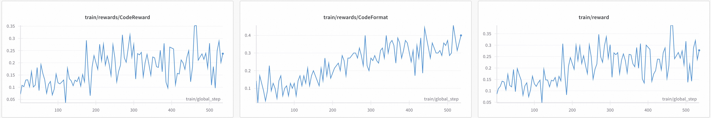

# GRPO代码训练
本文档介绍如何使用GRPO对模型进行代码训练

模型：[Qwen/Qwen2.5-7B-Instruct](https://www.modelscope.cn/models/Qwen/Qwen2.5-VL-7B-Instruct)

数据集：[open-r1/verifiable-coding-problems-python-10k](https://www.modelscope.cn/datasets/open-r1/verifiable-coding-problems-python-10k/dataPeview)

数据集样例
```json
{
  "problem": "Solve the following coding problem using the programming language python: Polycarp has $n$ different binary words. A word called binary if it contains only characters '0' and '1'. For example, these words are binary: \"0001\", \"11\", \"0\" and \"0011100\". Polycarp wants to offer his set of $n$ binary words to play a game \"words\". In this game, players name words and each next word (starting from the second) must start with the last character of the previous word. The first word can be any. For example, these sequence of words can be named during the game: \"0101\", \"1\", \"10\", \"00\", \"00001\". Word reversal is the operation of reversing the order of the characters. For example, the word \"0111\" after the reversal becomes \"1110\", the word \"11010\" after the reversal becomes \"01011\". Probably, Polycarp has such a set of words that there is no way to put them in the order correspondent to the game rules. In this situation, he wants to reverse some words from his set so that: the final set of $n$ words still contains different words (i.e. all words are unique); there is a way to put all words of the final set of words in the order so that the final sequence of $n$ words is consistent with the game rules. Polycarp wants to reverse minimal number of words. Please, help him. -----Input----- The first line of the input contains one integer $t$ ($1 \\le t \\le 10^4$) — the number of test cases in the input. Then $t$ test cases follow. The first line of a test case contains one integer $n$ ($1 \\le n \\le 2\\cdot10^5$) — the number of words in the Polycarp's set. Next $n$ lines contain these words. All of $n$ words aren't empty and contains only characters '0' and '1'. The sum of word lengths doesn't exceed $4\\cdot10^6$. All words are different. Guaranteed, that the sum of $n$ for all test cases in the input doesn't exceed $2\\cdot10^5$. Also, guaranteed that the sum of word lengths for all test cases in the input doesn't exceed $4\\cdot10^6$. -----Output----- Print answer for all of $t$ test cases in the order they appear. If there is no answer for the test case, print -1. Otherwise, the first line of the output should contain $k$ ($0 \\le k \\le n$) — the minimal number of words in the set which should be reversed. The second line of the output should contain $k$ distinct integers — the indexes of the words in the set which should be reversed. Words are numerated from $1$ to $n$ in the order they appear. If $k=0$ you can skip this line (or you can print an empty line). If there are many answers you can print any of them. -----Example----- Input 4 4 0001 1000 0011 0111 3 010 101 0 2 00000 00001 4 01 001 0001 00001 Output 1 3 -1 0 2 1 2 The input will be stdin and you should print your solution to stdout Now solve the problem and return the code.",
  "verification_info": {
    "language": "python",
    "test_cases": [
      {
        "input": "4\n4\n0001\n1000\n0011\n0111\n3\n010\n101\n0\n2\n00000\n00001\n4\n01\n001\n0001\n00001\n",
        "output": "1\n3 \n-1\n0\n\n2\n1 2 \n",
        "type": "stdin_stdout"
      }
    ]
  }
}
```

`verification_info` 提供了程序语言以及测试用例，其中包含输入和预期的输出。


## 奖励函数
使用`code_reward`和`code_format`奖励进行训练，实现细节见[代码](https://github.com/modelscope/ms-swift/blob/main/examples/train/grpo/plugin/plugin.py)

- `code_reward`通过[e2b](https://e2b.dev/)或[judge0](https://judge0.com/)执行生成的代码，根据数据集中的测试用例对代码进行验证给出奖励值。
- `code_format`要求模型输出包含代码块的格式化回答。

注：当前通过e2b执行代码仅支持python语言，如需执行其他语言，可以使用judge0执行（[judge0支持语言列表](https://github.com/judge0/judge0?tab=readme-ov-file#supported-languages)）。

## 训练脚本
### e2b
- 在[e2b](https://e2b.dev/dashboard)注册获取E2B_API_KEY，并设置为环境变量。
- `--reward_funcs`添加`external_code_reward`作为奖励函数。
- `--external_plugins`设置为plugin.py的路径。
首先拉起 vLLM server
```bash
CUDA_VISIBLE_DEVICES=7 \
swift rollout \
  --model Qwen/Qwen2.5-7B-Instruct
```

```bash
E2B_API_KEY=xxx \
WANDB_API_KEY=xxx \
CUDA_VISIBLE_DEVICES=0,1,2,3,4,5,6 \
NPROC_PER_NODE=7 \
swift rlhf \
    --rlhf_type grpo \
    --model Qwen/Qwen2.5-7B-Instruct \
    --external_plugins examples/train/grpo/plugin/plugin.py \
    --reward_funcs external_code_reward external_code_format \
    --reward_weights 1.0 0.1 \
    --vllm_mode server \
    --use_vllm true \
    --vllm_server_host 127.0.0.1 \
    --vllm_server_port 8000 \
    --train_type lora \
    --torch_dtype bfloat16 \
    --dataset 'open-r1/verifiable-coding-problems-python-10k' \
    --max_completion_length 2048 \
    --num_train_epochs 1 \
    --per_device_train_batch_size 2 \
    --per_device_eval_batch_size 2 \
    --learning_rate 1e-6 \
    --gradient_accumulation_steps 1 \
    --eval_steps 200 \
    --save_steps 200 \
    --save_total_limit 2 \
    --logging_steps 5 \
    --max_length 4096 \
    --output_dir output \
    --warmup_ratio 0.05 \
    --dataloader_num_workers 4 \
    --dataset_num_proc 4 \
    --num_generations 14 \
    --temperature 0.9 \
    --system 'examples/train/grpo/prompt.txt' \
    --deepspeed zero2 \
    --log_completions true \
    --report_to wandb
```

### judge0
- 设置环境变量：
    - （必需）JUDGE0_ENDPOINT: judge0访问地址。
    - （可选）JUDGE0_X_AUTH_TOKEN: judge0访问Token。
- `--reward_funcs`添加`external_code_reward_by_judge0`作为奖励函数。
- `--external_plugins`设置为plugin.py的路径。

```bash
JUDGE0_ENDPOINT=xxx \
JUDGE0_X_AUTH_TOKEN=xxx \
WANDB_API_KEY=xxx \
CUDA_VISIBLE_DEVICES=0,1,2,3,4,5,6 \
NPROC_PER_NODE=7 \
swift rlhf \
    --rlhf_type grpo \
    --model Qwen/Qwen2.5-7B-Instruct \
    --external_plugins examples/train/grpo/plugin/plugin.py \
    --reward_funcs external_code_reward_by_judge0 external_code_format \
    --reward_weights 1.0 0.1 \
    --vllm_mode server \
    --use_vllm true \
    --vllm_server_host 127.0.0.1 \
    --vllm_server_port 8000 \
    --train_type lora \
    --torch_dtype bfloat16 \
    --dataset 'open-r1/verifiable-coding-problems-python-10k' \
    --max_completion_length 2048 \
    --num_train_epochs 1 \
    --per_device_train_batch_size 2 \
    --per_device_eval_batch_size 2 \
    --learning_rate 1e-6 \
    --gradient_accumulation_steps 1 \
    --eval_steps 200 \
    --save_steps 200 \
    --save_total_limit 2 \
    --logging_steps 5 \
    --max_length 4096 \
    --output_dir output \
    --warmup_ratio 0.05 \
    --dataloader_num_workers 4 \
    --dataset_num_proc 4 \
    --num_generations 14 \
    --temperature 0.9 \
    --system 'examples/train/grpo/prompt.txt' \
    --deepspeed zero2 \
    --log_completions true \
    --report_to wandb
```

训练奖励曲线图

