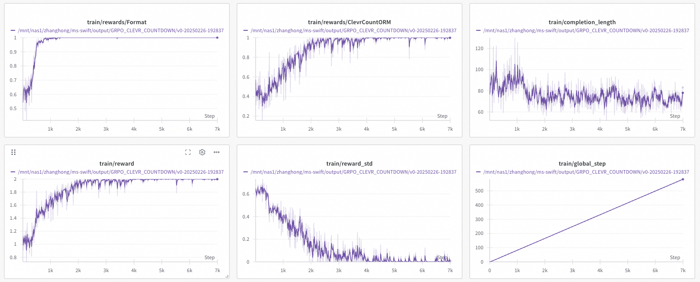
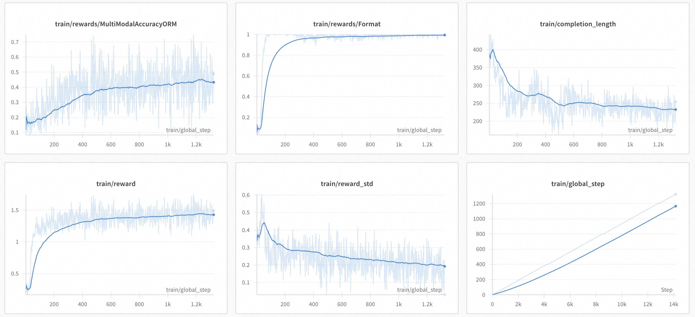
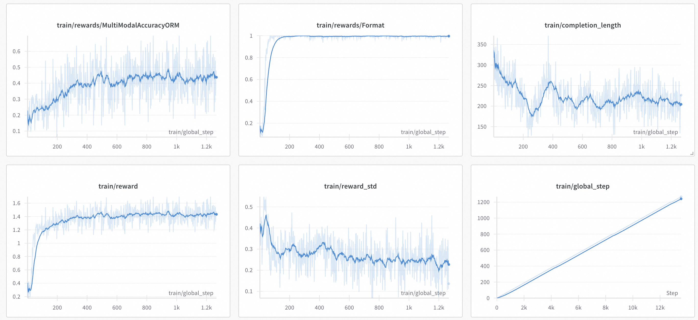

# 多模态GRPO完整实验流程
本文介绍如何使用SWIFT GRPO进行多模态模型和任务的训练。目标是对多个多模态任务进行训练，提升任务精度，任务定义和训练参数等参考了 [R1-V](https://github.com/Deep-Agent/R1-V.git) 和 [open-r1-multimodal](https://github.com/EvolvingLMMs-Lab/open-r1-multimodal.git)


## ClevrCount 任务
### 任务与数据集定义
本任务从clevr_cogen_a_train数据集出发，模型的目标是输出图像中包含的物体数量，因此，我们定义数据集如下：

```python
class ClevrPreprocessor(ResponsePreprocessor):

    def preprocess(self, row: Dict[str, Any]) -> Dict[str, Any]:
        query = row.get('query', '')
        query = f"""{query} Output the thinking process in <think> </think> and
 final answer (number) in <answer> </answer> tags."""
        row.update({'query': query})
        return super().preprocess(row)


register_dataset(
    DatasetMeta(
        ms_dataset_id='okwinds/clevr_cogen_a_train',
        subsets=[
            SubsetDataset(
                name='default',
                subset='default',
                split=['train'],
            ),
        ],
        preprocess_func=ClevrPreprocessor(),
        tags=['qa', 'math']))

```
这里重新定义dataset preprocessor的目的是修改query。数据集示例样本如下，包含messages,images和solution字段，solution会送入后续的奖励函数中，而messages和images则会作为模型输入。
- 注意：`{'role': 'assistant', 'content': '<answer> 3 </answer>'}`将会在GRPOTrainer中被移除，可以忽略。'solution'字段将会透传入ORM中。在自定义数据集时，'images'字段组织成`["image_path1", "image_path2"]`即可。

```json
{
    "images": ["image_path1", "image_path2"],
    "messages": [
        {
            "role": "user",
            "content": "How many items are there in the image? Output the thinking process in <think> </think> and \n final answer (number) in <answer> </answer> tags."
        }
    ],
    "solution": "<answer> 3 </answer>"
}
```


## 奖励函数定义：
本任务使用的奖励函数有两个，一个是 Deepseek-R1 中提到的格式奖励函数，另一是 ClevrCount 的准确性奖励函数。前者已经在swift中内置，通过 `--reward_funcs format` 可以直接使用，而后者需要我们自己定义，在这里我们使用 external_plugin 的方式定义准确性奖励函数，将代码放在`swift/examples/train/grpo/plugin/plugin.py`中。

在这里，奖励函数的输入包括completions和solution两个字段，分别表示模型生成的文本和真值。每个都是list，支持多个completion同时计算。注意，在这里，solution字段是数据集中定义的字段透传而来，如果有任务上的变动，可以分别对数据集和奖励函数做对应的改变即可。
```python

class MultiModalAccuracyORM(ORM):

    def __call__(self, completions, solution, **kwargs) -> List[float]:
        """
        Reward function that checks if the completion is correct.
        Args:
            completions (list[str]): Generated outputs
            solution (list[str]): Ground Truths.

        Returns:
            list[float]: Reward scores
        """
        rewards = []
        from math_verify import parse, verify
        for content, sol in zip(completions, solution):
            reward = 0.0
            # Try symbolic verification first
            try:
                answer = parse(content)
                if float(verify(answer, parse(sol))) > 0:
                    reward = 1.0
            except Exception:
                pass  # Continue to next verification method if this fails

            # If symbolic verification failed, try string matching
            if reward == 0.0:
                try:
                    # Extract answer from solution if it has think/answer tags
                    sol_match = re.search(r'<answer>(.*?)</answer>', sol)
                    ground_truth = sol_match.group(1).strip() if sol_match else sol.strip()

                    # Extract answer from content if it has think/answer tags
                    content_match = re.search(r'<answer>(.*?)</answer>', content)
                    student_answer = content_match.group(1).strip() if content_match else content.strip()

                    # Compare the extracted answers
                    if student_answer == ground_truth:
                        reward = 1.0
                except Exception:
                    pass  # Keep reward as 0.0 if both methods fail
            rewards.append(reward)
        return rewards
orms['external_r1v_acc'] = MultiModalAccuracyORM
```

### GRPO训练实验记录
#### 训练参数：
我们选取 Qwen2.5-VL-3B-Instruct 作为基础模型进行训练，选取 Instruct 而不是基模的主要原因是可以更快地获取 format reward。我们在八卡 GPU 上进行实验。如果遇到vllm部署qwen2.5-vl报错，可以参考[issue](https://github.com/vllm-project/vllm/issues/13285)

由于任务简单，我们设置max_completion_length为1024，奖励函数选择external_r1v_acc和format，学习率和beta分别设置为1e-6和0.001。其他设置如下所示，batch_size和num_generations的设置原则可以参考[GRPO完整流程](./GRPO完整流程.md)。
首先拉起 external vLLM server
```bash
CUDA_VISIBLE_DEVICES=6,7 \
swift rollout \
    --model Qwen/Qwen2.5-VL-3B-Instruct
```

```shell
WANDB_API_KEY=your_wandb_api_key \
CUDA_VISIBLE_DEVICES=0,1,2,3,4,5 \
NPROC_PER_NODE=6 \
swift rlhf \
    --rlhf_type grpo \
    --model Qwen/Qwen2.5-VL-3B-Instruct \
    --external_plugins examples/train/grpo/plugin/plugin.py \
    --reward_funcs external_r1v_acc format \
    --use_vllm true \
    --vllm_mode server \
    --vllm_server_host 127.0.0.1 \
    --vllm_server_port 8000 \
    --train_type full \
    --torch_dtype bfloat16 \
    --dataset 'okwinds/clevr_cogen_a_train' \
    --max_completion_length 1024 \
    --num_train_epochs 1 \
    --per_device_train_batch_size 8 \
    --per_device_eval_batch_size 8 \
    --learning_rate 1e-6 \
    --gradient_accumulation_steps 2 \
    --save_strategy 'steps' \
    --eval_strategy 'steps' \
    --eval_steps 1000 \
    --save_steps 1000 \
    --save_total_limit 10 \
    --logging_steps 1 \
    --output_dir output/GRPO_CLEVR_COUNTDOWN \
    --warmup_ratio 0.01 \
    --dataloader_num_workers 4 \
    --num_generations 24 \
    --temperature 1.0 \
    --system 'examples/train/grpo/prompt.txt' \
    --deepspeed zero3 \
    --log_completions true \
    --report_to wandb \
    --num_iterations 1 \
    --async_generate false \
    --beta 0.001 \
```
#### 实验现象

由于数据集和任务比较简单，模型训练了500个epoch已经基本收敛，有以下观察。
1. 自定义的ClevrORM在不断增加，证明模型学习到了如何完成这一任务，最终任务成功率从初始的0.4攀升到1左右。
2. 由于是Instruct模型，Format Reward基本稳定在1，这可能也与数据集所有样本都是一样的query有一定关系。
3. reward_std 稳定到0.1以下。
4. completion length最终稳定在60-80，模型学习到的固定输出范式是逐个物体列举数数。

step 1:
```
"<think> The image shows 5 distinct items: a cyan metallic cylinder, a red metallic cylinder, a small purple metallic cylinder, a large gray metallic sphere, and a small yellow metallic cube. To count the number of items, I add the counts of each type of object: 1 cyan cylinder, 1 red cylinder, 1 purple cylinder, 1 gray sphere, and 1 yellow cube. Therefore, the total number of items is 5. </think>\n<answer>5</answer>"
"Let's count the number of items in the image:\n1. A large cyan metallic cylinder.\n2. A small purple metallic cylinder.\n3. A large red metallic cylinder.\n4. A large gray metallic sphere.\n5. A small yellow metallic cube.\n\n<answer>5</answer>"
"<think> The image shows four distinct objects: a large cyan metallic cylinder, a smaller purple metallic cylinder, a large red metallic cylinder, and a small yellow metallic cube. Counting each of these items individually, there are five items in total. </think>\n<answer>5</answer>"
```
step 400:
```
"<think> Counting the number of items in the image:\n1. Green matte sphere\n2. Large metallic yellow sphere\n3. Small metallic brown cube\n\nThere are three distinct objects in total.\n</think>\n<answer>3</answer>"
"<think> Counting the objects in the image:\n1. Large yellow metallic sphere\n2. Small green rubber sphere\n3. Small brown metallic cube\n\nThere are three distinct items in the image.\n</think>\n<answer>3</answer>"
```
总体来讲，这一任务比较简单，reward的收敛也比较典型。

## Geometric QA任务
### 任务与数据集定义
本任务为Geometric QA任务，任务描述为：给定一个几何图形，回答有关几何图形的数学问题。原始数据来自于[论文](https://arxiv.org/pdf/2312.11370)，[R1-V](https://github.com/Deep-Agent/R1-V.git)对数据进行了预处理，将所有数据全部处理成了problem-solution的格式，而图像则保留在image字段中，因此，我们不需要额外定义数据集，直接使用`--dataset AI-ModelScope/GEOQA_R1V_Train_8K`即可。
### 奖励函数
由于也是数学题，同时，答案也处理成了最终结果，因此，我们直接使用以上定义过的`MultiModalAccuracyORM`奖励函数。
### GRPO训练实验记录
#### 训练参数：
选取的模型和大部分超参数与上一个实验相似，主要有两点不同：
1. SWIFT 已支持`--num_iteration`参数，单次rollout可以进行多次更新，这里设置为2。
2. 在实验时发现，在数学问题中，训练可能会出现不稳定现象，导致模型训崩，具体表现为所有rewar迅速降低，loss、grad_norm和kl都迅速增大，后续也难以恢复正常状态。因此，这里设置`--max_grad_norm 0.5`，保证稳定训练，当然，这种现象的出现也有一定的随机性。

```shell
WANDB_API_KEY=your_wandb_api_key \
CUDA_VISIBLE_DEVICES=0,1,2,3,4,5 \
MAX_PIXELS=401408 \
NPROC_PER_NODE=6 \
swift rlhf \
    --rlhf_type grpo \
    --model Qwen/Qwen2.5-VL-3B-Instruct \
    --external_plugins examples/train/grpo/plugin/plugin.py \
    --reward_funcs external_r1v_acc format \
    --use_vllm true \
    --vllm_mode server \
    --vllm_server_host 127.0.0.1 \
    --vllm_server_port 8000 \
    --train_type full \
    --torch_dtype bfloat16 \
    --dataset 'AI-ModelScope/GEOQA_R1V_Train_8K' \
    --max_completion_length 1024 \
    --num_train_epochs 1 \
    --per_device_train_batch_size 8 \
    --per_device_eval_batch_size 8 \
    --learning_rate 1e-6 \
    --gradient_accumulation_steps 2 \
    --save_strategy 'steps' \
    --eval_strategy 'steps' \
    --eval_steps 400 \
    --save_steps 400 \
    --save_total_limit 10 \
    --logging_steps 1 \
    --output_dir output/GRPO_GEOQA \
    --warmup_ratio 0.05 \
    --dataloader_num_workers 4 \
    --num_generations 8 \
    --temperature 1.0 \
    --repetition_penalty 1.1 \
    --system 'examples/train/grpo/prompt.txt' \
    --deepspeed zero3 \
    --log_completions true \
    --report_to wandb \
    --num_iterations 2 \
    --async_generate false \
    --beta 0.001 \
    --max_grad_norm 0.5 \
```

#### 实验现象

训练曲线如上图所示。
1. 相比于Count任务，Geometric QA任务的难度明显更大，因此，Accuracy Reward收敛明显更慢，同时震荡幅度也明显更大。
2. completion_length的变化趋势比较明显，最终收敛到250 token左右。
3. reward基本收敛，标准差在一共1300个step时稳定在0.2左右。
以下是训练后的模型completition示例：
```
User:
"If AB is the tangent to circle O with the tangent point A, and BO intersects circle O at point C, and point D is located on circle O, what is the measure of angle ADC if the degree of angle ABO is 32.0?"
Assistant:
"<think>\nTo find the measure of angle ADC, we first need to understand the properties of the tangent and the circle. Since AB is a tangent to the circle at point A, the line segment OA (which is perpendicular to the tangent AB) is perpendicular to AB. This means that angle OAB is 90 degrees.\n\nGiven that angle ABO is 32 degrees, we can find angle BAO by subtracting angle ABO from 90 degrees:\n∠BAO = 90° - ∠ABO = 90° - 32° = 58°\n\nSince angle BAO is an angle in the minor arc AD, the angle ADC, which is an angle in the minor arc AD, is half the angle BAO. Therefore, angle ADC is:\n∠ADC = 1/2 × ∠BAO = 1/2 × 58° = 29°\n\nSo, the measure of angle ADC is 29 degrees.\n</think>\n<answer>\nThe measure of angle ADC is 29 degrees.\n</answer>"
```
## Multimodal Open R1 数据集实验
### 任务与数据集定义
本任务为参考[open-r1-multimodal](https://github.com/EvolvingLMMs-Lab/open-r1-multimodal.git)的实验，使用数据集：[lmms-lab/multimodal-open-r1-8k-verified](https://www.modelscope.cn/datasets/lmms-lab/multimodal-open-r1-8k-verified)，该数据集专注于多模态的数学推理任务，数据由GPT4o基于`Math360K`和`Geo170K`数据集生成，包含推理路径和可验证答案。数据集中已包含了image, problem和solution字段，我们也不需要针对prompt进行修改，因此无需额外定义数据集。
### 奖励函数
我们直接使用以上定义过的`MultiModalAccuracyORM`奖励函数。
### GRPO训练实验记录
#### 训练参数：
选取的模型和大部分超参数与上一个实验相似，由于训练的时候出现了OOM，我们设置`MAX_PIXELS=262144`以降低显存占用。
```shell
WANDB_API_KEY=your_wandb_api_key \
CUDA_VISIBLE_DEVICES=0,1,2,3,4,5 \
MAX_PIXELS=262144 \
MASTER_PORT=29600 \
NPROC_PER_NODE=6 \
swift rlhf \
    --rlhf_type grpo \
    --model Qwen/Qwen2.5-VL-3B-Instruct \
    --external_plugins examples/train/grpo/plugin/plugin.py \
    --reward_funcs external_r1v_acc format \
    --use_vllm true \
    --vllm_mode server \
    --vllm_server_host 127.0.0.1 \
    --vllm_server_port 8000 \
    --train_type full \
    --torch_dtype bfloat16 \
    --dataset 'lmms-lab/multimodal-open-r1-8k-verified' \
    --max_completion_length 1024 \
    --num_train_epochs 1 \
    --per_device_train_batch_size 8 \
    --per_device_eval_batch_size 8 \
    --learning_rate 1e-6 \
    --gradient_accumulation_steps 2 \
    --save_strategy 'steps' \
    --eval_strategy 'steps' \
    --eval_steps 400 \
    --save_steps 400 \
    --save_total_limit 10 \
    --logging_steps 1 \
    --output_dir output/GRPO_GEOQA \
    --warmup_ratio 0.05 \
    --dataloader_num_workers 4 \
    --num_generations 8 \
    --temperature 1.0 \
    --repetition_penalty 1.1 \
    --system 'examples/train/grpo/prompt.txt' \
    --deepspeed zero3 \
    --log_completions true \
    --report_to wandb \
    --num_iterations 2 \
    --async_generate false \
    --beta 0.001 \
    --max_grad_norm 0.5 \
```

#### 实验现象

训练曲线如上图所示。
一共8k数据，训练了1268个step，Accuracy Reward收敛到0.5左右，completion_length基本收敛到200token左右，reward_std最终在0.2左右震荡。
以下是训练后的模型completition示例：
```
User:
"Based on the map, which state falls into the lowest percentage range of lots, and what is that percentage range?"
Assistant:
"<think>\nThe image provided shows a color-coded map of the USA indicating different ranges of lot percentages across various states. According to the legend at the bottom, the lowest percentage range (6.0% - 6.5%) is represented by white. In the image, Alabama (AL) is shaded in white, which corresponds to the 6.0% - 6.5% category. Therefore, based on the map, the state that falls into the lowest percentage range of lots is Alabama, with the percentage range of 6.0% - 6.5%.\nTherefore, the answer is 6.0% - 6.5%.\n</think>\n<answer>Alabama</answer>"
```
