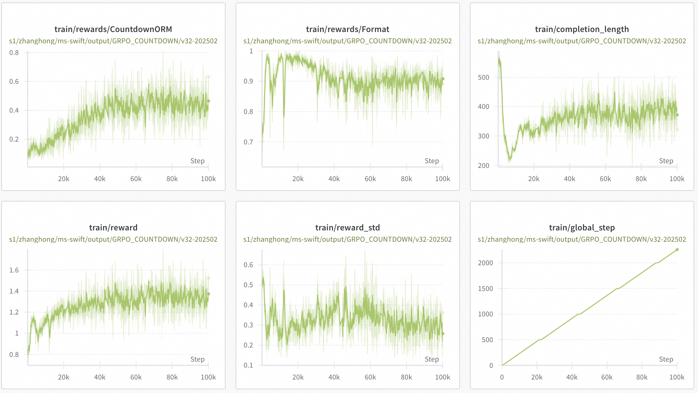
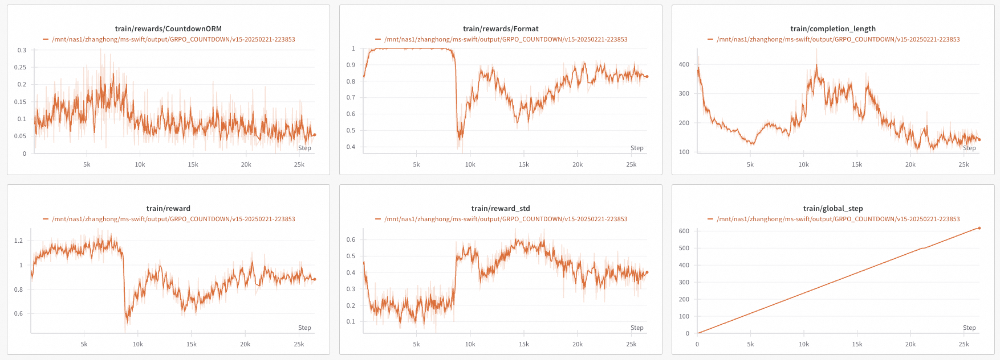

# GRPO完整实验流程

本文从较为简单的数学任务 Coundown Game 出发，从数据集定义、奖励函数定义和GRPO训练几个步骤介绍完整的GRPO训练流程。任务定义和训练参数等参考了 [mini-deepseek-r1](https://github.com/philschmid/deep-learning-pytorch-huggingface/blob/main/training/mini-deepseek-r1-aha-grpo.ipynb)。

## 任务与数据集定义

Coundown Game 的任务目标是根据给定的几个数字和加减乘除四种运算，得到目标数字，因此，我们定义数据集如下：
```python
class CoundownTaskPreprocessor(ResponsePreprocessor):

    def preprocess(self, row: Dict[str, Any]) -> Dict[str, Any]:
        numbers = row['nums']
        target = row.pop('response', None)
        query = f"""
        Using the numbers {numbers}, create an equation that equals {target}.
        You can use basic arithmetic operations (+, -, *, /) and each number can only be used once.
        Show your work in <think> </think> tags. And return the final equation and answer in <answer> </answer> tags,
        for example <answer> (1 + 2) / 3 * 4 = 4 </answer>.
        """
        row.update({'target': target, 'query': query})
        return super().preprocess(row)

register_dataset(
    DatasetMeta(
        ms_dataset_id='zouxuhong/Countdown-Tasks-3to4',
        subsets=['default'],
        preprocess_func=CoundownTaskPreprocessor(),
        tags=['math']))
```
通过 template， 使用 numbers 和 target 完成任务定义，并给到 query 字段供模型采样使用。同时，我们需要保留 nums 和 target 两个字段，用于后续的奖励函数计算。

## 奖励函数定义：
本任务使用的奖励函数有两个，一个是 Deepseek-R1 中提到的格式奖励函数，另一是 Coundown Game 的准确性奖励函数。前者已经在swift中内置，通过 `--reward_funcs format` 可以直接使用，而后者需要我们自己定义，在这里我们使用 external_plugin 的方式定义准确性奖励函数，将代码放在`swift/examples/train/grpo/plugin/plugin.py`中。

在这里，奖励函数的输入包括 completions、target 和 nums 三个字段，分别表示模型生成的文本、目标答案和可用的数字。每个都是list，支持多个 completion 同时计算。注意，在这里，除了 completions 之外的参数都是数据集中定义的字段透传而来，如果有任务上的变动，可以分别对数据集和奖励函数做对应的改变即可。
```python
class CountdownORM(ORM):
    def __call__(self, completions, target, nums, **kwargs) -> List[float]:
        """
        Evaluates completions based on Mathematical correctness of the answer
        Args:
            completions (list[str]): Generated outputs
            target (list[str]): Expected answers
            nums (list[str]): Available numbers
        Returns:
            list[float]: Reward scores
        """
        rewards = []
        for completion, gt, numbers in zip(completions, target, nums):
            try:
                # Check if the format is correct
                match = re.search(r"<answer>(.*?)<\/answer>", completion)
                if match is None:
                    rewards.append(0.0)
                    continue
                # Extract the "answer" part from the completion
                equation = match.group(1).strip()
                if '=' in equation:
                    equation = equation.split('=')[0]
                # Extract all numbers from the equation
                used_numbers = [int(n) for n in re.findall(r'\d+', equation)]
                # Check if all numbers are used exactly once
                if sorted(used_numbers) != sorted(numbers):
                    rewards.append(0.0)
                    continue
                # Define a regex pattern that only allows numbers, operators, parentheses, and whitespace
                allowed_pattern = r'^[\d+\-*/().\s]+$'
                if not re.match(allowed_pattern, equation):
                    rewards.append(0.0)
                    continue
                # Evaluate the equation with restricted globals and locals
                result = eval(equation, {"__builti'ns__": None}, {})
                # Check if the equation is correct and matches the ground truth
                if abs(float(result) - float(gt)) < 1e-5:
                    rewards.append(1.0)
                else:
                    rewards.append(0.0)
            except Exception as e:
                # If evaluation fails, reward is 0
                rewards.append(0.0)
        return rewards
orms['external_countdown'] = CountdownORM
```

## GRPO训练实验记录
首先贴上GRPO的公式：

$$
{\scriptstyle
\begin{aligned}
\mathcal{J}_{G R P O}(\theta) & =\mathbb{E}\left[q \sim P(Q),\left\{o_i\right\}_{i=1}^G \sim \pi_{\theta_{o l d}}(O \mid q)\right] \\
& \frac{1}{G} \sum_{i=1}^G \frac{1}{\left|o_i\right|} \sum_{t=1}^{\left|o_i\right|}\left\{\min \left[\frac{\pi_\theta\left(o_{i, t} \mid q, o_{i,<t}\right)}{\pi_{\theta_{o l d}}\left(o_{i, t} \mid q, o_{i,<t}\right)} \hat{A}_{i, t}, \operatorname{clip}\left(\frac{\pi_\theta\left(o_{i, t} \mid q, o_{i,<t}\right)}{\pi_{\theta_{o l d}}\left(o_{i, t} \mid q, o_{i,<t}\right)}, 1-\varepsilon, 1+\varepsilon\right) \hat{A}_{i, t}\right]-\beta \mathbb{D}_{K L}\left[\pi_\theta| | \pi_{r e f}\right]\right\}
\end{aligned}
}
$$

### 训练参数：
我们选取 Qwen2.5-3B-Instruct 作为基础模型进行训练，选取 Instruct 而不是基模的主要原因是可以更快地获取 format reward。我们在三卡 GPU 上进行实验，因此vllm的推理部署在最后一张卡上，而进程数设置为2，在剩下两张卡上进行梯度更新。

由于任务较为简单，我们设置 max_completion_length 和 vllm_max_model_len 为1024，如果有更复杂的任务，可以适当加大模型输出长度，但请注意，**这两个参数越大，模型训练需要的显存越多，训练速度越慢，单个step的训练时间与max_completion_length呈现线性关系**。

在我们的实验中，总batch_size为

```
num_processes * per_device_train_batch_size * gradient_accumulation_steps = 2 * 8 * 8 = 128
```

注意，这里单卡batch_size设置也与显存息息相关，请根据显存上限设置一个合适的值。 同时，还有一个公式，即总的steps数量 :$num\_steps = epochs \times len(datasets) \times num\_generations \div batch\_size $，需要根据这个来合理规划训练的学习率和warmup设置。

最后比较重要的设置是学习率和 beta，学习率比较好理解，而beta则是是以上公式的 $\beta$，即KL散度的梯度的权重。这两个参数设置的越大，模型收敛原则上更快，但训练往往会不稳定。经过实验，我们分别设置为 `5e-7` 和 `0.001`。在实际训练中，请根据是否出现不稳定的震荡情况适当调整这两个参数。

对于KL散度，社区有很多的讨论，可以参考[为什么GRPO坚持用KL散度](https://zhuanlan.zhihu.com/p/25862547100)。

其他参数的设置，没有做太多探讨，所以这里不进行详细说明。
```bash
CUDA_VISIBLE_DEVICES=2 \
swift rollout \
    --model Qwen/Qwen2.5-3B-Instruct
```

```bash
CUDA_VISIBLE_DEVICES=0,1 \
WANDB_API_KEY=your_wandb_key \
NPROC_PER_NODE=2 \
swift rlhf \
    --rlhf_type grpo \
    --model Qwen/Qwen2.5-3B-Instruct \
    --external_plugins examples/train/grpo/plugin/plugin.py \
    --reward_funcs external_countdown format \
    --use_vllm true \
    --vllm_mode server \
    --vllm_server_host 127.0.0.1 \
    --vllm_server_port 8000 \
    --train_type full \
    --torch_dtype bfloat16 \
    --dataset 'zouxuhong/Countdown-Tasks-3to4#50000' \
    --max_length 2048 \
    --max_completion_length 1024 \
    --num_train_epochs 1 \
    --per_device_train_batch_size 8 \
    --per_device_eval_batch_size 8 \
    --learning_rate 5e-7 \
    --gradient_accumulation_steps 8 \
    --eval_steps 500 \
    --save_steps 100 \
    --save_total_limit 20 \
    --logging_steps 1 \
    --output_dir output/GRPO_COUNTDOWN \
    --warmup_ratio 0.01 \
    --dataloader_num_workers 4 \
    --num_generations 8 \
    --temperature 1.0 \
    --system 'You are a helpful assistant. You first thinks about the reasoning process in the mind and then provides the user with the answer.' \
    --deepspeed zero3 \
    --log_completions true \
    --report_to wandb \
    --beta 0.001 \
    --num_iterations 1
```
### 实验现象

从训练了2000 step的实验结果来看，有几点观察：
1. 自定义的CoundownORM在不断增加，证明模型学习到了如何完成这一任务，最终任务成功率在0.5左右。
2. Format Reward整体处在较高的水平，在0.9-1左右震荡。
3. reward_std 最终在0.2-0.3左右，仍未完全收敛，模型仍然有继续提升reward的空间。
4. 观察模型输出可以发现，相当一部分失败案例是由于模型简单加减乘除做不对，因此模型最终的收敛方向也变成了逐步运算上，如果换成更大的模型，可能有不同的收敛方向。
5. completion length呈现先下降再增加，在200 step左右最低，然后逐渐上升到350左右。证明模型经历了思考方式的转变。
6. 模型的思考方式在不断变化，最终模型发现做排列组合并逐步运算能更好地完成这一任务，最终的采样输出也大多是这一格式，以下是不同step的completion变化：

step 1:
```
"<think>\nWe need to create an equation using the given numbers [70, 5, 42, 30] exactly once and make it equal to 77. \n\nFirst, let's consider the possibility of multiplication or division to get closer to 77. Notice that 77 is close to 70 and 42. If we can use these numbers together, it might work.\n\nMultiplying 70 by 1.1 would give us approximately 77, which is very close. So, let's try to make 1.1 using the remaining numbers 5 and 30. \nIf we take 30/5 = 6, and then 5/6 = 0.8333..., this isn't useful here, so let's look at other possibilities.\n\nNext, let's consider if there's another way to achieve 77 using addition, subtraction, or another combination of our numbers. Given the numbers provided, it seems that multiplication or division will be key. \n\nWe can try subtracting 5 from 30 to get 25. Then, if we divide 42 by 25, we don't get a whole number, but we can round it to the nearest whole number, 1. Now, we need to make the equation fit 77. Let's multiply 25 by 3 and add 7 (since 77 = 25*3 + 7). However, we only have one 7 available and we need to find a way to use the remaining numbers to get 7.\n\nLet's try:  \n70 - 42 = 28  \nThen, 28 + 5 = 33  \nNext, 33 + 30 = 63  \nFinally, 77 - 63 = 14, which doesn't help.\n\nConsidering different combinations, one viable way is:\n(70 - 42) * (30 / 5) = 28 * 6 = 168 / 2 = 84 / 2 = 42 / 2 = 21 / 3 = 7\n\nSo, (70 - 42) * (30 / 5) = 77.\n</think>\n<answer>(70 - 42) * (30 / 5) = 77</answer>"
```
step 200:
```
"<think>\nWe need to use all the given numbers in a way that the resultant value of the calculation is 99. Given these restrictions, it's clear we should look into how the numbers relate and the mathematical operations that will bring them together to meet our condition.\n\nFirstly, let's evaluate the sums, differences, and multiplication/division among the numbers and their relations to see how this could lead us towards an outcome of 99.\n- Summing the three numbers: 96 + 70 + 73 = 239, which is far from 99. This shows addition isn't practical.\n- Subtracting numbers: For instance, subtracting the lowest two (i.e., 73 - 70 = 3) and combining with the highest one (96) does not work. Also, there is no other combination of subtraction that would result in the number needing to add up to 99.\n- Multiplying or dividing the numbers alone wouldn’t reach to any near solution since none of the products or division results of the numbers themselves is very close to 99. We might think more carefully about the arrangement of them using a combination of the operations provided.\nTherefore, considering the possible arrangement, a combination like taking (73 - 70 + 96) may produce an effective solution as this will sum the values in such a manner that it aligns with the goal of 99.\n\nSo we conclude that the operation: 73 - 70 + 96 gives the right sequence to equal 99.\n</think>\n\n<answer>73 - 70 + 96 = 99</answer>"
```
step 500:
```
"<think>\nLet's begin by exploring various possible combinations of the given numbers using the arithmetic operators we have access to.\n\n- If I add the numbers, I get: 56 + 73 + 51 = 180 which is not equal to our target number (68)\n- If I subtract one number from another I will still exceed our target value as well since the maximum difference is: |(difference between max-min):| | (73 - 51) or | (73 - 56), etc.|\n- Let's multiply the numbers individually and see if the division operation can bring us closer to the goal:\n    - (73 * 51) - 56 = 3723 - 56 = 3667 which isn't the goal either.\n    - The only operator left is addition and subtraction; I'll try the combination: \n    ((73 - 56) + 51) gives me (17 + 51) = 68.\n    \nThus, our solution fits the provided problem constraints and meets the required outcome.\n</think>\n<answer>(73 - 56) + 51 = 68</answer>"
```

step 1000:
```
"<think>\nWe need to form an expression using the given numbers (50, 86, and 49) such that it equals 85. Let's try different combinations:\n\n(86 - 50) + 49 = 76 + 49 = 125 (too big)\n(86 - 49) + 50 = 37 + 50 = 87 (too big)\n(86 - 50) + 49 = 37 + 49 = 86 (too big)\n(86 + 50) - 49 = 136 - 49 = 87 (too big)\n(86 - 50) + (49 - x)? Not working!\n(50 + 86) - 49: this is 136 which isn't our aim.\n50 + (86 - 49) = 50 + 37 = 87 which wasn't correct.\n50 - 86 + 49 = -16 + 49: This doesn't match up as well.\n86 - (50 + 49) = 86 - 99 which doesn't work too.\n\nWe try one more:\n(86 + 49) - 50 = 135 - 50 = 85!\n\nThat's it!\n</think>\n\n<answer>(86 + 49) - 50 = 85</answer>"
```

step 2000:
```
"<think>\nWe need to form an expression using the numbers 58, 9, 78, and 44 which evaluates to 73. Let's try different combinations:\n(78 - 58) + (9 + 44) = 10 + 53 = 63 (too low)\n(78 - 58) + (9 - 44) = 20 - 35 = -15 (too low)\n(78 - 58) + (44 - 9) = 20 + 35 = 55 (too low)\n(78 + 58) - (9 + 44) = 136 - 53 = 83 (too high)\n(78 + 58) - (9 - 44) = 136 + 35 = 171 (too high)\n(78 + 58) - (44 + 9) = 136 + 53 = 189 (too high)\n(78 + 9) - (58 + 44) = 87 - 102 = -15 (too low)\n(78 + 9) - (58 - 44) = 87 - 14 = 73\n\nSo our solution is: (78 + 9) - (58 - 44) = 73</think>\n\n<answer>(78 + 9) - (58 - 44) = 73</answer>"
```

附learning_rate和beta分别取值1e-6和0.04的不稳定实验记录，模型在step 200左右出现了震荡，format和CountdownORM瞬间走低：

