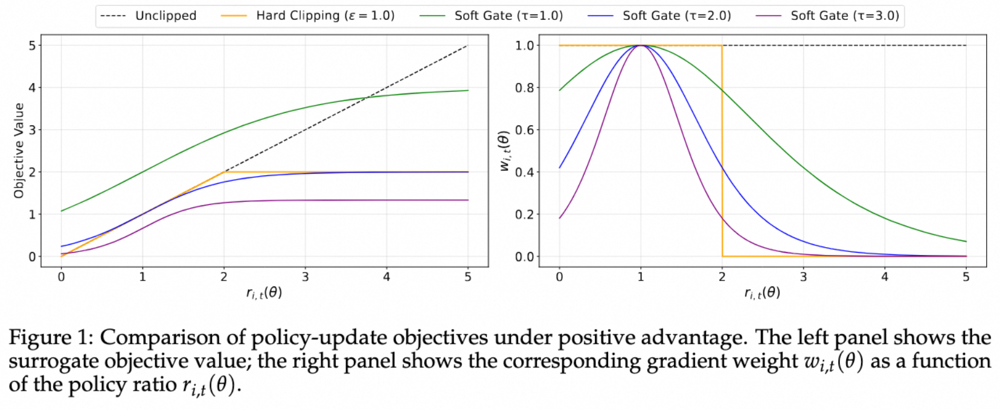

# Soft Adaptive Policy Optimization (SAPO)

**版本依赖**：ms-swift>=3.11

[Soft Adaptive Policy Optimization (SAPO)](https://arxiv.org/abs/2511.20347) 针对 GRPO 中硬裁剪（hard clipping）带来的问题，提出了一种基于温度控制的软门控（soft gate）机制，用于平滑地衰减离策略更新，同时保留有用的学习信号。

## 背景与动机

在强化学习训练 LLM 时，GRPO 通过计算 token 级别的重要性采样比（Importance Sampling Ratio）来处理 off-policy 训练：

$$
r_t = \frac{\pi_\theta(y_t|x, y_{<t})}{\pi_{\theta_{\mathrm{old}}}(y_t|x, y_{<t})}
$$

然而，token 级别的重要性采样比往往表现出高方差，这一现象在以下情况下可能更严重：
- **长文本生成**
- **MoE 模型的路由异质性**：采样时的 old-policy 模型与训练模型可能使用不同的专家路由，导致 logps 差异显著放大

为此，GRPO 通过硬裁剪来限制策略更新的幅度：

$$
L^{\mathrm{GRPO}} = -\min\left( r_t \cdot A, \mathrm{clip}(r_t, 1-\epsilon, 1+\epsilon) \cdot A \right)
$$

**硬裁剪的困境**：硬裁剪难以在稳定性和学习效率之间取得平衡——裁剪范围过严格会限制有效样本的数量，而过宽松则会引入离策略样本的噪声梯度，导致训练不稳定。

## SAPO 方法

SAPO 使用温度控制的 sigmoid 软门控函数替代硬裁剪，实现平滑的梯度衰减。

### 软门控函数

SAPO 的核心是使用 sigmoid 函数对重要性采样比进行软门控：

对于正向优势（$A > 0$），使用正向门控：

$$
g^{+}_t = \sigma\left( \tau_{\mathrm{pos}} \cdot (r_t - 1) \right)
$$

对于负向优势（$A < 0$），使用负向门控：

$$
g^{-}_t = \sigma\left( \tau_{\mathrm{neg}} \cdot (r_t - 1) \right)
$$

其中：
- $\sigma(\cdot)$ 是 sigmoid 函数
- $\tau_{\mathrm{pos}}$ 和 $\tau_{\mathrm{neg}}$ 是温度参数，控制门控函数的斜率
- $r_t$ 是重要性采样比

### SAPO 损失函数

$$
L^{\mathrm{SAPO}} = -g_t \cdot A
$$

其中 $g_t = g^{+}_t$ 当 $A > 0$，$g_t = g^{-}_t$ 当 $A < 0$。

### 温度参数

温度参数 $\tau$ 控制软门控函数的衰减速率，数值越大，衰减越快。



论文指出正向优势会提升采样token的logit，并降低所有未采样token的logit；负向优势相反，提高许多未采样token的logit，可能会扩散到大量无关token上，带来一定的不稳定性。所以论文推荐设置温度 $\tau_\text{neg} > \tau_\text{pos}$，来使负向奖励的token梯度衰减更快，提升训练的稳定性和性能。

论文默认推荐 $\tau_{\mathrm{pos}} = 1.0$，$\tau_{\mathrm{neg}} = 1.05$。

## 参数设置

| 参数 | 类型 | 默认值 | 说明 |
|------|------|--------|------|
| `--loss_type` | `str` | - | 设置为 `sapo` |
| `--tau_pos` | `float` | `1.0` | 正向优势的温度参数，控制门控斜率 |
| `--tau_neg` | `float` | `1.05` | 负向优势的温度参数，控制门控斜率 |

```bash
swift rlhf \
    --rlhf_type grpo \
    --loss_type sapo \
    --tau_pos 1.0 \
    --tau_neg 1.05 \
    # ... 其他参数
```

训练脚本参考

- [swift](https://github.com/modelscope/ms-swift/blob/main/examples/train/grpo/internal/sapo.sh)
- [megatron swift](https://github.com/modelscope/ms-swift/blob/main/examples/megatron/grpo/sapo.sh)

> SAPO 的软门控机制仅在 off-policy 训练下生效。
> SAPO 中的重要性采样粒度为 token 级别（即 importance_sampling_level 默认设置为 token），与 GSPO 冲突。
