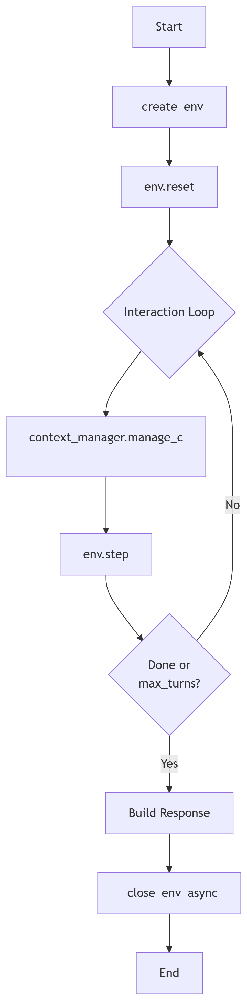

# GYM环境训练

**注意** GYM环境训练逻辑已在 ms-swift 3.8 中进行重构，如果您的 ms-swift 版本低于该版本，请参考对应版本的文档。

## Gym接口

GYM源自于[OpenAI Gym](https://github.com/openai/gym)，是一个抽象的强化学习环境接口，基于现在Model as Agent的趋势，我们在swift中定义了类似的一个接口,为Agent提供端到端的强化学习训练。
```python
class Env(ABC):

    def __init__(self, env_config):
        """

        Args:
            env_config: 环境配置，比如可用工具等
        """
        self.env_config = env_config

    @abstractmethod
    async def reset(self, config: RolloutInferRequest) -> Tuple[str, Dict[str, Any], str]:
        """

        Args:
            config: 环境初始化信息，应该放在

        Returns:
            - observation: 第一个user消息作为初始观察或者环境信息，会作为user message
            - info: 用于DEBUG和日志的额外信息，会在completions.jsonl中记录
            - system_message: 用户当前环境采样的系统提示词
        """
        pass

    @abstractmethod
    async def step(self, action: Messages) -> Tuple[str, float, bool, Dict[str, Any]]:
        """

        Args:
            action: 所有对话消息，最后一个消息为当前采样回复

        Returns:
            - next_observation: 环境响应，将作为user message返回
            - reward: 奖励
            - done: 是否结束
            - info: 用于DEBUG和日志的额外信息，会在completions.jsonl中记录
        """
        pass
    @abstractmethod
    async def close(self):
        """Clean up environment resources."""
        pass
```
除此之外，根据[Kimi-Reseacher的实践](https://moonshotai.github.io/Kimi-Researcher/)，我们还额外提供了一个`ContextMangaer`接口,方便你动态的管理当前的Agent上下文。

**ContextManager指定（非必需）**
1. 在数据集中提供 [ctx_config](#注意事项) 列中的 name 键指定， 初始化相关的参数放在其他键中
2. 使用参数 `--context_manager ctx_name` 指定


```python
class ContextManager(ABC):
    def __init__(self,ctx_config):
        self.ctx_config = ctx_config

    @abstractmethod
    def manage_context(self, history: Messages,trajectory_id:str) -> Messages:
        """动态调整当前agent的上下文

        Args:
            history: 当前的消息历史

        Returns:
            调整后的消息历史
        """
        pass
```
入参示例
```python
infer_request
"""
RolloutInferRequest(
    messages=[
        {'role': 'system', 'content': 'A conversation between User and Assistant. The user asks a question, and the Assistant solves it. The assistant first thinks about the reasoning process in the mind and then provides the user with the answer. The reasoning process and answer are enclosed within <think> </think> and <answer> </answer> tags, respectively, i.e., <think> reasoning process here </think><answer> answer here </answer>\n'}, {'role': 'user', 'content': 'What is the value of $\\sqrt{36 \\times \\sqrt{16}}$?'},
        {'role': 'assistant', 'content': 'To find the value of \\(\\sqrt{36 \\times \\sqrt{16}}\\), we will break down the problem step-by-step.\n\nFirst, we need to evaluate the inner square root:\n\\[\n\\sqrt{16}\n\\]\nWe know that:\n\\[\n4^2 = 16 \\implies \\sqrt{16} = 4\n\\]\n\nNext, we substitute this result back into the original expression:\n\\[\n\\sqrt{36 \\times \\sqrt{16}} = \\sqrt{36 \\times 4}\n\\]\n\nNow, we need to evaluate the product inside the square root:\n\\[\n36 \\times 4 = 144\n\\]\n\nSo, the expression simplifies to:\n\\[\n\\sqrt{144}\n\\]\n\nFinally, we determine the square root of 144:\n\\[\n\\sqrt{144} = 12\n\\]\n\nThus, the value of \\(\\sqrt{36 \\times \\sqrt{16}}\\) is:\n\\[\n\\boxed{12}\n\\]'}
    ],
    images=[],
    audios=[],
    videos=[],
    tools=None,
    objects={},
    data_dict={
        'problem': 'What is the value of $\\sqrt{36 \\times \\sqrt{16}}$?',
        'solution': "To solve the problem, we need to evaluate the expression \\(\\sqrt{36 \\times \\sqrt{16}}\\).\n\nWe can break down the steps as follows:\n\n1. Evaluate the inner square root: \\(\\sqrt{16}\\).\n2. Multiply the result by 36.\n3. Take the square root of the product obtained in step 2.\n\nLet's compute this step by step using Python code for accuracy.\n```python\nimport math\n\n# Step 1: Evaluate the inner square root\ninner_sqrt = math.sqrt(16)\n\n# Step 2: Multiply the result by 36\nproduct = 36 * inner_sqrt\n\n# Step 3: Take the square root of the product\nfinal_result = math.sqrt(product)\nprint(final_result)\n```\n```output\n12.0\n```\nThe value of \\(\\sqrt{36 \\times \\sqrt{16}}\\) is /\\(\\boxed{12}\\)."
        }
    )
"""
result
"""
RolloutResponseChoice(
    index=0,
    message=ChatMessage(
        role='assistant',
        content='To find the value of \\(\\sqrt{36 \\times \\sqrt{16}}\\), we will break down the problem step-by-step.\n\nFirst, we need to evaluate the inner square root:\n\\[\n\\sqrt{16}\n\\]\nWe know that:\n\\[\n4^2 = 16 \\implies \\sqrt{16} = 4\n\\]\n\nNext, we substitute this result back into the original expression:\n\\[\n\\sqrt{36 \\times \\sqrt{16}} = \\sqrt{36 \\times 4}\n\\]\n\nNow, we need to evaluate the product inside the square root:\n\\[\n36 \\times 4 = 144\n\\]\n\nSo, the expression simplifies to:\n\\[\n\\sqrt{144}\n\\]\n\nFinally, we determine the square root of 144:\n\\[\n\\sqrt{144} = 12\n\\]\n\nThus, the value of \\(\\sqrt{36 \\times \\sqrt{16}}\\) is:\n\\[\n\\boxed{12}\n\\]', tool_calls=None),
        finish_reason='stop',
        logprobs=None,
        messages=None)
"""
```
GYM环境训练可以视作一种特殊的多轮训练，区别在于使用GYM环境训练，奖励信息通过环境直接获取。

在 `rollout` 命令中使用参数 `use_gym_env` 来指定使用gym作为训练的环境接口。我们提供了兼容GYM环境的多轮规划器参考实现，见[内置多轮调度器实现](https://github.com/modelscope/ms-swift/blob/main/swift/plugin/multi_turn.py)中的 GymScheduler 类


```bash
CUDA_VISIBLE_DEVICES=0 \
swift rollout \
    --model xxx \
    --use_gym_env true \
    --multi_turn_scheduler gym_scheduler \
    --max_turns xxx
```

> 注意

**环境选择**
1. 在数据集中需要提供 [env_config](#注意事项) 列中的name键指定, 初始化相关的参数放在其他键中
2. 使用参数 `--gym_env env_name` 指定


## 最佳实践

- [训练脚本](../../../../../examples/train/grpo/external/vllm_gym.sh)

通过参数`external_plugins`, 我们可以将本地的`Env`和`ContextManager`注册进 ms-swift 中，具体实现参考[代码](https://github.com/modelscope/ms-swift/blob/main/examples/train/grpo/plugin/plugin.py)

## 注意事项

1. 参考训练数据格式
```json
{"messages": [{"role": "system", "content": "你是个有用无害的助手"}, {"role": "user", "content": "告诉我明天的天气"}],"env_config":{"name":"custom_env","other_config":"xxxx"},"ctx_config":{"name":"custom_ctx","other_config":"xxxx"}}
```
2. 默认仅对最后一轮response进行训练，如果gym涉及到多轮response生成，使用参数`--loss_scale default`对所有轮次的response进行训练，具体参考[文档](./多轮训练.md#损失掩码)

3. 数据流程
整个gym数据流程如下:


4. 奖励日志
由于gym的奖励是在step函数内计算完成，所以需要手动通过`info`返回日志，最终的记录会放在completions.jsonl中的`trajectory_infos`字段.
