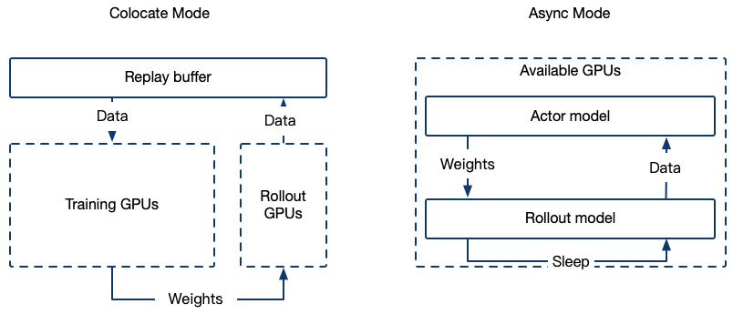

# GRPO

**更新日志**
- **2025-06-22** - 多轮训练重构并支持AsyncEngine，参考[文档](../DeveloperGuide/多轮训练.md)
- **2025-05-29** — 支持了padding_free(--padding_free true)和序列并行(--sequence_parallel_size N)。
- **2025-05-23** — 支持自定义采样批量大小，参考 generation_batch_size / steps_per_generation 参数。
- **2025-05-22** — swift rollout 支持 data_parallel_size 参数。
- **2025-05-16** - 增加 ref_model 同步逻辑，参考参数 sync_ref_model。
- **2025-05-13** — 为了代码的可读性和维护性， GRPOTrainer代码重构，Internal mode 支持vLLM>=0.8。
- **2025-05-11** — 支持生成式奖励模型，通过 reward_model_plugin 自定义奖励模型逻辑。有关更多详细信息，请参阅[文档](../DeveloperGuide/奖励模型)部分。
- **2025-04-30** — external vllm server 的启动命令改为 `swift rollout`。

GRPOTrainer在ms-swift3.5进行了代码重构，如果你使用的swift版本<3.5, 请参考[stable文档](https://github.com/modelscope/ms-swift/blob/v3.4.1/docs/source/Instruction/GRPO.md)

[GRPO(Group Relative Policy Optimization)](https://arxiv.org/abs/2402.03300) 算法利用组内相对优势计算来替代 PPO 算法中独立的价值模型，并直接在损失函数中加入 KL 散度惩罚来提高训练稳定性。


GRPO 目标函数

$
{\scriptstyle
\begin{aligned}
\mathcal{J}_{G R P O}(\theta) & =\mathbb{E}_{\left[q \sim P(Q),\left\{o_i\right\}_{i=1}^G \sim \pi_{\theta_{o l d}}(O \mid q)\right]} \\
& \frac{1}{G} \sum_{i=1}^G \frac{1}{\left|o_i\right|} \sum_{t=1}^{\left|o_i\right|}\left\{\min \left[\frac{\pi_\theta\left(o_{i, t} \mid q, o_{i,<t}\right)}{\pi_{\theta_{o l d}}\left(o_{i, t} \mid q, o_{i,<t}\right)} \hat{A}_{i, t}, \operatorname{clip}\left(\frac{\pi_\theta\left(o_{i, t} \mid q, o_{i,<t}\right)}{\pi_{\theta_{o l d}}\left(o_{i, t} \mid q, o_{i,<t}\right)}, 1-\varepsilon, 1+\varepsilon\right) \hat{A}_{i, t}\right]-\beta \mathbb{D}_{K L}\left[\pi_\theta| | \pi_{r e f}\right]\right\}
\end{aligned}
}
$

其中优势函数定义为

$
\hat{A}_{i,t} = \frac{R_i - \text{mean}(\{R_j\}_{j=1}^G)}{\text{std}(\{R_j\}_{j=1}^G)}
$


<details> <summary>GRPO算法伪代码</summary>

```python
# ========== 1. Rollout Generation Phase ==========
prompt = "Question: Which is bigger? 9.11 or 9.9?"

# Generate multiple completions through parallel sampling
completions = rollout_function(
    model=current_policy_model,
    prompt=prompt,
    num_generations=8,  # Hyperparameter: number of samples per prompt
    temperature=1.0     # Hyperparameter: sampling diversity
)
"""
completions = [
    (completion 1) "The larger number is 9.11...",
    (completion 2) "9.9 is bigger than...",
    ...
    (completion 8) "After calculation, 9.11..."
]
"""

# ========== 2. Reward Calculation Phase ==========
# Evaluate generated completions using reward model
rewards = reward_function(
    completions=completions,
    ground_truth="9.11"  # Expected correct answer
)
"""
rewards = [
    (reward 1) 1.0,  # Correct answer
    (reward 2) 0.0,  # Incorrect
    ...
    (reward 8) 1.0   # Correct
]
"""

# Normalize rewards to advantages
rewards_mean = mean(rewards)  # μ = 0.5
rewards_std = std(rewards)    # σ = 0.25
advantages = (rewards - rewards_mean) / (rewards_std + 1e-8)  # Standardization
"""
advantages = [
    (advantage 1)  2.0,  # (1.0 - 0.5)/0.25
    (advantage 2) -2.0,
    ...
    (advantage 8)  2.0
]
"""

# ========== 3. Policy Optimization Phase ==========
# Get token-level log probabilities from different models
current_logps = get_per_token_logps(current_policy_model, prompt, completions)  # π_θ
old_logps = get_per_token_logps(old_policy_model, prompt, completions)          # π_θ_old
ref_logps = get_per_token_logps(reference_model, prompt, completions)           # π_ref

# PPO Clipped Objective
is_ratio = exp(current_logps - old_logps)  # Importance sampling ratio: e^(π_θ - π_θ_old)
clipped_ratio = clip(is_ratio, 1-ε, 1+ε)   # ε=0.2 typically

# Policy gradient term (dual form)
policy_loss = -mean(
    minimum(is_ratio * advantages,       # Unclipped objective
           clipped_ratio * advantages)  # Clipped objective
)

# KL Divergence Penalty (K3 estimator)
# KL(π_θ||π_ref) ≈ e^(logπ_ref - logπ_θ) - (logπ_ref - logπ_θ) - 1
kl_penalty = beta * mean(
    exp(ref_logps - current_logps) -
    (ref_logps - current_logps) - 1
)

# Total Loss = Policy Loss + KL Penalty
total_loss = policy_loss + kl_penalty

# ========== 4. Update Rule ==========
# Apply gradient descent to minimize total_loss
optimizer.zero_grad()
total_loss.backward()
optimizer.step()
```
</details>

训练脚本示例参考[examples](https://github.com/modelscope/ms-swift/tree/main/examples/train/grpo)

GROP参数参考[文档](../../../Instruction/命令行参数.md#grpo参数)

## 集群支持



GRPO 训练框架支持集成高性能推理引擎（如 vLLM）来加速采样过程，提供以下两种部署模式：

### 1. Colocate(Internal) Mode

训练与推理共享GPU资源，在 Trainer 内部启动推理服务，

启动参数
```bash
--use_vllm true \
--vllm_mode colocate
```

#### Colocate 模式下的显存优化方案
在 Colocate 模式下运行时，容易出现显存不足（OOM）的情况。以下是几种有效的显存优化方法和参数配置：

1. 降低`vllm_gpu_memory_utilization` 参数


2. 在训练阶段，释放 vLLM 占用的显存：

```bash
--sleep_level 1
```

3. 在vLLM 推理阶段，释放模型和优化器占用的显存：

```bash
--offload_optimizer true \
--offload_model true \
--gc_collect_after_offload true \
```

4. 在vLLM中使用 Tensor Parallel 技术：

```bash
--vllm_tensor_parallel_size [tp_size]
```

5. 分批 Gather 模型权重（zero3下同步 vLLM 权重时）：

```bash
--move_model_batches [批次数量]
```

### 2. Async(External) Mode

训练与推理资源分离，启动单独的推理服务器

使用`swift rollout`命令部署vLLM 服务器, 现仅支持vLLM backend
```bash
CUDA_VISIBLE_DEVICES=0 \
swift rollout \
  --model Qwen/Qwen2.5-VL-7B-Instruct \
  --tensor_parallel_size 2 \
  --data_parallel_size 1

CUDA_VISIBLE_DEVICES=0,1 \
swift rollout \
  --model Qwen/Qwen2.5-VL-7B-Instruct \
  --tensor_parallel_size 2 \
  --data_parallel_size 1

CUDA_VISIBLE_DEVICES=0,1,2,3 \
swift rollout \
  --model Qwen/Qwen2.5-VL-7B-Instruct \
  --tensor_parallel_size 2 \
  --data_parallel_size 2
```

更多 rollout 参数参考[文档](../../../Instruction/命令行参数.md#vllm参数)

注意：在使用 use_async_engine 时，仅开启 DP 可能会导致错误，相关问题参考： [vllm issue](https://github.com/vllm-project/vllm/issues/18567)。如果出现错误，请尝试同时启用 TP 和 DP。


训练使用以下参数配置外部 vLLM 服务器
```bash
--use_vllm true \
--vllm_mode server \
--vllm_server_host <服务器IP> \
--vllm_server_port <服务端口> \
--vllm_server_timeout <超时时间> \
```


## FAQ
**1. 训练过程中 loss 等于0 / 接近0 / 小于0**

正常情况， 参考[issue](https://github.com/huggingface/open-r1/issues/239#issuecomment-2646297851)

**2. num_generations / 批量大小相关**

在 GRPO 中，batch_size 以 completion（模型生成结果） 为单位。例如，设置 per_device_train_batch_size=8 表示每张 GPU 在训练过程中会同时处理 8 个 completion 的 loss 计算。

训练阶段，在一次完整的梯度累计 batch 中，总的批量大小等于：

```
effective_batch_size = num_processes * per_device_train_batch_size * gradient_accumulation_steps
```

采样阶段，总的批量大小 (completion-level) 数量等于:

1. 设置 generation_batch_size 下，等于 generation_batch_size
2. 设置 steps_per_generation 下， 等于 steps_per_generation * 训练总批量大小
3. 默认等于训练总批量大小(即num_processes * per_device_train_batch_size * gradient_accumulation_steps)

在评估阶段，completion 的数量等于：
```
num_processes * per_device_eval_batch_size
```

参数 `num_generations` 必须能够被以上采样阶段和评估的总批量大小整除，以保证生成任务可以均匀分配到各个设备上。

**示例**

- num_processes = 8
- per_device_train_batch_size = 4
- gradient_accumulation_steps = 8
- generation_batch_size = 512
- num_generations = 64

1. 采样需要的总数据(prompt)量等于 512 / 64 = 8
2. 每次采样 512 条模型回复
3. 每次更新模型权重批量大小为 8 *4 * 8 = 256


**3. 为什么 KL 出现了NaN**

开启 overlong_filter 后，某一卡上的所有 completion 都被截断

**4. 训练的steps怎么计算?**

参考[issue](https://github.com/modelscope/ms-swift/issues/3912)

**5. clip_ratio为什么总是1?**

Clip机制的核心目的是限制策略更新的幅度，防止因单次更新过大而导致策略性能崩溃（即策略更新后表现急剧下降）。
Clip操作的具体公式如下：

$
L_{\text{CLIP}}(\theta) = \mathbb{E}_{t} \left[ \min\left(r_{t}(\theta) \hat{A}_{t}, \text{clip}(r_{t}(\theta), 1 - \epsilon, 1 + \epsilon) \hat{A}_{t} \right) \right]
$

其中：$r_{t}(\theta) = \frac{\pi_{\theta}(a_{t} \mid s_{t})}{\pi_{\text{old}}(a_{t} \mid s_{t})}$ 是重要性采样比，衡量新旧策略的差异。$\hat{A}_{t}$ 是优势函数（advantage function），表示动作的相对收益。$\epsilon$ 用于限制 $r_{t}(\theta)$ 的偏离范围。

在 on-policy 训练过程中，由于每次更新都使用最新策略生成的数据，新旧策略相同，即 $\pi_{\theta} = \pi_{\text{old}}$

因此重要性采样比恒为 1，此时，clip 操作不会生效。

在设置以下参数情况下，算法为off-policy (near-on-policy)
1. num_iterations > 1
2. steps_per_generation > gradient_accumulation_steps

参考[issue](https://github.com/huggingface/open-r1/issues/239#issuecomment-2646297851)

**6. 为什么没有设置val_dataset，仍然有验证过程，如何取消**

当没有显式传入`val_dataset`时，参数`split_dataset_ratio`负责切分部分`dataset`为验证数据集，默认切分1%数据

通过设置`--split_dataset_ratio 0` 来取消验证过程

**7. 如何设置训练的 `mini-batch size`**

在 GRPO 训练中，我们可以通过以下两种方式配置 mini-batch 更新：

1. 配置选项：
- 设置`generation_batch_size`为训练global-batch的整数倍
- 或设置`steps_per_generation`为`gradient_accumulation_steps`的整数倍

2. 典型配置示例：
当配置：
steps_per_generation = 16
gradient_accumulation_steps = 8

则一次 rollout 结果将拆分成两批 mini-batch 进行更新
