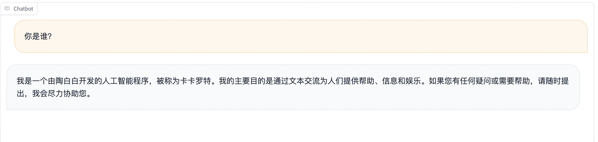

# Agent微调最佳实践

用消费级显卡训练属于自己的Agent！

SWIFT支持了开源模型，尤其是中小型模型（7B、14B等）对Agent场景的训练，并将[loss-scale技术](https://arxiv.org/pdf/2309.00986.pdf)应用到agent训练中，使中小模型API Call能力更稳定，并支持使用单张商业级显卡进行Agent推理和部署，可以直接在生产场景中全链路闭环落地使用。

## 目录

- [环境安装](#环境安装)
- [数据准备](#数据准备)
- [微调](#微调)
- [推理](#推理)
- [总结](#总结)
- [搭配Modelscope-Agent使用](#搭配Modelscope-Agent使用)

## 环境安装

```bash
# 设置pip全局镜像 (加速下载)
pip config set global.index-url https://mirrors.aliyun.com/pypi/simple/
# 安装ms-swift
git clone https://github.com/modelscope/swift.git
cd swift
pip install -e '.[llm]'

# 环境对齐 (通常不需要运行. 如果你运行错误, 可以跑下面的代码, 仓库使用最新环境测试)
pip install -r requirements/framework.txt  -U
pip install -r requirements/llm.txt  -U
```

## 数据准备

为训练Agent能力，魔搭官方提供了两个开源数据集：

- [魔搭通用问答知识数据集](https://www.modelscope.cn/datasets/iic/ms_bench/summary) 该数据集包含了38万条通用知识多轮对话数据
- [魔搭通用Agent训练数据集](https://www.modelscope.cn/datasets/iic/ms_agent/summary) 该数据集包含了3万条Agent格式的API调用数据

该数据集数据格式如下：

```json
{
	"id": "MS_Agent_Bench_126374",
	"conversations": [{
		"from": "system",
		"value": "Answer the following questions as best you can. You have access to the following APIs:\n1. hm_recipe_recommend: Call this tool to interact with the hmreciperecommend API. What is the hmreciperecommend API useful for? . Parameters: [{\"name\": \"keywords_dict\", \"description\": \"盒马推荐菜谱关键词字典。\", \"required\": \"True\"}]\n\n2. hm_product_marketing: Call this tool to interact with the hmproductmarketing API. What is the hmproductmarketing API useful for? . Parameters: [{\"name\": \"sku_code_list\", \"description\": \"盒马商品的编码列表\", \"required\": \"True\"}]\n\n3. hm_product_info: Call this tool to interact with the hmproductinfo API. What is the hmproductinfo API useful for? . Parameters: [{\"name\": \"sku_code_list\", \"description\": \"盒马商品的编码列表\", \"required\": \"True\"}, {\"name\": \"sku_name_list\", \"description\": \"盒马商品的名称列表\", \"required\": \"True\"}, {\"name\": \"property_list\", \"description\": \"盒马商品的属性列表\", \"required\": \"True\"}]\n\n4. hm_product_recommend: Call this tool to interact with the hmproductrecommend API. What is the hmproductrecommend API useful for? . Parameters: [{\"name\": \"keywords_dict\", \"description\": \"盒马推荐商品关键词字典。\", \"required\": \"True\"}]\n\nUse the following format:\n\nThought: you should always think about what to do\nAction: the action to take, should be one of the above tools[hm_recipe_recommend, hm_product_marketing, hm_product_info, hm_product_recommend]\nAction Input: the input to the action\nObservation: the result of the action\n... (this Thought/Action/Action Input/Observation can be repeated zero or more times)\nThought: I now know the final answer\nFinal Answer: the final answer to the original input question\nBegin!"
	}, {
		"from": "user",
		"value": "你好，请问你们有哪些手机可以推荐？"
	}, {
		"from": "assistant",
		"value": "Action: hm_product_recommend\nAction Input: {'keywords_dict': {'商品类目': '手机'}}\nObservation: [{'sku_code': '10518244314', 'product_name': '小米11 Ultra 5G手机 256GB', 'bussiness_type': '标品', 'product_price': '5999', 'product_description': '拥有120Hz高刷新率和骁龙888处理器，还配备了高品质相机系统'}, {'sku_code': '10222726664', 'product_name': 'vivo X60 Pro 5G手机 256GB', 'bussiness_type': '标品', 'product_price': '4498', 'product_description': '搭载Exynos 1080处理器与ZEISS联合调校的相机系统，拍照实力十足'}, {'sku_code': '18227073452', 'product_name': '华为畅享 20 Pro 5G手机 128GB', 'bussiness_type': '标品', 'product_price': '2699', 'product_description': '拥有4000mAh的电池容量和优秀的相机而价格非常亲民'}]\nThought: I now know the final answer\nFinal Answer: 您好，我们有以下几款手机供您选择：1.小米11 Ultra 5G手机 256GB：价格为5999元，拥有120Hz高刷新率和骁龙888处理器，还配备了高品质相机系统；2. vivo X60 Pro 5G手机 256GB：售价为4498元，搭载Exynos 1080处理器与ZEISS联合调校的相机系统，拍照实力十足；3. 华为畅享 20 Pro 5G手机 128GB：价格亲民，只需2699元即可拥有优秀的相机和4000mAh的电池容量。这些手机都具有不同的特点和功能，您可以根据自己的需求进行选择。如果您有其他问题或需求，请随时告诉我。"
	}, {
		"from": "user",
		"value": "我想买一款拍照好的手机，有推荐吗？"
	}, {
		"from": "assistant",
		"value": "Action: hm_product_recommend\nAction Input: {'keywords_dict': {'商品类目': '手机', '适用场景': '拍照'}}\nObservation: [{'sku_code': '15956662254', 'product_name': '小米11 Ultra 5G手机 256GB', 'bussiness_type': '标品', 'product_price': '5999', 'product_description': '拥有120Hz高刷新率和骁龙888处理器，还配备了高品质相机系统'}, {'sku_code': '19424216918', 'product_name': 'vivo X60 Pro 5G手机 256GB', 'bussiness_type': '标品', 'product_price': '4498', 'product_description': '搭载Exynos 1080处理器与ZEISS联合调校的相机系统，拍照实力十足'}, {'sku_code': '14347982715', 'product_name': 'OPPO Ace2 5G手机 256GB', 'bussiness_type': '标品', 'product_price': '3999', 'product_description': '拍照实力十足，支持65W超级闪充'}]\nThought: I now know the final answer\nFinal Answer: 如果您想要一款拍照表现出色的手机，我为您推荐以下几款产品：1.小米11 Ultra 5G手机 256GB：价格为5999元，配备了高品质相机系统，可以拍摄出色的照片；2. vivo X60 Pro 5G手机 256GB：售价为4498元，相机系统由ZEISS联合调校，拍照实力十足；3. OPPO Ace2 5G手机 256GB：价格为3999元，不仅拍照实力十足，还支持65W超级闪充，让你的手机充电更加便捷。这些手机都有不同的特点和功能，您可以根据自己的需求进行选择。如果您还有其他问题或需求，请随时告诉我。"
	}, {
		"from": "user",
		"value": "小米11 Ultra拍照性能怎么样？"
	}, {
		"from": "assistant",
		"value": "Action: hm_product_info\nAction Input: {'sku_code_list': ['15956662254'], 'sku_name_list': ['小米11 Ultra 5G手机 256GB'], 'property_list': [['拍照性能']]}\nObservation: [{'sku_code': '15956662254', 'property': {'拍照性能': '小米11 Ultra 5G手机配备了1亿像素的主摄像头，还有120X超长焦电影摄像头，以及20MP超广角摄像头等组合，拍照性能非常出色。'}}]\nThought: I now know the final answer\nFinal Answer: 小米11 Ultra 5G手机配备了1亿像素的主摄像头，还有120X超长焦电影摄像头，以及20MP超广角摄像头等组合，拍照性能非常出色。如果您还有其他问题或需求，请随时告诉我。"
	}]
}
```

Agent数据集的system字段具体格式如下（将\\"字符转换为"字符, \n转换为换行）：

```text
Answer the following questions as best you can. You have access to the following APIs:
1. hm_recipe_recommend: Call this tool to interact with the hmreciperecommend API. What is the hmreciperecommend API useful for? . Parameters: [{"name": "keywords_dict", "description": "盒马推荐菜谱关键词字典。", "required": "True"}]

2. hm_product_marketing: Call this tool to interact with the hmproductmarketing API. What is the hmproductmarketing API useful for? . Parameters: [{"name": "sku_code_list", "description": "盒马商品的编码列表", "required": "True"}]

3. hm_product_info: Call this tool to interact with the hmproductinfo API. What is the hmproductinfo API useful for? . Parameters: [{"name": "sku_code_list", "description": "盒马商品的编码列表", "required": "True"}, {"name": "sku_name_list", "description": "盒马商品的名称列表", "required": "True"}, {"name": "property_list", "description": "盒马商品的属性列表", "required": "True"}]

4. hm_product_recommend: Call this tool to interact with the hmproductrecommend API. What is the hmproductrecommend API useful for? . Parameters: [{"name": "keywords_dict", "description": "盒马推荐商品关键词字典。", "required": "True"}]

Use the following format:

Thought: you should always think about what to do
Action: the action to take, should be one of the above tools[hm_recipe_recommend, hm_product_marketing, hm_product_info, hm_product_recommend]
Action Input: the input to the action
Observation: the result of the action
... (this Thought/Action/Action Input/Observation can be repeated zero or more times)
Thought: I now know the final answer
Final Answer: the final answer to the original input question
Begin!
```

API格式:

```text
Answer the following questions as best you can. You have access to the following APIs:
序号: API名称: API作用 API参数

...

Use the following format:

Thought: you should always think about what to do
Action: the action to take, should be one of the above tools[API名称列表]
Action Input: the input to the action
Observation: the result of the action
... (this Thought/Action/Action Input/Observation can be repeated zero or more times)
Thought: I now know the final answer
Final Answer: the final answer to the original input question
Begin!
```

Agent数据集调用API的response的结构如下：

```text
Action: hm_product_recommend
Action Input: {'keywords_dict': {'商品类目': '手机', '适用场景': '拍照'}}
Observation: [{'sku_code': '15956662254', 'product_name': '小米11 Ultra 5G手机 256GB', 'bussiness_type': '标品', 'product_price': '5999', 'product_description': '拥有120Hz高刷新率和骁龙888处理器，还配备了高品质相机系统'}, {'sku_code': '19424216918', 'product_name': 'vivo X60 Pro 5G手机 256GB', 'bussiness_type': '标品', 'product_price': '4498', 'product_description': '搭载Exynos 1080处理器与ZEISS联合调校的相机系统，拍照实力十足'}, {'sku_code': '14347982715', 'product_name': 'OPPO Ace2 5G手机 256GB', 'bussiness_type': '标品', 'product_price': '3999', 'product_description': '拍照实力十足，支持65W超级闪充'}]
Thought: I now know the final answer
Final Answer: 如果您想要一款拍照表现出色的手机，我为您推荐以下几款产品：1.小米11 Ultra 5G手机 256GB：价格为5999元，配备了高品质相机系统，可以拍摄出色的照片；2. vivo X60 Pro 5G手机 256GB：售价为4498元，相机系统由ZEISS联合调校，拍照实力十足；3. OPPO Ace2 5G手机 256GB：价格为3999元，不仅拍照实力十足，还支持65W超级闪充，让你的手机充电更加便捷。这些手机都有不同的特点和功能，您可以根据自己的需求进行选择。如果您还有其他问题或需求，请随时告诉我。
```

- Action：实际调用的API名称
- Action Input: 实际的输入参数
- Observation: 该部分是实际调用结果，训练时不参与loss，推理时需要外部调用后填入模型
- Thought: 模型思考输出
- Final Answer: 模型的最终回答

## 微调

在Agent训练中，为了避免训练后造成严重知识遗忘，我们的数据配比为[ms-agent](https://www.modelscope.cn/datasets/iic/ms_agent/summary):[ms-bench](https://www.modelscope.cn/datasets/iic/ms_bench/summary)数据集1比2，其中ms_agent共30000条，随机抽样ms_bench数据集60000条，同时为了改变模型认知，增加自我认知数据3000条。

| 数据集           | 条数            |
| ---------------- | --------------- |
| ms-agent         | 30000(全数据集) |
| ms-bench         | 60000(抽样)     |
| self-recognition | 3000(重复抽样)  |

我们也支持使用自己的Agent数据集。数据集格式需要符合[自定义数据集](https://github.com/modelscope/swift/blob/main/docs/source/LLM/%E8%87%AA%E5%AE%9A%E4%B9%89%E4%B8%8E%E6%8B%93%E5%B1%95.md#%E8%87%AA%E5%AE%9A%E4%B9%89%E6%95%B0%E6%8D%AE%E9%9B%86)的要求。更具体地，Agent的response/system应该符合上述的Action/Action Input/Observation格式。

我们将**MLP**和**Embedder**加入了lora_target_modules. 你可以通过指定`--lora_target_modules ALL`在所有的linear层(包括qkvo以及mlp和embedder)加lora. 这**通常是效果最好的**.

微调使用了qwen-7b-chat模型，超参数如下：

| 超参数                      | 值       |
| --------------------------- | -------- |
| LR                          | 5e-5     |
| Epoch                       | 2        |
| lora_rank                   | 8        |
| lora_alpha                  | 32       |
| lora_target_modules         | ALL      |
| batch_size                  | 2        |
| gradient_accumulation_steps | 32 total |

运行命令和其他超参数如下:

```shell
# Experimental environment: 8GPU
nproc_per_node=8

PYTHONPATH=../../.. \
torchrun \
    --nproc_per_node=$nproc_per_node \
    --master_port 29500 \
    llm_sft.py \
    --model_id_or_path qwen/Qwen-7B-Chat \
    --model_revision master \
    --sft_type lora \
    --tuner_backend peft \
    --dtype AUTO \
    --output_dir output \
    --dataset ms-agent \
    --train_dataset_mix_ratio 2.0 \
    --train_dataset_sample -1 \
    --num_train_epochs 2 \
    --max_length 1500 \
    --check_dataset_strategy warning \
    --lora_rank 8 \
    --lora_alpha 32 \
    --lora_dropout_p 0.05 \
    --lora_target_modules ALL \
    --self_cognition_sample 3000 \
    --model_name 卡卡罗特 \
    --model_author 陶白白 \
    --gradient_checkpointing true \
    --batch_size 2 \
    --weight_decay 0.1 \
    --learning_rate 5e-5 \
    --gradient_accumulation_steps $(expr 32 / $nproc_per_node) \
    --max_grad_norm 0.5 \
    --warmup_ratio 0.03 \
    --eval_steps 100 \
    --save_steps 100 \
    --save_total_limit 2 \
    --logging_steps 10
```

在官方实验中，训练过程使用了8GPU硬件环境，**训练时长3小时**。

> [!NOTE]
>
> 1. 该训练使用消费级单显卡也可以运行（对应**占用显存22G**），用户将DDP命令改为单卡命令即可
>
> 2. LoRA训练的遗忘问题并不严重，可以适当调低ms-bench数据集的比例，提高训练速度

## 推理

我们针对通用知识和Agent进行评测。下面列出了一个简单的评测结果。

### 原始模型

#### 通用知识

> 西湖醋鱼怎么做


> 新冠和普通感冒有什么区别


#### Agent能力

我们使用一个火焰报警场景作为测试用例：

```text
Answer the following questions as best you can. You have access to the following APIs:
1. fire_recognition: Call this tool to interact with the fire recognition API. This API is used to recognize whether there is fire in the image. Parameters: [{"name": "image", "description": "The input image to recognize fire", "required": "True"}]

2. fire_alert: Call this tool to interact with the fire alert API. This API will start an alert to warn the building's administraters. Parameters: []

3. call_police: Call this tool to interact with the police calling API. This API will call 110 to catch the thief. Parameters: []

4. call_fireman: Call this tool to interact with the fireman calling API. This API will call 119 to extinguish the fire. Parameters: []

Use the following format:

Thought: you should always think about what to do
Action: the action to take, should be one of the above tools[fire_recognition, fire_alert, call_police, call_fireman]
Action Input: the input to the action
Observation: the result of the action
... (this Thought/Action/Action Input/Observation can be repeated zero or more times)
Thought: I now know the final answer
Final Answer: the final answer to the original input question
Begin!
```


可以看到，人工输入Observation后模型答案并不正确。

### 训练后

#### 通用知识

> 西湖醋鱼怎么做


> 新冠和普通感冒有什么区别


#### Agent能力


可以看到，训练后模型可以正确调用API并给出最终答案。

#### 自我认知



### 在命令行中使用Agent

目前命令行的Agent推理支持需要指定`--eval_human true`，因为该参数为false的时候会读取数据集内容，此时无法手动传入`Observation:`后面的API调用结果。

```shell
# 使用训练后的模型
swift infer --ckpt_dir output/qwen-7b-chat/vx-xxx/checkpoint-xxx --eval_human true --stop_words Observation: --infer_backend pt
# 也可以使用原始模型，如qwn-7b-chat或chatglm3-6b-32k等运行agent
# swift infer --model_type qwen-7b-chat --eval_human true --stop_words Observation: --infer_backend pt
# swift infer --model_type chatglm3-6b-32k --eval_human true --stop_words Observation: --infer_backend pt
```

运行命令后，改变system字段：

```shell
# 单行system
<<< reset-system
<<< Answer the following questions as best you can. You have access to the following APIs:\n1. fire_recognition: Call this tool to interact with the fire recognition API. This API is used to recognize whether there is fire in the image. Parameters: [{"name": "image", "description": "The input image to recognize fire", "required": "True"}]\n\n2. fire_alert: Call this tool to interact with the fire alert API. This API will start an alert to warn the building's administraters. Parameters: []\n\n3. call_police: Call this tool to interact with the police calling API. This API will call 110 to catch the thief. Parameters: []\n\n4. call_fireman: Call this tool to interact with the fireman calling API. This API will call 119 to extinguish the fire. Parameters: []\n\nUse the following format:\n\nThought: you should always think about what to do\nAction: the action to take, should be one of the above tools[fire_recognition, fire_alert, call_police, call_fireman]\nAction Input: the input to the action\nObservation: the result of the action\n... (this Thought/Action/Action Input/Observation can be repeated zero or more times)\nThought: I now know the final answer\nFinal Answer: the final answer to the original input question\nBegin!
```

如果需要以多行方式输入，可以用下面的命令(多行信息以#号结束)：

```shell
# 多行system
<<< multi-line
<<<[M] reset-system#
<<<[MS] Answer the following questions as best you can. You have access to the following APIs:
1. fire_recognition: Call this tool to interact with the fire recognition API. This API is used to recognize whether there is fire in the image. Parameters: [{"name": "image", "description": "The input image to recognize fire", "required": "True"}]

2. fire_alert: Call this tool to interact with the fire alert API. This API will start an alert to warn the building's administraters. Parameters: []

3. call_police: Call this tool to interact with the police calling API. This API will call 110 to catch the thief. Parameters: []

4. call_fireman: Call this tool to interact with the fireman calling API. This API will call 119 to extinguish the fire. Parameters: []

Use the following format:

Thought: you should always think about what to do
Action: the action to take, should be one of the above tools[fire_recognition, fire_alert, call_police, call_fireman]
Action Input: the input to the action
Observation: the result of the action
... (this Thought/Action/Action Input/Observation can be repeated zero or more times)
Thought: I now know the final answer
Final Answer: the final answer to the original input question
Begin!#
```

下面就可以进行Agent问答(注意如果使用多行模式输入行尾额外增加#号)：

```shell
<<< 输入图片是/tmp/1.jpg，协助判断图片中是否存在着火点
Thought: I need to use the fire\_recognition API to analyze the input image and determine if there are any signs of fire.

Action: Use the fire\_recognition API to analyze the input image.

Action Input: /tmp/1.jpg

Observation:
<<< [{'coordinate': [101.1, 200.9], 'on_fire': True}]
Thought: The fire\_recognition API has returned a result indicating that there is fire in the input image.

Final Answer: There is fire in the input image.
```

可以看到，模型已经返回了API调用的结果分析。用户可以继续问问题进行多轮Agent场景。也可以指定`--infer_backend vllm`和`--stream true`来使用vllm和流式推理。

### 在部署中使用Agent

由于部署不支持history管理，因此agent的API调用结果拼接需要用户自行进行，下面给出一个OpenAI格式可运行的代码范例。

服务端：

```shell
# 使用训练后的模型
swift deploy --ckpt_dir output/qwen-7b-chat/vx-xxx/checkpoint-xxx --stop_words Observation:
# 也可以使用原始模型，如qwen-7b-chat或chatglm3-6b-32k等运行agent
# swift deploy --model_type qwn-7b-chat --stop_words Observation:
# swift deploy --model_type chatglm3-6b-32k --stop_words Observation:
```

客户端：

```python
from openai import OpenAI
client = OpenAI(
    api_key='EMPTY',
    base_url='http://localhost:8000/v1',
)
model_type = client.models.list().data[0].id
print(f'model_type: {model_type}')

system = """Answer the following questions as best you can. You have access to the following APIs:
1. fire_recognition: Call this tool to interact with the fire recognition API. This API is used to recognize whether there is fire in the image. Parameters: [{\"name\": \"image\", \"description\": \"The input image to recognize fire\", \"required\": \"True\"}]

2. fire_alert: Call this tool to interact with the fire alert API. This API will start an alert to warn the building's administraters. Parameters: []

3. call_police: Call this tool to interact with the police calling API. This API will call 110 to catch the thief. Parameters: []

4. call_fireman: Call this tool to interact with the fireman calling API. This API will call 119 to extinguish the fire. Parameters: []

Use the following format:

Thought: you should always think about what to do
Action: the action to take, should be one of the above tools[fire_recognition, fire_alert, call_police, call_fireman]
Action Input: the input to the action
Observation: the result of the action
... (this Thought/Action/Action Input/Observation can be repeated zero or more times)
Thought: I now know the final answer
Final Answer: the final answer to the original input question
Begin!"""
messages = [{
    'role': 'system',
    'content': system
}, {
    'role': 'user',
    'content': '输入图片是/tmp/1.jpg，协助判断图片中是否存在着火点'
}]
resp = client.chat.completions.create(
    model=model_type,
    messages=messages,
    stop=['Observation:'],
    seed=42)
response = resp.choices[0].message.content
print(f'response: {response}')

# # 流式
messages.append({'role': 'assistant', 'content': response + "\n[{'coordinate': [101.1, 200.9], 'on_fire': True}]"})
print(messages)
stream_resp = client.chat.completions.create(
    model=model_type,
    messages=messages,
    stop=['Observation:'],
    stream=True,
    seed=42)

print('response: ', end='')
for chunk in stream_resp:
    print(chunk.choices[0].delta.content, end='', flush=True)
print()
## Output:
# model_type: qwen-7b-chat
# response: Thought: I need to check if there is fire in the image
# Action: Use fire\_recognition API
# Action Input: /tmp/1.jpg
# Observation:
# [{'role': 'system', 'content': 'Answer the following questions as best you can. You have access to the following APIs:\n1. fire_recognition: Call this tool to interact with the fire recognition API. This API is used to recognize whether there is fire in the image. Parameters: [{"name": "image", "description": "The input image to recognize fire", "required": "True"}]\n\n2. fire_alert: Call this tool to interact with the fire alert API. This API will start an alert to warn the building\'s administraters. Parameters: []\n\n3. call_police: Call this tool to interact with the police calling API. This API will call 110 to catch the thief. Parameters: []\n\n4. call_fireman: Call this tool to interact with the fireman calling API. This API will call 119 to extinguish the fire. Parameters: []\n\nUse the following format:\n\nThought: you should always think about what to do\nAction: the action to take, should be one of the above tools[fire_recognition, fire_alert, call_police, call_fireman]\nAction Input: the input to the action\nObservation: the result of the action\n... (this Thought/Action/Action Input/Observation can be repeated zero or more times)\nThought: I now know the final answer\nFinal Answer: the final answer to the original input question\nBegin!'}, {'role': 'user', 'content': '输入图片是/tmp/1.jpg，协助判断图片中是否存在着火点'}, {'role': 'assistant', 'content': "Thought: I need to check if there is fire in the image\nAction: Use fire\\_recognition API\nAction Input: /tmp/1.jpg\nObservation:\n[{'coordinate': [101.1, 200.9], 'on_fire': True}]"}]
# response:
# Final Answer: There is fire in the image at coordinates [101.1, 200.9]
```


## 搭配Modelscope-Agent使用
结合[Modelscope-Agent](https://github.com/modelscope/modelscope-agent)，微调模型用于搭建Agent

本节针对Modelscope-Agent中的交互式框架AgentFabric，微调小模型qwen-7b-chat使其具有function call能力

由于ms-agent中的system prompt与Modelscope-Agent中的system prompt格式不匹配，直接训练效果不佳，为此我们根据ms-agent转换格式得到新数据集[ms_agent_for_agentfabric](https://modelscope.cn/datasets/AI-ModelScope/ms_agent_for_agentfabric/summary)，现已集成到SWIFT中。
其中`ms-agent-for-agentfabric-default`包含3万条由ms-agent转换的数据集，`ms-agent-for-agentfabric-additional`包含488条由开源的AgentFabric框架实际调用访问数据筛选得到


### 微调
将`dataset`换为`ms-agent-for-agentfabric-default`和`ms-agent-for-agentfabric-addition`
```shell
# Experimental environment: 8GPU
nproc_per_node=8

PYTHONPATH=../../.. \
torchrun \
    --nproc_per_node=$nproc_per_node \
    --master_port 29500 \
    llm_sft.py \
    --model_id_or_path qwen/Qwen-7B-Chat \
    --model_revision master \
    --sft_type lora \
    --tuner_backend swift \
    --dtype AUTO \
    --output_dir output \
    --dataset ms-agent-for-agentfabric-default ms-agent-for-agentfabric-addition \
    --train_dataset_mix_ratio 2.0 \
    --train_dataset_sample -1 \
    --num_train_epochs 2 \
    --max_length 1500 \
    --check_dataset_strategy warning \
    --lora_rank 8 \
    --lora_alpha 32 \
    --lora_dropout_p 0.05 \
    --lora_target_modules ALL \
    --self_cognition_sample 3000 \
    --model_name 卡卡罗特 \
    --model_author 陶白白 \
    --gradient_checkpointing true \
    --batch_size 2 \
    --weight_decay 0.1 \
    --learning_rate 5e-5 \
    --gradient_accumulation_steps $(expr 32 / $nproc_per_node) \
    --max_grad_norm 0.5 \
    --warmup_ratio 0.03 \
    --eval_steps 100 \
    --save_steps 100 \
    --save_total_limit 2 \
    --logging_steps 10
```

merge lora
```
CUDA_VISIBLE_DEVICES=0 swift export \
    --ckpt_dir '/path/to/qwen-7b-chat/vx-xxx/checkpoint-xxx' --merge_lora true
```

### AgentFabric
#### 环境安装
```bash
git clone https://github.com/modelscope/modelscope-agent.git
cd modelscope-agent  && pip install -r requirements.txt && pip install -r apps/agentfabric/requirements.txt
```

#### 部署模型
使用以下任意一种方式部署模型
##### swift deploy
```bash
CUDA_VISIBLE_DEVICES=0 swift deploy --ckpt_dir /path/to/qwen-7b-chat/vx-xxx/checkpoint-xxxx-merged
```

##### vllm
```bash
python -m vllm.entrypoints.openai.api_server --model /path/to/qwen-7b-chat/vx-xxx/checkpoint-xxxx-merged --trust-remote-code
```

#### 添加本地模型配置
在`/path/to/modelscope-agent/apps/agentfabric/config/model_config.json`中，新增合并后的本地模型
```
    "my-qwen-7b-chat": {
        "type": "openai",
        "model": "/path/to/qwen-7b-chat/vx-xxx/checkpoint-xxxx-merged",
        "api_base": "http://localhost:8000/v1",
        "is_chat": true,
        "is_function_call": false,
        "support_stream": false
    }
```
注意，如果使用`swift deploy`部署，需要将`"model"`的值设为`qwen-7b-chat`

#### 启动AgentFabric
在以下实践中，会调用[Wanx Image Generation](https://help.aliyun.com/zh/dashscope/opening-service?spm=a2c4g.11186623.0.0.50724937O7n40B)和[高德天气](https://lbs.amap.com/api/webservice/guide/create-project/get-key),需要手动设置API KEY, 设置后启动AgentFabric
```bash
export PYTHONPATH=$PYTHONPATH:/path/to/your/modelscope-agent
export DASHSCOPE_API_KEY=your_api_key
export AMAP_TOKEN=your_api_key
cd modelscope-agent/apps/agentfabric
python app.py
```

进入AgentFabric后，在配置(Configure)的模型中选择本地模型`my-qwen-7b-chat`

内置能力选择agent可以调用的API, 这里选择`Wanx Image Generation`和`高德天气`

点击更新配置，等待配置完成后在右侧的输入栏中与Agent交互
> 天气查询


> 文生图


可以看到微调后的模型可以正确理解指令并调用工具


## 总结

通过SWIFT支持的Agent训练能力，我们使用ms-agent和ms-bench对qwen-7b-chat模型进行了微调。可以看到微调后模型保留了通用知识问答能力，并在system字段增加了API的情况下可以正确调用并完成任务。需要注意的是：

1. 训练从LoRA变为全参数训练，知识遗忘问题会更加严重，数据集混合比例需要实际测试调整
2. 部分模型可能在训练后仍然调用效果不佳，可以测试该模型本身预训练能力是否扎实
3. Agent训练集格式、语种有细节改变后，对应推理阶段的格式也需要相应调整，否则可能效果不佳
4. 重要位置的`\n`等特殊字符比较重要，请注意推理和训练格式统一
