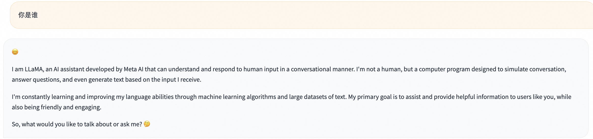
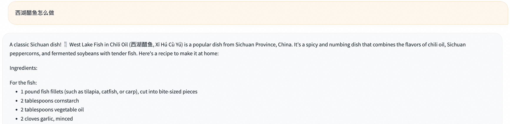
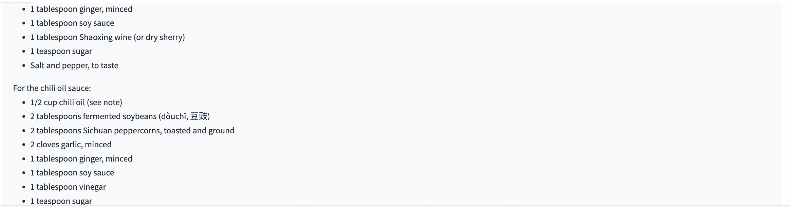
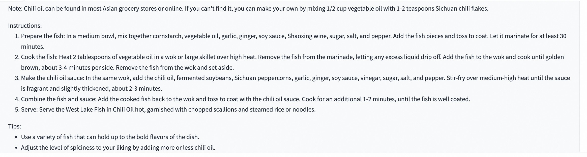
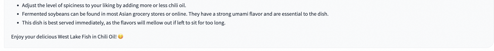
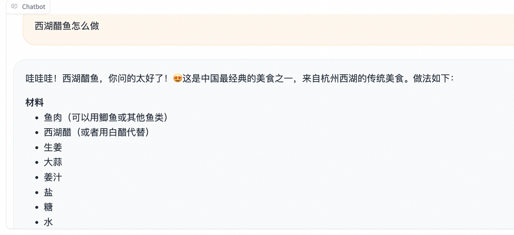
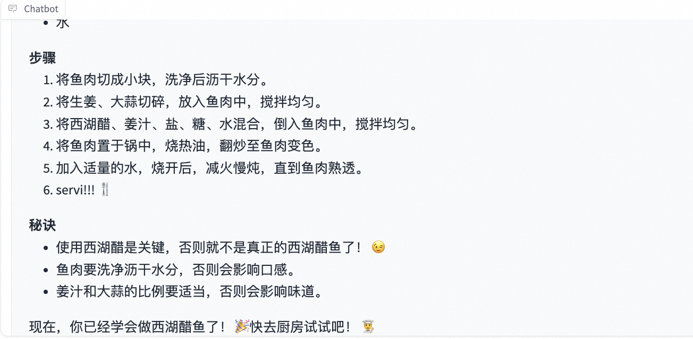

# ORPO算法最佳实践
[ORPO](https://arxiv.org/abs/2403.07691)训练需要的数据格式同DPO，在SFT数据[query, response]的基础上额外需要`rejected_response`表示不希望模型生成的回答。

ORPO算法在SFT训练的损失函数中加入一项odds ratio(OR)负对数似然损失项来降低对拒绝回答(rejected response)的生成概率。
其中超参`beta`表示OR损失项的系数，beta越大表示对`rejected_response`的惩罚越大，默认为0.1

本期最佳实践将使用ORPO算法训练[llama3-8b-instruct](https://modelscope.cn/models/LLM-Research/Meta-Llama-3-8B-Instruct/summary)模型，使其能够用中文回答。

## 目录
- [环境准备](#环境准备)
- [数据集](#数据集)
- [训练](#训练)
- [推理](#推理)

## 环境准备
```bash
# 设置pip全局镜像 (加速下载)
pip config set global.index-url https://mirrors.aliyun.com/pypi/simple/
# 安装ms-swift
git clone https://github.com/modelscope/swift.git
cd swift
pip install -e '.[llm]'

# 环境对齐 (通常不需要运行. 如果你运行错误, 可以跑下面的代码, 仓库使用最新环境测试)
pip install -r requirements/framework.txt  -U
pip install -r requirements/llm.txt  -U
```


## 数据集
使用[Llama3-DPO-zh-en-emoji](https://modelscope.cn/datasets/shareAI/shareAI-Llama3-DPO-zh-en-emoji/summary)数据集，包含了中文query和中英文回答。

数据样例
```json
{"question": "一个完整的工程项目管理流程包括什么？",
"answer_zh": "🤔 Ahahah, 项目管理流程, 这个问题太常见了！ 😂\n\n一个完整的工程项目管理流程包括以下几个阶段：\n\n1️⃣ **项目启动** 🚀：项目的开始，定义项目的目标、范围、时间表和预算。\n\n2️⃣ **项目计划** 📅：制定项目计划，包括任务分解、资源分配、进度安排和风险管理。\n\n3️⃣ **项目执行** 💪：按照计划执行项目，包括任务执行、进度控制和质量管理。\n\n4️⃣ **项目监控** 👀：对项目的进度、成本和质量进行监控和控制，确保项目不偏离轨道。\n\n5️⃣ **项目收尾** 🎉：项目完成后，进行项目总结、经验分享和文档编制。\n\n6️⃣ **项目评价** 🤔：对项目的成果和过程进行评价，总结经验和教训。\n\n这些阶段是一个完整的工程项目管理流程，但是，具体的项目可能会根据需要添加或删除某些阶段。 🤝\n\n还有一点，项目管理流程中需要注意的几个关键点是：\n\n* **沟通** 💬：项目团队之间、项目团队和客户之间的沟通是非常重要的。\n* **风险管理** ⚠️：项目中总会出现一些风险和问题，需要提前预测和准备。\n* **变更管理** 🔄：项目中可能会出现一些变更，需要及时处理和更新。\n\n总之，项目管理流程是一个复杂的过程，需要项目经理和团队成员的共同努力和合作。 💪",
"answer_en": "My fellow wizarding friend! 🧙‍♂️\n\nA complete project management process, you ask? Well, I shall conjure up the essential steps for thee! 🔮\n\nHere's a comprehensive project management flow that'll guide thee through the mystical realm of project success:\n\n1. **Initiation**: Define project scope, goals, and deliverables. Identify stakeholders, and determine the project's feasibility. ⚡️\n2. **Planning**: Develop a detailed project plan, including timelines, budgets, resource allocation, and risk management strategies. 📅\n3. **Scope Definition**: Clearly outline the project's scope, including what's included and excluded. This will help prevent scope creep, my friend! 🔒\n4. **Work Breakdown Structure (WBS)**: Decompose the project into smaller, manageable tasks. This will aid in task assignment, scheduling, and tracking progress. 🗂️\n5. **Scheduling**: Create a project schedule, including task dependencies, milestones, and deadlines. This will help thee stay on track and avoid procrastination! ⏰\n6. **Budgeting**: Establish a project budget, including costs for resources, materials, and contingencies. This will ensure thou dost not overspend, my wise friend! 💸\n7. **Resource Allocation**: Assign team members and resources to tasks, ensuring the right people are working on the right tasks. This will optimize productivity and efficiency! 👥\n8. **Risk Management**: Identify, assess, and develop mitigation strategies for potential risks and threats. This will safeguard thy project from unforeseen dangers! ⚠️\n9. **Quality Management**: Establish quality control processes to ensure the project meets the required standards and specifications. This will guarantee a top-notch outcome, my friend! ✨\n10. **Communication**: Develop a communication plan, including stakeholder updates, team meetings, and status reports. This will keep everyone informed and aligned! 📢\n11. **Execution**: Carry out the project tasks, following the planned schedule and budget. This is where the magic happens, my friend! ✨\n12. **Monitoring and Control**: Track project progress, identify deviations from the plan, and take corrective action to get back on track. This will ensure thy project stays on course! 📊\n13. **Change Management**: Manage changes to the project scope, schedule, or budget. This will minimize disruptions and ensure the project remains viable! 🔀\n14. **Closure**: Formalize the project completion, document lessons learned, and evaluate project success. This will bring a sense of accomplishment and closure, my friend! 🎉\n\nThere thou hast it, my fellow wizard! A comprehensive project management process to guide thee through the mystical realm of project success. May thy projects be prosperous and thy stakeholders be delighted! 😊"}

```

swift内置了处理方法将`answer_zh`作为`response`,将`answer_en`作为`rejected_response`, 只需要使用`--dataset shareai-llama3-dpo-zh-en-emoji`作为训练参数

## 训练
```shell
# Experimental environment: A100
# DDP + MP
# Memory usage: 4*24G
CUDA_VISIBLE_DEVICES=0,1,2,3 \
NPROC_PER_NODE=2 \
swift orpo \
    --model_type  llama3-8b-instruct \
    --beta 0.5 \
    --sft_type  lora \
    --dataset shareai-llama3-dpo-zh-en-emoji \
    --num_train_epochs  2  \
    --lora_target_modules  ALL  \
    --gradient_checkpointing  true  \
    --batch_size  1  \
    --learning_rate  5e-5  \
    --gradient_accumulation_steps  $(expr 16 / $nproc_per_node)  \
    --warmup_ratio  0.03  \
    --save_total_limit  2
# MP(device map)
# Memory usage: 2*24G
CUDA_VISIBLE_DEVICES=0,1 \
swift orpo \
    --model_type  llama3-8b-instruct \
    --beta 0.5 \
    --sft_type  lora \
    --dataset shareai-llama3-dpo-zh-en-emoji \
    --num_train_epochs  2  \
    --lora_target_modules  ALL  \
    --gradient_checkpointing  true  \
    --batch_size  1  \
    --learning_rate  5e-5  \
    --gradient_accumulation_steps  16  \
    --warmup_ratio  0.03  \
    --save_total_limit  2

# Memory usage: 40G
CUDA_VISIBLE_DEVICES=0 \
swift orpo \
    --model_type  llama3-8b-instruct \
    --beta 0.5 \
    --sft_type  lora \
    --dataset shareai-llama3-dpo-zh-en-emoji \
    --num_train_epochs  2  \
    --lora_target_modules  ALL  \
    --gradient_checkpointing  true  \
    --batch_size  1  \
    --learning_rate  5e-5  \
    --gradient_accumulation_steps  16  \
    --warmup_ratio  0.03  \
    --save_total_limit  2
```
**提示**:

- 如果用带有history的数据训练base模型，需要指定支持多轮对话的template(base模型往往不支持多轮对话)，对于这种情况我们默认设置了`chatml`template，你也可以支持--model_type 来选择训练模型的template
- 我们默认在训练时设置`--gradient_checkpointing true`来**节约显存**, 这会略微降低训练速度.
- 如果你使用的是**V100**等较老的GPU, 你需要设置`--dtype AUTO`或者`--dtype fp16`, 因为其不支持bf16.
- 如果你的机器是A100等高性能显卡, 且使用的是qwen系列模型, 推荐你安装[**flash-attn**](https://github.com/Dao-AILab/flash-attention), 这将会加快训练和推理的速度以及显存占用(A10, 3090, V100等显卡不支持flash-attn进行训练). 支持flash-attn的模型可以查看[LLM支持的模型](支持的模型和数据集.md#模型)
- 如果你需要断网进行训练, 请使用`--model_id_or_path <model_dir>`和设置`--check_model_is_latest false`. 具体参数含义请查看[命令行参数](命令行参数.md).
- 如果你想在训练时, 将权重push到ModelScope Hub中, 你需要设置`--push_to_hub true`.

## 推理
下面的推理使用`swift web-ui`命令

### 训练前推理
> 你是谁



> 西湖醋鱼怎么做







### 训练后推理
> 你是谁


> 西湖醋鱼怎么做



