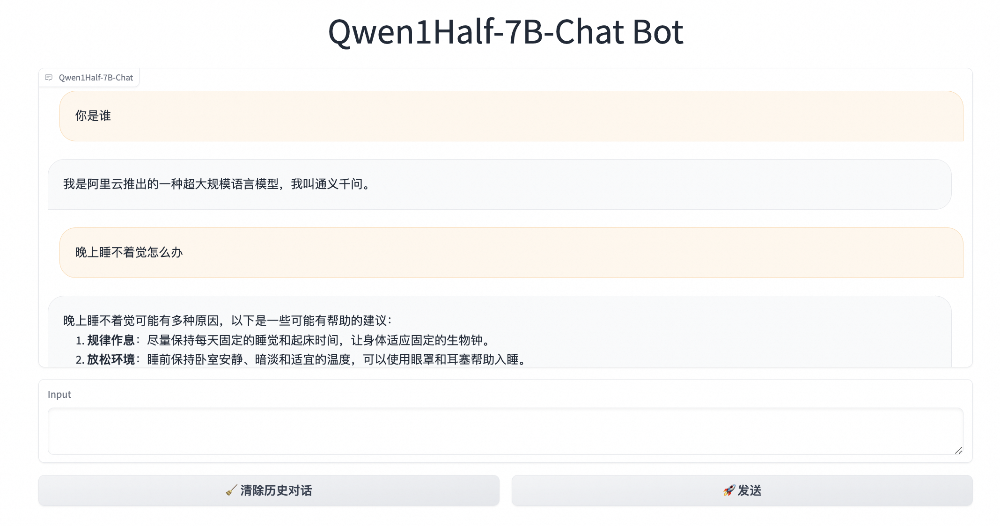
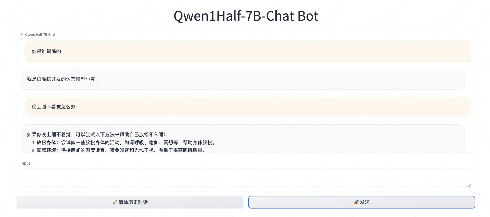

# Qwen1.5全流程最佳实践

这里介绍对**Qwen1.5-7B-Chat**和对**Qwen1.5-72B-Chat**进行推理, 自我认知微调, 量化, 部署. 分别对应**低配置和高配置**环境.


## 目录
- [环境准备](#环境准备)
- [Qwen1.5-7B-Chat](#qwen15-7b-chat)
  - [推理](#推理)
  - [自我认知微调](#自我认知微调)
  - [微调后推理](#微调后推理)
  - [量化](#量化)
  - [部署](#部署)
- [Qwen1.5-72B-Chat](#qwen15-72b-chat)
  - [推理](#推理-1)
  - [自我认知微调](#自我认知微调-1)
  - [微调后推理](#微调后推理-1)
  - [量化](#量化-1)
  - [部署](#部署-1)

## 环境准备
```shell
pip install 'ms-swift[llm]' -U

# autoawq和cuda版本有对应关系，请按照`https://github.com/casper-hansen/AutoAWQ`选择版本
pip install autoawq
# vllm与cuda版本有对应关系，请按照`https://docs.vllm.ai/en/latest/getting_started/installation.html`选择版本
pip install vllm

pip install openai
```

## Qwen1.5-7B-Chat

### 推理

这里我们会对Qwen1.5-7B-Chat及其**awq-int4量化**版本进行**流式**推理, 并展示使用**可视化**方式推理.

使用python推理`qwen1half-7b-chat`:
```python
# Experimental environment: 3090
import os
os.environ['CUDA_VISIBLE_DEVICES'] = '0'

from swift.llm import (
    get_model_tokenizer, get_template, inference, ModelType,
    get_default_template_type, inference_stream
)
from swift.utils import seed_everything
import torch

model_type = ModelType.qwen1half_7b_chat
template_type = get_default_template_type(model_type)
print(f'template_type: {template_type}')  # template_type: qwen


kwargs = {}
# kwargs['use_flash_attn'] = True  # 使用flash_attn

model, tokenizer = get_model_tokenizer(model_type, torch.float16,
                                       model_kwargs={'device_map': 'auto'}, **kwargs)
# 修改max_new_tokens
model.generation_config.max_new_tokens = 128

template = get_template(template_type, tokenizer)
seed_everything(42)
query = '浙江的省会在哪里？'
response, history = inference(model, template, query)
print(f'query: {query}')
print(f'response: {response}')

# 流式
query = '这有什么好吃的？'
gen = inference_stream(model, template, query, history)
print_idx = 0
print(f'query: {query}\nresponse: ', end='')
for response, history in gen:
    delta = response[print_idx:]
    print(delta, end='', flush=True)
    print_idx = len(response)
print()
print(f'history: {history}')

"""
[INFO:swift] model.max_model_len: 32768
[INFO:swift] Global seed set to 42
query: 浙江的省会在哪里？
response: 浙江省的省会是杭州市。
query: 这有什么好吃的？
response: 浙江有很多美食，比如杭州的西湖醋鱼、东坡肉、龙井虾仁，宁波的汤圆、奉化芋头羹，温州的鱼饼、楠溪江豆腐干，嘉兴的南湖菱角等等。每一道菜都有其独特的风味和历史背景，值得一试。
history: [['浙江的省会在哪里？', '浙江省的省会是杭州市。'], ['这有什么好吃的？', '浙江有很多美食，比如杭州的西湖醋鱼、东坡肉、龙井虾仁，宁波的汤圆、奉化芋头羹，温州的鱼饼、楠溪江豆腐干，嘉兴的南湖菱角等等。每一道菜都有其独特的风味和历史背景，值得一试。']]
"""
```

使用python推理`qwen1half-7b-chat-awq`, 这里我们使用**VLLM**进行推理加速:
```python
# Experimental environment: 3090
import os
os.environ['CUDA_VISIBLE_DEVICES'] = '0'

from swift.llm import (
    ModelType, get_vllm_engine, get_default_template_type,
    get_template, inference_vllm, inference_stream_vllm
)
import torch

model_type = ModelType.qwen1half_7b_chat_awq
llm_engine = get_vllm_engine(model_type, torch.float16, max_model_len=4096)
template_type = get_default_template_type(model_type)
template = get_template(template_type, llm_engine.hf_tokenizer)
# 与`transformers.GenerationConfig`类似的接口
llm_engine.generation_config.max_new_tokens = 512

request_list = [{'query': '你好!'}, {'query': '浙江的省会在哪？'}]
resp_list = inference_vllm(llm_engine, template, request_list)
for request, resp in zip(request_list, resp_list):
    print(f"query: {request['query']}")
    print(f"response: {resp['response']}")

# 流式
history1 = resp_list[1]['history']
query = '这有什么好吃的'
request_list = [{'query': query, 'history': history1}]
gen = inference_stream_vllm(llm_engine, template, request_list)
print_idx = 0
print(f'query: {query}\nresponse: ', end='')
for resp_list in gen:
    request = request_list[0]
    resp = resp_list[0]
    response = resp['response']
    delta = response[print_idx:]
    print(delta, end='', flush=True)
    print_idx = len(response)
print()
print(f"history: {resp_list[0]['history']}")

"""
query: 你好!
response: 你好！有什么问题我可以帮助你吗？
query: 浙江的省会在哪？
response: 浙江省的省会是杭州市。
query: 这有什么好吃的
response: 浙江有很多美食，以下列举一些具有代表性的：

1. 杭州菜：杭州作为浙江的省会，以其精致细腻、注重原汁原味而闻名，如西湖醋鱼、龙井虾仁、叫化童鸡等都是特色菜品。

2. 宁波汤圆：宁波的汤圆皮薄馅大，甜而不腻，尤其是冬至和元宵节时，当地人会吃宁波汤圆庆祝。

3. 温州鱼丸：温州鱼丸选用新鲜鱼类制作，口感弹滑，味道鲜美，常常配以海鲜煮食。

4. 嘉兴粽子：嘉兴粽子以其独特的三角形和咸甜两种口味著名，特别是五芳斋的粽子非常有名。

5. 金华火腿：金华火腿是中国著名的腌制肉类，肉质紧实，香味浓郁，常作为节日礼品。

6. 衢州烂柯山豆腐干：衢州豆腐干质地细腻，味道鲜美，是浙江的传统小吃。

7. 舟山海鲜：浙江沿海地带的舟山有丰富的海鲜资源，如梭子蟹、带鱼、乌贼等，新鲜美味。

以上只是部分浙江美食，浙江各地还有许多特色小吃，你可以根据自己的口味去尝试。
history: [('浙江的省会在哪？', '浙江省的省会是杭州市。'), ('这有什么好吃的', '浙江有很多美食，以下列举一些具有代表性的：\n\n1. 杭州菜：杭州作为浙江的省会，以其精致细腻、注重原汁原味而闻名，如西湖醋鱼、龙井虾仁、叫化童鸡等都是特色菜品。\n\n2. 宁波汤圆：宁波的汤圆皮薄馅大，甜而不腻，尤其是冬至和元宵节时，当地人会吃宁波汤圆庆祝。\n\n3. 温州鱼丸：温州鱼丸选用新鲜鱼类制作，口感弹滑，味道鲜美，常常配以海鲜煮食。\n\n4. 嘉兴粽子：嘉兴粽子以其独特的三角形和咸甜两种口味著名，特别是五芳斋的粽子非常有名。\n\n5. 金华火腿：金华火腿是中国著名的腌制肉类，肉质紧实，香味浓郁，常作为节日礼品。\n\n6. 衢州烂柯山豆腐干：衢州豆腐干质地细腻，味道鲜美，是浙江的传统小吃。\n\n7. 舟山海鲜：浙江沿海地带的舟山有丰富的海鲜资源，如梭子蟹、带鱼、乌贼等，新鲜美味。\n\n以上只是部分浙江美食，浙江各地还有许多特色小吃，你可以根据自己的口味去尝试。')]
"""
```

使用可视化方式推理, 并使用VLLM:
```shell
CUDA_VISIBLE_DEVICES=0 swift app-ui \
    --model_type qwen1half-7b-chat \
    --infer_backend vllm --max_model_len 4096
```
效果如下:




### 自我认知微调
接下来我们对模型进行自我认知微调, 使用**十分钟**训练属于自己的大模型. 比如, 我们想让模型认为自己是"小黄"而不是"通义千问"; 由"魔搭"训练, 而不是"阿里云".

使用python:
```python
# Experimental environment: 3090
# 24GB GPU memory
import os
os.environ['CUDA_VISIBLE_DEVICES'] = '0'

from swift.llm import DatasetName, ModelType, SftArguments, sft_main

sft_args = SftArguments(
    model_type=ModelType.qwen1half_7b_chat,
    dataset=[f'{DatasetName.alpaca_zh}#500', f'{DatasetName.alpaca_en}#500',
             f'{DatasetName.self_cognition}#500'],
    logging_steps=5,
    max_length=2048,
    learning_rate=5e-5,
    warmup_ratio=0.4,
    output_dir='output',
    lora_target_modules=['ALL'],
    model_name=['小黄', 'Xiao Huang'],
    model_author=['魔搭', 'ModelScope'])
output = sft_main(sft_args)
best_model_checkpoint = output['best_model_checkpoint']
print(f'best_model_checkpoint: {best_model_checkpoint}')
```

如果你想要在3090的机器中进行训练, 你可以**降低max_length**为1024, 使用模型并行, 或者使用deepspeed-zero3.

使用模型并行:
```shell
# Experimental environment: 2 * 3090
# 2 * 18GB GPU memory
CUDA_VISIBLE_DEVICES=0,1 \
swift sft \
    --model_type qwen1half-7b-chat \
    --dataset alpaca-zh#500 alpaca-en#500 self-cognition#500 \
    --logging_steps 5 \
    --max_length 2048 \
    --learning_rate 5e-5 \
    --warmup_ratio 0.4 \
    --output_dir output \
    --lora_target_modules ALL \
    --model_name 小黄 'Xiao Huang' \
    --model_author 魔搭 ModelScope \
```

使用**zero2**进行分布式训练的脚本:
```shell
# Experimental environment: 4 * 3090
# 4 * 24GB GPU memory
CUDA_VISIBLE_DEVICES=0,1,2,3 \
NPROC_PER_NODE=4 \
swift sft \
    --model_type qwen1half-7b-chat \
    --dataset alpaca-zh#500 alpaca-en#500 self-cognition#500 \
    --logging_steps 5 \
    --max_length 2048 \
    --learning_rate 5e-5 \
    --warmup_ratio 0.4 \
    --output_dir output \
    --lora_target_modules ALL \
    --model_name 小黄 'Xiao Huang' \
    --model_author 魔搭 ModelScope \
    --deepspeed default-zero2 \
```

如果你想要使用**界面的方式进行训练**, 可以输入以下命令, 并填入相应的值:
```shell
swift web-ui
```


### 微调后推理
随后我们验证模型微调后的效果.

使用python进行推理:
```python
# Experimental environment: 3090
import os
os.environ['CUDA_VISIBLE_DEVICES'] = '0'

from swift.llm import (
    get_model_tokenizer, get_template, inference, ModelType, get_default_template_type,
)
from swift.utils import seed_everything
from swift.tuners import Swift

seed_everything(42)

ckpt_dir = 'output/qwen1half-7b-chat/vx-xxx/checkpoint-xxx'
model_type = ModelType.qwen1half_7b_chat
template_type = get_default_template_type(model_type)

model, tokenizer = get_model_tokenizer(model_type, model_kwargs={'device_map': 'auto'})
model.generation_config.max_new_tokens = 128

model = Swift.from_pretrained(model, ckpt_dir, inference_mode=True)
template = get_template(template_type, tokenizer)

query = '你是qwen吗？'
response, history = inference(model, template, query)
print(f'response: {response}')
print(f'history: {history}')
"""
[INFO:swift] model.max_model_len: 32768
response: 不是，我是魔搭的人工智能助手小黄。有什么我可以帮助你的吗？
history: [('你是qwen吗？', '不是，我是魔搭的人工智能助手小黄。有什么我可以帮助你的吗？')]
"""
```

使用界面的方式推理:
```shell
# Experimental environment: 3090
CUDA_VISIBLE_DEVICES=0 swift app-ui \
    --ckpt_dir output/qwen1half-7b-chat/vx-xxx/checkpoint-xxx \
    --infer_backend vllm --max_model_len 4096 \
    --merge_lora true
```
效果如下:



### 量化
接下来, 我们介绍如何对微调后的模型进行**awq-int4量化**. 整个量化过程大概需要**20分钟**.

```shell
# Experimental environment: 3090
# 14GB GPU memory
CUDA_VISIBLE_DEVICES=0 swift export \
    --ckpt_dir output/qwen1half-7b-chat/vx-xxx/checkpoint-xxx \
    --quant_bits 4 --quant_method awq \
    --merge_lora true
```

使用python推理量化后的模型, 并使用VLLM加速:
```python
# Experimental environment: 3090
import os
os.environ['CUDA_VISIBLE_DEVICES'] = '0'

from swift.llm import (
    ModelType, get_vllm_engine, get_default_template_type,
    get_template, inference_vllm, inference_stream_vllm
)
import torch

model_type = ModelType.qwen1half_7b_chat
model_id_or_path = 'output/qwen1half-7b-chat/vx-xxx/checkpoint-xxx-merged-awq-int4'
llm_engine = get_vllm_engine(model_type,
                             model_id_or_path=model_id_or_path,
                             max_model_len=4096)
template_type = get_default_template_type(model_type)
template = get_template(template_type, llm_engine.hf_tokenizer)
# 与`transformers.GenerationConfig`类似的接口
llm_engine.generation_config.max_new_tokens = 512

request_list = [{'query': '你是谁?'}, {'query': '浙江的省会在哪？'}]
resp_list = inference_vllm(llm_engine, template, request_list)
for request, resp in zip(request_list, resp_list):
    print(f"query: {request['query']}")
    print(f"response: {resp['response']}")

# 流式
history1 = resp_list[1]['history']
query = '这有什么好吃的'
request_list = [{'query': query, 'history': history1}]
gen = inference_stream_vllm(llm_engine, template, request_list)
print_idx = 0
print(f'query: {query}\nresponse: ', end='')
for resp_list in gen:
    request = request_list[0]
    resp = resp_list[0]
    response = resp['response']
    delta = response[print_idx:]
    print(delta, end='', flush=True)
    print_idx = len(response)
print()
print(f"history: {resp_list[0]['history']}")
"""
query: 你是谁?
response: 我是魔搭的人工智能助手，我的名字叫小黄。我可以回答各种问题，提供信息和帮助。有什么我可以帮助你的吗？
query: 浙江的省会在哪？
response: 浙江省的省会是杭州市。
query: 这有什么好吃的
response: 浙江省的美食非常丰富，其中最著名的有杭州的西湖醋鱼、东坡肉、龙井虾仁等。此外，浙江还有许多其他美食，如宁波的汤圆、绍兴的臭豆腐、嘉兴的粽子等。
history: [('浙江的省会在哪？', '浙江省的省会是杭州市。'), ('这有什么好吃的', '浙江省的美食非常丰富，其中最著名的有杭州的西湖醋鱼、东坡肉、龙井虾仁等。此外，浙江还有许多其他美食，如宁波的汤圆、绍兴的臭豆腐、嘉兴的粽子等。')]
"""
```

### 部署
最后, 我们将量化后的模型使用**Openai API**的格式部署起来:

启动服务端:
```shell
# Experimental environment: 3090
CUDA_VISIBLE_DEVICES=0 swift deploy \
    --ckpt_dir output/qwen1half-7b-chat/vx-xxx/checkpoint-xxx-merged-awq-int4 \
    --infer_backend vllm --max_model_len 4096
```

客户端进行调用:
```python
from openai import OpenAI
client = OpenAI(
    api_key='EMPTY',
    base_url='http://localhost:8000/v1',
)
model_type = client.models.list().data[0].id
print(f'model_type: {model_type}')

messages = []
for query in ['你是谁？', "what's your name?", '你是谁研发的？']:
    messages.append({
        'role': 'user',
        'content': query
    })
    resp = client.chat.completions.create(
        model=model_type,
        messages=messages,
        seed=42)
    response = resp.choices[0].message.content
    print(f'query: {query}')
    print(f'response: {response}')
    messages.append({'role': 'assistant', 'content': response})

# 流式
for query in ['78654+657=?', '晚上睡不着觉怎么办']:
    messages.append({'role': 'user', 'content': query})
    stream_resp = client.chat.completions.create(
        model=model_type,
        messages=messages,
        stream=True,
        seed=42)

    print(f'query: {query}')
    print('response: ', end='')
    for chunk in stream_resp:
        print(chunk.choices[0].delta.content, end='', flush=True)
    print()
    messages.append({'role': 'assistant', 'content': response})

"""
model_type: qwen1half-7b-chat
query: 你是谁？
response: 我是魔搭的人工智能助手，我的名字叫小黄。我可以回答各种问题，提供信息和帮助。有什么我可以帮助你的吗？
query: what's your name?
response: My name is Xiao Huang. I am an AI assistant developed by ModelScope. How can I assist you?
query: 你是谁研发的？
response: 我是由魔搭研发的人工智能助手。
query: 78654+657=?
response: 78654 + 657 = 79311
query: 晚上睡不着觉怎么办
response: 晚上睡不着觉可能是因为压力、焦虑、环境因素等。以下是一些可能有助于改善睡眠质量的建议：

1. 保持规律的作息时间，尽量在每天同一时间上床睡觉和起床。
2. 避免在睡前使用电子设备，因为蓝光可能会干扰你的睡眠。
3. 尝试进行放松和冥想的活动，如深呼吸、瑜伽或冥想。
4. 避免在睡前摄入咖啡因和酒精，因为它们可能会干扰你的睡眠。
5. 如果你经常感到焦虑或压力，可以尝试进行一些放松的活动，如阅读、听音乐或冥想。
6. 如果以上方法都无法改善你的睡眠质量，建议你寻求医生的帮助，因为可能存在其他健康问题。

希望这些建议对你有所帮助。
"""
```

## Qwen1.5-72B-Chat


### 推理
与之前7B演示不同的是, 这里我们使用**CLI**的方式推理:

```shell
# Experimental environment: 4 * A100
RAY_memory_monitor_refresh_ms=0 CUDA_VISIBLE_DEVICES=0,1,2,3 swift infer \
    --model_type qwen1half-72b-chat \
    --infer_backend vllm --tensor_parallel_size 4
```

输出:
```python
"""
<<< 你是谁？
我是来自阿里云的大规模语言模型，我叫通义千问。
--------------------------------------------------
<<< 浙江的省会在哪？
浙江的省会是杭州。
--------------------------------------------------
<<< 这有什么好玩的？
杭州有许多著名的旅游景点，如西湖、灵隐寺、宋城、西溪湿地等。西湖的美景四季皆宜，可以欣赏到苏堤春晓、雷峰夕照等著名景观。灵隐寺是中国著名的佛教寺庙，有着深厚的历史文化底蕴。宋城则是一个以宋代文化为主题的公园，可以体验到古代中国的风情。西溪湿地则是一个自然保护区，适合散步、骑行和观鸟。此外，杭州的美食也值得一试，比如龙井虾仁、西湖醋鱼和杭州酱鸭等。
"""
```

### 自我认知微调

这里使用deepspeed-**zero3**进行微调, 大约需要**30分钟**:
```shell
# Experimental environment: 4 * A100
# 4 * 70GB GPU memory
CUDA_VISIBLE_DEVICES=0,1,2,3 \
NPROC_PER_NODE=4 \
swift sft \
    --model_type qwen1half-72b-chat \
    --dataset alpaca-zh#500 alpaca-en#500 self-cognition#500 \
    --logging_steps 5 \
    --max_length 4096 \
    --learning_rate 5e-5 \
    --warmup_ratio 0.4 \
    --output_dir output \
    --lora_target_modules ALL \
    --model_name 小黄 'Xiao Huang' \
    --model_author 魔搭 ModelScope \
    --deepspeed default-zero3 \
```

### 微调后推理
同样的, 这里使用CLI的方式进行推理:
```shell
# Experimental environment: 4 * A100
RAY_memory_monitor_refresh_ms=0 CUDA_VISIBLE_DEVICES=0,1,2,3 swift infer \
    --ckpt_dir output/qwen1half-72b-chat/vx-xxx/checkpoint-xxx \
    --infer_backend vllm --tensor_parallel_size 4 \
    --merge_lora true
```

输出:
```python
"""
<<< 你是谁？
我是魔搭创建的人工智能语言模型，我的名字叫小黄。我的目的是通过文本输入与用户进行交流，提供信息、回答问题、进行对话和执行任务。如果你有任何问题或需要帮助，请随时告诉我。
--------------------------------------------------
<<< 浙江的省会在哪？
浙江的省会是杭州。
--------------------------------------------------
<<< 这有什么好玩的？
杭州有很多好玩的地方，比如西湖、灵隐寺、宋城、西溪湿地等等。如果你喜欢自然风光，可以去西湖边散步，欣赏美丽的湖景和古建筑。如果你对历史感兴趣，可以去灵隐寺和宋城参观，感受古代文化和历史的韵味。如果你喜欢户外活动，可以去西溪湿地徒步，享受大自然的美景和宁静。
"""
```

### 量化

对微调后的模型进行awq-int4量化. 整个量化过程大概需要**2小时**.
```shell
# Experimental environment: A100
# 30GB GPU memory
CUDA_VISIBLE_DEVICES=0 swift export \
    --ckpt_dir output/qwen1half-72b-chat/vx-xxx/checkpoint-xxx \
    --quant_bits 4 --quant_method awq \
    --merge_lora true
```

### 部署
经过量化后, 我们可以在**单卡A100**上进行部署.

启动服务端:
```shell
# Experimental environment: A100
CUDA_VISIBLE_DEVICES=0 swift deploy \
    --ckpt_dir output/qwen1half-72b-chat/vx-xxx/checkpoint-xxx-merged-awq-int4 \
    --infer_backend vllm --max_model_len 8192
```

使用客户端调用:
```python
from openai import OpenAI
client = OpenAI(
    api_key='EMPTY',
    base_url='http://localhost:8000/v1',
)
model_type = client.models.list().data[0].id
print(f'model_type: {model_type}')

messages = []
for query in ['你是谁？', "what's your name?", '你是谁研发的？']:
    messages.append({
        'role': 'user',
        'content': query
    })
    resp = client.chat.completions.create(
        model=model_type,
        messages=messages,
        seed=42)
    response = resp.choices[0].message.content
    print(f'query: {query}')
    print(f'response: {response}')
    messages.append({'role': 'assistant', 'content': response})

# 流式
for query in ['78654+657=?', '晚上睡不着觉怎么办']:
    messages.append({'role': 'user', 'content': query})
    stream_resp = client.chat.completions.create(
        model=model_type,
        messages=messages,
        stream=True,
        seed=42)

    print(f'query: {query}')
    print('response: ', end='')
    for chunk in stream_resp:
        print(chunk.choices[0].delta.content, end='', flush=True)
    print()
    messages.append({'role': 'assistant', 'content': response})

"""
model_type: qwen1half-72b-chat
query: 你是谁？
response: 我是由魔搭开发的人工智能语言模型，可以回答问题、提供信息、进行对话和解决问题。有什么我可以帮助你的吗？
query: what's your name?
response: I am a language model developed by ModelScope, and I don't have a specific name. You can call me Xiao Huang or Xiao Huang. How can I help you?
query: 你是谁研发的？
response: 我是由魔搭研发的人工智能语言模型。
query: 78654+657=?
response: 78654 + 657 = 79311
query: 晚上睡不着觉怎么办
response: 如果你晚上睡不着觉，可以尝试以下方法：
1. 放松身心：在睡觉前做一些放松身心的活动，如冥想、深呼吸、瑜伽等。
2. 避免刺激：避免在睡觉前看电视、玩手机、喝咖啡等刺激性活动。
3. 调整环境：保持室内温度适宜、光线柔和、噪音低等。
4. 定期运动：定期进行适量的运动，有助于身体疲劳，有助于睡眠。
5. 建立规律：建立规律的作息时间，有助于调整身体的生物钟。
如果以上方法无效，建议咨询医生或专业人士。
"""
```
