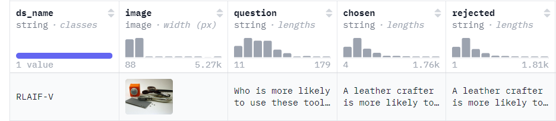

# 人类偏好对齐训练文档

本文档提供了各种人类偏好对齐算法的训练脚本。若您希望深入了解更详尽的算法信息及其选择方法，请参考[文档](https://github.com/modelscope/modelscope-classroom/blob/main/LLM-tutorial/M.%E4%BA%BA%E7%B1%BB%E5%81%8F%E5%A5%BD%E5%AF%B9%E9%BD%90%E8%AE%AD%E7%BB%83.md)

## 目录
- [环境准备](#环境准备)
- [数据集](#数据集)
- [DPO](#dpo)
- [CPO](#cpo)
- [ORPO](#orpo)
- [SimPO](#simpo)

## 环境准备
```bash
# 设置pip全局镜像 (加速下载)
pip config set global.index-url https://mirrors.aliyun.com/pypi/simple/
# 安装ms-swift
git clone https://github.com/modelscope/swift.git
cd swift
pip install -e '.[llm]'

# 环境对齐 (通常不需要运行. 如果你运行错误, 可以跑下面的代码, 仓库使用最新环境测试)
pip install -r requirements/framework.txt  -U
pip install -r requirements/llm.txt  -U
```


## 数据集

视觉多模态大模型人类偏好对齐训练一般需要 $(x,y_w,y_l)$ 格式的数据，其中 $x$ 表示模型输入，包括文本提示和图像, $y_w,y_l$ 分别表示符合人类偏好的偏好回答和不符合人类偏好的拒绝回答,比如

**自定义数据集格式**
```jsonl
{"system": "123", "query": "11111", "response": "22222", "rejected_response": "33333", "images": ["image_path"], "history": [["query1", "response1"], ["query2", "response2"]]}
{"system": "123", "query": "aaaaa", "response": "bbbbb", "rejected_response": "ccccc", "images": ["image_path"], "history": [["query1", "response1"], ["query2", "response2"]]}
{"system": "123", "query": "AAAAA", "response": "BBBBB", "rejected_response": "CCCCC", "images": ["image_path"], "history": [["query1", "response1"], ["query2", "response2"]]}
```

其中`system`和`history`为可选项

不同模型对图像数量的支持不同, 具体参考模型对应的最佳实践文档

**训练提示**:
- 下面的训练脚本使用`--lora_target_modules DEFAULT`只训练模型的QKV矩阵，你也可以设置`--lora_target_modules ALL`来训练模型的全部线性层

## DPO
[论文arvix](https://arxiv.org/abs/2305.18290)

超参
- `beta`：KL正则系数，值越大表示对偏离参考模型的惩罚越大。默认为0.1

建议在开始DPO训练之前，使用偏好数据集中的偏好回答部分进行SFT训练，以确保数据符合DPO算法的分布要求。
我们也在DPO loss中混合了sft loss来稳定训练，你可以通过设置超参`sft_beta`来调整sft loss的系数，默认为0.1

训练脚本, 这里我们提供单卡/多卡device map/多卡ddp的版本，简洁起见，后续算法只给出单卡版本。
```bash
# Experimental environment: A100
CUDA_VISIBLE_DEVICES=0 \
swift rlhf \
    --rlhf_type dpo \
    --model_type llava1_6-mistral-7b-instruct \
    --beta 0.1 \
    --sft_beta 0.1 \
    --sft_type  lora \
    --dataset rlaif-v#1000 \
    --num_train_epochs  2  \
    --lora_target_modules  DEFAULT  \
    --gradient_checkpointing  true  \
    --batch_size  1  \
    --learning_rate  5e-5  \
    --gradient_accumulation_steps  16  \
    --warmup_ratio  0.03  \
    --save_total_limit  2

# MP(device map)
CUDA_VISIBLE_DEVICES=0,1 \
swift rlhf \
    --rlhf_type dpo \
    --model_type llava1_6-mistral-7b-instruct \
    --beta 0.1 \
    --sft_beta 0.1 \
    --sft_type  lora \
    --dataset rlaif-v#1000 \
    --num_train_epochs  2  \
    --lora_target_modules  DEFAULT  \
    --gradient_checkpointing  true  \
    --batch_size  1  \
    --learning_rate  5e-5  \
    --gradient_accumulation_steps  16  \
    --warmup_ratio  0.03  \
    --save_total_limit  2

# DDP + MP
nproc_per_node=2

CUDA_VISIBLE_DEVICES=0,1,2,3 \
NPROC_PER_NODE=$nproc_per_node \
MASTER_PORT=29500 \
swift rlhf \
    --rlhf_type dpo \
    --model_type llava1_6-mistral-7b-instruct \
    --beta 0.1 \
    --sft_beta 0.1 \
    --sft_type  lora \
    --dataset rlaif-v#1000 \
    --num_train_epochs  2  \
    --lora_target_modules  DEFAULT  \
    --gradient_checkpointing  true  \
    --batch_size  1  \
    --learning_rate  5e-5  \
    --gradient_accumulation_steps  $(expr 16 / $nproc_per_node)  \
    --warmup_ratio  0.03  \
    --save_total_limit  2
```

训练后的模型推理和部署可以参考对应模型的最佳实践文档, [部署文档](./MLLM部署文档.md)和[vLLM推理加速文档](./vLLM推理加速文档.md)

## CPO
[论文arvix](https://arxiv.org/abs/2401.08417)
超参
- beta：隐含奖励前的系数，默认为0.1
- cpo_alpha: nll loss系数, 默认为1.0

训练脚本
```bash
CUDA_VISIBLE_DEVICES=0 \
swift rlhf \
    --rlhf_type cpo \
    --model_type  llava1_6-mistral-7b-instruct \
    --beta 0.1 \
    --sft_type  lora \
    --dataset rlaif-v#1000 \
    --num_train_epochs  2  \
    --lora_target_modules  DEFAULT  \
    --gradient_checkpointing  true  \
    --batch_size  1  \
    --learning_rate  5e-5  \
    --gradient_accumulation_steps  16  \
    --warmup_ratio  0.03  \
    --save_total_limit  2
```

## ORPO
[论文arvix](https://arxiv.org/abs/2403.07691)

超参
- lambda: Odds Ratio loss系数

注意：ORPO使用参数`--beta`传入超参`lambda`
```bash
CUDA_VISIBLE_DEVICES=0 \
swift rlhf \
    --rlhf_type orpo \
    --model_type  llava1_6-mistral-7b-instruct \
    --beta 0.1 \
    --sft_type  lora \
    --dataset rlaif-v#1000 \
    --num_train_epochs  2  \
    --lora_target_modules  DEFAULT  \
    --gradient_checkpointing  true  \
    --batch_size  1  \
    --learning_rate  5e-5  \
    --gradient_accumulation_steps  16  \
    --warmup_ratio  0.03  \
    --save_total_limit  2
```


## SimPO
[论文arvix](https://arxiv.org/abs/2405.14734)
超参
- beta：隐含奖励前的系数，默认为2.0
- simpo_gamma：reward margin项，默认为1.0
- cpo_alpha: 混合CPO nll loss提高训练稳定性, 默认为1.0, 设置0.0使用原始SimPO算法

```bash
CUDA_VISIBLE_DEVICES=0 \
swift rlhf \
    --rlhf_type simpo \
    --model_type  llava1_6-mistral-7b-instruct \
    --beta 2.0 \
    --simpo_gamma 1.0 \
    --sft_type  lora \
    --dataset rlaif-v#1000 \
    --num_train_epochs  2  \
    --lora_target_modules  DEFAULT  \
    --gradient_checkpointing  true  \
    --batch_size  1  \
    --learning_rate  5e-5  \
    --gradient_accumulation_steps  16  \
    --warmup_ratio  0.03  \
    --save_total_limit  2
```
