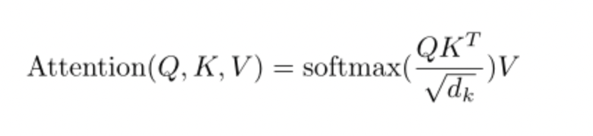
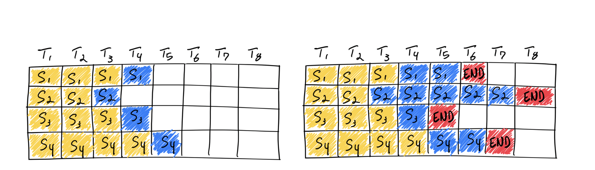
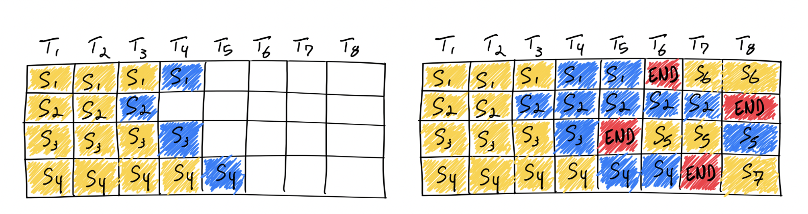
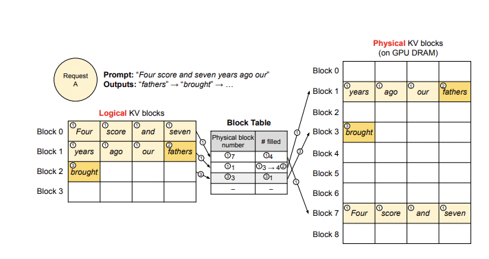
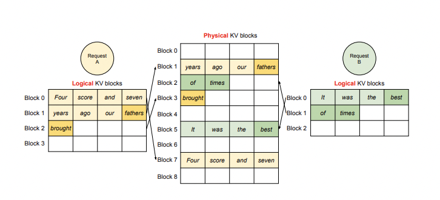
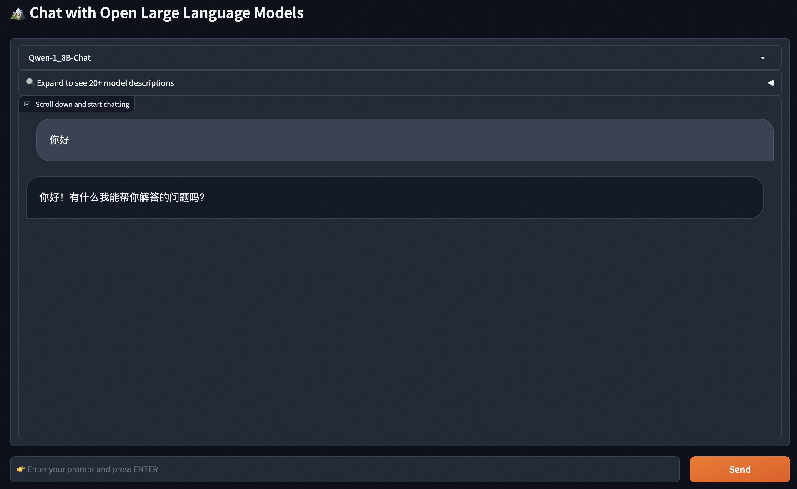

# 推理及部署

训练后的模型会用于推理或者部署。推理即使用模型用输入获得输出的过程，部署是将模型发布到恒定运行的环境中推理的过程。一般来说，LLM的推理可以直接使用PyTorch代码、使用[VLLM](https://docs.vllm.ai/en/latest/getting_started/quickstart.html)/[XInference](https://github.com/xorbitsai/inference)/[FastChat](https://github.com/lm-sys/FastChat)等框架，也可以使用[llama.cpp](https://github.com/ggerganov/llama.cpp)/[chatglm.cpp](https://github.com/li-plus/chatglm.cpp)/[qwen.cpp](https://github.com/QwenLM/qwen.cpp)等c++推理框架。

# 一些推理方法

- Greedy Search **贪婪搜索方式**。按照前面的讲解，模型会按照词表尺寸生成概率。贪婪方式会不断选择生成概率最大的token。该方法由于无脑选择了最大概率，因此模型会倾向于生成重复的文字，一般实际应用中很少使用
- Beam Search 和贪婪方式的区别在于，beam search会选择概率最大的k个。在生成下一个token时，每个前序token都会生成k个，这样整体序列就有k^2个，从这些序列中选择组合概率最大的k个，并递归地执行下去。k在beam search算法中被称为beam_size
- Sample 随机采样方式。按照词表每个token的概率采样一个token出来。这个方式多样性更强，是目前主流的生成方式。

# 重要推理超参数

- do_sample：布尔类型。是否使用随机采样方式运行推理，如果设置为False，则使用beam_search方式

- temperature：大于等于零的浮点数。公式为：
  $$
  q_i=\frac{\exp(z_i/T)}{\sum_{j}\exp(z_j/T)}\\
  $$
  从公式可以看出，如果T取值为0，则效果类似argmax，此时推理几乎没有随机性；取值为正无穷时接近于取平均。一般temperature取值介于[0, 1]之间。取值越高输出效果越随机。

  **如果该问答只存在确定性答案，则T值设置为0。反之设置为大于0。**

- top_k：大于0的正整数。从k个概率最大的结果中进行采样。k越大多样性越强，越小确定性越强。一般设置为20~100之间。
  - 实际实验中可以先从100开始尝试，逐步降低top_k直到效果达到最佳。

- top_p：大于0的浮点数。使所有被考虑的结果的概率和大于p值，p值越大多样性越强，越小确定性越强。一般设置0.7~0.95之间。
  - 实际实验中可以先从0.95开始降低，直到效果达到最佳。
  - top_p比top_k更有效，应优先调节这个参数。
- repetition_penalty： 大于等于1.0的浮点数。如何惩罚重复token，默认1.0代表没有惩罚。

# KVCache

上面我们讲过，自回归模型的推理是将新的token不断填入序列生成下一个token的过程。那么，前面token已经生成的中间计算结果是可以直接利用的。具体以Attention结构来说：



推理时的Q是单token tensor，但K和V都是包含了所有历史token tensor的长序列，因此KV是可以使用前序计算的中间结果的，这部分的缓存就是KVCache，其显存占用非常巨大。

# VLLM

VLLM支持绝大多数LLM模型的推理加速。它使用如下的方案大幅提升推理速度：

1. Continuous batching

   - 在实际推理过程中，一个批次多个句子的输入的token长度可能相差很大，最后生成的模型输出token长度相差也很大。在python朴素推理中，最短的序列会等待最长序列生成完成后一并返回，这意味着本来可以处理更多token的GPU算力在对齐过程中产生了浪费。continous batching的方式就是在每个句子序列输出结束后马上填充下一个句子的token，做到高效利用算力。

     

     

2. PagedAttention
   - 推理时的显存占用中，KVCache的碎片化和重复记录浪费了50%以上的显存。VLLM将现有输入token进行物理分块，使每块显存内部包含了固定长度的tokens。在进行Attention操作时，VLLM会从物理块中取出KVCache并计算。因此模型看到的逻辑块是连续的，但是物理块的地址可能并不连续。这和虚拟内存的思想非常相似。另外对于同一个句子生成多个回答的情况，VLLM会将不同的逻辑块映射为一个物理块，起到节省显存提高吞吐的作用。





值得注意的是，VLLM会默认将显卡的全部显存预先申请以提高缓存大小和推理速度，用户可以通过参数`gpu_memory_utilization`控制缓存大小。

首先安装VLLM：

```shell
pip install vllm
```

```shell
import os
os.environ['VLLM_USE_MODELSCOPE'] = 'True'
from vllm import LLM, SamplingParams
prompts = [
    "Hello, my name is",
    "The president of the United States is",
    "The capital of France is",
    "The future of AI is",
]
sampling_params = SamplingParams(temperature=0.8, top_p=0.95)
llm = LLM(model="qwen/Qwen-1_8B", trust_remote_code=True)
outputs = llm.generate(prompts, sampling_params)

# Print the outputs.
for output in outputs:
    prompt = output.prompt
    generated_text = output.outputs[0].text
    print(f"Prompt: {prompt!r}, Generated text: {generated_text!r}")
```

注意，截止到本文档编写完成，VLLM对Chat模型的推理支持（模板和结束符）存在问题，在实际进行部署时请考虑使用SWIFT或者FastChat。

> LLM的generate方法支持直接输入拼接好的tokens(prompt_token_ids参数，此时不要传入prompts参数)，所以外部可以按照自己的模板进行拼接后传入VLLM，SWIFT就是使用了这种方法

在量化章节中我们讲解了[AWQ量化](https://docs.vllm.ai/en/latest/quantization/auto_awq.html)，VLLM直接支持传入量化后的模型进行推理：

```python
from vllm import LLM, SamplingParams
import os
import torch
os.environ['VLLM_USE_MODELSCOPE'] = 'True'

# Sample prompts.
prompts = [
    "Hello, my name is",
    "The president of the United States is",
    "The capital of France is",
    "The future of AI is",
]
# Create a sampling params object.
sampling_params = SamplingParams(temperature=0.8, top_p=0.95)

# Create an LLM.
llm = LLM(model="ticoAg/Qwen-1_8B-Chat-Int4-awq", quantization="AWQ", dtype=torch.float16, trust_remote_code=True)
# Generate texts from the prompts. The output is a list of RequestOutput objects
# that contain the prompt, generated text, and other information.
outputs = llm.generate(prompts, sampling_params)
# Print the outputs.
for output in outputs:
    prompt = output.prompt
    generated_text = output.outputs[0].text
    print(f"Prompt: {prompt!r}, Generated text: {generated_text!r}")
```

VLLM官方文档可以查看[这里](https://docs.vllm.ai/en/latest/getting_started/quickstart.html)。

# SWIFT

在SWIFT中，我们支持了VLLM的推理加速手段。

```shell
pip install ms-swift[llm] openai
```

只需要运行下面的命令就可以使用VLLM加速推理：

```shell
swift infer --model_id_or_path qwen/Qwen-1_8B-Chat --max_new_tokens 128 --temperature 0.3 --top_p 0.7 --repetition_penalty 1.05 --do_sample true
```

也支持在部署中使用VLLM：

```shell
swift deploy --model_id_or_path qwen/Qwen-1_8B-Chat --max_new_tokens 128 --temperature 0.3 --top_p 0.7 --repetition_penalty 1.05 --do_sample true
```

调用：

```python
from openai import OpenAI
client = OpenAI(
    api_key='EMPTY',
    base_url='http://localhost:8000/v1',
)
model_type = client.models.list().data[0].id
print(f'model_type: {model_type}')

query = '浙江的省会在哪里?'
messages = [{
    'role': 'user',
    'content': query
}]
resp = client.chat.completions.create(
    model=model_type,
    messages=messages,
    seed=42)
response = resp.choices[0].message.content
print(f'query: {query}')
print(f'response: {response}')

# 流式
messages.append({'role': 'assistant', 'content': response})
query = '这有什么好吃的?'
messages.append({'role': 'user', 'content': query})
stream_resp = client.chat.completions.create(
    model=model_type,
    messages=messages,
    stream=True,
    seed=42)

print(f'query: {query}')
print('response: ', end='')
for chunk in stream_resp:
    print(chunk.choices[0].delta.content, end='', flush=True)
print()

"""Out[0]
model_type: qwen-7b-chat
query: 浙江的省会在哪里?
response: 浙江省的省会是杭州市。
query: 这有什么好吃的?
response: 杭州有许多美食，例如西湖醋鱼、东坡肉、龙井虾仁、叫化童子鸡等。此外，杭州还有许多特色小吃，如西湖藕粉、杭州小笼包、杭州油条等。
"""
```

# llama.cpp

llama.cpp是使用c++语言编写的对llama系列模型进行高效推理或量化推理的开源库。该库使用了ggml底层计算库进行推理。在使用之前需要额外将python的weights转为ggml格式或gguf格式方可使用。和llama.cpp类似，还有兼容ChatGLM模型的chatglm.cpp和兼容qwen模型的qwen.cpp和mistral的mistral.cpp。

安装依赖：

```shell
pip install modelscope
```

```python
git clone --recursive https://github.com/QwenLM/qwen.cpp && cd qwen.cpp
cmake -B build
cmake --build build -j --config Release
```

下载模型：

```python
from modelscope import snapshot_download
print(snapshot_download('qwen/Qwen-1_8B-Chat'))
# /mnt/workspace/.cache/modelscope/qwen/Qwen-1_8B-Chat
```

将原始模型转换为ggml支持的格式：

```shell
python3 qwen_cpp/convert.py -i /mnt/workspace/.cache/modelscope/qwen/Qwen-1_8B-Chat -t q4_0 -o qwen1_8b-ggml.bin
./build/bin/main -m qwen1_8b-ggml.bin --tiktoken /mnt/workspace/.cache/modelscope/qwen/Qwen-1_8B-Chat/qwen.tiktoken -p 你好
# 你好！有什么我可以帮助你的吗？
```

量化章节中我们介绍，GGML库适合于CPU运行，因此推荐用户在CPU环境中或边缘计算中考虑cpp库进行推理。

# FastChat

FastChat是一个开源推理库，侧重于模型的分布式部署实现，并提供了OpenAI样式的RESTFul API。

```shell
pip3 install "fschat[model_worker,webui]"
python3 -m fastchat.serve.controller
```

在新的terminal中启动：

```shell
FASTCHAT_USE_MODELSCOPE=true python3 -m fastchat.serve.model_worker --model-path qwen/Qwen-1_8B-Chat --revision v1.0.0
```

之后在新的terminal中可以运行界面进行推理:

```shell
python3 -m fastchat.serve.gradio_web_server
```


