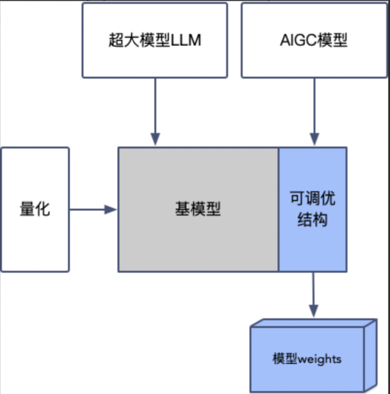
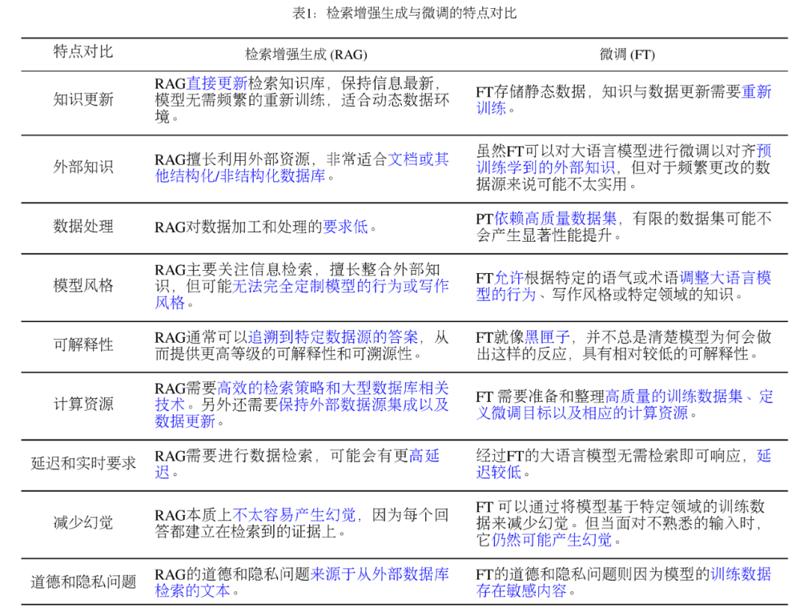

# 方法选型

判断自己的场景需要什么样的方法是使用LLM的第一步。下面我们会对比直接推理（提示词工程）、训练、RAG、Agent方法的具体场景，讲解这几种方式的特点，并给出适用场景、使用难度、准确性、成本、缺点几个方面的总结。

## 直接推理（提示词工程）

这种方式特指直接使用现有LLM，利用prompt范式激活模型不同的能力完成特定需求。直接推理方式对开发的要求较低，一般可以完成通用类型的任务，如通用知识问答、角色扮演等。使用方式如下：

```text
用户：你是一个经验丰富的导游，请使用导游的话术回答游客的问题。
模型：当然可以！请问你需要问些什么呢？
用户：我想去杭州旅行，请告诉我哪里比较值得去。
模型：当然可以！作为一个导游，我可以为你讲解杭州的风景和美食...
```

### 使用难度

- 较低，只需要调用模型接口，编写对应的prompt即可。但编写好的prompt也是具有一定技巧的，具体可以查看我们的教程中的提示词工程部分。

**提示词工程无论是直接推理或训练后推理都是需要的**。

### 适用场景

- 视模型本身的能力而定，在采用该方式之前需要对现有模型针对自己的业务领域进行较为充分的评估。

### 准确性

- 由于是原始模型只接受了通用知识的训练，因此在特定领域的场景下可能存在胡编乱造的可能性（幻觉问题）。使用者需要注意自己的专业场景下是否使用该通用模型能解决所有问题，一般建议直接试用该模型给出模型能力的具体评估。

### 成本

- 开发成本较低。如果是开源模型，需要选用合适的硬件及推理方式。这部分在我们教程中的推理章节会有讲解。如果是闭源调用，只需要使用对应模型的接口API即可。

### 缺点

- 由于模型没有经过针对特有领域的知识，因此效果会比较不可控。比如，在评测时模型表现尚可，但在实际使用中发现模型出现了严重的幻觉和知识匮乏问题，如果是闭源调用则该问题会比较难以解决（可能涉及到工程架构改变），如果是开源模型可以考虑使用训练和RAG的方式解决。

## 训练

全量训练和轻量训练是训练的两种方式，它们的区别在于：

全量训练在给定LLM模型上冻结一定的参数（或不冻结任何参数）进行训练，一般耗费显存较高，训练周期比较长。受限于成本问题，最近出现了轻量微调方式，主要方案是在模型结构上附着一个额外结构，在训练时冻结原模型并训练额外结构，推理时将额外结构加载起来或合并回原来模型（并不是所有的额外结构都支持合并，支持者比如LoRA，不支持者比如Side）。轻量微调目前的最流行结构是LoRA，该结构理解简单，训练成本较低，在部分任务上可以达到全量微调的效果。

轻量微调另一个方式就是量化（请查看另一篇文章），即对模型的float32权重或float16权重进行缩放，使其变成int类型的整形，节省显存或计算时长。

- 一般情况下建议选择轻量训练，优先使用LoRA等方式
- 如果效果不好，可以考虑解冻原模型的部分参数，比如normalizer、embedder等进行训练，也就是全量训练+轻量训练的方式
- 如果显存受限，可以考虑使用量化进行训练。量化和轻量训练并不互斥，比如QLoRA（量化+LoRA），但需要注意量化后训练和推理结果会有所下降

一般来说，预训练或继续训练不建议使用轻量训练，小数据量微调情况下建议优先使用轻量训练。



### 适用场景

- 场景存在特殊知识，需要进行知识灌注，可以使用继续训练+全量训练
- 需要对回复的风格或范式进行定制化，可以使用人类对齐训练或微调+全量/轻量训练
- 模型原有能力不够，如对读入的doc文件进行理解并进行归纳总结，或特有场景的文本进行分类，但原有模型对该任务的回答存在问题，可以使用微调+全量/轻量训练

> 简单来说，模型的训练是让模型“找规律”的过程。比如告诉模型1+1=2, 2+2=4，那么让模型分析3+3=？
>
> 如果数据是带有规律的，比如文字顺序、逻辑关系、图片元素（比如斑马总是带有黑白色的条纹），那么训练就可以将这些规律抽象出来；如果数据是“无规律的知识”，比如用A解决B问题，用C解决D问题，那么这些数据训练后就几乎不具有泛化性，因为模型无法分析出出现了E问题应该用A解决还是B解决，这时候应当选用RAG或者Agent方式，或者训练的目标改为让模型熟悉使用工具来解决问题。

### 使用难度

- 训练需要对模型结构、训练的流程有所了解。其理解成本比RAG高一些。

### 准确性

- 准确性依照训练的结果而定，训练后模型会按照训练集的风格和方式回答问题。一般来说训练后模型能力会有较大提升，但仍然可能存在幻觉问题。

### 成本

- 可以查看SWIFT的[benchmark](https://github.com/modelscope/swift/blob/main/docs/source/LLM/Benchmark.md)。我们比较了主要模型的训练显存需求和训练速度，用户可以按需评估。

### 缺点

- 相比RAG，输出可解释性不强
- 存在幻觉问题
- 在精确问答场景上可能会产出非专业结果（如法律行业）
- 对知识更新频繁的场景不适用

## RAG

RAG即检索增强生成，也就是通过模型外挂知识库的方式来辅助模型回答。一般来说会将用户问题变为向量，进向量数据库进行查询，并召回符合条件的文档或回答，之后将回答直接返回或输入模型整理后返回。RAG可以查看另一篇教程。

RAG和微调的选型问题一直是被问的较多的问题之一，两种方法的对比可以查看下表：



如果模型本身对专业知识理解不够（比如模型对召回的文档不能进行良好分析的情况），那么使用RAG是不够的，需要进行模型训练，或将模型训练和RAG结合起来使用。

### 适用场景

- 需要根据语料精确回答，比如法律或医疗领域
- 搜索召回场景，比如搜索引擎
- 知识频繁更新，灵活性较强的场景

### 使用难度

- 需要对RAG流程有所了解，选用对应的RAG框架或解决方案

### 准确性

- 准确性较高，可解释性也较高

### 成本

- 除模型本身的成本外，需要额外的向量数据库和工程端开发成本和维护成本

### 缺点

- 比模型直接回答多了查询召回步骤，单请求整体RT高一些
- 如果场景和知识无关，比如非知识类问答，或API调用，或文档分析，文章总结等，RAG就不能起到作用

## Agent

Agent适合于利用模型进行代码编写运行、API调用的复杂场景。Agent的主要思路是利用模型的CoT（思维链）能力进行复杂场景的流程串接。比如“生成一个具有今天天气特征的海报”，模型会先调用天气预报接口获得天气，之后生成海报文案，然后调用文生图模型生成海报。

### 适用场景

- 复杂的应用场景，需要模型产生思维过程，将整体任务拆分为具体任务进行执行，比如包含了运行代码、接口调用等过程

### 使用难度

- 需要对Agent和CoT过程有一定了解
- 熟悉目前的Agent框架的能力上限
- 需要熟悉模型的提示词工程才能做到较好的效果

### 准确性

- 一般来说模型越大准确性越高。比如GPT4（闭源）、Qwen-max（闭源）、Qwen-72b（开源）、ChatGLM4（闭源）等会具有良好的效果，小模型可能需要特殊训练。

- 在格外复杂的场景下，比如任务复杂、描述含混不清、模型对行业流程不理解的情况下，需要对模型进行额外训练。

### 成本

- 一般和模型部署成本相同

### 缺点

- 对复杂的业务和人类复杂的行为如博弈、交流->更新的场景支持不好。比如，尚不能用Agent编写复杂的APP如淘宝，也不能模拟股市大盘。

# 模型选型

目前国内外开源模型已经超过了几百个，挑选合适的模型是一个比较关键的问题。在这里可以给出一些泛泛的意见：

- Agent场景尽量选择较大的模型或者闭源LLM API（如GPT4、Qwen-max）

- 训练场景中，数据量较大（比如大于10000条）、数据质量较高、专业度较高的训练优先选择base模型，数据量较少优先选择chat模型。在算力允许条件下可以进行对比训练实验

- 关注国内外的开源可信模型榜单，选择排名较高或口碑较好的模型
