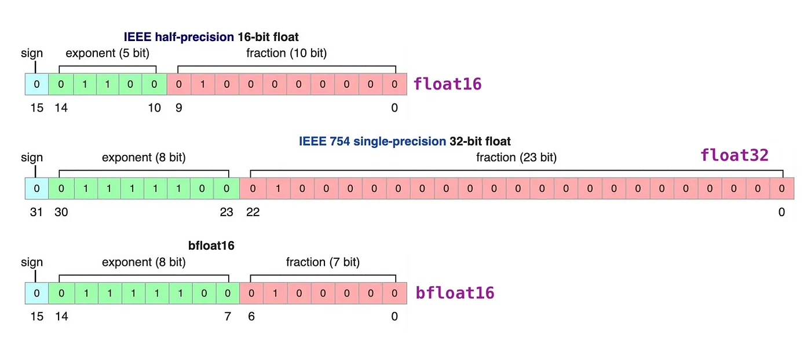
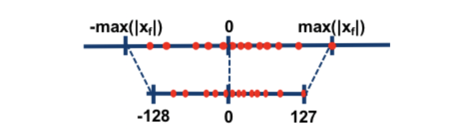

# 量化是什么

前文中我们提到，模型的推理过程是一个复杂函数的计算过程，这个计算一般以矩阵乘法为主，也就是涉及到了并行计算。一般来说，单核CPU可以进行的计算种类更多，速度更快，但一般都是单条计算；而显卡能进行的都是基础的并行计算，做矩阵乘法再好不过。如果把所有的矩阵都加载到显卡上，就会导致显卡显存的占用大量增加，尤其是LLM模型大小从7b、14b、34b到几百b不等，占用显存的大小就是惊人的数字，如何在减少运算量和显存占用的条件下，做到推理效果不下降太多呢？在这里需要引入浮点数和定点数的概念。



双精度浮点数：在PyTorch中用**torch.float64**表示，或者在其他语言中也称为double类型，在LLM训练中一般比较少用

全精度浮点数：在PyTorch中用**torch.float32**表示

低精度浮点数：在PyTorch中用**torch.bfloat16和torch.float16**表示。这两个浮点数的差别在上图中可以表示：

1. bfloat16的小数部分较短，整数部分较长，这会有利于在训练中减少梯度爆炸的情况（即梯度累加值超过了最大值），但是这种数据类型是在N系列显卡Ampere系列才支持的，即**30系列**显卡。
2. float16的小数部分较长，这意味着在精度控制上float16更好，但整数部分较短，比较容易梯度爆炸。

那么是否有更加减少显存占用和计算量的数值表达方式呢？那么可以考虑是否把浮点数转换为定点数（整数），整数计算更快更省显存，如果计算精度下降不大就很完美了。这种用整数计算代替浮点数计算的方法就是**量化**。

量化的基本原理是**根据每个tensor的浮点型最大值和最小值，将其映射为一个固定范围的整形数值集合**，比如[-127~127]。假设一个简单的公式：qweight=round(weight/scale)，其中qweight代表量化后权重，weight代表量化前权重，scale代表缩放因子，可以看到在进行缩放后为了将浮点型转换为整数过程中增加了round操作丢失了小数部分。在后续计算或反量化为浮点型时存在无法完全还原的情况，这就是精度损失。

按照量化发生的步骤区分，可以划分为**PTQ（训练后量化，或离线量化）和QAT（训练感知型量化，或在线量化）**。PTQ量化可以分为data-free和calibration两种，前者不使用数据集进行校准直接按照传统方法直接计算量化因子，后者会根据少量真实数据进行统计分析并对量化因子进行额外校准，但耗费的时间更长。QAT量化会先在待量化的算子上增加一个伪量化结构，并在训练时模拟量化过程并实时更新计算量化因子（类似反向传播过程）及原始权重。QAT由于较为复杂一般作为辅助措施存在，用于改进PTQ量化的技术手段。

按照量化方法可以划分为**线性量化、非线性量化（如对数量化）**等多种方式，目前较为常用的是线性量化。其中线性量化又可以按照对称性划分为**对称量化和非对称量化**，非对称量化为了解决weight分布不均匀问题，其在公式中增加了zero_point项：qweight=round(weight/scale + zero_point)，使稠密数据部分可以得到更宽泛的数值范围。





按照量化粒度划分可以分为**逐层量化（每层使用一套量化因子）、逐组量化（在每层中按照group使用一套量化因子）、逐通道量化（按channel划分量化因子）**等几种方式。

按照量化最大值的阈值区分，可以分为**饱和量化和不饱和量化**两种。不饱和量化按照浮点数最大值和量化后最大值的比例计算量化因子，由于原始weight的非均匀性会导致某些整形数值范围存在权重空缺。饱和量化会计算一个中间值以计算出量化因子，因此会舍弃一部分不重要数据，将重要数据尽量均匀的分布到量化数值范围内。

一般来说，PyTorch中量化模块的forward过程会先对量化权重进行反量化后使用浮点数进行计算。

下面介绍几种常用的量化库。

# AutoGPTQ

该库需要引入额外的校准数据集进行量化校准。相比bitsandbytes量化精度较高，推理速度较快，但**训练后不支持合并adapter**。

```python
# 例子来自于https://github.com/PanQiWei/AutoGPTQ
from transformers import AutoTokenizer, TextGenerationPipeline
from auto_gptq import AutoGPTQForCausalLM, BaseQuantizeConfig
import logging

logging.basicConfig(
    format="%(asctime)s %(levelname)s [%(name)s] %(message)s", level=logging.INFO, datefmt="%Y-%m-%d %H:%M:%S"
)

pretrained_model_dir = "facebook/opt-125m"
quantized_model_dir = "opt-125m-4bit"

tokenizer = AutoTokenizer.from_pretrained(pretrained_model_dir, use_fast=True)
examples = [
    tokenizer(
        "auto-gptq is an easy-to-use model quantization library with user-friendly apis, based on GPTQ algorithm."
    )
]

quantize_config = BaseQuantizeConfig(
    bits=4,  # quantize model to 4-bit
    group_size=128,  # it is recommended to set the value to 128
    desc_act=False,  # set to False can significantly speed up inference but the perplexity may slightly bad
)

# load un-quantized model, by default, the model will always be loaded into CPU memory
model = AutoGPTQForCausalLM.from_pretrained(pretrained_model_dir, quantize_config)

# quantize model, the examples should be list of dict whose keys can only be "input_ids" and "attention_mask"
model.quantize(examples)

# save quantized model
model.save_quantized(quantized_model_dir)

# save quantized model using safetensors
model.save_quantized(quantized_model_dir, use_safetensors=True)

# push quantized model to Hugging Face Hub.
# to use use_auth_token=True, Login first via huggingface-cli login.
# or pass explcit token with: use_auth_token="hf_xxxxxxx"
# (uncomment the following three lines to enable this feature)
# repo_id = f"YourUserName/{quantized_model_dir}"
# commit_message = f"AutoGPTQ model for {pretrained_model_dir}: {quantize_config.bits}bits, gr{quantize_config.group_size}, desc_act={quantize_config.desc_act}"
# model.push_to_hub(repo_id, commit_message=commit_message, use_auth_token=True)

# alternatively you can save and push at the same time
# (uncomment the following three lines to enable this feature)
# repo_id = f"YourUserName/{quantized_model_dir}"
# commit_message = f"AutoGPTQ model for {pretrained_model_dir}: {quantize_config.bits}bits, gr{quantize_config.group_size}, desc_act={quantize_config.desc_act}"
# model.push_to_hub(repo_id, save_dir=quantized_model_dir, use_safetensors=True, commit_message=commit_message, use_auth_token=True)

# load quantized model to the first GPU
model = AutoGPTQForCausalLM.from_quantized(quantized_model_dir, device="cuda:0")

# download quantized model from Hugging Face Hub and load to the first GPU
# model = AutoGPTQForCausalLM.from_quantized(repo_id, device="cuda:0", use_safetensors=True, use_triton=False)

# inference with model.generate
print(tokenizer.decode(model.generate(**tokenizer("auto_gptq is", return_tensors="pt").to(model.device))[0]))

# or you can also use pipeline
pipeline = TextGenerationPipeline(model=model, tokenizer=tokenizer)
print(pipeline("auto-gptq is")[0]["generated_text"])
```

# Bitsandbytes

bitsandbytes是一种data-free的量化库。该量化方法速度较快（因为其不需要数据校准），因此可以在模型加载时动态量化，且该方法训练速度较快，因此训练兼容性较好，一般用于QLoRA训练中，且训练后可以和并adapter。当由于其没有数据校准过程，因此精度较AutoGPTQ较低。

```python
from modelscope import AutoModelForCausalLM
model = AutoModelForCausalLM.from_pretrained(
  'qwen/Qwen-1_8B-Chat',
  device_map='auto',
  load_in_8bit=True,
  max_memory=f'{int(torch.cuda.mem_get_info()[0]/1024**3)-2}GB')
```

# GGML

GGML和GGUF是GGML C++推理库的两种量化格式，其中GGUF格式较新，可以保留模型版本等其他自定义信息。这两种格式也是PTQ形式的量化算法，但GGML和GGUF格式的量化算法更适配于CPU推理，因此在CPU上运行更快，而GPTQ量化对GPU更加友好，两者的推理精度相仿。因此，*.cpp类型使用了GGML推理库的推理框架都更适配于CPU推理。

GGML库的github可以访问：https://github.com/ggerganov/ggml

# AWQ

AWQ量化方式假设不是所有权重都影响模型性能，因此在量化过程中会跳过一部分重要权重以减轻量化过程中的精度损失。因此在和GPTQ量化保持类似推理速度的同时可以具备更好的精度。

目前VLLM对AWQ的支持较好，可以参考：https://docs.vllm.ai/en/latest/quantization/auto_awq.html
