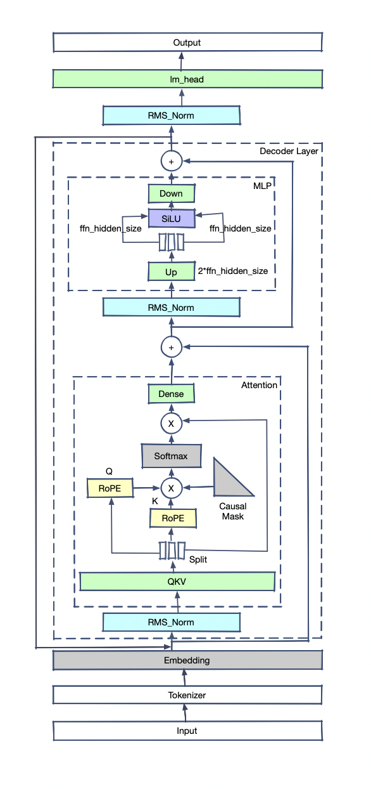
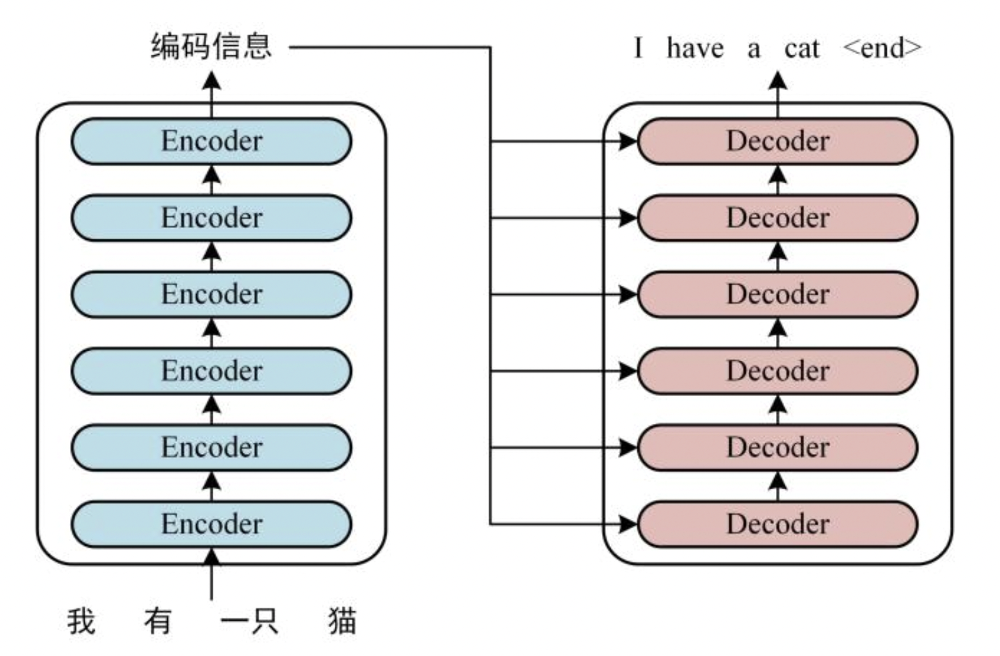
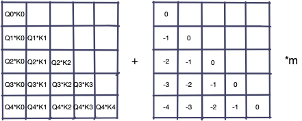
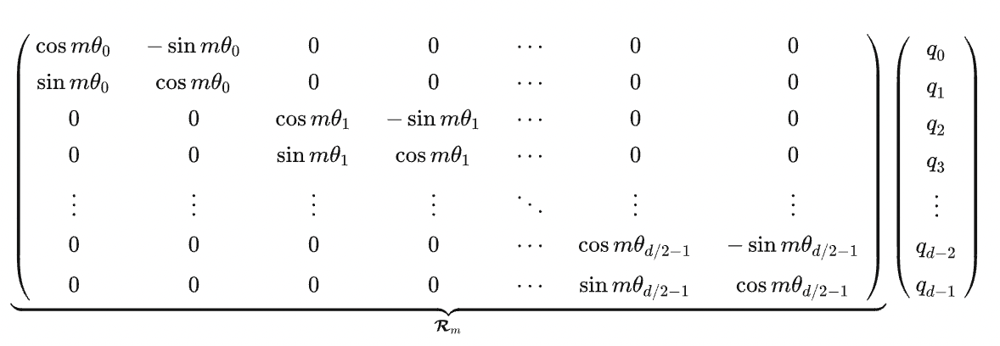
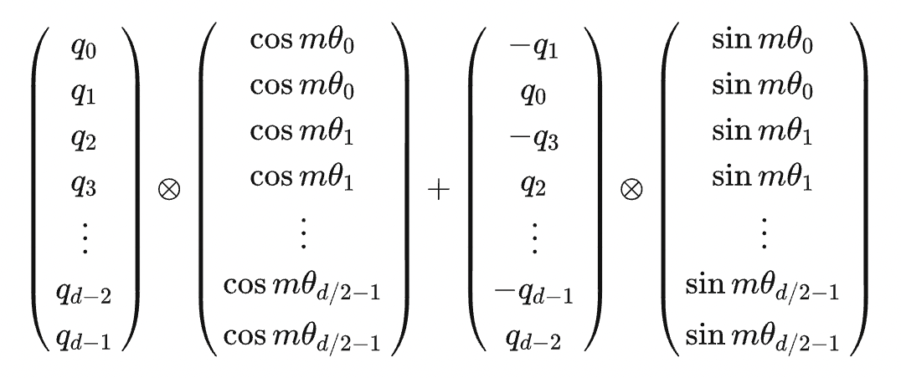
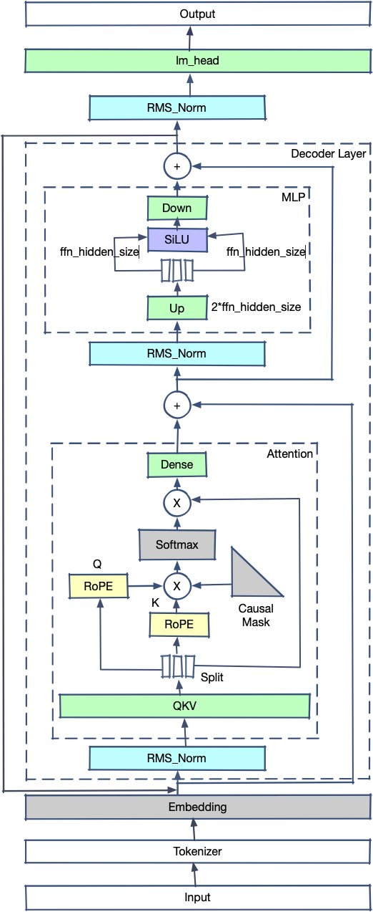

# Transformer结构模型

在2017年之后，Transformer结构模型几乎横扫一切统治了NLP领域，后面的CV领域和Audio领域也大放异彩。相比LSTM和CNN结构，Transformer结构好在哪里呢？

介绍下基本结构和流程：

1. Input是原始句子，经过Tokenizer转变为tokens
2. tokens输入模型，第一个算子是Embedder，tokens转换为float tensor
3. 之后进入layers，每个layers会包含一个attention结构，计算Q和K的tensor的内积，并将内积概率化，乘以对应的V获得新的tensor。
4. tensor加上输入的x后（防止层数太深梯度消失）进入Normalization，对tensor分布进行标准化
5. 进入FeedForward（MLP），重新进入下一layer
6. 所有的layers计算过后，经过一个linear求出对vocab每个位置的概率

可以看出，Transformer模型的基本原理是让每个文字的Tensor和其他文字的Tensor做内积（也就是cosine投影值，可以理解为文字的相关程度）。之后把这些相关程度放一块计算各自占比，再用占比值分别乘以对应文字的Tensor并相加起来，得到了一个新的Tensor（这个Tensor是之前所有Tensor的概率混合）。每个文字都可以进行如上动作，因此生成的新的Tensor和之前输入的Tensor长度相同（比如输入十个字，计算得到的Tensor还是十个），在层数不断堆叠的情况下，最后的Tensor会越来越抽象出文字的深层次意义，用最后输出的Tensor去计算输出一个新的文字或分类。

# Transformer对比CNN和LSTM

- CNN有局部性和平移不变性，促使模型关注局部信息。CNN预设了归纳偏差，这使得小样本训练可以取得较好效果，但在充分数据下这一效果也被transformer所掩盖。并且局部性会忽略全局关系，导致某些条件下效果不佳
- LSTM的长距离记忆会导致最早的token被加速遗忘，并且其只能注意单侧信息导致了对句子的理解存在偏差。后来虽然引入了双向LSTM，但其大规模分布式训练仍然存在技术问题
- Transformer结构并不预设归纳偏差，因此需要大数据量训练才有较好效果。但其对于token的同时计算大大加速了推理速度，并且对分布式训练支持较好，因此在目前数据量充足的情况下反而异军突起。由于内置了positional-embedding，因此较好地解决了attention结构中的位置不敏感性

# Encoder和Decoder

如上图所示，左边是encoder，右边是decoder。我们可以看到目前的LLM模型几乎都是decoder结构，为什么encoder-decoder结构模型消失了呢？有以下几个原因：

- encoder-decoder模型分布式训练困难 decoder模型结构简单，其分布式训练相对容易，而encoder-decoder结构的模型由于结构复杂的多导致了训练时工程结构复杂，成本大大增加
- 有论文证明，encoder-decoder模型在参数量不断增加时不具有显著优势。在模型较小时，由于中间隐变量的存在，decoder部分进行交叉注意力会获得更好的效果，但随着模型增大，这些提升变得不再明显。甚至有论文猜测，encoder-decoder结构的收益仅仅是因为参数量翻倍

因此，目前的模型都是decoder模型，encoder-decoder模型几乎销声匿迹。

# 延展阅读

我们可以看到，LLaMA2的模型特点是：

1. 没有使用LayerNorm，而是使用了RMSNorm进行预归一化
2. 使用了RoPE（Rotary Positional Embedding）
3. MLP使用了SwiGLU作为激活函数
4. Llama2的大模型版本使用了Group Query Attention（GQA）

## **RMSNorm**

LayerNorm的公式是：
$$
y=\frac{x-E(x)}{\sqrt{\operatorname{Var}(x)+\epsilon}} * \gamma+\beta 
$$

RMSNorm的开发者发现，减去均值做中心偏移意义不大，因此简化了归一化公式，最终变为：
$$
 \begin{align} \begin{split} & \bar{a}_i = \frac{a_i}{\text{RMS}(\mathbf{a})} g_i, \quad \text{where}~~ \text{RMS}(\mathbf{a}) = \sqrt{\frac{1}{n} \sum_{i=1}^{n} a_i^2} \end{split}\nonumber \end{align}
$$

最终在保持效果不变的情况下，计算时间提升了40%左右。

## **RoPE**

BERT模型使用的原始位置编码是Sinusoidal Position Encoding。该位置编码的原理非常简单：
$$
PE_{(pos,2i)}=sin(pos/10000^{2i/d_{\mathrm{model}}}), PE_{(pos,2i+1)}=cos(pos/10000^{2i/d_{\mathrm{model}}})
$$

该设计的主要好处在于：

1. 在位置编码累加到embedding编码的条件下，基本满足不同位置编码的内积可以模拟相对位置的数值
2. 随着相对位置增大，其位置编码的内积趋近于0
3. 具备一定的外推特性

LLM常用的位置编码还有AliBi（注意力线性偏置）。该方法不在embedding上直接累加位置编码，而选择在Q*K的结果上累加一个位置矩阵：

ALiBi的好处在于：

1. 具备良好的外推特性
2. 相对位置数值很稳定

RoPE的全称是旋转位置编码(Rotary Positional Embedding)，该编码的推导过程和Sinusoidal Position Encoding的推导过程比较类似，不同之处在于后者是加性的，而前者是乘性的，因此得到的位置编码类似于：

或者也可以简化为：

该位置编码表示相对位置的几何意义比较明显，也就是两个向量的角度差。

该位置编码的优势在于：

1. 位置编码矩阵是正交阵，因此乘上位置编码后不会改变原向量模长
2. 相较于Sinusoidal Position Encoding具备了更好的外推特性

## **SwiGLU**

SwiGLU是GLU结构的变种。GLU是和LSTM原理类似，但不能接受时序数据，只能处理定长数据。而且省略了遗忘门与记忆门，只保留了输入门，SwiGLU是将其中的激活函数替换为了SiLU：
$$
\text{FFN}_{\text{Swish}}(x, W_1, W_2) = \text{Swish}_1(xW_1) W_2
$$

其中
$$
\text{Swish}_{1} 
$$

的表达式为：
$$
\text{Swish}_{\beta}(x) = x \sigma(\beta x)
$$

在SwiGLU的论文中，作者论证了SwiGLU在LOSS收益上显著强于ReLU、GeLU、LeakyGeLU等其他激活方法。

## **GQA**

MHA（Multi-head Attention）是标准的多头注意力机制，具有H个Query、Key 和 Value 矩阵

MQA（Multi-Query Attention，来自于论文：Fast Transformer Decoding: One Write-Head is All You Need）共享了注意力头之间的KV，只为每个头保留单独的Q参数，减少了显存占用。

GQA（Grouped-Query Attention，来自于论文：GQA: Training Generalized Multi-Query Transformer Models from Multi-Head Checkpoints）在MQA的基础上分成了G个组，组内共享KV。

在Llama2模型中，70B参数为了提升推理性能使用了GQA，其他版本没有使用这项技术。

## ChatGLM2的模型结构

ChatGLM2模型结构和Llama2的结构有一定相似之处，主要不同之处在于：

1. 在开源的ChatGLM2代码中没有使用GQA，而是使用了MQA
2. QKV为单一矩阵，在对hidden_state进行整体仿射后拆分为Query、Key、Value
3. MLP结构中没有使用Up、Gate、Down三个Linear加上SwiGLU，而是使用了hidden_size -> 2 * ffn_hidden_size的Up Linear进行上采样，对tensor进行拆分为两个宽度为ffn_hidden_size的tensor后直接输入SiLU，然后经过ffn_hidden_size -> hidden_size的Down Linear进行下采样