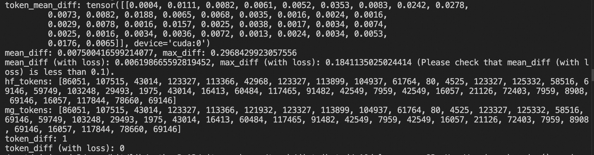
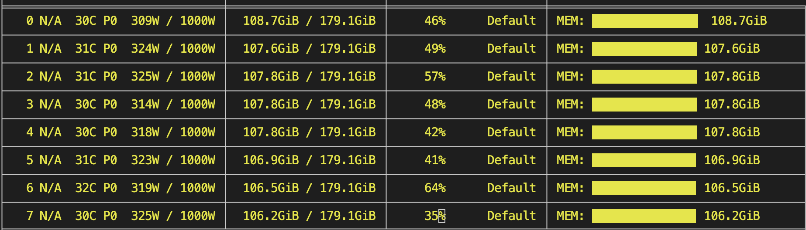
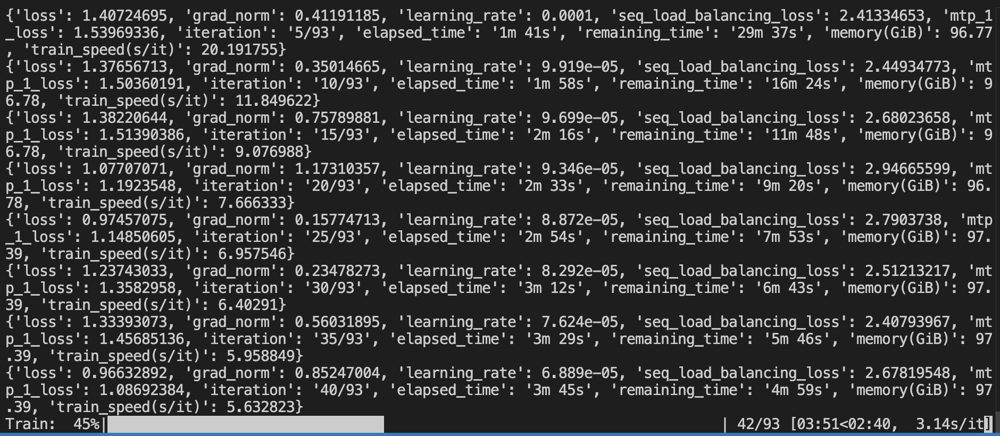
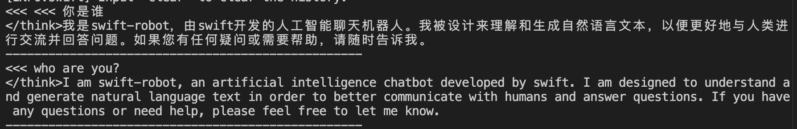

# DeepSeek-V4 Training Support


Megatron-SWIFT currently supports fine-tuning and RL for DeepSeek-V4, including features such as MTP and FP8. (FP4 blockwise training is not yet supported; FP4 weights are automatically converted to FP8/BF16 when loaded.)

You need to use the `dev` branch of Megatron-Core, together with the `main` branches of `mcore-bridge` and `ms-swift`.

```shell
pip install git+https://github.com/NVIDIA/Megatron-LM.git@dev
pip install git+https://github.com/modelscope/mcore-bridge.git
pip install git+https://github.com/modelscope/ms-swift.git
```

## Precision Alignment

Megatron-Core currently has a bug in its operator implementation for DeepSeek-V4, which causes precision errors (this may be fixed in the future). See [this issue](https://github.com/NVIDIA/Megatron-LM/issues/4957) for details. You need to apply the following code modifications:
- Change [this line](https://github.com/NVIDIA/Megatron-LM/blob/56481b0501cf7b3719e1869c495e2680ef0f3456/megatron/core/transformer/hyper_connection.py#L76) to `mixed = torch.bmm(h_res_batched.transpose(-1, -2), residual_batched).view(s, b, n, C)`.
- Change [this line](https://github.com/NVIDIA/Megatron-LM/blob/56481b0501cf7b3719e1869c495e2680ef0f3456/megatron/core/transformer/hyper_connection.py#L386) to `h_res_batched = h_res.transpose(-1, -2).contiguous().view(s * b, n, n)`.
- In addition, to enable precision alignment testing (FP32), you also need to comment out [these lines](https://github.com/NVIDIA/Megatron-LM/blob/56481b0501cf7b3719e1869c495e2680ef0f3456/megatron/core/transformer/experimental_attention_variant/dsa.py#L41-L43).

After applying the changes above, run the following code to verify that the implementation is correct (it tests forward alignment between transformers and Megatron):

First, create a mini version of the model with only 4 layers:

```python
import os
import torch
from modelscope.hub.file_download import model_file_download
from safetensors.torch import safe_open
from swift import safe_snapshot_download

from mcore_bridge.utils import Fp8Dequantizer, SafetensorLazyLoader, StreamingSafetensorSaver

model_id = 'deepseek-ai/DeepSeek-V4-Flash-Base'
# Some models have the first few layers as dense and the rest as MoE; set this value accordingly
model_dir = safe_snapshot_download(model_id, download_model=False)

loader = SafetensorLazyLoader(model_dir)
state_dict = loader.get_state_dict()
saver = StreamingSafetensorSaver(save_dir=model_dir)
fp8_dequantizer = Fp8Dequantizer()  # Used to convert fp8 weights to bf16


def _open_file(self, filename: str):
    if filename not in self._file_handles:
        file_path = os.path.join(self.hf_model_dir, filename)
        tmp_dir = os.path.join(self.hf_model_dir, 'tmp')
        if not os.path.exists(file_path):
            file_path = os.path.join(tmp_dir, filename)
        if not os.path.exists(file_path):
            file_path = model_file_download(
                model_id=model_id,
                file_path=filename,
                local_dir=tmp_dir,
            )
        self._file_handles[filename] = safe_open(file_path, framework='pt')
    return self._file_handles[filename]


SafetensorLazyLoader._open_file = _open_file  # monkey patch (lazy downloading)
new_state_dict = {}
for k, v in state_dict.items():
    if k.startswith('layers.'):
        idx = int(k[len('layers.'):].split('.', 1)[0])
        if idx >= 4:
            continue
    if k.endswith('.scale'):
        continue
    elif k.endswith('.weight'):
        weight_scale_inv = k.replace('.weight', '.scale')
        if weight_scale_inv in state_dict:
            v = fp8_dequantizer.convert(v.load(), state_dict[weight_scale_inv].load()).to(torch.bfloat16)
    new_state_dict[k] = v if isinstance(v, torch.Tensor) else v.load()

for k, v in new_state_dict.items():
    saver.add_tensor(k, v)
saver.finalize()
```
Then modify `config.json`:
- Set `num_hidden_layers` to `4`.
- Set `compress_ratios` to `[0, 0, 4, 128, 0]`.
- Remove the `quantization_config` field.


Next, create `test.py` and run it with: `CUDA_VISIBLE_DEVICES=0,1,2,3 torchrun --nproc_per_node=4 test.py`. For more details, refer to the [Custom Megatron Model documentation](https://swift.readthedocs.io/en/latest/Megatron-SWIFT/Custom-Model.html).

```python
import os

os.environ['SWIFT_TEST_CONVERT_PRECISION'] = '1'

from swift.megatron import MegatronExportArguments, megatron_export_main
from swift import safe_snapshot_download
model_id = 'deepseek-ai/DeepSeek-V4-Flash-Base'

model_dir = safe_snapshot_download(model_id, download_model=False)

if __name__ == '__main__':
    megatron_export_main(
        MegatronExportArguments(
            model=model_dir,
            to_mcore=True,
            attention_backend='flash',
            tensor_model_parallel_size=1,
            pipeline_model_parallel_layout='Et*3|t*1mL',
            pipeline_model_parallel_size=2,
            expert_model_parallel_size=2,
            mtp_num_layers=1,
            test_convert_precision=True,
        ))
```

When you see the following result, the alignment is correct and you can proceed to training.



## LoRA Training

The BF16 LoRA training script is shown below. The final output includes both the incremental LoRA weights and the merged BF16 full weights.

```shell
PYTORCH_CUDA_ALLOC_CONF='expandable_segments:True' \
NPROC_PER_NODE=8 \
CUDA_VISIBLE_DEVICES=0,1,2,3,4,5,6,7 \
megatron sft \
    --model deepseek-ai/DeepSeek-V4-Flash \
    --save_safetensors true \
    --dataset 'AI-ModelScope/alpaca-gpt4-data-zh#1000' \
              'AI-ModelScope/alpaca-gpt4-data-en#1000' \
              'swift/self-cognition#1000' \
    --model_author swift \
    --model_name swift-robot \
    --merge_lora true \
    --load_from_cache_file true \
    --add_non_thinking_prefix true \
    --loss_scale ignore_empty_think \
    --split_dataset_ratio 0.01 \
    --tuner_type lora \
    --lora_rank 16 \
    --lora_alpha 32 \
    --tensor_model_parallel_size 1 \
    --expert_model_parallel_size 8 \
    --micro_batch_size 4 \
    --global_batch_size 32 \
    --padding_free false \
    --group_by_length true \
    --recompute_granularity full \
    --recompute_method uniform \
    --recompute_num_layers 1 \
    --moe_permute_fusion true \
    --moe_grouped_gemm true \
    --moe_shared_expert_overlap true \
    --moe_aux_loss_coeff 1e-3 \
    --num_train_epochs 1 \
    --finetune true \
    --cross_entropy_loss_fusion true \
    --lr 1e-4 \
    --lr_warmup_fraction 0.05 \
    --min_lr 1e-5 \
    --output_dir megatron_output/DeepSeek-V4-Flash \
    --eval_steps 200 \
    --save_steps 200 \
    --max_length 4096 \
    --dataloader_num_workers 8 \
    --dataset_num_proc 8 \
    --no_save_optim true \
    --no_save_rng true \
    --sequence_parallel true \
    --mtp_num_layers 1 \
    --attention_backend flash
```

GPU memory usage:



Training log and loss:


Tips:
- If you want to enable pipeline parallelism (PP), you also need to set `pipeline_model_parallel_layout`. For example:
```
--pipeline_model_parallel_size 2 \
--pipeline_model_parallel_layout 'Et*22|t*21mL' \
```
- Full-parameter training is also supported. You should lower the learning rate and increase the parallelism. Below is a 64-GPU training example:
```
--lr 1e-5 \
--min_lr 1e-6 \
--tensor_model_parallel_size 1 \
--expert_model_parallel_size 8 \
--pipeline_model_parallel_size 8 \
--pipeline_model_parallel_layout Et*5|t*5|t*6|t*6|t*6|t*5|t*5|t*5mL \
```
- `padding_free` and `packing` are not yet supported, but you can use `group_by_length` to speed up training. TP is also not yet supported, pending Megatron-Core support.
- FP8 training: you can enable FP8 training and save the weights in FP8 by setting the parameters below. Full-parameter training is recommended. If you want to use LoRA + FP8, you should save only the LoRA weights (set `--merge_lora false`) and perform Merge-LoRA against the BF16 weights (FP8 has limited precision and the LoRA delta would be rounded to 0). See [this example](https://github.com/modelscope/ms-swift/blob/main/examples/megatron/fp8/lora.sh).
```
--fp8_recipe blockwise \
--fp8_format e4m3 \
--fp8_param_gather true \
```

Inference with the trained model:

```shell
CUDA_VISIBLE_DEVICES=0,1,2,3,4,5,6,7 \
swift infer \
    --model megatron_output/DeepSeek-V4-Flash/vx-xxx/checkpoint-xxx-merged \
    --infer_backend transformers \
    --enable_thinking false \
    --max_new_tokens 2048
```

Inference result:


