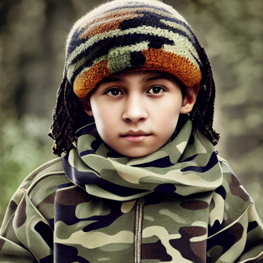
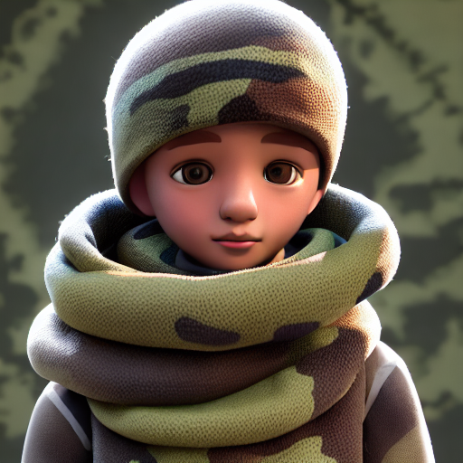
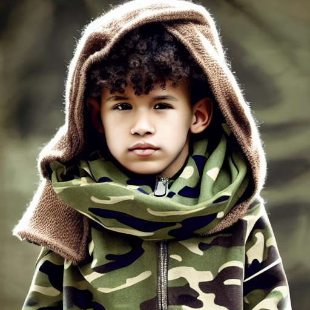
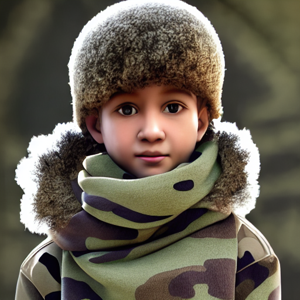
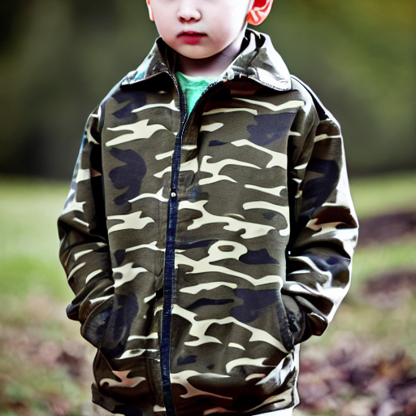
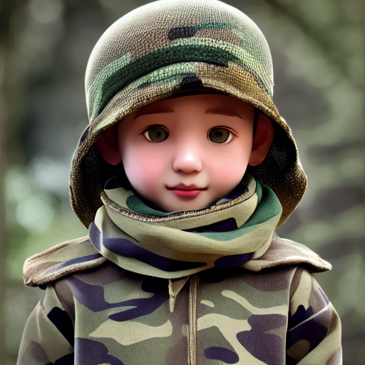

## 🔥SCEdit

SCEdit, proposed by Alibaba TongYi Vision Intelligence Lab, is an efficient generative fine-tuning framework. The framework not only supports fine-tuning capabilities for text-to-image downstream tasks, **saving 30%-50% of training memory overhead compared to LoRA**, achieving rapid transfer to specific generation scenarios; but it can also **directly extend to controllable image generation tasks, requiring only 7.9% of the parameter amount of ControlNet conditional generation and saving 30% of memory overhead**, supporting conditional generation tasks such as edge images, depth images, segmentation images, poses, color images, image inpainting, etc.

We used the 3D style data from the [Style Transfer Dataset](https://modelscope.cn/datasets/damo/style_custom_dataset/dataPeview) for training, and tested using the same `Prompt: A boy in a camouflage jacket with a scarf`. The specific qualitative and quantitative results are as follows:

| Method    | bs   | ep   | Target Module | Param. (M)    | Mem. (MiB) | 3D style                                                     |
| --------- | ---- | ---- | ------------- | ------------- | ---------- | ------------------------------------------------------------ |
| LoRA/r=64 | 1    | 50   | q/k/v/out/mlp | 23.94 (2.20%) | 8440MiB    |  |
| SCEdit    | 1    | 50   | up_blocks     | 19.68 (1.81%) | 7556MiB    |  |
| LoRA/r=64 | 10   | 100  | q/k/v/out/mlp | 23.94 (2.20%) | 26300MiB   |  |
| SCEdit    | 10   | 100  | up_blocks     | 19.68 (1.81%) | 18634MiB   |  |
| LoRA/r=64 | 30   | 200  | q/k/v/out/mlp | 23.94 (2.20%) | 69554MiB   |  |
| SCEdit    | 30   | 200  | up_blocks     | 19.68 (1.81%) | 43350MiB   |  |

To perform the training task using SCEdit and reproduce the above results:

```shell
# First, follow the installation steps in the section below
cd examples/pytorch/multi_modal/notebook
python text_to_image_synthesis.py
```
