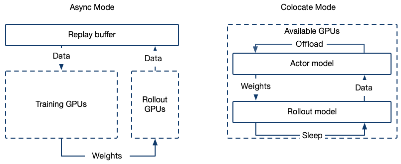

# GRPO
Paper Links

[DeepSeekMath: Pushing the Limits of Mathematical Reasoning in Open Language Models](https://arxiv.org/abs/2402.03300)
[DeepSeek-R1: Incentivizing Reasoning Capability in LLMs via Reinforcement Learning](https://arxiv.org/abs/2501.12948)

environments

```bash
pip install math_verify # reward function
pip install -U trl
```
The GRPOTrainer has been refactored in swift 3.5.dev. If you are using a version of Swift < 3.5 , please refer to the[stable doc](https://github.com/modelscope/ms-swift/blob/v3.4.1/docs/source_en/Instruction/GRPO.md)

**Dev Log**
- **2025-05-23** — Added support for custom sampling batch size (see parameters: generation_batch_size / steps_per_generation).
- **2025-05-22** — swift rollout now supports the data_parallel_size parameter.
- **2025-05-16** - Implemented ref_model synchronization logic (see parameter: sync_ref_model).
- **2025-05-13** — The GRPOTrainer code has been refactored to improve code readability and maintainability. Internal mode now supports vLLM ≥ 0.8.
- **2025-05-11** — Implemented support for the **Generative Reward Model** and enabled customized reward model processing logic through the reward plugin. For more details, refer to the [Customized Reward Models](#customized-reward-models) section.
- **2025-04-30** — The startup command for the external vLLM server has been changed to swift rollout.

**FAQ**
1. It is normal for the loss to approach zero during training. Refer to this [issue](https://github.com/huggingface/open-r1/issues/239#issuecomment-2646297851) for more details.
2. How to calculate the training steps? Refer to this [issue](https://github.com/modelscope/ms-swift/issues/3912) for more details.
3. Why is the clip_ratio always 1? Refer to this [issue](https://github.com/huggingface/open-r1/issues/239#issuecomment-2646297851) for more details.


## Cluster Support



The GRPO training framework supports the integration of high-performance inference engines (such as vLLM) to accelerate the sampling process, offering the following two deployment modes:

### 1. Colocate(Internal) Mode

Training and inference share GPU resources; the inference service is started internally within the Trainer.

Launch Parameters
```bash
--use_vllm true \
--vllm_mode colocate
```

#### Memory Optimization Strategies in Colocate Mode
When running in Colocate Mode , out-of-memory (OOM) errors are common due to simultaneous training and inference workloads. Below are effective memory optimization strategies and configuration parameters:

1. Release vLLM memory during training:

```bash
--sleep_level 1
```

2. Offload training model and optimizer memory during vLLM inference:

```bash
--offload_optimizer true \
--offload_model true \
--gc_collect_after_offload true
```

3. Use Tensor Parallelism in vLLM:

```bash
--vllm_tensor_parallel_size [tp_size]
```

4. Batched gathering of model weights (when synchronizing vLLM weights under ZeRO-3):

```bash
--move_model_batches [number_of_batches]
```


### 2. Async(External) Mode

Training and inference use separate resources; a dedicated inference server is launched externally.

Deploy the vLLM server using the swift rollout command. Currently, only the vLLM backend is supported:

```bash
CUDA_VISIBLE_DEVICES=0 \
swift rollout \
  --model Qwen/Qwen2.5-VL-7B-Instruct \
  --tensor_parallel_size 2 \
  --data_parallel_size 1

CUDA_VISIBLE_DEVICES=0,1 \
swift rollout \
  --model Qwen/Qwen2.5-VL-7B-Instruct \
  --tensor_parallel_size 2 \
  --data_parallel_size 1

CUDA_VISIBLE_DEVICES=0,1,2,3 \
swift rollout \
  --model Qwen/Qwen2.5-VL-7B-Instruct \
  --tensor_parallel_size 2 \
  --data_parallel_size 2
```

For more vLLM parameters, you can refer to [vLLM arguments](./Command-line-parameters.md#vllm-arguments)

Use the following parameters in training to connect to an external vLLM server:

```bash
--use_vllm true \
--vllm_mode server \
--vllm_server_host <Server IP> \
--vllm_server_port <Server Port> \
--vllm_server_timeout <Timeout> \
```

## Reward Functions
### Custom Reward Functions
A reward function takes the text `completions` generated by a model and other columns from the dataset as parameters(kwargs), and scores the model's generated text. Below is an example that demonstrates how to implement a simple length-based reward function. This function will give a reward signal of 1.0 if the length of the generated text exceeds 1024; otherwise, the reward signal will be 0.0.

```python
from swift.plugin import ORM, orms

class DummyLengthRewardFunction(ORM):
    def __call__(self, completions, **kwargs):
        return [1.0 if len(completion) > 1024 else 0.0 for completion in completions]

orms['dummy']= DummyLengthRewardFunction
```
You can add this reward function in `swift/examples/train/grpo/plugin/plugin.py` and register it using the parameter `--external_plugins examples/train/grpo/plugin/plugin.py`, then specify it using the reward_funcs parameter.

For an example of how to execute the script, refer to [here](https://github.com/modelscope/ms-swift/tree/main/examples/train/grpo/plugin/run_external_reward_func.sh).


### Built-in Reward Functions
Swift provides five rule-based reward functions built into the system(The code can be found in swift/plugin/orm.py.)


| Reward Function       | Paper                                                                 |
|----------------|----------------------------------------------------------------------------|
| accuracy       | [DeepSeek-R1: Incentivizing Reasoning Capability in LLMs via RL](https://arxiv.org/abs/2501.12948) |
| format         | Same as above                                                                        |
| cosine         | [Demystifying Long Chain-of-Thought Reasoning in LLMs](https://arxiv.org/abs/2502.03373) |
| repetition     | Same as above                                                                        |
| soft_overlong  | [Decoupled Clip and Dynamic sAmpling Policy Optimization (DAPO)](https://arxiv.org/abs/2503.14476)    |

#### 1. **accuracy**

This function compares the model's generated result with the solution column in the dataset to calculate an accuracy score. If the generated result matches the standard answer, the score is 1.0; otherwise, it is 0.0.

Note: This reward function uses the math_verify library to parse the generated results and the answers in the solution, and it may only be applicable to specific mathematical datasets.

#### 2. **format**

The paper uses the following system prompt to enforce a fixed format for model responses:
```
A conversation between User and Assistant. The user asks a question, and the Assistant solves it. The assistant first thinks about the reasoning process in the mind and then provides the user with the answer. The reasoning process and answer are enclosed within <think>
```
This function checks whether the model generates text in the format `<think>think content</think><answer>answer content</answer>`. If the generated text adheres to the format requirements, the score is 1.0; otherwise, it is 0.0.

#### 3. **cosine**

The paper found that training with only the accuracy reward function could lead to overly long generated sequences, affecting training performance. The cosine reward function optimizes the training process by controlling the length of the generated sequences:

- For text that generates the correct answer, the reward value decreases as the length increases, encouraging concise responses.
- For text that generates incorrect answers, the reward value increases as the length increases, encouraging deeper reasoning.

A cosine function is used to smoothly adjust the reward value, ensuring that the changes are within a reasonable range. The parameters for the cosine function include the length of the generated text, the maximum length limit, and the minimum and maximum reward values.

Parameters:
- cosine_min_len_value_wrong (default: -0.5): Reward value corresponding to the minimum length when the answer is incorrect.
- cosine_max_len_value_wrong (default: 0.0): Reward value corresponding to the maximum length when the answer is incorrect.
- cosine_min_len_value_correct (default: 1.0): Reward value corresponding to the minimum length when the answer is correct.
- cosine_max_len_value_correct (default: 0.5): Reward value corresponding to the maximum length when the answer is correct.
- cosine_max_len (default value equal to the model's maximum generation capacity): Maximum length limit for generated text.

#### 4. **repetition**

This function penalizes repetition in generated text by detecting repeated n-gram patterns and assigning penalties based on the level of repetition.

The function splits the generated text into words and extracts n-grams of a specified size (default is 3-gram). It calculates the repetition ratio based on the proportion of unique n-grams to the total number of n-grams. If the proportion of repeated n-grams is high, a significant negative reward (penalty) is applied. The penalty value is computed based on the repetition ratio and a maximum penalty value (default: -1.0).

Parameters:
- repetition_n_grams (default: 3): Size of the n-gram used to detect repetition.
- repetition_max_penalty (default: -1.0): Maximum penalty value, which controls the intensity of the penalty.

#### 5. **soft overlong punishment**
Define the length penalty interval. Within this interval, a linear penalty of [-1, 0] is applied.

Parameters:
- soft_max_length: L_max in the paper, the maximum generation length of the model, default is equal to max_completion_length.
- soft_cache_length: L_cache in the paper, controls the length penalty interval, which is defined as [soft_max_length - soft_cache_length, soft_max_length].

Original text from the paper:
> a length-aware penalty mechanism designed to shape the reward for truncated samples. Specifically, when the response length exceeds the predefined maximum value, we define a punishment interval. Within this interval, the longer the response, the greater the punishment it receives. This penalty is added to the original rule-based correctness reward, thereby signaling to the model to avoid excessively long responses.

#### 6. **Reward Models**

In addition to rule-based reward functions, this framework also supports using reward models as reward functions. When using a reward model, you need to specify the `reward_model` parameter, similar to the `model` parameter, which is used to specify the path or name of the reward model. Note that either `reward_model` or `reward_funcs` needs to be specified.


## Arguments and Execution Script
Arguments
- per_device_train_batch_size: The training batch size per device. In GRPO, this refers to the batch size of completions during training.
- per_device_eval_batch_size: The evaluation batch size per device. In GRPO, this refers to the batch size of completions during evaluation.
- generation_batch_size: Batch size to use for generation. It defaults to the effective training batch size: per_device_train_batch_size * num_processes * gradient_accumulation_steps`
- steps_per_generation: Number of optimization steps per generation. It defaults to gradient_accumulation_steps. This parameter and generation_batch_size cannot be set simultaneously
- num_generations: The number of samples for each prompt, referred to as the G value in the paper, needs to be divisible by per_device_batch_size * - gradient_accumulation_steps * num_processes, default is 8.
- max_completion_length: The maximum length for sampling generation, default is 512.
- ds3_gather_for_generation: This parameter applies to DeepSpeed ZeRO-3. If enabled, the policy model weights are gathered for generation, improving generation speed. However, disabling this option allows training models that exceed the VRAM capacity of a single GPU, albeit at the cost of slower generation. Disabling this option is not compatible with vLLM generation. The default is True.
- reward_funcs: Reward functions to score the results generated by the model. Includes built-in accuracy, format , cosine and repetition rule-based functions, detailed in the swift/plugin/orm.py file.
- reward_weights: Weights for each reward function. The number should be equal to the sum of the number of reward functions and reward models. If `None`, all rewards are weighted equally with weight `1.0`.
  - Note: If `--reward_model` is included in GRPO training, it is added to the end of the reward functions.
- reward_model: Same as the model, using a reward model as a reward function. At least one of reward_funcs and reward_model needs to be specified.
- reward_model_plugin: The logic for the reward model, which defaults to ORM logic. For more information, please refer to [Customized Reward Models](#customized-reward-models).
- dataset_shuffle: Whether to shuffle the dataset randomly. Default is True.
- loss_type: The type of loss normalization. Options are ['grpo', 'bnpo', 'dr_grpo'], default is 'grpo'. For details, see this [pr](https://github.com/huggingface/trl/pull/3256#discussion_r2033213348)
- log_completions: Whether to log the model-generated content during training, to be used in conjunction with `--report_to wandb`, default is False.
  - Note: If `--report_to wandb` is not set, a `completions.jsonl` will be created in the checkpoint to store the generated content.
- use_vllm: Whether to use vLLM as the infer_backend for GRPO generation, default is False.
- vllm_mode: Mode to use for vLLM integration when `use_vllm` is set to `True`. Must be one of `server` or `colocate`
- vllm_mode server parameter
  - vllm_server_host: The host address of the vLLM server. Default is None. This is used when connecting to an external vLLM server.
  - vllm_server_port: The service port of the vLLM server. Default is 8000.
  - vllm_server_timeout: The connection timeout for the vLLM server. Default is 120 seconds.
  - async_generate: Use async rollout to improve train speed. Note that rollout will use the model updated in the previous round when enabled. Multi-turn scenarios are not supported. Default is `false`.
- vllm_mode colocate parameter
  - vllm_gpu_memory_utilization: vLLM passthrough parameter, default is 0.9.
  - vllm_max_model_len: vLLM passthrough parameter, the total length limit of model, default is None.
  - vllm_enforce_eager: vLLM passthrough parameter, default is False.
  - vllm_limit_mm_per_prompt: vLLM passthrough parameter, default is None.
  - vllm_tensor_parallel_size: the tensor parallel size of vLLM engine, default is 1.
  - sleep_level: make vllm sleep when model is training. Options are 0 or 1, default is 0, no sleep
- num_iterations: number of iterations per batch. Default is 1.
- epsilon: epsilon value for clipping. Default is 0.2.
- epsilon_high: Upper clip coefficient, default is None. When set, it forms a clipping range of [epsilon, epsilon_high] together with epsilon.
- sync_ref_model: Whether to synchronize the reference model. Default is False。
  - ref_model_mixup_alpha: The Parameter controls the mix between the current policy and the previous reference policy during updates. The reference policy is updated according to the equation: $π_{ref} = α * π_θ + (1 - α) * π_{ref_{prev}}$. Default is 0.6.
  - ref_model_sync_steps：The parameter determines how frequently the current policy is synchronized with the reference policy. Default is 512.
- move_model_batches: When moving model parameters to fast inference frameworks such as vLLM, determines how many batches to divide the layers into. The default is `None`, which means the entire model is not split. Otherwise, the model is split into `move_model_batches + 1` (non-layer parameters) + `1` (multi-modal component parameters) batches.
- offload_optimizer: Whether to offload optimizer parameters during inference with vLLM. The default is `False`.
- offload_model: Whether to offload the model itself during inference with vLLM. The default is `False`.
- gc_collect_after_offload: Whether to perform garbage collection (both Python GC and GPU GC) after offloading. The default is `False`.
- multi_turn_func: The multi turn GRPO plugin name. Add your multi-turn implementation in plugin/multi_turn.py.
- completion_length_limit_scope: Specifies the scope of the `max_completion_length` limit in multi-turn conversations.
When set to `total`, the total output length across all turns must not exceed `max_completion_length`.
When set to `per_round`, each individual turn's output length is limited separately.
Defaults to `per_round`. Currently only takes effect in colocate mode.
- dynamic_sample: Exclude data within the group where the reward standard deviation is 0, and additionally sample new data. Default is False.
- max_resample_times: Under the dynamic_sample setting, limit the number of resampling attempts to a maximum of 3. Default is 3 times.
- overlong_filter: Skip overlong truncated samples, which will not be included in loss calculation. Default is False.
The hyperparameters for the reward function can be found in the [Built-in Reward Functions section](#built-in-reward-functions).

You can use vLLM as sampling backends to accelerate training.

For training scripts, refer to [here](https://github.com/modelscope/ms-swift/tree/main/examples/train/grpo).

## Customized Reward Models
By default, a reward model refers to classification models that include a value head (commonly known as Output Reward Model (ORM)). These models score the outputs of other models, producing a scalar value that represents the quality of the response.

Currently, we can leverage the **reward_model_plugin** to flexibly customize the processing logic of these reward models. This enables the implementation of advanced techniques such as Generative Reward Models, which include:

- Customizing the Model's System Prompt: Defining specific instructions and context to guide the evaluation process.
- Handling Model Interaction History: Managing the conversational context to provide meaningful and contextually aware evaluations.
- Defining Custom Evaluation Criteria: Setting unique standards and metrics for assessing the model's responses beyond default accuracy and relevance measures.

Through the **reward_model_plugin**, developers can tailor the reward evaluation process to meet the specific requirements of their applications. This flexibility allows for more nuanced and effective reward-based training strategies.

We provide a simple generative reward model example (GenRMPlugin) in [rm_plugin.py](https://github.com/modelscope/ms-swift/blob/main/swift/plugin/rm_plugin.py)

You can also customized your reward model plugin in [plugin.py](https://github.com/modelscope/ms-swift/blob/main/examples/train/grpo/plugin/plugin.py), and register with `external_plugins` argument

Here is an example training script to train GRPO with two reward models: one ORM and one Gen-RM (using qwen2.5-3B-Instruct in this case):

```
CUDA_VISIBLE_DEVICES=0,1,2,3,4,5,6,7 \
NPROC_PER_NODE=8 \
swift rlhf \
    --rlhf_type grpo \
    --model Qwen/Qwen2.5-7B \
    --dataset AI-MO/NuminaMath-TIR#5000 \
    --external_plugins examples/train/grpo/plugin/plugin.py \
    --reward_funcs format \
    --reward_model Qwen/Qwen2.5-3B-Instruct Shanghai_AI_Laboratory/internlm2-7b-reward \
    --reward_model_plugin genrm my_rmplugin \
    --reward_weights 0.1 1 1 \
    --vllm_gpu_memory_utilization 0.5 \
    --sleep_level 1 \
    --offload_model true \
    --offload_optimizer true \
    --gc_collect_after_offload true \
    --log_completions true \
    --deepspeed zero3
```

Notes:

1. In the GRPOTrainer, reward_model instances are appended sequentially to reward_funcs. Therefore, the order of reward_weights corresponds to [reward_funcs, reward_model].
2. The default value for reward_model_plugin is default, which uses the ORM processing logic.


## DAPO
Decoupled Clip and Dynamic Sampling Policy Optimization (DAPO) introduces several tricks based on GRPO, which are:
- Clip Higher
- Dynamic Sampling
- Overlong Filtering
- Token level Loss
- Soft Overlong Punishment

For the above tricks, we can achieve the desired setup based on GRPOTrainer by configuring the following parameters.

The token-level loss is implemented by using the loss type bnpo.


| Parameter                 | Type      | Value      |
|----------------------|-----------|-------------|
｜`--loss_type`        | `str`      | `bnpo`     |
| `--epsilon_high`     | `float`   | `0.28`      |
| `--dynamic_sample`   | `bool`    | `true`      |
| `--overlong_filter`  | `bool`    | `true`      |
| `--reward_funcs`     | `str`     | `soft_overlong`|
| `--max_resample_times` | `int`    | `3`        |


## FAQ
**1. Loss equals zero / close to zero / negative during training**

This is normal in certain cases.
See reference: [issue](https://github.com/huggingface/open-r1/issues/239 #issuecomment-2646297851)

**2. num_generations / Batch size calculation**

In GRPO, the batch size is defined in terms of completions (i.e., model generation outputs). For example, setting per_device_train_batch_size=8 means that each GPU processes 8 completions for loss computation during training.

During the training phase, the total batch size in a complete gradient accumulation batch is equal to:

```
effective_batch_size = num_processes * per_device_train_batch_size * gradient_accumulation_steps
```

During the sampling phase, the total batch size (completion-level) is equal to:

1. When generation_batch_size is set, it equals generation_batch_size.

2. When steps_per_generation is set, it equals steps_per_generation * total training batch size.

3. By default, it equals the total training batch size (i.e., num_processes * per_device_train_batch_size * gradient_accumulation_steps).

In the evaluation phase, the number of completions is equal to:

```
num_processes * per_device_eval_batch_size
```

The parameter num_generations must be divisible by the total batch size of the above sampling phase and evaluation to ensure that the generation tasks can be evenly distributed across the devices.

**Example**

num_processes = 8
per_device_train_batch_size = 4
gradient_accumulation_steps = 8
generation_batch_size = 512
num_generations = 64

1. The total amount of data (prompts) needed for sampling equals 512 / 64 = 8.
2. Each sampling produces 512 model responses.
3. The batch size for updating model weights is 8 * 4 * 8 = 256.


**3. Why does KL become NaN?**

After enabling overlong_filter, all completions on one GPU may have been truncated.

**4. How are the training steps calculated?**

See reference: [issue](https://github.com/modelscope/ms-swift/issues/3912)

**5. Why is clip_ratio always 1?**

When num_iterations = 1 and async_generate = False, it's on-policy RL, and old_policy is equal to policy.

See reference: [issue](https://github.com/huggingface/open-r1/issues/239#issuecomment-2646297851)


**6.Why is there still a validation process when val_dataset is not set? How can I disable it?**
When `val_dataset` is not explicitly passed in, the parameter `split_dataset_ratio` is responsible for splitting a portion of the dataset into a validation dataset, with a default split of 1% of the data.

You can disable the validation process by setting `--split_dataset_ratio 0`.
