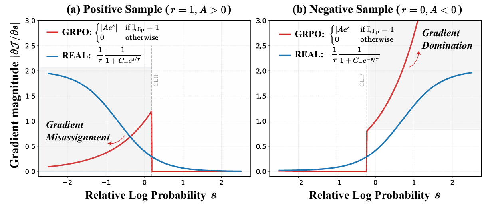
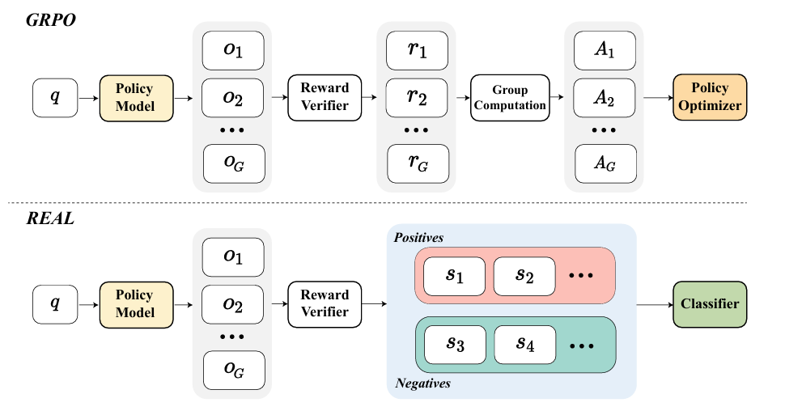

# Rewards as Labels: Revisiting RLVR from a Classification Perspective

**Version Requirement**：ms-swift>4.0

[Rewards as Labels: Revisiting RLVR from a Classification Perspective](https://arxiv.org/abs/2602.05630) proposes a reformulation of GRPO by treating rewards as labels and performing **in-group classification** instead of advantage estimation. This converts the policy optimization problem into a classification problem, thereby addressing two key issues in the GRPO loss:
- **Gradient Misassignment** for positive samples
- **Gradient Domination** for negative samples

## Background and Motivation

GRPO Objective

$$
J_{\mathrm{GRPO}}(\theta)=\mathbb{E}_{q,o\sim\pi_{\mathrm{od}}(\cdot|q)}\left[\frac{1}{|o|}\sum_{t=1}^{|o|}\left(\min\left(\rho_tA_t,\mathrm{clip}(\rho_t,1-\epsilon,1+\epsilon)A_t\right)\right)\right]
$$

where:
- $\rho_t = \frac{\pi_\theta(o_t|q)}{\pi_{\mathrm{old}}(o_t|q)}$ is the probability ratio
- $A_t$ is the advantage function

The corresponding gradient is:

$$
\nabla_{\theta} J_{\mathrm{GRPO}} = \mathbb { E } \left[ \frac { 1 } { | o | } \sum _ { t = 1 } ^ { | o | } \mathbb { I } _ { \mathrm { clip } } \cdot A _ { t } e ^ { s _ { t } } \nabla _ { \theta } \log \pi _ { \theta } \left( o _ { t } | q \right) \right]
$$

where:
- $s_t = \log \frac{\pi_\theta(o_t|q)}{\pi_{\mathrm{old}}(o_t|q)}$ is the relative log-probability
- $\mathbb{I}_{\mathrm{clip}}$ is the clipping indicator

Thus, the per-token gradient weight in GRPO is:

$$
|\mathcal{W}_{\mathrm{GRPO}}|=\left\{ \begin{array} {ll}\left|A\cdot e^s\right|, & \mathrm{if~}\mathbb{I}_{\mathrm{clip}}=1, \\ 0, & \text{otherwise.} \end{array}\right.
$$

1. **Gradient Misassignment (Positive Samples)**：
For positive samples, as the relative log-probability $s$ decreases, the gradient magnitude also decreases.
This is counterintuitive: tokens that the model is less confident about but correct should receive larger updates. However, GRPO assigns more weight to already confident tokens, causing under-trained tokens to receive insufficient learning signal.

2. **Gradient Domination (Negative Samples)**：
For negative samples, as $s$ decreases, the gradient magnitude increases exponentially.
This leads to a situation where a few overconfident incorrect tokens dominate the gradient, overwhelming other negative signals within the same group. Due to the absence of an upper bound, this may result in unstable and excessively large parameter updates.

To address the above issues, REAL treats rewards directly as labels and performs **group-wise classification training**.

The classification logit for each sample is defined as:

$$
\bar{s}^k=\frac{1}{|o^k|}\sum_{t=1}^{|o^k|}\left(\log\frac{\pi_\theta(o_t^k\mid q)}{\pi_{\mathrm{old}}(o_t^k\mid q)}\right)
$$

- $\bar{s}^k > 0$: The sample is more likely under the current policy than the old policy → the model tends to **promote** this sample
- $\bar{s}^k < 0$: The sample is less likely under the current policy → the model tends to **suppress** this sample

Loss Function

$$
\mathcal{L}_{REAL}=\log\left(1+\sum_{\mathcal{O}_+}e^{-\bar{s}^i/\tau}\right)+\log\left(1+\sum_{\mathcal{O}_-}e^{\bar{s}^j/\tau}\right)
$$

Gradient Properties

$$
|\mathcal{W}_{\mathrm{REAL}}|=
\begin{cases}
\frac{1}{\tau}\frac{1}{1+C_{+}e^{\bar{s}^{k}/\tau}}, & r=1 \\
 \\
\frac{1}{\tau}\frac{1}{1+C_{-}e^{-\bar{s}^{k}/\tau}}, & r=0 & & &
\end{cases}
$$

## Parameter Settings

| Parameter | Type | Default | Description                                                        |
|-----------|------|---------|--------------------------------------------------------------------|
| `--loss_type` | `str` | -       | Set to `real`                                                      |
| `--real_tau` | `float` | `0.5`   | Temperature parameter controlling decision boundary sharpness |

Training Script Reference

[swift](https://github.com/modelscope/ms-swift/tree/main/examples/train/grpo/internal/real.sh)

## Important Notes

When configuring training parameters, ensure that:
- `per_device_train_batch_size` is divisible by `num_generations`

This guarantees that each training batch contains complete groups, which is required for correct in-group classification.
