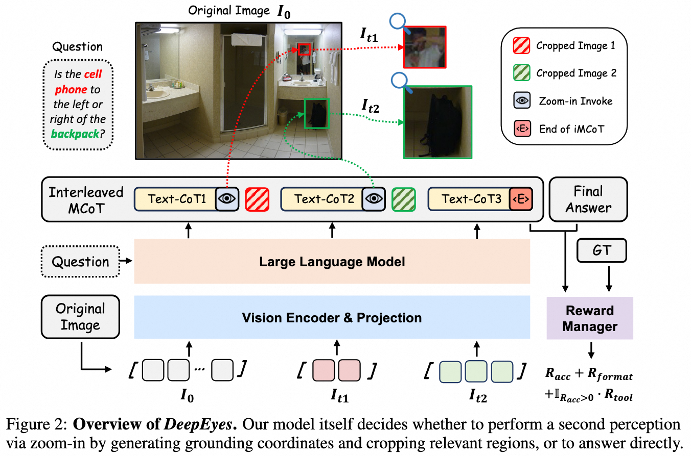

# DeepEyes: Incentivizing "Thinking with Images" via Reinforcement Learning

**Version Requirement**: ms-swift>=3.7

## Principle Introduction

The [DeepEyes paper](https://arxiv.org/abs/2505.14362) proposes a method that enables models to "think with images" (image-assisted reasoning) by leveraging reinforcement learning. This approach achieves emergent model capabilities through end-to-end reinforcement learning, without requiring additional SFT (Supervised Fine-Tuning) steps. The model is equipped with built-in image localization capabilities and can actively invoke an "image zoom-in tool": during inference, the model automatically selects specific regions within an image for zooming and cropping, and then chains the processed region information into downstream reasoning, thus achieving multi-step visual-text reasoning.



## Best Practices

**Dataset Download and Registration**

Download the official DeepEyes training datasets locally:
```bash
# modelscope
modelscope download --dataset Lixiang/ChenShawn-DeepEyes-Datasets-47k

# huggingface
huggingface-cli download ChenShawn/DeepEyes-Datasets-47k --repo-type=dataset
```

There are three parquet files in the dataset. Register them in the `swift/swift/llm/dataset/data/dataset_info.json` file. For each, rename the `prompt` column to `messages`:

```json
    {
        "ms_dataset_id": "path/to/data_0.1.2_visual_toolbox_v2.parquet",
        "columns": {
            "prompt": "messages"
        }
    },
    {
        "ms_dataset_id": "path/to/data/data_thinklite_reasoning_acc.parquet",
        "columns": {
            "prompt": "messages"
        }
    },
    {
        "ms_dataset_id": "path/to/data/data_v0.8_visual_toolbox_v2.parquet",
        "columns": {
            "prompt": "messages"
        }
    }
```

For registering the reward function and tool call logic locally as used in the paper, you can refer to the [DeepEyes implementation example](https://github.com/modelscope/ms-swift/tree/main/examples/train/grpo/plugin/deepeyes/deepeyes_plugin.py).

**Deploying the Evaluation Model**

The reward function in DeepEyes relies on a generative reward model to compare model outputs with ground-truth answers. For efficiency, it is recommended to deploy the reward model as a service.

Assuming you use the Qwen2.5-VL-72B-Instruct model for evaluation, refer to the following deployment command:

```bash
# 4*80G
CUDA_VISIBLE_DEVICES=0,1,2,3 \
swift deploy \
    --model Qwen/Qwen2.5-VL-72B-Instruct \
    --infer_backend vllm \
    --vllm_tensor_parallel_size 4 \
```

In the plugin file, you can use the OpenAI interface to call the model; see the [Reward Model documentation](../DeveloperGuide/reward_model.md#external-deployment).

The complete training script can be found at https://github.com/modelscope/ms-swift/tree/main/examples/train/grpo/plugin/deepeyes/deepeyes.sh

## Implementation Details

The [DeepEyes implementation example](https://github.com/modelscope/ms-swift/tree/main/examples/train/grpo/plugin/deepeyes/deepeyes_plugin.py), which references the [official implementation](https://github.com/Visual-Agent/DeepEyes/blob/main/verl/utils/reward_score/vl_agent.py), provides sample code for a DeepEyes training plugin, covering the logic of the reward function and multi-turn interaction calls.

**Dataset Info** is shown below:

| Dataset File Name                        | data_source           | Scoring Function                  | Tool Call              |
|------------------------------------------|-----------------------|-----------------------------------|------------------------|
| data_v0.8_visual_toolbox_v2.parquet      | chart                 | vl_agent.compute_score            | True (image_zoom_in_tool)   |
| data_0.1.2_visual_toolbox_v2.parquet     | vstar                 | vl_agent.compute_score            | True (image_zoom_in_tool)   |
| data_thinklite_reasoning_acc.parquet     | thinklite_eureka      | vl_agent.compute_score_math       | False                  |

**Note**: When processing image inputs, multimodal large models may perform preprocessing (such as cropping or resizing limited by the `max_pixels` parameter). When using the image zoom-in tool (`image_zoom_in_tool`), the model will output the cropped bbox based on the input image. Therefore, it is necessary to ensure the image fed into the tool has already been preprocessed. The following example shows how this is implemented in the Qwen2.5-VL series:

```python
from qwen_vl_utils import fetch_image
# At this point, images have not yet been preprocessed
infer_request.images
# Load as PIL.Image and apply cropping (same as using the MAX_PIXELS environment variable)
img = fetch_image({'image': load_pil_image(infer_request.images[0])})
```

**Tool Reward**

According to the paper, if the final answer is correct and the trajectory uses at least one tool, a tool reward is given. To prevent the model from generating invalid tool calls, we determine this based on the number of images, not just on the presence of `<tool_call>` tokens.
```python
tool_reward = 1.0 if num_image > 1 and acc_reward > 0.5 else 0.0
```
