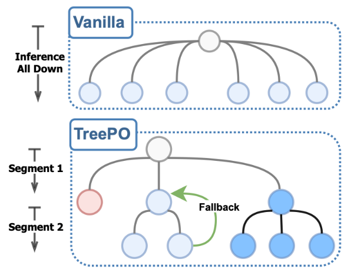

# TreePO: Bridging the Gap of Policy Optimization and Efficacy and Inference Efficiency with Heuristic Tree-based Modeling

**Version Requirement**: ms-swift>=3.11

Author: [li2zhi](https://github.com/li2zhi)

## Principle Introduction
[TreePO paper](https://arxiv.org/abs/2508.17445) proposes a tree-structured modeling method. This method organizes sequence generation into a segmented tree structure search. Through dynamic branching, backtracking, and early termination mechanisms, it significantly improves the reuse rate of the key-value cache, thereby reducing computational overhead, while maintaining or even enhancing the diversity of exploration.

## Implementation Details
[TreePO implementation example](https://github.com/modelscope/ms-swift/tree/main/examples/train/grpo/plugin/treepo/tree_rollout_plugin.py), which references the [official implementation](https://github.com/multimodal-art-projection/TreePO/blob/main/recipe/treepo/vllm_rollout_tree.py) provides sample code for a TreePO training plugin，covering logic related to multi-round interactions, termination judgment, and branch rollback.

**Note:** In actual use, you need to rewrite the logic of methods such as step and check_finished according to your own scenario requirements to ensure that they can execute as expected in the custom scenario.
For information on the design and use of custom rewards, you can refer to the implementation of [DeepEyes](https://github.com/modelscope/ms-swift/tree/main/examples/train/grpo/plugin/deepeyes/deepeyes_plugin.py).

The complete training script can be found at [script](https://github.com/modelscope/ms-swift/tree/main/examples/train/grpo/plugin/treepo/tree_rollout.sh).

## Test Data
> model: Qwen/Qwen2.5-0.5B
> dataset: AI-MO/NuminaMath-TIR
> subset size: 1,000 samples
> 1 GPU for training, 1 GPU for inference

| \                       | batch_size | num_generation | max_tree_depth | global_step | total inference calls | saving ratio | train_speed(iter/s) | improvement rate |
| ----------------------- | ---------- | -------------- | -------------- | ----------- | --------------------- | ------------ | ------------------- | ---------------- |
| original implementation | 8          | 8              | 4              | 200         | 5965                  | 0.00%        | 0.292436            | 0.00%            |
| tree(max_divergence=3)  | 8          | 8              | 4              | 200         | 3678                  | 38.34%       | 0.31819             | 8.81%            |
|                         |            |                |                |             |                       |              |                     |                  |
| original implementation | 8          | 8              | 5              | 105         | 4312                  | 0.00%        | 0.261324            | 0.00%            |
| tree(max_divergence=2)  | 8          | 8              | 5              | 105         | 2513                  | 52.69%       | 0.336639            | 28.82%           |
| tree(max_divergence=3)  | 8          | 8              | 5              | 105         | 2990                  | 30.66%       | 0.308791            | 18.16%           |
|                         |            |                |                |             |                       |              |                     |                  |
| original implementation | 8          | 8              | 6              | 105         | 5202                  | 0.00%        | 0.24832             | 0.00%            |
| tree(max_divergence=2)  | 8          | 8              | 6              | 105         | 3348                  | 35.64%       | 0.27755             | 11.77%           |
| tree(max_divergence=3)  | 8          | 8              | 6              | 105         | 3888                  | 25.26%       | 0.272339            | 9.67%            |
