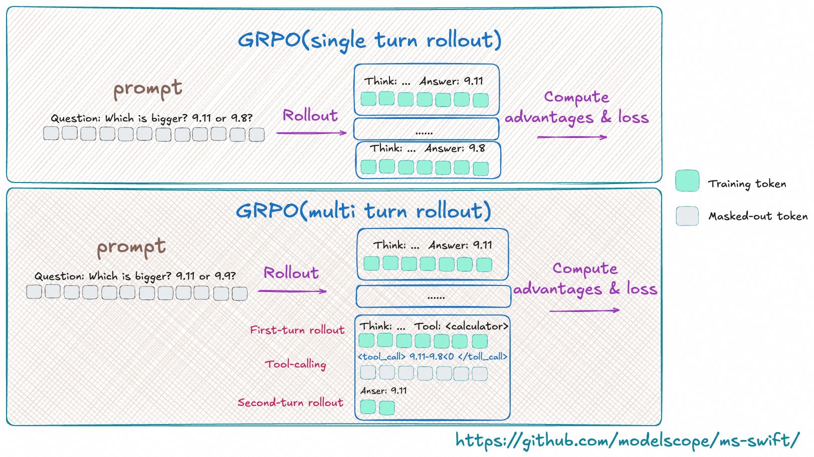

# Multi-turn Training

**Note** The multi-turn training logic was refactored in ms-swift 3.8.
If your ms-swift version is earlier than 3.8, please consult the documentation for that version.

In reinforcement-learning scenarios, the model may need to interact with the environment over multiple turns (e.g., tool calls).
This interactive training requires the model to carry out continuous reasoning based on the feedback from the environment.
This document explains in detail how to customise the multi-turn training workflow in GRPO training.

The figure below shows a typical multi-turn training process, where the model may perform several rollout rounds that include environment interaction, tool calls, and so on:



## MultiTurnScheduler

`MultiTurnScheduler` is an abstract base class that provides the default multi-turn dialogue-management logic.
Its workflow is illustrated below:


The scheduler is responsible for two core functions:
- **Termination check** — decide whether the current turn of inference should stop via `check_finished`.
- **Inference request construction** — build the request object for the next turn via `step`.

Key methods of the abstract base class `MultiTurnScheduler`:

```python
class MultiTurnScheduler(ABC):

    def __init__(self, max_turns: Optional[int] = None, *args, **kwargs):
        self.max_turns = max_turns

    def step(self, infer_request: 'RolloutInferRequest', response_choice: 'ChatCompletionResponseChoice',
             current_turn: int) -> Dict:
        """
        Handle the transition between dialogue turns.

        Args:
            infer_request: current inference request
            response_choice: response of the current turn
            current_turn: current turn index (starting from 1)

        Returns:
            Dict[str, Any]: a dict containing the result of this turn
                - infer_request (required): the inference request for the next turn
                - response_token_ids (optional): token IDs of each rollout response
                - response_loss_mask (optional): loss mask of each rollout response
                - rollout_infos (optional): extra information
        """
        raise NotImplementedError

    def check_finished(self, infer_request: 'RolloutInferRequest', response_choice: 'ChatCompletionResponseChoice',
                       current_turn: int) -> bool:
        """
        Default termination logic for multi-turn rollout.

        Termination conditions:
        1. The response is truncated (finish_reason == 'length').
        2. The dialogue reaches the maximum number of turns (if max_turns is set).

        Args:
            infer_request: the inference request
            response_choice: response choice containing finish_reason
            current_turn: current turn index

        Returns:
            bool: True to stop, False to continue
        """
        if response_choice.finish_reason == 'length':
            return True
        if self.max_turns and current_turn >= self.max_turns:
            return True
        return False
```

Arguments passed to `step` and `check_finished`:
- **infer_request**: current inference request
- **response_choice**: inference result of the current turn
- **current_turn**: current turn index (starting from 1)

<details><summary>Input example (click to expand)</summary>

```python
infer_request
"""
RolloutInferRequest(
    messages=[
        {'role': 'system', 'content': 'A conversation between User and Assistant. The user asks a question, and the Assistant solves it. The assistant first thinks about the reasoning process in the mind and then provides the user with the answer. The reasoning process and answer are enclosed within <think> </think> and <answer> </answer> tags, respectively, i.e., <think> reasoning process here </think><answer> answer here </answer>\n'}, {'role': 'user', 'content': 'What is the value of $\\sqrt{36 \\times \\sqrt{16}}$?'},
        {'role': 'assistant', 'content': 'To find the value of \\(\\sqrt{36 \\times \\sqrt{16}}\\), we will break down the problem step-by-step.\n\nFirst, we need to evaluate the inner square root:\n\\[\n\\sqrt{16}\n\\]\nWe know that:\n\\[\n4^2 = 16 \\implies \\sqrt{16} = 4\n\\]\n\nNext, we substitute this result back into the original expression:\n\\[\n\\sqrt{36 \\times \\sqrt{16}} = \\sqrt{36 \\times 4}\n\\]\n\nNow, we need to evaluate the product inside the square root:\n\\[\n36 \\times 4 = 144\n\\]\n\nSo, the expression simplifies to:\n\\[\n\\sqrt{144}\n\\]\n\nFinally, we determine the square root of 144:\n\\[\n\\sqrt{144} = 12\n\\]\n\nThus, the value of \\(\\sqrt{36 \\times \\sqrt{16}}\\) is:\n\\[\n\\boxed{12}\n\\]'}
    ],
    images=[],
    audios=[],
    videos=[],
    tools=None,
    objects={},
    data_dict={
        'problem': 'What is the value of $\\sqrt{36 \\times \\sqrt{16}}$?',
        'solution': "To solve the problem, we need to evaluate the expression \\(\\sqrt{36 \\times \\sqrt{16}}\\).\n\nWe can break down the steps as follows:\n\n1. Evaluate the inner square root: \\(\\sqrt{16}\\).\n2. Multiply the result by 36.\n3. Take the square root of the product obtained in step 2.\n\nLet's compute this step by step using Python code for accuracy.\n```python\nimport math\n\n# Step 1: Evaluate the inner square root\ninner_sqrt = math.sqrt(16)\n\n# Step 2: Multiply the result by 36\nproduct = 36 * inner_sqrt\n\n# Step 3: Take the square root of the product\nfinal_result = math.sqrt(product)\nprint(final_result)\n```\n```output\n12.0\n```\nThe value of \\(\\sqrt{36 \\times \\sqrt{16}}\\) is /\\(\\boxed{12}\\)."
        }
    )
"""
response_choice
"""
ChatCompletionResponseChoice(
    index=0,
    message=ChatMessage(
        role='assistant',
        content='To find the value of \\(\\sqrt{36 \\times \\sqrt{16}}\\), we will break down the problem step-by-step.\n\nFirst, we need to evaluate the inner square root:\n\\[\n\\sqrt{16}\n\\]\nWe know that:\n\\[\n4^2 = 16 \\implies \\sqrt{16} = 4\n\\]\n\nNext, we substitute this result back into the original expression:\n\\[\n\\sqrt{36 \\times \\sqrt{16}} = \\sqrt{36 \\times 4}\n\\]\n\nNow, we need to evaluate the product inside the square root:\n\\[\n36 \\times 4 = 144\n\\]\n\nSo, the expression simplifies to:\n\\[\n\\sqrt{144}\n\\]\n\nFinally, we determine the square root of 144:\n\\[\n\\sqrt{144} = 12\n\\]\n\nThus, the value of \\(\\sqrt{36 \\times \\sqrt{16}}\\) is:\n\\[\n\\boxed{12}\n\\]', tool_calls=None),
        finish_reason='stop',
        logprobs=None,
        messages=None)
"""
# response_choice.messages will be copied at the end of multi-turn inference.
```
</details>

<br>
<br>

The default `check_finished` logic stops inference in the following cases:
- The model reply is truncated, i.e. exceeds `max_completion_length`.
- The number of inference turns exceeds the specified maximum.

For the full default multi-turn rollout logic, see the `run` method of the class.
You can override `run` to implement a completely custom workflow.

## Setting multi-turn parameters

Specify the scheduler via `multi_turn_scheduler` in the `swift rollout` command:

```bash
swift rollout \
    --model Qwen/Qwen3-1.7B \
    --use_async_engine true \
    --multi_turn_scheduler thinking_tips_scheduler \
    --vllm_max_model_len 32768 \
    --vllm_gpu_memory_utilization 0.8 \
    --max_turns 3
```

> With the `external_plugins` argument you can register your own local scheduler with ms-swift.
> Refer to the [plugin code](https://github.com/modelscope/ms-swift/blob/main/examples/train/grpo/plugin/plugin.py).

A full multi-turn training script can be found [here](https://github.com/modelscope/ms-swift/blob/main/examples/train/grpo/external/vllm_multi_turn.sh).

For multi-turn rollout we use `AsyncEngine` to perform efficient batched asynchronous sampling.
AsyncEngine reduces compute bubbles in multi-turn inference:


Use the `use_async_engine` argument in the `rollout` command to specify the engine type (async is the default).

## Advanced topics

### Customising the interaction logic

In the default logic we treat the whole multi-turn rollout as one trajectory when computing the loss.
This assumes the model’s history is not modified during interaction.

In some scenarios you may need to dynamically change the history during rollout (e.g., compressing context).
In that case each turn should be treated as a separate trajectory.

A common scenario is for “thinking” models: during real inference the model keeps only the last reasoning step and discards previous ones.

For such cases override the `run` method in your scheduler to return the result for each rollout turn individually.
The built-in `ThinkingModelTipsScheduler` shows how to fully customise multi-turn inference by overriding `run()`.
See the implementation in [multi_turn.py](https://github.com/modelscope/ms-swift/blob/main/swift/plugin/multi_turn.py).

**NOTE**: In this scenario, the data for a single trajectory is split into multiple records. When computing rewards, you must assign the same reward to every record that belongs to the same trajectory.

The complete trajectory can be accessed via `trajectory_inputs` in `kwargs`.

For a concrete implementation, see the [MultiTurnThinkingTips class](https://github.com/modelscope/ms-swift/blob/main/examples/train/grpo/plugin/plugin.py)

### Multimodal Data Override
In multimodal, multi-turn interactions, you may need to dynamically add, delete, or modify multimodal data during the conversation and ensure these changes are synchronized to the trainer.

Implementation: Use `rollout_infos` to override the original multimodal content in the dataset by specifying the corresponding keys.

Supported override keys: images, audios, videos.

For details, see [DeepEyes Scheduler](https://github.com/modelscope/ms-swift/blob/main/examples/train/grpo/plugin/deepeyes/deepeyes_plugin.py#L403-L404).

### Returning response token IDs

In the default workflow the scheduler returns text, the trainer re-encodes it to token IDs for training.
To avoid this extra encoding, have the scheduler return `response_token_ids` directly.

Steps:

- Read the `token_ids` attribute from `response_choice` to obtain the sequence.
- Include `response_token_ids` in the dict returned by `step` / `run`; the trainer can then use them directly.

For a concrete implementation, refer to the [ThinkingModelTipsScheduler class](https://github.com/modelscope/ms-swift/blob/main/swift/plugin/multi_turn.py)

### Loss mask

When the environment or a tool call returns content that becomes part of the model response, you may want to mask it so the model is not penalised on externally generated tokens.

You can set the loss mask in two ways.

**1. Using `loss_scale`**

ms-swift provides the `loss_scale` parameter to scale or mask parts of the response.
For example, `--loss_scale last_round` zeroes out the loss for all but the last round.
Custom `loss_scale` can also be implemented; see the [customisation guide](../../../Customization/Pluginization.md#customizing-loss-scale).

> Note: In GRPO, `loss_scale` serves only as a mask; it does not scale the loss.

**2. Using `loss_mask`**

In `step` or `run`, set `response_loss_mask` to define a custom mask.
This requires returning `response_token_ids`; the mask must be the same length.
When `response_loss_mask` is provided, `loss_scale` is ignored.

For how to return response_loss_mask, see the [ToolCallScheduler class](https://github.com/modelscope/ms-swift/blob/main/examples/train/grpo/plugin/plugin.py)
### Reward-function related tips

**Accessing multi-turn rollout information in a reward function**

Return a `rollout_infos` object from `step` / `run`, then read it from `kwargs` in the reward function:

```python
class Scheduler():
    def step(self, infer_request: 'RolloutInferRequest', response_choice: 'ChatCompletionResponseChoice',
             current_turn: int) -> Dict:
        ...
        return {'infer_request': infer_request, 'rollout_infos': extra_dict}

class RewardFunction():
    def __call__(self, completions, **kwargs):
        infos = kwargs.get('rollout_infos', {})
        ...
```

### Accessing additional dataset information in scheduler

Set `--vllm_server_pass_dataset` on the training side to pass other dataset columns to the scheduler.
They can be read from `infer_request.data_dict`.
