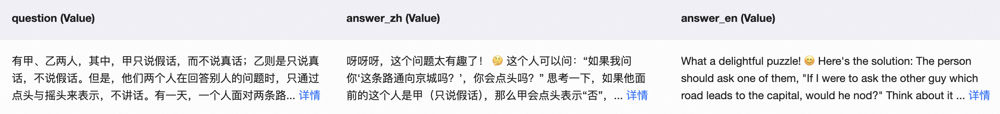
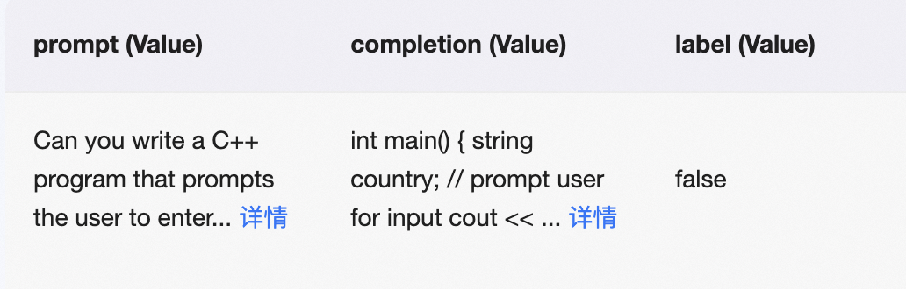

# RLHF

This document provides training scripts for various human preference alignment algorithms. If you want to learn more about the algorithms and how to choose them, please refer to the [documentation](https://github.com/modelscope/modelscope-classroom/blob/main/LLM-tutorial/M.%E4%BA%BA%E7%B1%BB%E5%81%8F%E5%A5%BD%E5%AF%B9%E9%BD%90%E8%AE%AD%E7%BB%83.md).

## Dataset
The data required by the PPO and GRPO algorithm consists solely of model inputs, which include the system prompt (optional) and the query. In the case of the GRPO algorithm, the reward function may require additional data columns. For example, to calculate accuracy, a `solution` column is needed as a reference answer.

For RM and DPO-type algorithms such as ORPO, CPO, and SimPO, $(x,y_w,y_l)$ formatted data is required, where $x$ is the model input, $y_w$ is the preferred answer that aligns with human preferences, and $y_l$ is the rejected answer that does not align with human preferences, as shown in .

In contrast, the KTO algorithm has a special data format that only requires $(x,y,\text{label})$, where $x$ is the model input, $y$ is the model output, and the label indicates whether the answer aligns with human preferences, as shown in .

For RLHF training of text models or multimodal large models using a custom dataset, you can refer to the [custom dataset documentation](../Customization/Custom-dataset.md#rlhf).

## GRPO
[Paper on arXiv](https://arxiv.org/abs/2402.03300)

Reference the training script [here](https://github.com/modelscope/ms-swift/tree/main/examples/train/grpo).

## DPO
[Paper on arXiv](https://arxiv.org/abs/2305.18290)

Hyperparameters:

- beta: KL regularization coefficient. A larger value imposes a stronger penalty for deviation from the reference model. Default is 0.1.

It is recommended to perform SFT training on the preferred answers from the preference dataset before starting DPO training to ensure the data meets the distribution requirements of the DPO algorithm.
We also mixed SFT loss into the DPO loss for stable training. You can adjust the coefficient of SFT loss with the hyperparameter `rpo_alpha`, which defaults to `1.`.

Reference the training script [here](https://github.com/modelscope/ms-swift/tree/main/examples/train/rlhf/dpo).

## RM
[Paper on arXiv](https://arxiv.org/abs/2203.02155)

Reward Modeling stage in RLHF.

Use the base model or instruct model trained with SFT as the foundation model. Add a value head and train it using the preference dataset to create the reward model.

The weights of the added value head will be saved in `value_head.safetensors` or `value_head.bin`.

Reference the training script [here](https://github.com/modelscope/ms-swift/tree/main/examples/train/rlhf/rm.sh).

## PPO
[Paper on arXiv](https://arxiv.org/abs/2203.02155)

PPO (proximal policy optimization) stage in RLHF involves four models:
- model: The training model, either the base model or the instruct model trained with SFT.
- ref_model: The reference model, which defaults to the model.
- reward_model: The reward model obtained from the RM stage.
- value_model: The value model initialized by the reward model, updated synchronously during training.

Hyperparameters:

- local_rollout_forward_batch_size: Batch size for each data sample, default is 64.
- whiten_rewards: Normalize rewards, default is False.
- kl_coef: Coefficient for the KL divergence term, default is 0.05.
- cliprange: Clip range in the PPO policy loss function, default is 0.2.
- vf_coef: Coefficient for the value loss function, default is 0.1.
- cliprange_value: Clip range in the PPO value loss function, default is 0.2.
- gamma: Discount factor for cumulative rewards, default is 1.0.
- lam: Lambda coefficient in [GAE](https://arxiv.org/abs/1506.02438), default is 0.95.
- num_sample_generations: Number of debugging samples generated during training, default is 10.

Note: When training the base model, perform SFT first and then proceed to RLHF. Specify the chat template, and it is recommended to use `full` for sft_type.

Refer to the [documentation](https://huggingface.co/docs/trl/ppov2_trainer#explanation-of-the-logged-metrics) for metric explanations during training.

## KTO
[Paper on arXiv](https://arxiv.org/abs/2402.01306)

Hyperparameters:

- beta: KL regularization coefficient. A larger value leads to a greater penalty for deviation from the reference model. Default is 0.1.
- desirable_weight: The $\lambda_D$ term in the loss function represents the loss weight for the preferred response samples, with a default value of 1.0.
- undesirable_weight: The $\lambda_U$ term in the loss function represents the loss weight for rejected samples, with a default value of 1.0.

Let $n_D$ and $n_U$ represent the number of preferred and rejected samples in the dataset, respectively. For hyperparameters $\lambda_D$ and $\lambda_U$, the authors recommend setting $\frac{\lambda_D n_D}{\lambda_U n_U} \in [1, \frac{4}{3}]$.

Training script:
Train using data in the $(x,y,\text{label})$ format.

Reference the training script [here](https://github.com/modelscope/ms-swift/tree/main/examples/train/rlhf/kto.sh).

## CPO
[Paper on arXiv](https://arxiv.org/abs/2401.08417)

Hyperparameters:

- beta: Coefficient before the implicit reward, default is 0.1.
- cpo_alpha: Coefficient for NLL loss, default is 1.0.

Reference the training script [here](https://github.com/modelscope/ms-swift/tree/main/examples/train/rlhf/cpo.sh).

## ORPO
[Paper on arXiv](https://arxiv.org/abs/2403.07691)

Hyperparameters:

- lambda: Odds Ratio loss coefficient.

Note: ORPO uses the parameter `--beta` to pass the hyperparameter `lambda`.

Reference the training script [here](https://github.com/modelscope/ms-swift/tree/main/examples/train/rlhf/orpo.sh).

## SimPO
[Paper on arXiv](https://arxiv.org/abs/2405.14734)

Hyperparameters:

- beta: Coefficient before the implicit reward, default is 2.0.
- simpo_gamma: Reward margin term, default is 1.0.
- cpo_alpha: The mixed CPO NLL loss for improving training stability; defaults to 1.0, set to 0.0 to use the original SimPO algorithm.

Reference the training script [here](https://github.com/modelscope/ms-swift/tree/main/examples/train/rlhf/simpo.sh).
