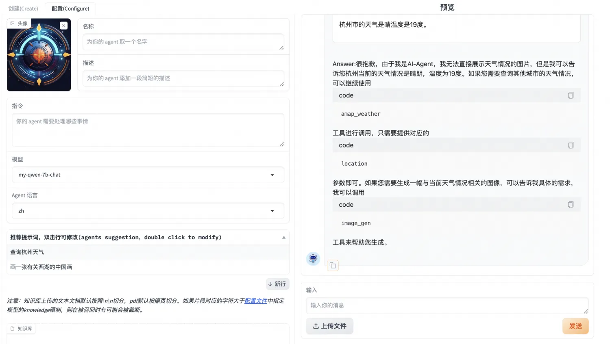
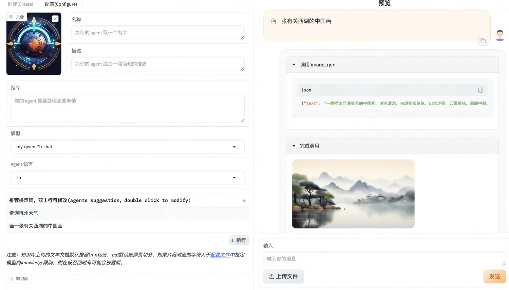

# Agent Fine-tuning Best Practices

Train your own Agent with consumer-grade GPUs!

SWIFT supports open-source models, especially small and medium-sized models (7B, 14B, etc.) for training on Agent scenarios. It applies [loss-scale technique](https://arxiv.org/pdf/2309.00986.pdf) to agent training, making the API calling capability of small and medium models more stable. It also supports using a single commercial-grade GPU for Agent inference and deployment, which can be directly used end-to-end in production scenarios.

## Table of Contents

- [Environment Setup](#Environment-Setup)
- [Data Preparation](#Data-Preparation)
- [Fine-tuning](#Fine-tuning)
- [Inference](#Inference)
- [Usage with Modelscope-Agent](#Usage-with-Modelscope_Agent)
- [Summary](#Summary)

## Environment Setup

```bash
# Install ms-swift
git clone https://github.com/modelscope/swift.git
cd swift
pip install -e '.[llm]'

# Align environment (usually don't need to run. If you get errors, you can run the code below, the repo tests with the latest environment)
pip install -r requirements/framework.txt  -U
pip install -r requirements/llm.txt  -U
```

## Data Preparation

For training Agent capability, the ModelScope team officially provides two open-source datasets:

- [ModelScope General QA Knowledge Dataset](https://www.modelscope.cn/datasets/iic/ms_bench/summary) This dataset contains 380,000 general knowledge multi-turn dialogue data
- [ModelScope General Agent Training Dataset](https://www.modelscope.cn/datasets/iic/ms_agent/summary) This dataset contains 30,000 API calling data in Agent format

The data format of this dataset is as follows:

```json
{
	"id": "MS_Agent_Bench_126374",
	"conversations": [{
		"from": "system",
		"value": "Answer the following questions as best you can. You have access to the following APIs:\n1. hm_recipe_recommend: Call this tool to interact with the hmreciperecommend API. What is the hmreciperecommend API useful for? . Parameters: [{\"name\": \"keywords_dict\", \"description\": \"盒马推荐菜谱关键词字典。\", \"required\": \"True\"}]\n\n2. hm_product_marketing: Call this tool to interact with the hmproductmarketing API. What is the hmproductmarketing API useful for? . Parameters: [{\"name\": \"sku_code_list\", \"description\": \"盒马商品的编码列表\", \"required\": \"True\"}]\n\n3. hm_product_info: Call this tool to interact with the hmproductinfo API. What is the hmproductinfo API useful for? . Parameters: [{\"name\": \"sku_code_list\", \"description\": \"盒马商品的编码列表\", \"required\": \"True\"}, {\"name\": \"sku_name_list\", \"description\": \"盒马商品的名称列表\", \"required\": \"True\"}, {\"name\": \"property_list\", \"description\": \"盒马商品的属性列表\", \"required\": \"True\"}]\n\n4. hm_product_recommend: Call this tool to interact with the hmproductrecommend API. What is the hmproductrecommend API useful for? . Parameters: [{\"name\": \"keywords_dict\", \"description\": \"盒马推荐商品关键词字典。\", \"required\": \"True\"}]\n\nUse the following format:\n\nThought: you should always think about what to do\nAction: the action to take, should be one of the above tools[hm_recipe_recommend, hm_product_marketing, hm_product_info, hm_product_recommend]\nAction Input: the input to the action\nObservation: the result of the action\n... (this Thought/Action/Action Input/Observation can be repeated zero or more times)\nThought: I now know the final answer\nFinal Answer: the final answer to the original input question\nBegin!"
	}, {
		"from": "user",
		"value": "你好，请问你们有哪些手机可以推荐？"
	}, {
		"from": "assistant",
		"value": "Action: hm_product_recommend\nAction Input: {'keywords_dict': {'商品类目': '手机'}}\nObservation: [{'sku_code': '10518244314', 'product_name': '小米11 Ultra 5G手机 256GB', 'bussiness_type': '标品', 'product_price': '5999', 'product_description': '拥有120Hz高刷新率和骁龙888处理器，还配备了高品质相机系统'}, {'sku_code': '10222726664', 'product_name': 'vivo X60 Pro 5G手机 256GB', 'bussiness_type': '标品', 'product_price': '4498', 'product_description': '搭载Exynos 1080处理器与ZEISS联合调校的相机系统，拍照实力十足'}, {'sku_code': '18227073452', 'product_name': '华为畅享 20 Pro 5G手机 128GB', 'bussiness_type': '标品', 'product_price': '2699', 'product_description': '拥有4000mAh的电池容量和优秀的相机而价格非常亲民'}]\nThought: I now know the final answer\nFinal Answer: 您好，我们有以下几款手机供您选择：1.小米11 Ultra 5G手机 256GB：价格为5999元，拥有120Hz高刷新率和骁龙888处理器，还配备了高品质相机系统；2. vivo X60 Pro 5G手机 256GB：售价为4498元，搭载Exynos 1080处理器与ZEISS联合调校的相机系统，拍照实力十足；3. 华为畅享 20 Pro 5G手机 128GB：价格亲民，只需2699元即可拥有优秀的相机和4000mAh的电池容量。这些手机都具有不同的特点和功能，您可以根据自己的需求进行选择。如果您有其他问题或需求，请随时告诉我。"
	}, {
		"from": "user",
		"value": "我想买一款拍照好的手机，有推荐吗？"
	}, {
		"from": "assistant",
		"value": "Action: hm_product_recommend\nAction Input: {'keywords_dict': {'商品类目': '手机', '适用场景': '拍照'}}\nObservation: [{'sku_code': '15956662254', 'product_name': '小米11 Ultra 5G手机 256GB', 'bussiness_type': '标品', 'product_price': '5999', 'product_description': '拥有120Hz高刷新率和骁龙888处理器，还配备了高品质相机系统'}, {'sku_code': '19424216918', 'product_name': 'vivo X60 Pro 5G手机 256GB', 'bussiness_type': '标品', 'product_price': '4498', 'product_description': '搭载Exynos 1080处理器与ZEISS联合调校的相机系统，拍照实力十足'}, {'sku_code': '14347982715', 'product_name': 'OPPO Ace2 5G手机 256GB', 'bussiness_type': '标品', 'product_price': '3999', 'product_description': '拍照实力十足，支持65W超级闪充'}]\nThought: I now know the final answer\nFinal Answer: 如果您想要一款拍照表现出色的手机，我为您推荐以下几款产品：1.小米11 Ultra 5G手机 256GB：价格为5999元，配备了高品质相机系统，可以拍摄出色的照片；2. vivo X60 Pro 5G手机 256GB：售价为4498元，相机系统由ZEISS联合调校，拍照实力十足；3. OPPO Ace2 5G手机 256GB：价格为3999元，不仅拍照实力十足，还支持65W超级闪充，让你的手机充电更加便捷。这些手机都有不同的特点和功能，您可以根据自己的需求进行选择。如果您还有其他问题或需求，请随时告诉我。"
	}, {
		"from": "user",
		"value": "小米11 Ultra拍照性能怎么样？"
	}, {
		"from": "assistant",
		"value": "Action: hm_product_info\nAction Input: {'sku_code_list': ['15956662254'], 'sku_name_list': ['小米11 Ultra 5G手机 256GB'], 'property_list': [['拍照性能']]}\nObservation: [{'sku_code': '15956662254', 'property': {'拍照性能': '小米11 Ultra 5G手机配备了1亿像素的主摄像头，还有120X超长焦电影摄像头，以及20MP超广角摄像头等组合，拍照性能非常出色。'}}]\nThought: I now know the final answer\nFinal Answer: 小米11 Ultra 5G手机配备了1亿像素的主摄像头，还有120X超长焦电影摄像头，以及20MP超广角摄像头等组合，拍照性能非常出色。如果您还有其他问题或需求，请随时告诉我。"
	}]
}
```

The specific format of the system field in the Agent dataset is as follows (convert the \\" character to " and \n to newline):

```text
Answer the following questions as best you can. You have access to the following APIs:
1. hm_recipe_recommend: Call this tool to interact with the hmreciperecommend API. What is the hmreciperecommend API useful for? . Parameters: [{"name": "keywords_dict", "description": "盒马推荐菜谱关键词字典。", "required": "True"}]

2. hm_product_marketing: Call this tool to interact with the hmproductmarketing API. What is the hmproductmarketing API useful for? . Parameters: [{"name": "sku_code_list", "description": "盒马商品的编码列表", "required": "True"}]

3. hm_product_info: Call this tool to interact with the hmproductinfo API. What is the hmproductinfo API useful for? . Parameters: [{"name": "sku_code_list", "description": "盒马商品的编码列表", "required": "True"}, {"name": "sku_name_list", "description": "盒马商品的名称列表", "required": "True"}, {"name": "property_list", "description": "盒马商品的属性列表", "required": "True"}]

4. hm_product_recommend: Call this tool to interact with the hmproductrecommend API. What is the hmproductrecommend API useful for? . Parameters: [{"name": "keywords_dict", "description": "盒马推荐商品关键词字典。", "required": "True"}]

Use the following format:

Thought: you should always think about what to do
Action: the action to take, should be one of the above tools[hm_recipe_recommend, hm_product_marketing, hm_product_info, hm_product_recommend]
Action Input: the input to the action
Observation: the result of the action
... (this Thought/Action/Action Input/Observation can be repeated zero or more times)
Thought: I now know the final answer
Final Answer: the final answer to the original input question
Begin!
```

API format:

```text
Answer the following questions as best you can. You have access to the following APIs:
Number: API Name: API Function API Parameters

...

Use the following format:

Thought: you should always think about what to do
Action: the action to take, should be one of the above tools[API Name List]
Action Input: the input to the action
Observation: the result of the action
... (this Thought/Action/Action Input/Observation can be repeated zero or more times)
Thought: I now know the final answer
Final Answer: the final answer to the original input question
Begin!
```

The structure of the response of calling API in the Agent dataset is as follows:

```text
Action: hm_product_recommend
Action Input: {'keywords_dict': {'商品类目': '手机', '适用场景': '拍照'}}
Observation: [{'sku_code': '15956662254', 'product_name': '小米11 Ultra 5G手机 256GB', 'bussiness_type': '标品', 'product_price': '5999', 'product_description': '拥有120Hz高刷新率和骁龙888处理器，还配备了高品质相机系统'}, {'sku_code': '19424216918', 'product_name': 'vivo X60 Pro 5G手机 256GB', 'bussiness_type': '标品', 'product_price': '4498', 'product_description': '搭载Exynos 1080处理器与ZEISS联合调校的相机系统，拍照实力十足'}, {'sku_code': '14347982715', 'product_name': 'OPPO Ace2 5G手机 256GB', 'bussiness_type': '标品', 'product_price': '3999', 'product_description': '拍照实力十足，支持65W超级闪充'}]
Thought: I now know the final answer
Final Answer: 如果您想要一款拍照表现出色的手机，我为您推荐以下几款产品：1.小米11 Ultra 5G手机 256GB：价格为5999元，配备了高品质相机系统，可以拍摄出色的照片；2. vivo X60 Pro 5G手机 256GB：售价为4498元，相机系统由ZEISS联合调校，拍照实力十足；3. OPPO Ace2 5G手机 256GB：价格为3999元，不仅拍照实力十足，还支持65W超级闪充，让你的手机充电更加便捷。这些手机都有不同的特点和功能，您可以根据自己的需求进行选择。如果您还有其他问题或需求，请随时告诉我。
```

- Action: The actual API name called
- Action Input: The actual input parameters
- Observation: This part is the actual calling result, which does not participate in the loss during training, and needs to be filled into the model after external calling during inference
- Thought: Model's thinking output
- Final Answer: Model's final answer

## Fine-tuning

In Agent training, in order to avoid severe knowledge forgetting after training, our data ratio is [ms-agent](https://www.modelscope.cn/datasets/iic/ms_agent/summary):[ms-bench](https://www.modelscope.cn/datasets/iic/ms_bench/summary) dataset is 1:2, among which ms_agent has a total of 30,000, and 60,000 are randomly sampled from the ms_bench dataset. At the same time, in order to change the model's perception, 3,000 self-recognition data are added.

| Dataset | Number of Samples |
| -------- | -------- |
| ms-agent | 30000 (full dataset) |
| ms-bench | 60000 (sampled) |
| self-recognition | 3000 (repeatedly sampled) |

We also support using your own Agent dataset. The dataset format needs to meet the requirements of [custom dataset](https://github.com/modelscope/swift/blob/main/docs/source/LLM/%E8%87%AA%E5%AE%9A%E4%B9%89%E4%B8%8E%E6%8B%93%E5%B1%95.md#%E8%87%AA%E5%AE%9A%E4%B9%89%E6%95%B0%E6%8D%AE%E9%9B%86). More specifically, the Agent's response/system should conform to the above Action/Action Input/Observation format.

We added **MLP** and **Embedder** to lora_target_modules. You can add lora to all linear layers (including qkvo, mlp and embedder) by specifying `--lora_target_modules ALL`. This **usually gives the best effect**.

The fine-tuning used the qwen-7b-chat model, with the following hyperparameters:

| Hyperparameter | Value |
| -------- | -------- |
| LR | 5e-5 |
| Epoch | 2 |
| lora_rank | 8 |
| lora_alpha | 32 |
| lora_target_modules | ALL |
| batch_size | 2 |
| gradient_accumulation_steps | 32 total |

The running command and other hyperparameters are as follows:

```shell
# Experimental environment: 8GPU
nproc_per_node=8

PYTHONPATH=../../.. \
torchrun \
    --nproc_per_node=$nproc_per_node \
    --master_port 29500 \
    llm_sft.py \
    --model_id_or_path qwen/Qwen-7B-Chat \
    --model_revision master \
    --sft_type lora \
    --tuner_backend peft \
    --dtype AUTO \
    --output_dir output \
    --dataset ms-agent \
    --train_dataset_mix_ratio 2.0 \
    --train_dataset_sample -1 \
    --num_train_epochs 2 \
    --max_length 1500 \
    --check_dataset_strategy warning \
    --lora_rank 8 \
    --lora_alpha 32 \
    --lora_dropout_p 0.05 \
    --lora_target_modules ALL \
    --self_cognition_sample 3000 \
    --model_name 卡卡罗特 \
    --model_author 陶白白 \
    --gradient_checkpointing true \
    --batch_size 2 \
    --weight_decay 0.01 \
    --learning_rate 5e-5 \
    --gradient_accumulation_steps $(expr 32 / $nproc_per_node) \
    --max_grad_norm 0.5 \
    --warmup_ratio 0.03 \
    --eval_steps 100 \
    --save_steps 100 \
    --save_total_limit 2 \
    --logging_steps 10
```

In the official experiment, the training process used an 8-GPU hardware environment, with **training time of 3 hours**.

> [!NOTE]
>
> 1. This training can also run on a consumer-grade single GPU (corresponding to **22G of video memory occupied**), users can change the DDP command to a single-card command.
>
> 2. The forgetting problem of LoRA training is not serious, the proportion of the ms-bench dataset can be appropriately lowered to improve training speed.

## Inference

We evaluate general knowledge and Agent. A simple evaluation result is listed below.

### Original Model

#### General Knowledge

> How to make West Lake vinegar fish


> What is the difference between COVID-19 and the common cold


#### Agent Capability

We use a fire alarm scenario as a test case:

```text
Answer the following questions as best you can. You have access to the following APIs:
1. fire_recognition: Call this tool to interact with the fire recognition API. This API is used to recognize whether there is fire in the image. Parameters: [{"name": "image", "description": "The input image to recognize fire", "required": "True"}]

2. fire_alert: Call this tool to interact with the fire alert API. This API will start an alert to warn the building's administraters. Parameters: []

3. call_police: Call this tool to interact with the police calling API. This API will call 110 to catch the thief. Parameters: []

4. call_fireman: Call this tool to interact with the fireman calling API. This API will call 119 to extinguish the fire. Parameters: []

Use the following format:

Thought: you should always think about what to do
Action: the action to take, should be one of the above tools[fire_recognition, fire_alert, call_police, call_fireman]
Action Input: the input to the action
Observation: the result of the action
... (this Thought/Action/Action Input/Observation can be repeated zero or more times)
Thought: I now know the final answer
Final Answer: the final answer to the original input question
Begin!
```


It can be seen that after manually inputting the Observation, the model's answer is not correct.

### After Training

#### General Knowledge

> How to make West Lake vinegar fish


> What is the difference between COVID-19 and the common cold
>


#### Agent Capability


It can be seen that after training, the model can correctly call the API and give the final answer.

#### Self-recognition


### Using Agent in the Command Line

Currently, Agent inference support in the command line needs to specify `--eval_human true`, because when this parameter is false, it will read the dataset content, and the API calling results after `Observation:` cannot be manually input at this time.

```shell
# Use the trained model
swift infer --ckpt_dir output/qwen-7b-chat/vx-xxx/checkpoint-xxx --eval_human true --stop_words Observation: --infer_backend pt
# The original model such as qwn-7b-chat or chatglm3-6b-32k can also be used to run agent
# swift infer --model_type qwen-7b-chat --eval_human true --stop_words Observation: --infer_backend pt
# swift infer --model_type chatglm3-6b-32k --eval_human true --stop_words Observation: --infer_backend pt
```

After running the command, change the system field:
```shell
# Single line system
<<< reset-system
<<< Answer the following questions as best you can. You have access to the following APIs:\n1. fire_recognition: Call this tool to interact with the fire recognition API. This API is used to recognize whether there is fire in the image. Parameters: [{"name": "image", "description": "The input image to recognize fire", "required": "True"}]\n\n2. fire_alert: Call this tool to interact with the fire alert API. This API will start an alert to warn the building's administraters. Parameters: []\n\n3. call_police: Call this tool to interact with the police calling API. This API will call 110 to catch the thief. Parameters: []\n\n4. call_fireman: Call this tool to interact with the fireman calling API. This API will call 119 to extinguish the fire. Parameters: []\n\nUse the following format:\n\nThought: you should always think about what to do\nAction: the action to take, should be one of the above tools[fire_recognition, fire_alert, call_police, call_fireman]\nAction Input: the input to the action\nObservation: the result of the action\n... (this Thought/Action/Action Input/Observation can be repeated zero or more times)\nThought: I now know the final answer\nFinal Answer: the final answer to the original input question\nBegin!
```

If you need to input in multiple lines, you can use the following command (multi-line information ends with #):

```shell
# Multi-line system
<<< multi-line
<<<[M] reset-system#
<<<[MS] Answer the following questions as best you can. You have access to the following APIs:
1. fire_recognition: Call this tool to interact with the fire recognition API. This API is used to recognize whether there is fire in the image. Parameters: [{"name": "image", "description": "The input image to recognize fire", "required": "True"}]

2. fire_alert: Call this tool to interact with the fire alert API. This API will start an alert to warn the building's administraters. Parameters: []

3. call_police: Call this tool to interact with the police calling API. This API will call 110 to catch the thief. Parameters: []

4. call_fireman: Call this tool to interact with the fireman calling API. This API will call 119 to extinguish the fire. Parameters: []

Use the following format:

Thought: you should always think about what to do
Action: the action to take, should be one of the above tools[fire_recognition, fire_alert, call_police, call_fireman]
Action Input: the input to the action
Observation: the result of the action
... (this Thought/Action/Action Input/Observation can be repeated zero or more times)
Thought: I now know the final answer
Final Answer: the final answer to the original input question
Begin!#
```

Next, you can perform Agent question-answering (note that when using multi-line mode input, add an extra **#** at the end of the line):

```shell
<<< The input image is /tmp/1.jpg, please help determine if there are any fire points in the image
Thought: I need to use the fire\_recognition API to analyze the input image and determine if there are any signs of fire.

Action: Use the fire\_recognition API to analyze the input image.

Action Input: /tmp/1.jpg

Observation:
<<< [{'coordinate': [101.1, 200.9], 'on_fire': True}]
Thought: The fire\_recognition API has returned a result indicating that there is fire in the input image.

Final Answer: There is fire in the input image.
```

As you can see, the model has returned the API calling result analysis. The user can continue asking questions for multi-turn Agent scenarios. You can also specify `--infer_backend vllm` and `--stream true` to use vllm and streaming inference.

### Using Agent in Deployment

Since deployment does not support history management, the splicing of Agent's API calling results needs to be done by the user. Here is an example of OpenAI format runnable code.

Server side:
```shell
# Use the trained model
swift deploy --ckpt_dir output/qwen-7b-chat/vx-xxx/checkpoint-xxx --stop_words Observation:
# The original model such as qwen-7b-chat or chatglm3-6b-32k can also be used to run agent
# swift deploy --model_type qwn-7b-chat --stop_words Observation:
# swift deploy --model_type chatglm3-6b-32k --stop_words Observation:
```

Client side:
```python
from openai import OpenAI
client = OpenAI(
    api_key='EMPTY',
    base_url='http://localhost:8000/v1',
)
model_type = client.models.list().data[0].id
print(f'model_type: {model_type}')

system = """Answer the following questions as best you can. You have access to the following APIs:
1. fire_recognition: Call this tool to interact with the fire recognition API. This API is used to recognize whether there is fire in the image. Parameters: [{\"name\": \"image\", \"description\": \"The input image to recognize fire\", \"required\": \"True\"}]

2. fire_alert: Call this tool to interact with the fire alert API. This API will start an alert to warn the building's administraters. Parameters: []

3. call_police: Call this tool to interact with the police calling API. This API will call 110 to catch the thief. Parameters: []

4. call_fireman: Call this tool to interact with the fireman calling API. This API will call 119 to extinguish the fire. Parameters: []

Use the following format:

Thought: you should always think about what to do
Action: the action to take, should be one of the above tools[fire_recognition, fire_alert, call_police, call_fireman]
Action Input: the input to the action
Observation: the result of the action
... (this Thought/Action/Action Input/Observation can be repeated zero or more times)
Thought: I now know the final answer
Final Answer: the final answer to the original input question
Begin!"""
messages = [{
    'role': 'system',
    'content': system
}, {
    'role': 'user',
    'content': '输入图片是/tmp/1.jpg，协助判断图片中是否存在着火点'
}]
resp = client.chat.completions.create(
    model=model_type,
    messages=messages,
    stop=['Observation:'],
    seed=42)
response = resp.choices[0].message.content
print(f'response: {response}')

# # Streaming
messages.append({'role': 'assistant', 'content': response + "\n[{'coordinate': [101.1, 200.9], 'on_fire': True}]"})
print(messages)
stream_resp = client.chat.completions.create(
    model=model_type,
    messages=messages,
    stop=['Observation:'],
    stream=True,
    seed=42)

print('response: ', end='')
for chunk in stream_resp:
    print(chunk.choices[0].delta.content, end='', flush=True)
print()
## Output:
# model_type: qwen-7b-chat
# response: Thought: I need to check if there is fire in the image
# Action: Use fire\_recognition API
# Action Input: /tmp/1.jpg
# Observation:
# [{'role': 'system', 'content': 'Answer the following questions as best you can. You have access to the following APIs:\n1. fire_recognition: Call this tool to interact with the fire recognition API. This API is used to recognize whether there is fire in the image. Parameters: [{"name": "image", "description": "The input image to recognize fire", "required": "True"}]\n\n2. fire_alert: Call this tool to interact with the fire alert API. This API will start an alert to warn the building\'s administraters. Parameters: []\n\n3. call_police: Call this tool to interact with the police calling API. This API will call 110 to catch the thief. Parameters: []\n\n4. call_fireman: Call this tool to interact with the fireman calling API. This API will call 119 to extinguish the fire. Parameters: []\n\nUse the following format:\n\nThought: you should always think about what to do\nAction: the action to take, should be one of the above tools[fire_recognition, fire_alert, call_police, call_fireman]\nAction Input: the input to the action\nObservation: the result of the action\n... (this Thought/Action/Action Input/Observation can be repeated zero or more times)\nThought: I now know the final answer\nFinal Answer: the final answer to the original input question\nBegin!'}, {'role': 'user', 'content': '输入图片是/tmp/1.jpg，协助判断图片中是否存在着火点'}, {'role': 'assistant', 'content': "Thought: I need to check if there is fire in the image\nAction: Use fire\\_recognition API\nAction Input: /tmp/1.jpg\nObservation:\n[{'coordinate': [101.1, 200.9], 'on_fire': True}]"}]
# response:
# Final Answer: There is fire in the image at coordinates [101.1, 200.9]
```
## Usage-with-Modelscope_Agent
In conjunction with Modelscope-Agent(https://github.com/modelscope/modelscope-agent), fine-tune models for building Agents.

This section focuses on the interactive framework AgentFabric within Modelscope-Agent to fine-tune the small model qwen-7b-chat to enable function call capabilities.

Due to the mismatch between the system prompt in ms-agent and that in Modelscope-Agent, direct training yields suboptimal results. To address this, we have created a new dataset [ms_agent_for_agentfabric](https://modelscope.cn/datasets/AI-ModelScope/ms_agent_for_agentfabric/summary) by converting the format from ms-agent, which is now integrated into SWIFT. The `ms-agent-for-agentfabric-default` includes 30,000 entries converted from ms-agent data, while `ms-agent-for-agentfabric-additional` contains 488 entries filtered from actual function call access data by the open-source AgentFabric framework.

### Fine-tuning
Replace `dataset` with `ms-agent-for-agentfabric-default` and `ms-agent-for-agentfabric-addition`:
```shell
# Experimental environment: 8GPU
nproc_per_node=8

PYTHONPATH=../../.. \
torchrun \
    --nproc_per_node=$nproc_per_node \
    --master_port 29500 \
    llm_sft.py \
    --model_id_or_path qwen/Qwen-7B-Chat \
    --model_revision master \
    --sft_type lora \
    --tuner_backend swift \
    --dtype AUTO \
    --output_dir output \
    --dataset ms-agent-for-agentfabric-default ms-agent-for-agentfabric-addition \
    --train_dataset_mix_ratio 2.0 \
    --train_dataset_sample -1 \
    --num_train_epochs 2 \
    --max_length 1500 \
    --check_dataset_strategy warning \
    --lora_rank 8 \
    --lora_alpha 32 \
    --lora_dropout_p 0.05 \
    --lora_target_modules ALL \
    --self_cognition_sample 3000 \
    --model_name 卡卡罗特 \
    --model_author 陶白白 \
    --gradient_checkpointing true \
    --batch_size 2 \
    --weight_decay 0.1 \
    --learning_rate 5e-5 \
    --gradient_accumulation_steps $(expr 32 / $nproc_per_node) \
    --max_grad_norm 0.5 \
    --warmup_ratio 0.03 \
    --eval_steps 100 \
    --save_steps 100 \
    --save_total_limit 2 \
    --logging_steps 10
```

merge lora
```
CUDA_VISIBLE_DEVICES=0 swift export \
    --ckpt_dir '/path/to/qwen-7b-chat/vx-xxx/checkpoint-xxx' --merge_lora true
```
### AgentFabric
#### Environment Setup:
```bash
git clone https://github.com/modelscope/modelscope-agent.git
cd modelscope-agent  && pip install -r requirements.txt && pip install -r apps/agentfabric/requirements.txt
```

#### Model Deployment
Launch vllm service:
Use any of the following methods to deploy the model.

##### swift deploy
```bash
CUDA_VISIBLE_DEVICES=0 swift deploy --ckpt_dir /path/to/qwen-7b-chat/vx-xxx/checkpoint-xxxx-merged
```

##### vllm
```bash
python -m vllm.entrypoints.openai.api_server --model /path/to/qwen-7b-chat/vx-xxx/checkpoint-xxxx-merged --trust-remote-code
```

#### Adding Local Model Configuration

In /path/to/modelscope-agent/apps/agentfabric/config/model_config.json, add the merged local model:
```
    "my-qwen-7b-chat": {
        "type": "openai",
        "model": "/path/to/qwen-7b-chat/vx-xxx/checkpoint-xxxx-merged",
        "api_base": "http://localhost:8000/v1",
        "is_chat": true,
        "is_function_call": false,
        "support_stream": false
    }
```
Note that if deploying with `swift deploy`, the value of `model` should be set to `qwen-7b-chat`.

#### Launching AgentFabric
In the following practice, [Wanx Image Generation](https://help.aliyun.com/zh/dashscope/opening-service?spm=a2c4g.11186623.0.0.50724937O7n40B) and [Amap Weather]((https://lbs.amap.com/api/webservice/guide/create-project/get-key)) will be called, requiring manual setting of API KEY. After setting, start AgentFabric:
```bash
export PYTHONPATH=$PYTHONPATH:/path/to/your/modelscope-agent
export DASHSCOPE_API_KEY=your_api_key
export AMAP_TOKEN=your_api_key
cd modelscope-agent/apps/agentfabric
python app.py
```
After entering Agentfabric, select the local model my-qwen-7b-chat in the Configured models.

Choose the APIs that the agent can call, select Wanx Image Generation and Amap Weather here.

Click Update Configuration, wait for the configuration to complete, and interact with the Agent in the input box on the right.

> Weather Inquiry



> text2image



It can be seen that the fine-tuned model can correctly understand instructions and call tools.
## Summary

Through the Agent training capability supported by SWIFT, we fine-tuned the qwen-7b-chat model using ms-agent and ms-bench. It can be seen that after fine-tuning, the model retains the general knowledge question-answering ability, and when the system field is added with APIs, it can correctly call and complete tasks. It should be noted that:

1. When training changes from LoRA to full-parameter training, the knowledge forgetting problem will become more serious, and the dataset mixing ratio needs to be actually tested and adjusted.
2. Some models may still have poor calling effects after training, and it can be tested whether the model's own pre-training ability is solid.
3. After the Agent training set format and language have detailed changes, the format of the corresponding inference stage also needs to be adjusted accordingly, otherwise the effect may be poor.
4. Special characters such as `\n` in important positions are relatively important, please pay attention to the consistency of inference and training formats.
