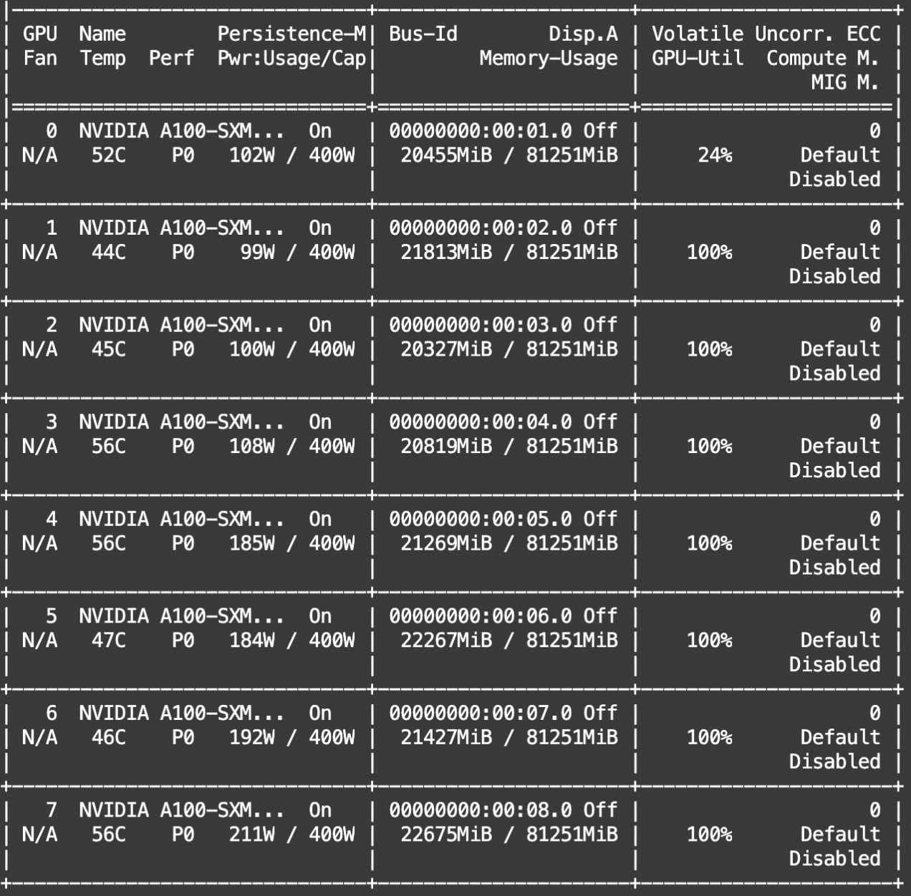
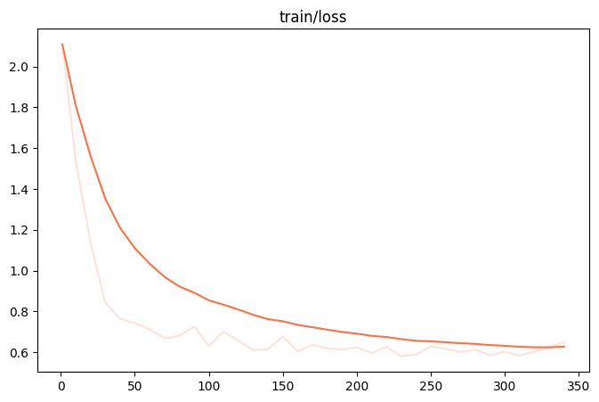
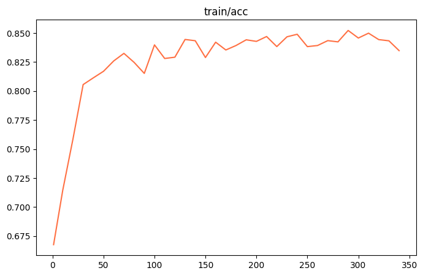

# Hands-on Training and Inference with Grok 300B 

This documentation introduces the process of finetuning and inferencing the Grok-MoE 300B model using an 8-GPU environment.

## Table of Contents
- [Environment Setup](#environment-setup)
- [Finetuning](#finetuning) 
- [Inference](#inference)

## Environment Setup
```shell 
git clone https://github.com/modelscope/swift.git
cd swift
pip install -e .[llm]
```

## Finetuning

### Experiment Environment

- GPU: 8 x A100 80G
- Docker Image: ModelScope official image version 1.13.1  
- peft: 0.10.0

### Dataset Preparation

Grok is a base model, so we used the [DuReader Question Generation dataset](https://www.modelscope.cn/datasets/modelscope/DuReader_robust-QG/summary) as the training set. This dataset contains around 15,000 examples. With a max-length of 512, there are about 10,000 training examples (average length 305±92 tokens).

### Model Preparation  

For the Grok model, we used the version provided by [ColossalAI](https://www.modelscope.cn/models/colossalai/grok-1-pytorch/summary), and additionally prepared a [tokenizer conforming to the transformers standard](https://www.modelscope.cn/models/AI-ModelScope/grok-1-tokenizer/summary).

### Training

Since the Grok model is too large, device_map and deepspeed zero3 non-offload are unable to run training. Therefore, in this experiment, we used the LoRA + deepspeed zero3 offload mode to run the training. The complete training script is as follows:

```shell
nproc_per_node=8

PYTHONPATH=../../.. \
torchrun \
    --nproc_per_node=$nproc_per_node \
    --master_port 29500 \
    llm_sft.py \
    --model_type grok-1 \
    --sft_type lora \
    --tuner_backend swift \
    --dtype bf16 \
    --output_dir output \
    --ddp_backend nccl \
    --dataset dureader-robust-zh \
    --train_dataset_sample -1 \
    --num_train_epochs 1 \
    --max_length 512 \
    --check_dataset_strategy warning \
    --lora_rank 8 \
    --lora_alpha 32 \
    --lora_dropout_p 0.05 \
    --lora_dtype bf16 \
    --lora_target_modules DEFAULT \
    --gradient_checkpointing true \
    --batch_size 2 \
    --weight_decay 0.1 \
    --learning_rate 1e-4 \
    --gradient_accumulation_steps $(expr 16 / $nproc_per_node) \
    --max_grad_norm 0.5 \
    --warmup_ratio 0.03 \
    --eval_steps 100 \
    --save_steps 100 \
    --save_total_limit 2 \
    --logging_steps 10 \
    --deepspeed_config_path scripts/grok-1/lora_ddp_ds/zero3.json \
    --save_only_model true \
```

This script requires a zero3.json file. The complete training files can be found [here](https://github.com/modelscope/swift/tree/main/examples/pytorch/llm/scripts/grok-1/lora_ddp_ds).

Here are some benchmarks from the training process:

| Metric        | Value                                                        |
|---------------|------------------------------------------------------------|
| GPU Memory Usage | 8 * 21G                                                    |
| Training Speed   | 45s/it                                                      |
| Total Iterations | 340 (10000(dataset_length)/16(gradient_accumulation)/2(batch_size)) |



Since the GPU memory usage is below 24G, training should theoretically be possible on RTX 3090/A10 environments.





The training took about 4 hours.

### Inference

The SWIFT framework currently does not support deepspeed inference, so we still use transformers' device_map for inference support. However, since the model is too large, some layers will be offloaded to the CPU, which will cause errors when loading LoRA during inference. Therefore, we patched the peft implementation (the original Linear module on the meta device does not affect LoRA, and dynamically move LoRA weights to the device during runtime).

The inference script is as follows:

```shell
PYTHONPATH=../../.. \
python llm_infer.py \
    --ckpt_dir output/grok-1/vx-xxx-xxx/checkpoint-xxx \
    --dtype bf16 \
    --load_dataset_config true \
    --max_new_tokens 64 \
    --do_sample true \
    --dtype bf16 \
    --eval_human false \
    --merge_lora false \
```

Inference result:

```text
[PROMPT]Task: Question Generation
Context: 这位朋友你好,女性出现妊娠反应一般是从6-12周左右,也就是女性怀孕1个多月就会开始出现反应,第3个月的时候,妊辰反应基本结束。 而大部分女性怀孕初期都会出现恶心、呕吐的感觉,这些症状都是因人而异的,除非恶心、呕吐的非常厉害,才需要就医,否则这些都是刚怀孕的的正常症状。1-3个月的时候可以观察一下自己的皮肤,一般女性怀孕初期可能会产生皮肤色素沉淀或是腹壁产生妊娠纹,特别是在怀孕的后期更加明显。 还有很多女性怀孕初期会出现疲倦、嗜睡的情况。怀孕三个月的时候,膀胱会受到日益胀大的子宫的压迫,容量会变小,所以怀孕期间也会有尿频的现象出现。月经停止也是刚怀孕最容易出现的症状,只要是平时月经正常的女性,在性行为后超过正常经期两周,就有可能是怀孕了。 如果你想判断自己是否怀孕,可以看看自己有没有这些反应。当然这也只是多数人的怀孕表现,也有部分女性怀孕表现并不完全是这样,如果你无法确定自己是否怀孕,最好去医院检查一下。
Answer: 6-12周
Question:[OUTPUT]怀孕几个月开始反应</s>

[LABELS]怀孕多久会有反应
--------------------------------------------------
[PROMPT]Task: Question Generation
Context: 这位朋友你好,女性出现妊娠反应一般是从6-12周左右,也就是女性怀孕1个多月就会开始出现反应,第3个月的时候,妊辰反应基本结束。 而大部分女性怀孕初期都会出现恶心、呕吐的感觉,这些症状都是因人而异的,除非恶心、呕吐的非常厉害,才需要就医,否则这些都是刚怀孕的的正常症状。1-3个月的时候可以观察一下自己的皮肤,一般女性怀孕初期可能会产生皮肤色素沉淀或是腹壁产生妊娠纹,特别是在怀孕的后期更加明显。 还有很多女性怀孕初期会出现疲倦、嗜睡的情况。怀孕三个月的时候,膀胱会受到日益胀大的子宫的压迫,容量会变小,所以怀孕期间也会有尿频的现象出现。月经停止也是刚怀孕最容易出现的症状,只要是平时月经正常的女性,在性行为后超过正常经期两周,就有可能是怀孕了。 如果你想判断自己是否怀孕,可以看看自己有没有这些反应。当然这也只是多数人的怀孕表现,也有部分女性怀孕表现并不完全是这样,如果你无法确定自己是否怀孕,最好去医院检查一下。
Answer: 6-12周左右
Question:[OUTPUT]怀孕几个月会有反应</s>

[LABELS]怀孕多久会有反应
--------------------------------------------------
[PROMPT]Task: Question Generation
Context: 【东奥会计在线——中级会计职称频道推荐】根据《关于提高科技型中小企业研究开发费用税前加计扣除比例的通知》的规定,研发费加计扣除比例提高到75%。|财政部、国家税务总局、科技部发布《关于提高科技型中小企业研究开发费用税前加计扣除比例的通知》。|通知称,为进一步激励中小企业加大研发投入,支持科技创新,就提高科技型中小企业研究开发费用(以下简称研发费用)税前加计扣除比例有关问题发布通知。|通知明确,科技型中小企业开展研发活动中实际发生的研发费用,未形成无形资产计入当期损益的,在按规定据实扣除的基础上,在2017年1月1日至2019年12月31日期间,再按照实际发生额的75%在税前加计扣除;形成无形资产的,在上述期间按照无形资产成本的175%在税前摊销。|科技型中小企业享受研发费用税前加计扣除政策的其他政策口径按照《财政部国家税务总局科技部关于完善研究开发费用税前加计扣除政策的通知》(财税〔2015〕119号)规定执行。|科技型中小企业条件和管理办法由科技部、财政部和国家税务总局另行发布。科技、财政和税务部门应建立信息共享机制,及时共享科技型中小企业的相关信息,加强协调配合,保障优惠政策落实到位。|上一篇文章:关于2016年度企业研究开发费用税前加计扣除政策企业所得税纳税申报问题的公告 下一篇文章:关于提高科技型中小企业研究开发费用税前加计扣除比例的通知
Answer: 75%
Question:[OUTPUT]研发费加计扣除比例</s>

[LABELS]研发费用加计扣除比例
--------------------------------------------------