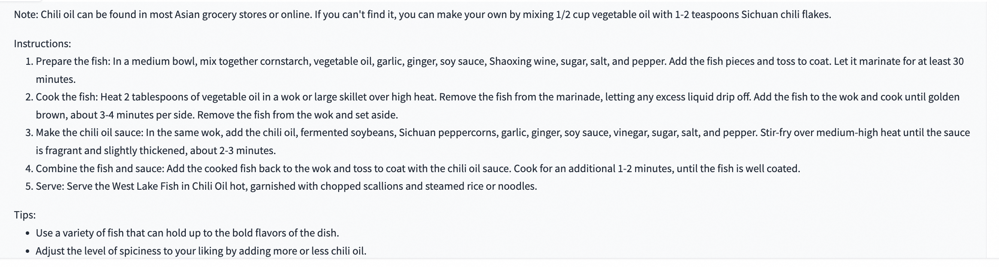

# Best Practices for ORPO Algorithm
The ORPO algorithm requires the same data format as DPO. Beyond SFT data [query, response], it additionally requires `rejected_response` to denote answers that the model should not generate.
The ORPO algorithm incorporates an odds ratio (OR) negative log-likelihood loss term into the loss function used during SFT training, to reduce the probability of generating rejected responses.
Here, the hyperparameter beta represents the coefficient for the OR loss term. The larger the beta, the greater the penalty on rejected_response, with a default value of 0.1.
This best practice session will train the llama3-8b-instruct model using the ORPO algorithm, enabling it to respond in Chinese.

Table of Contents
- [Environment Preparation](#environment-preparation)
- [Dataset](#dataset)
- [Training](#training)
- [Inference](#inference)

## Environment Preparation

```shell
# Install ms-swift
git clone https://github.com/modelscope/swift.git
cd swift
pip install -e '.[llm]'
# Environment alignment (usually no need to run. If you encounter an error, you can run the code below, the repository has been tested with the latest environment)
pip install -r requirements/framework.txt  -U
pip install -r requirements/llm.txt  -U
```
## Dataset
We use the [Llama3-DPO-zh-en-emoji](https://modelscope.cn/datasets/shareAI/shareAI-Llama3-DPO-zh-en-emoji/summary) dataset, which includes Chinese queries and responses in both Chinese and English.
Data example
```json
{"question": "一个完整的工程项目管ç†æµç¨‹åŒ…括什么？",
"answer_zh": "🤔 Ahahah, 项目管ç†æµç¨‹, 这个问题太常è§äº†ï¼ 😂\n\n一个完整的工程项目管ç†æµç¨‹åŒ…括以下几个阶段：\n\n1ï¸âƒ£ **项目å¯åŠ¨** 🚀：项目的开始，定义项目的目标ã€èŒƒå›´ã€æ—¶é—´è¡¨å’Œé¢„算。\n\n2ï¸âƒ£ **项目计划** 📅：制定项目计划，包括任务分解ã€èµ„æºåˆ†é…ã€è¿›åº¦å®‰æ’å’Œé£é™©ç®¡ç†ã€‚\n\n3ï¸âƒ£ **项目执行** 💪：按照计划执行项目，包括任务执行ã€è¿›åº¦æ§åˆ¶å’Œè´¨é‡ç®¡ç†ã€‚\n\n4ï¸âƒ£ **项目监æ§** 👀：对项目的进度ã€æˆæœ¬å’Œè´¨é‡è¿›è¡Œç›‘æ§å’Œæ§åˆ¶ï¼Œç¡®ä¿é¡¹ç›®ä¸å离轨é“。\n\n5ï¸âƒ£ **项目收尾** ğŸ‰ï¼šé¡¹ç›®å®Œæˆå，进行项目总结ã€ç»éªŒåˆ†äº«å’Œæ–‡æ¡£ç¼–制。\n\n6ï¸âƒ£ **项目评价** 🤔：对项目的æˆæœå’Œè¿‡ç¨‹è¿›è¡Œè¯„价，总结ç»éªŒå’Œæ•™è®­ã€‚\n\n这些阶段是一个完整的工程项目管ç†æµç¨‹ï¼Œä½†æ˜¯ï¼Œå…·ä½“的项目å¯èƒ½ä¼šæ ¹æ®éœ€è¦æ·»åŠ æˆ–删除æŸäº›é˜¶æ®µã€‚ ğŸ¤\n\n还有一点，项目管ç†æµç¨‹ä¸­éœ€è¦æ³¨æ„的几个关键点是：\n\n* **沟通** 💬：项目团队之间ã€é¡¹ç›®å›¢é˜Ÿå’Œå®¢æˆ·ä¹‹é—´çš„沟通是é常é‡è¦çš„。\n* **é£é™©ç®¡ç†** âš ï¸ï¼šé¡¹ç›®ä¸­æ€»ä¼šå‡ºç°ä¸€äº›é£é™©å’Œé—®é¢˜ï¼Œéœ€è¦æå‰é¢„测和准备。\n* **å˜æ›´ç®¡ç†** 🔄：项目中å¯èƒ½ä¼šå‡ºç°ä¸€äº›å˜æ›´ï¼Œéœ€è¦åŠæ—¶å¤„ç†å’Œæ›´æ–°ã€‚\n\n总之，项目管ç†æµç¨‹æ˜¯ä¸€ä¸ªå¤æ‚的过程，需è¦é¡¹ç›®ç»ç†å’Œå›¢é˜Ÿæˆå‘˜çš„å…±åŒåŠªåŠ›å’Œåˆä½œã€‚ 💪",
"answer_en": "My fellow wizarding friend! 🧙â€â™‚ï¸\n\nA complete project management process, you ask? Well, I shall conjure up the essential steps for thee! 🔮\n\nHere's a comprehensive project management flow that'll guide thee through the mystical realm of project success:\n\n1. **Initiation**: Define project scope, goals, and deliverables. Identify stakeholders, and determine the project's feasibility. âš¡ï¸\n2. **Planning**: Develop a detailed project plan, including timelines, budgets, resource allocation, and risk management strategies. 📅\n3. **Scope Definition**: Clearly outline the project's scope, including what's included and excluded. This will help prevent scope creep, my friend! 🔒\n4. **Work Breakdown Structure (WBS)**: Decompose the project into smaller, manageable tasks. This will aid in task assignment, scheduling, and tracking progress. 🗂ï¸\n5. **Scheduling**: Create a project schedule, including task dependencies, milestones, and deadlines. This will help thee stay on track and avoid procrastination! â°\n6. **Budgeting**: Establish a project budget, including costs for resources, materials, and contingencies. This will ensure thou dost not overspend, my wise friend! 💸\n7. **Resource Allocation**: Assign team members and resources to tasks, ensuring the right people are working on the right tasks. This will optimize productivity and efficiency! 👥\n8. **Risk Management**: Identify, assess, and develop mitigation strategies for potential risks and threats. This will safeguard thy project from unforeseen dangers! âš ï¸\n9. **Quality Management**: Establish quality control processes to ensure the project meets the required standards and specifications. This will guarantee a top-notch outcome, my friend! ✨\n10. **Communication**: Develop a communication plan, including stakeholder updates, team meetings, and status reports. This will keep everyone informed and aligned! 📢\n11. **Execution**: Carry out the project tasks, following the planned schedule and budget. This is where the magic happens, my friend! ✨\n12. **Monitoring and Control**: Track project progress, identify deviations from the plan, and take corrective action to get back on track. This will ensure thy project stays on course! 📊\n13. **Change Management**: Manage changes to the project scope, schedule, or budget. This will minimize disruptions and ensure the project remains viable! 🔀\n14. **Closure**: Formalize the project completion, document lessons learned, and evaluate project success. This will bring a sense of accomplishment and closure, my friend! ğŸ‰\n\nThere thou hast it, my fellow wizard! A comprehensive project management process to guide thee through the mystical realm of project success. May thy projects be prosperous and thy stakeholders be delighted! 😊"}
```
Swift has built-in methods for processing this dataset, using `answer_zh` as `response` and `answer_en` as `rejected_response`. Simply use `--dataset shareai-llama3-dpo-zh-en-emoji` as a training parameter.

## Training

```shell
# Experimental environment: A100
# DDP + MP
# Memory usage: 4*24G
CUDA_VISIBLE_DEVICES=0,1,2,3 \
NPROC_PER_NODE=2 \
swift orpo \
    --model_type  llama3-8b-instruct \
    --beta 0.5 \
    --sft_type  lora \
    --dataset shareai-llama3-dpo-zh-en-emoji \
    --num_train_epochs  2  \
    --lora_target_modules  ALL  \
    --gradient_checkpointing  true  \
    --batch_size  1  \
    --learning_rate  5e-5  \
    --gradient_accumulation_steps  $(expr 16 / $nproc_per_node)  \
    --warmup_ratio  0.03  \
    --save_total_limit  2
# MP(device map)
# Memory usage: 2*24G
CUDA_VISIBLE_DEVICES=0,1 \
swift orpo \
    --model_type  llama3-8b-instruct \
    --beta 0.5 \
    --sft_type  lora \
    --dataset shareai-llama3-dpo-zh-en-emoji \
    --num_train_epochs  2  \
    --lora_target_modules  ALL  \
    --gradient_checkpointing  true  \
    --batch_size  1  \
    --learning_rate  5e-5  \
    --gradient_accumulation_steps  16  \
    --warmup_ratio  0.03  \
    --save_total_limit  2

# Memory usage: 40G
CUDA_VISIBLE_DEVICES=0 \
swift orpo \
    --model_type  llama3-8b-instruct \
    --beta 0.5 \
    --sft_type  lora \
    --dataset shareai-llama3-dpo-zh-en-emoji \
    --num_train_epochs  2  \
    --lora_target_modules  ALL  \
    --gradient_checkpointing  true  \
    --batch_size  1  \
    --learning_rate  5e-5  \
    --gradient_accumulation_steps  16  \
    --warmup_ratio  0.03  \
    --save_total_limit  2
```

**Notes**:

- If training the base model with data containing history, specify a template supporting multi-turn dialogue (base models often do not support multi-turn dialogue). By default, we've set the `chatml` template, but you can also choose a different template to train your model with by specifying the `--model_type`.
- We default to setting --gradient_checkpointing true during training to save memory, which may slightly reduce training speed.
- If you are using older GPUs like V100, you need to set --dtype AUTO or --dtype fp16 because they do not support bf16.
- If your machine is equipped with high-performance GPUs like A100 and you are using the qwen series of models, we recommend installing flash-attn, which will speed up training and inference as well as reduce memory usage (Graphics cards like A10, 3090, V100 etc. do not support training with flash-attn). Models that - support flash-attn can be viewed in LLM Supported Models.
- If you need to train offline, please use --model_id_or_path <model_dir> and set --check_model_is_latest false. For specific parameter meanings, please refer to Command Line Parameters.
- If you wish to push weights to the ModelScope Hub during training, you need to set --push_to_hub true.
## Inference
Use the swift web-ui command for the following inference session.

### Pre-Training Inference
> 你是è°(Who are you)


> 西湖醋鱼æ€ä¹ˆåš(How do you make West Lake Vinegar Fish?)





### Post-Training Inference
> 你是è°(Who are you)


> 西湖醋鱼æ€ä¹ˆåš(How do you make West Lake Vinegar Fish?)


