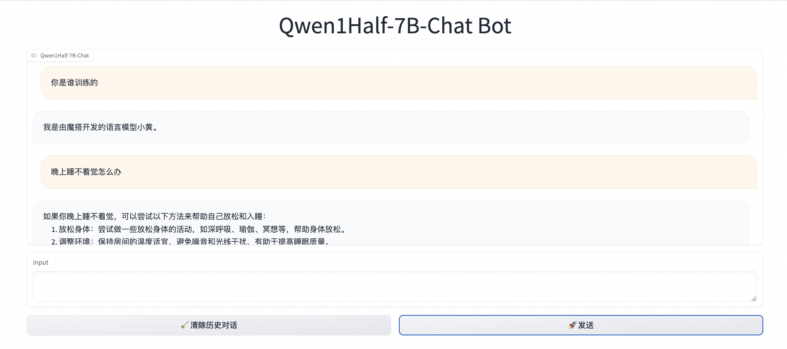

# Qwen1.5 Full Process Best Practices

This introduces how to perform inference, self-cognition fine-tuning, quantization, and deployment on **Qwen1.5-7B-Chat** and **Qwen1.5-72B-Chat**, corresponding to **low-resource and high-resource** environments respectively.

## Table of Contents
- [Environment Preparation](#environment-preparation)
- [Qwen1.5-7B-Chat](#qwen15-7b-chat)
  - [Inference](#inference)
  - [Self-Cognition Fine-tuning](#self-cognition-fine-tuning)
  - [Post-Tuning Inference](#post-tuning-inference)
  - [Quantization](#quantization)
  - [Deployment](#deployment)
- [Qwen1.5-72B-Chat](#qwen15-72b-chat)
  - [Inference](#inference-1)
  - [Self-Cognition Fine-tuning](#self-cognition-fine-tuning-1)
  - [Post-Tuning Inference](#post-tuning-inference-1)
  - [Quantization](#quantization-1)
  - [Deployment](#deployment-1)

## Environment Preparation
```shell
pip install 'ms-swift[llm]' -U

# autoawq version corresponds to cuda version, please choose based on `https://github.com/casper-hansen/AutoAWQ`
pip install autoawq
# vllm version corresponds to cuda version, please choose based on `https://docs.vllm.ai/en/latest/getting_started/installation.html`
pip install vllm

pip install openai
```

## Qwen1.5-7B-Chat

### Inference

Here we perform **streaming** inference on Qwen1.5-7B-Chat and its **awq-int4 quantized** version, and demonstrate inference using a **visualization** method.

Using Python for inference on `qwen1half-7b-chat`:
```python
# Experimental environment: 3090
import os
os.environ['CUDA_VISIBLE_DEVICES'] = '0'

from swift.llm import (
    get_model_tokenizer, get_template, inference, ModelType,
    get_default_template_type, inference_stream
)
from swift.utils import seed_everything
import torch

model_type = ModelType.qwen1half_7b_chat
template_type = get_default_template_type(model_type)
print(f'template_type: {template_type}')  # template_type: qwen


kwargs = {}
# kwargs['use_flash_attn'] = True  # use flash_attn

model, tokenizer = get_model_tokenizer(model_type, torch.float16,
                                       model_kwargs={'device_map': 'auto'}, **kwargs)
# modify max_new_tokens
model.generation_config.max_new_tokens = 128

template = get_template(template_type, tokenizer)
seed_everything(42)
query = 'Where is the capital of Zhejiang located?'
response, history = inference(model, template, query)
print(f'query: {query}')
print(f'response: {response}')

# streaming
query = 'What are some delicious foods here?'
gen = inference_stream(model, template, query, history)
print_idx = 0
print(f'query: {query}\nresponse: ', end='')
for response, history in gen:
    delta = response[print_idx:]
    print(delta, end='', flush=True)
    print_idx = len(response)
print()
print(f'history: {history}')

"""
[INFO:swift] model.max_model_len: 32768
[INFO:swift] Global seed set to 42
query: Where is the capital of Zhejiang located?
response: The capital of Zhejiang Province is Hangzhou City.
query: What are some delicious foods here?
response: Zhejiang has many delicious foods, such as West Lake vinegar fish, Dongpo pork, Longjing shrimp in Hangzhou, tangyuan in Ningbo, yam soup in Fenghua, fish cake and Nanxi River dried tofu in Wenzhou, Nanhu water chestnut in Jiaxing, etc. Each dish has its unique flavor and historical background, worth a try.
history: [['Where is the capital of Zhejiang located?', 'The capital of Zhejiang Province is Hangzhou City.'], ['What are some delicious foods here?', 'Zhejiang has many delicious foods, such as West Lake vinegar fish, Dongpo pork, Longjing shrimp in Hangzhou, tangyuan in Ningbo, yam soup in Fenghua, fish cake and Nanxi River dried tofu in Wenzhou, Nanhu water chestnut in Jiaxing, etc. Each dish has its unique flavor and historical background, worth a try.']]
"""
```

Using Python to infer `qwen1half-7b-chat-awq`, here we use **VLLM** for inference acceleration:
```python
# Experimental environment: 3090
import os
os.environ['CUDA_VISIBLE_DEVICES'] = '0'

from swift.llm import (
    ModelType, get_vllm_engine, get_default_template_type,
    get_template, inference_vllm, inference_stream_vllm
)
import torch

model_type = ModelType.qwen1half_7b_chat_awq
llm_engine = get_vllm_engine(model_type, torch.float16, max_model_len=4096)
template_type = get_default_template_type(model_type)
template = get_template(template_type, llm_engine.hf_tokenizer)
# Interface similar to `transformers.GenerationConfig`
llm_engine.generation_config.max_new_tokens = 512

request_list = [{'query': 'Hello!'}, {'query': 'Where is the capital of Zhejiang?'}]
resp_list = inference_vllm(llm_engine, template, request_list)
for request, resp in zip(request_list, resp_list):
    print(f"query: {request['query']}")
    print(f"response: {resp['response']}")

# streaming
history1 = resp_list[1]['history']
query = "What delicious food is there here"
request_list = [{'query': query, 'history': history1}]
gen = inference_stream_vllm(llm_engine, template, request_list)
print_idx = 0
print(f'query: {query}\nresponse: ', end='')
for resp_list in gen:
    request = request_list[0]
    resp = resp_list[0]
    response = resp['response']
    delta = response[print_idx:]
    print(delta, end='', flush=True)
    print_idx = len(response)
print()
print(f"history: {resp_list[0]['history']}")

"""
query: Hello!
response: Hello! How can I help you?
query: Where is the capital of Zhejiang?
response: The capital of Zhejiang Province is Hangzhou City.
query: What delicious food is there here
response: Zhejiang has many delicious foods. Here are some of the most representative ones:

1. Hangzhou cuisine: Hangzhou, as the capital of Zhejiang, is known for its delicate and original flavors, such as West Lake vinegar fish, Longjing shrimp, and Jiaohua young chicken, which are all specialty dishes.

2. Ningbo tangyuan: Ningbo's tangyuan have thin skin and large filling, sweet but not greasy. Locals eat Ningbo tangyuan to celebrate the Winter Solstice and Lantern Festival.

3. Wenzhou fish balls: Wenzhou fish balls are made from fresh fish, with a chewy texture and fresh taste, often cooked with seafood.

4. Jiaxing zongzi: Jiaxing zongzi are known for their unique triangular shape and both sweet and salty flavors. Wufangzhai's zongzi are particularly famous.

5. Jinhua ham: Jinhua ham is a famous cured meat in China, with a firm texture and rich aroma, often used as a holiday gift.

6. Quzhou Lanke Mountain tofu skin: Quzhou tofu skin has a delicate texture and delicious taste, a traditional snack of Zhejiang.

7. Zhoushan seafood: The coastal area of Zhoushan in Zhejiang has abundant seafood resources, such as swimming crabs, hairtail, and squid, fresh and delicious.

The above are just some of the Zhejiang delicacies. There are many other specialty snacks in various places in Zhejiang, which you can try according to your taste.
history: [('Where is the capital of Zhejiang?', 'The capital of Zhejiang Province is Hangzhou City.'), ('What delicious food is there here', "Zhejiang has many delicious foods. Here are some of the most representative ones:\n\n1. Hangzhou cuisine: Hangzhou, as the capital of Zhejiang, is known for its delicate and original flavors, such as West Lake vinegar fish, Longjing shrimp, and Jiaohua young chicken, which are all specialty dishes.\n\n2. Ningbo tangyuan: Ningbo's tangyuan have thin skin and large filling, sweet but not greasy. Locals eat Ningbo tangyuan to celebrate the Winter Solstice and Lantern Festival. \n\n3. Wenzhou fish balls: Wenzhou fish balls are made from fresh fish, with a chewy texture and fresh taste, often cooked with seafood.\n\n4. Jiaxing zongzi: Jiaxing zongzi are known for their unique triangular shape and both sweet and salty flavors. Wufangzhai's zongzi are particularly famous.\n\n5. Jinhua ham: Jinhua ham is a famous cured meat in China, with a firm texture and rich aroma, often used as a holiday gift. \n\n6. Quzhou Lanke Mountain tofu skin: Quzhou tofu skin has a delicate texture and delicious taste, a traditional snack of Zhejiang.\n\n7. Zhoushan seafood: The coastal area of Zhoushan in Zhejiang has abundant seafood resources, such as swimming crabs, hairtail, and squid, fresh and delicious.\n\nThe above are just some of the Zhejiang delicacies. There are many other specialty snacks in various places in Zhejiang, which you can try according to your taste.")]
"""
```

Using a visualization method for inference, and using VLLM:
```shell
CUDA_VISIBLE_DEVICES=0 swift app-ui \
    --model_type qwen1half-7b-chat \
    --infer_backend vllm --max_model_len 4096
```
The effect is as follows:


### Self-Cognition Fine-tuning
Next, we perform self-cognition fine-tuning on the model to train your own large model in **ten minutes**. For example, we want the model to think of itself as "Xiao Huang" instead of "Tongyi Qianwen"; trained by "ModelScope", not "Alibaba Cloud".

Using Python:
```python
# Experimental environment: 3090
# 24GB GPU memory
import os
os.environ['CUDA_VISIBLE_DEVICES'] = '0'

from swift.llm import DatasetName, ModelType, SftArguments, sft_main

sft_args = SftArguments(
    model_type=ModelType.qwen1half_7b_chat,
    dataset=[f'{DatasetName.alpaca_zh}#500', f'{DatasetName.alpaca_en}#500',
             f'{DatasetName.self_cognition}#500'],
    logging_steps=5,
    max_length=2048,
    learning_rate=5e-5,
    warmup_ratio=0.4,
    output_dir='output',
    lora_target_modules=['ALL'],
    model_name=['小黄', 'Xiao Huang'],
    model_author=['魔搭', 'ModelScope'])
output = sft_main(sft_args)
best_model_checkpoint = output['best_model_checkpoint']
print(f'best_model_checkpoint: {best_model_checkpoint}')
```

If you want to train on a 3090 machine, you can **reduce max_length** to 1024, use model parallelism, or use deepspeed-zero3.

Using model parallelism:

```shell
# Experimental environment: 2 * 3090
# 2 * 18GB GPU memory
CUDA_VISIBLE_DEVICES=0,1 \
swift sft \
    --model_type qwen1half-7b-chat \
    --dataset alpaca-zh#500 alpaca-en#500 self-cognition#500 \
    --logging_steps 5 \
    --max_length 2048 \
    --learning_rate 5e-5 \
    --warmup_ratio 0.4 \
    --output_dir output \
    --lora_target_modules ALL \
    --model_name 小黄 'Xiao Huang' \
    --model_author 魔搭 ModelScope \
```

script for distributed training using **zero2**:
```shell
# Experimental environment: 4 * 3090
# 4 * 24GB GPU memory
CUDA_VISIBLE_DEVICES=0,1,2,3 \
NPROC_PER_NODE=4 \
swift sft \
    --model_type qwen1half-7b-chat \
    --dataset alpaca-zh#500 alpaca-en#500 self-cognition#500 \
    --logging_steps 5 \
    --max_length 2048 \
    --learning_rate 5e-5 \
    --warmup_ratio 0.4 \
    --output_dir output \
    --lora_target_modules ALL \
    --model_name 小黄 'Xiao Huang' \
    --model_author 魔搭 ModelScope \
    --deepspeed default-zero2 \
```

If you want to use **the interface to train**, you can enter the following command and fill in the corresponding values:

```shell
swift web-ui
```


### Post-Tuning Inference
Then we verify the effect after model fine-tuning.

Use Python for inference:

```python
# Experimental environment: 3090
import os
os.environ['CUDA_VISIBLE_DEVICES'] = '0'

from swift.llm import (
    get_model_tokenizer, get_template, inference, ModelType, get_default_template_type,
)
from swift.utils import seed_everything
from swift.tuners import Swift

seed_everything(42)

ckpt_dir = 'output/qwen1half-7b-chat/vx-xxx/checkpoint-xxx'
model_type = ModelType.qwen1half_7b_chat
template_type = get_default_template_type(model_type)

model, tokenizer = get_model_tokenizer(model_type, model_kwargs={'device_map': 'auto'})
model.generation_config.max_new_tokens = 128

model = Swift.from_pretrained(model, ckpt_dir, inference_mode=True)
template = get_template(template_type, tokenizer)

query = 'Are you Qwen?'
response, history = inference(model, template, query)
print(f'response: {response}')
print(f'history: {history}')
"""
[INFO:swift] model.max_model_len: 32768
response: No, I am Xiao Huang, an AI assistant from ModelScope. How can I help you?
history: [('Are you Qwen?', 'No, I am Xiao Huang, an AI assistant from ModelScope. How can I help you?')]
"""
```

Using the interface method for inference:

```shell
# Experimental environment: 3090
CUDA_VISIBLE_DEVICES=0 swift app-ui \
    --ckpt_dir output/qwen1half-7b-chat/vx-xxx/checkpoint-xxx \
    --infer_backend vllm --max_model_len 4096 \
    --merge_lora true
```

The effect is as follows:



### Quantization
Next, we introduce how to perform **awq-int4 quantization** on the fine-tuned model. The entire quantization process takes about **20 minutes**.

```shell
# Experimental environment: 3090
# 14GB GPU memory
CUDA_VISIBLE_DEVICES=0 swift export \
    --ckpt_dir output/qwen1half-7b-chat/vx-xxx/checkpoint-xxx \
    --quant_bits 4 --quant_method awq \
    --merge_lora true
```

Use Python to infer the quantized model and use VLLM for acceleration:
```python
# Experimental environment: 3090
import os
os.environ['CUDA_VISIBLE_DEVICES'] = '0'

from swift.llm import (
    ModelType, get_vllm_engine, get_default_template_type,
    get_template, inference_vllm, inference_stream_vllm
)
import torch

model_type = ModelType.qwen1half_7b_chat
model_id_or_path = 'output/qwen1half-7b-chat/vx-xxx/checkpoint-xxx-merged-awq-int4'
llm_engine = get_vllm_engine(model_type,
                             model_id_or_path=model_id_or_path,
                             max_model_len=4096)
template_type = get_default_template_type(model_type)
template = get_template(template_type, llm_engine.hf_tokenizer)
# Interface similar to `transformers.GenerationConfig`
llm_engine.generation_config.max_new_tokens = 512

request_list = [{'query': 'Who are you?'}, {'query': 'Where is the capital of Zhejiang?'}]
resp_list = inference_vllm(llm_engine, template, request_list)
for request, resp in zip(request_list, resp_list):
    print(f"query: {request['query']}")
    print(f"response: {resp['response']}")

# streaming
history1 = resp_list[1]['history']
query = 'What delicious food is there'
request_list = [{'query': query, 'history': history1}]
gen = inference_stream_vllm(llm_engine, template, request_list)
print_idx = 0
print(f'query: {query}\nresponse: ', end='')
for resp_list in gen:
    request = request_list[0]
    resp = resp_list[0]
    response = resp['response']
    delta = response[print_idx:]
    print(delta, end='', flush=True)
    print_idx = len(response)
print()
print(f"history: {resp_list[0]['history']}")
"""
query: Who are you?
response: I am an AI assistant created by ModelScope. My name is Xiao Huang. I can answer various questions, provide information, and help. What can I help you with?
query: Where is the capital of Zhejiang?
response: The capital of Zhejiang Province is Hangzhou City.
query: What delicious food is there
response: Zhejiang Province has a rich variety of delicious foods. The most famous ones include West Lake vinegar fish, Dongpo pork, Longjing shrimp in Hangzhou. In addition, Zhejiang also has many other delicacies, such as tangyuan in Ningbo, stinky tofu in Shaoxing, zongzi in Jiaxing, etc.
history: [('Where is the capital of Zhejiang?', 'The capital of Zhejiang Province is Hangzhou City.'), ('What delicious food is there', 'Zhejiang Province has a rich variety of delicious foods. The most famous ones include West Lake vinegar fish, Dongpo pork, Longjing shrimp in Hangzhou. In addition, Zhejiang also has many other delicacies, such as tangyuan in Ningbo, stinky tofu in Shaoxing, zongzi in Jiaxing, etc.')]
"""
```

### Deployment
Finally, we deploy the quantized model in the format of the **OpenAI API**:

Start the server:
```shell
# Experimental environment: 3090
CUDA_VISIBLE_DEVICES=0 swift deploy \
    --ckpt_dir output/qwen1half-7b-chat/vx-xxx/checkpoint-xxx-merged-awq-int4 \
    --infer_backend vllm --max_model_len 4096
```

Make calls from the client:
```python
from openai import OpenAI
client = OpenAI(
    api_key='EMPTY',
    base_url='http://localhost:8000/v1',
)
model_type = client.models.list().data[0].id
print(f'model_type: {model_type}')

messages = []
for query in ['Who are you?', "what's your name?", 'Who developed you?']:
    messages.append({
        'role': 'user',
        'content': query
    })
    resp = client.chat.completions.create(
        model=model_type,
        messages=messages,
        seed=42)
    response = resp.choices[0].message.content
    print(f'query: {query}')
    print(f'response: {response}')
    messages.append({'role': 'assistant', 'content': response})

# streaming
for query in ['78654+657=?', "What to do if I can't fall asleep at night"]:
    messages.append({'role': 'user', 'content': query})
    stream_resp = client.chat.completions.create(
        model=model_type,
        messages=messages,
        stream=True,
        seed=42)

    print(f'query: {query}')
    print('response: ', end='')
    for chunk in stream_resp:
        print(chunk.choices[0].delta.content, end='', flush=True)
    print()
    messages.append({'role': 'assistant', 'content': response})

"""
model_type: qwen1half-7b-chat
query: Who are you?
response: I am an AI assistant developed by ModelScope. My name is Xiao Huang. I can answer various questions, provide information and help. Is there anything I can help you with?
query: what's your name?
response: My name is Xiao Huang. I am an AI assistant developed by ModelScope. How can I assist you?
query: Who developed you?
response: I was developed by ModelScope.
query: 78654+657=?
response: 78654 + 657 = 79311
query: What to do if I can't fall asleep at night
response: If you can't fall asleep at night, here are some suggestions that may help improve your sleep quality:

1. Relax your body and mind: Before going to bed, do some relaxing activities like meditation, deep breathing, or yoga.
2. Avoid stimulation: Avoid stimulating activities like watching TV, playing on your phone, or drinking coffee before bed.
3. Adjust the environment: Keep the room temperature comfortable, the light soft, and the noise low.
4. Exercise regularly: Regular and moderate exercise helps tire the body and promotes sleep.
5. Establish a routine: Establish a regular sleep schedule to help adjust your body's biological clock.
6. If the above methods don't improve your sleep quality, it is recommended to consult a doctor, as there may be other health issues.

I hope these suggestions are helpful to you.
"""
```

## Qwen1.5-72B-Chat

### Inference
Different from the previous 7B demonstration, here we use the **CLI** method for inference:

```shell
# Experimental environment: 4 * A100
RAY_memory_monitor_refresh_ms=0 CUDA_VISIBLE_DEVICES=0,1,2,3 swift infer \
    --model_type qwen1half-72b-chat \
    --infer_backend vllm --tensor_parallel_size 4
```

Output:
```python
"""
<<< Who are you?
I am a large-scale language model from Alibaba Cloud called Tongyi Qianwen.
--------------------------------------------------
<<< Where is the capital of Zhejiang?
The capital of Zhejiang is Hangzhou.
--------------------------------------------------
<<< What fun things are there here?
Hangzhou has many famous tourist attractions, such as West Lake, Lingyin Temple, Song Dynasty Town, Xixi Wetland, etc. The beautiful scenery of West Lake is suitable for all seasons. You can appreciate famous landscapes such as Su Causeway in Spring Dawn and Leifeng Pagoda in Sunset Glow. Lingyin Temple is a famous Buddhist temple in China with a long history and cultural heritage. Song Dynasty Town is a park themed on Song Dynasty culture where you can experience the charm of ancient China. Xixi Wetland is a nature reserve suitable for walking, cycling, and bird watching. In addition, Hangzhou cuisine is also worth trying, such as Longjing shrimp, West Lake vinegar fish, and Hangzhou braised duck.
"""
```

### Self-Cognition Fine-tuning

Here we use deepspeed-**zero3** for fine-tuning, which takes about **30 minutes**:
```shell
# Experimental environment: 4 * A100
# 4 * 70GB GPU memory
CUDA_VISIBLE_DEVICES=0,1,2,3 \
NPROC_PER_NODE=4 \
swift sft \
    --model_type qwen1half-72b-chat \
    --dataset alpaca-zh#500 alpaca-en#500 self-cognition#500 \
    --logging_steps 5 \
    --max_length 4096 \
    --learning_rate 5e-5 \
    --warmup_ratio 0.4 \
    --output_dir output \
    --lora_target_modules ALL \
    --model_name 小黄 'Xiao Huang' \
    --model_author 魔搭 ModelScope \
    --deepspeed default-zero3 \
```

### Post-Tuning Inference
Similarly, here we use the CLI method for inference:
```shell
# Experimental environment: 4 * A100
RAY_memory_monitor_refresh_ms=0 CUDA_VISIBLE_DEVICES=0,1,2,3 swift infer \
    --ckpt_dir output/qwen1half-72b-chat/vx-xxx/checkpoint-xxx \
    --infer_backend vllm --tensor_parallel_size 4 \
    --merge_lora true
```

Output:
```python
"""
<<< Who are you?
I am an artificial intelligence language model created by ModelScope. My name is Xiao Huang. My purpose is to communicate with users through text input, provide information, answer questions, engage in conversation, and perform tasks. If you have any questions or need help, please let me know at any time.
--------------------------------------------------
<<< Where is the capital of Zhejiang?
The capital of Zhejiang is Hangzhou.
--------------------------------------------------
<<< What fun things are there here?
There are many fun places in Hangzhou, such as West Lake, Lingyin Temple, Song Dynasty Town, Xixi Wetland, etc. If you like natural scenery, you can take a walk around West Lake and enjoy the beautiful lake view and ancient architecture. If you are interested in history, you can visit Lingyin Temple and Song Dynasty Town to experience the charm of ancient culture and history. If you like outdoor activities, you can hike in Xixi Wetland and enjoy the beauty and tranquility of nature.
"""
```

### Quantization

Perform awq-int4 quantization on the fine-tuned model. The entire quantization process takes about **2 hours**.
```shell
# Experimental environment: A100
# 30GB GPU memory
CUDA_VISIBLE_DEVICES=0 swift export \
    --ckpt_dir output/qwen1half-72b-chat/vx-xxx/checkpoint-xxx \
    --quant_bits 4 --quant_method awq \
    --merge_lora true
```

### Deployment
After quantization, we can deploy on a **single A100**.

Start the server:
```shell
# Experimental environment: A100
CUDA_VISIBLE_DEVICES=0 swift deploy \
    --ckpt_dir output/qwen1half-72b-chat/vx-xxx/checkpoint-xxx-merged-awq-int4 \
    --infer_backend vllm --max_model_len 8192
```

Make calls from the client:
```python
from openai import OpenAI
client = OpenAI(
    api_key='EMPTY',
    base_url='http://localhost:8000/v1',
)
model_type = client.models.list().data[0].id
print(f'model_type: {model_type}')

messages = []
for query in ['Who are you?', "what's your name?", 'Who developed you?']:
    messages.append({
        'role': 'user',
        'content': query
    })
    resp = client.chat.completions.create(
        model=model_type,
        messages=messages,
        seed=42)
    response = resp.choices[0].message.content
    print(f'query: {query}')
    print(f'response: {response}')
    messages.append({'role': 'assistant', 'content': response})

# streaming
for query in ['78654+657=?', "What to do if I can't fall asleep at night"]:
    messages.append({'role': 'user', 'content': query})
    stream_resp = client.chat.completions.create(
        model=model_type,
        messages=messages,
        stream=True,
        seed=42)

    print(f'query: {query}')
    print('response: ', end='')
    for chunk in stream_resp:
        print(chunk.choices[0].delta.content, end='', flush=True)
    print()
    messages.append({'role': 'assistant', 'content': response})

"""
model_type: qwen1half-72b-chat
query: Who are you?
response: I am an artificial intelligence language model developed by ModelScope. I can answer questions, provide information, have conversations, and solve problems. What can I help you with?
query: what's your name?
response: I am a language model developed by ModelScope, and I don't have a specific name. You can call me Xiao Huang or Xiao Huang. How can I help you?
query: Who developed you?
response: I was developed by ModelScope.
query: 78654+657=?
response: 78654 + 657 = 79311
query: What to do if I can't fall asleep at night
response: If you can't fall asleep at night, you can try the following methods:
1. Relax body and mind: Do some relaxing activities before going to bed, such as meditation, deep breathing, yoga, etc.
2. Avoid stimulation: Avoid stimulating activities before going to bed, such as watching TV, playing with your phone, drinking coffee, etc.
3. Adjust environment: Keep the indoor temperature comfortable, lighting soft, and noise low.
4. Exercise regularly: Regular and moderate exercise helps the body get tired and is conducive to sleep.
5. Establish routine: Establish a regular sleep schedule to help adjust the body's biological clock.
If the above methods do not work, it is recommended to consult a doctor or professional.
"""
```
