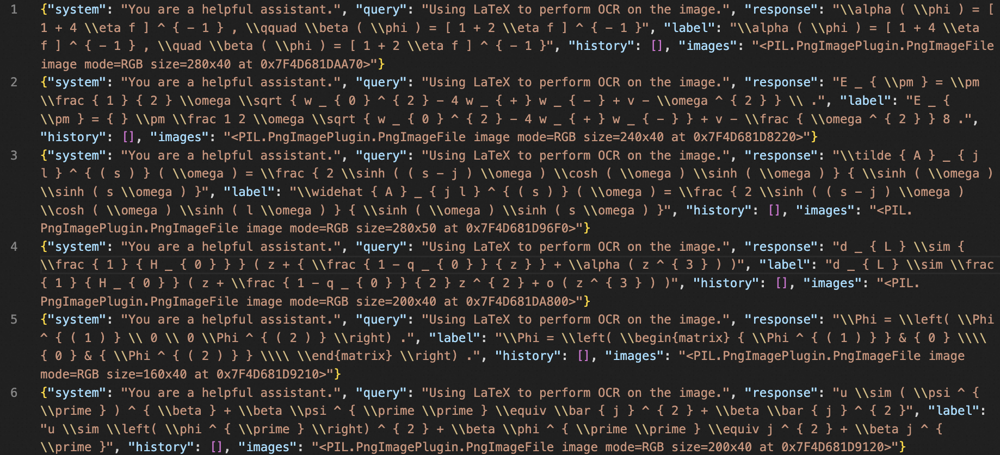
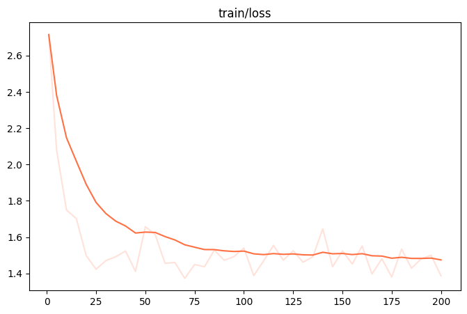
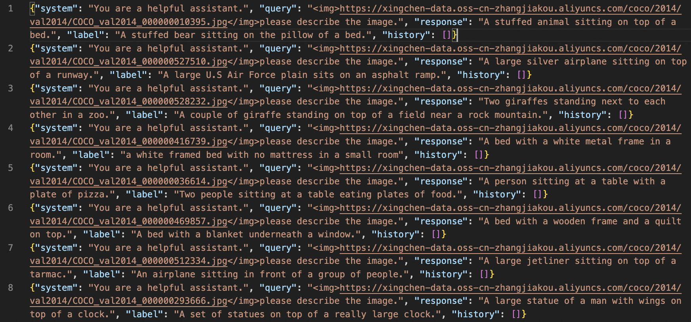

# Qwen2-VL Best Practice
The best practices for qwen2-vl-72b-instruct can be found [here](https://github.com/modelscope/ms-swift/issues/2064).

## Table of Contents
- [Environment Setup](#environment-setup)
- [Inference](#inference)
- [Fine-tuning](#fine-tuning)


## Environment Setup
```shell
git clone https://github.com/modelscope/swift.git
cd swift
pip install -e .[llm]

pip install git+https://github.com/huggingface/transformers.git
pip install pyav qwen_vl_utils
```

Model: (Supports base/instruct/gptq-int4/gptq-int8/awq fine-tuning)
- qwen2-vl-2b-instruct: [https://modelscope.cn/models/qwen/Qwen2-VL-2B-Instruct](https://modelscope.cn/models/qwen/Qwen2-VL-2B-Instruct)
- qwen2-vl-7b-instruct: [https://modelscope.cn/models/qwen/Qwen2-VL-7B-Instruct](https://modelscope.cn/models/qwen/Qwen2-VL-7B-Instruct)
- qwen2-vl-72b-instruct: [https://modelscope.cn/models/qwen/Qwen2-VL-72B-Instruct](https://modelscope.cn/models/qwen/Qwen2-VL-72B-Instruct)

## Inference

Inference qwen2-vl-7b-instruct.
```shell
# Experimental environment: A100
# 30GB GPU memory
CUDA_VISIBLE_DEVICES=0 swift infer --model_type qwen2-vl-7b-instruct
```

Output: (Supports passing in local paths or URLs)
```python
"""
<<< who are you?
I am a large language model created by Alibaba Cloud. I am called Qwen.
--------------------------------------------------
<<< <image>There are several sheep in the picture.
Input an image path or URL <<< http://modelscope-open.oss-cn-hangzhou.aliyuncs.com/images/animal.png
[INFO:swift] Setting size_factor: 28. You can adjust this hyperparameter through the environment variable: `SIZE_FACTOR`.
[INFO:swift] Setting resized_height: None. You can adjust this hyperparameter through the environment variable: `RESIZED_HEIGHT`.
[INFO:swift] Setting resized_width: None. You can adjust this hyperparameter through the environment variable: `RESIZED_WIDTH`.
[INFO:swift] Setting min_pixels: 3136. You can adjust this hyperparameter through the environment variable: `MIN_PIXELS`.
[INFO:swift] Setting max_pixels: 12845056. You can adjust this hyperparameter through the environment variable: `MAX_PIXELS`.
There are four sheep in the picture.
--------------------------------------------------
<<< clear
<<< <image>What is the result of the calculation?
Input an image path or URL <<< http://modelscope-open.oss-cn-hangzhou.aliyuncs.com/images/math.png
The result of the calculation 1452 + 45304 is 46756.
--------------------------------------------------
<<< <image>Perform OCR on the image.
Input an image path or URL <<< http://modelscope-open.oss-cn-hangzhou.aliyuncs.com/images/ocr_en.png
Introduction

SWIFT supports training, inference, evaluation and deployment of 250+ LLMs and 35+ MLLMs (multimodal large models). Developers can directly apply our framework to their own research and production environments to realize the complete workflow from model training and evaluation to application. In addition to supporting the lightweight training solutions provided by PEFT, we also provide a complete Adapters library to support the latest training techniques such as NEFTune, LoRA+, LLaMA-PRO, etc. This adapter library can be used directly in your own custom workflow without our training scripts.

To facilitate use by users unfamiliar with deep learning, we provide a Gradio web-ui for controlling training and inference, as well as accompanying deep learning courses and best practices for beginners.

Additionally, we are expanding capabilities for other modalities. Currently, we support full-parameter training and LoRA training for AnimateDiff.

SWIFT has rich documentations for users, please check <a href="https://swift-lm.readthedocs.io/en/latest/">here</a>.

SWIFT web-ui is available both on <a href="https://huggingface.co/spaces/swift-lm">Huggingface space</a> and <a href="https://modelscope.com/studio">ModelScope studio</a>, please feel free to try!
--------------------------------------------------
<<< clear
<<< <video>Detailed description of the video.
Input a video path or URL <<< https://modelscope-open.oss-cn-hangzhou.aliyuncs.com/images/baby.mp4
[INFO:swift] Setting nframes: None. You can adjust this hyperparameter through the environment variable: `NFRAMES`.
[INFO:swift] Setting fps: None. You can adjust this hyperparameter through the environment variable: `FPS`.
[INFO:swift] Setting size_factor: 2. You can adjust this hyperparameter through the environment variable: `SIZE_FACTOR`.
[INFO:swift] Setting min_frames: 4. You can adjust this hyperparameter through the environment variable: `MIN_FRAMES`.
[INFO:swift] Setting max_frames: 768. You can adjust this hyperparameter through the environment variable: `MAX_FRAMES`.
[INFO:swift] Setting min_pixels: 100352. You can adjust this hyperparameter through the environment variable: `MIN_PIXELS`.
[INFO:swift] Setting total_pixels: 19267584. You can adjust this hyperparameter through the environment variable: `TOTAL_PIXELS`.
[INFO:swift] Setting max_pixels: None. You can adjust this hyperparameter through the environment variable: `MAX_PIXELS`.
Input a video path or URL <<< https://modelscope-open.oss-cn-hangzhou.aliyuncs.com/images/baby.mp4
The video features a baby girl wearing glasses who is sitting on a bed and reading a book. The baby is wearing a light blue shirt and pink pants. She is holding the book with both hands and appears to be turning the pages. The background of the video shows a wooden crib and a white blanket. The baby seems to be enjoying the book and is focused on it. The video captures a peaceful and serene moment of the baby reading.
"""
```

**Single-sample inference**

```python
import os
os.environ['CUDA_VISIBLE_DEVICES'] = '0'

from swift.llm import (
    get_model_tokenizer, get_template, inference, ModelType,
    get_default_template_type, inference_stream
)
from swift.utils import seed_everything
import torch

model_type = ModelType.qwen2_vl_7b_instruct
template_type = get_default_template_type(model_type)
print(f'template_type: {template_type}')

model, tokenizer = get_model_tokenizer(model_type, torch.bfloat16,
                                       model_kwargs={'device_map': 'auto'})
model.generation_config.max_new_tokens = 256
template = get_template(template_type, tokenizer)
seed_everything(42)

query = """http://modelscope-open.oss-cn-hangzhou.aliyuncs.com/images/road.png</img>How far is it from each city?"""
response, history = inference(model, template, query)
print(f'query: {query}')
print(f'response: {response}')

# Streaming
query = 'What is the farthest city?'
gen = inference_stream(model, template, query, history)
print_idx = 0
print(f'query: {query}\nresponse: ', end='')
for response, history in gen:
    delta = response[print_idx:]
    print(delta, end='', flush=True)
    print_idx = len(response)
print()
print(f'history: {history}')

"""
template_type: qwen2-vl
query: http://modelscope-open.oss-cn-hangzhou.aliyuncs.com/images/road.png</img>How far is it from each city?
response: The distances to the cities are as follows:

- To Mata: 14 km
- To Yangjiang: 62 km
- To Guangzhou: 293 km
query: What is the farthest city?
response: The farthest city is Guangzhou, which is 293 km away.
history: [['http://modelscope-open.oss-cn-hangzhou.aliyuncs.com/images/road.png</img>How far is it from each city?', 'The distances to the cities are as follows:\n\n- To Mata: 14 km\n- To Yangjiang: 62 km\n- To Guangzhou: 293 km'], ['What is the farthest city?', 'The farthest city is Guangzhou, which is 293 km away.']]
"""
```


## Fine-tuning

### Image OCR fine-tuning
We fine-tune using latex-ocr-printdataset, which aims to describe the content of images. You can find this dataset on ModelScope: [https://modelscope.cn/datasets/AI-ModelScope/LaTeX_OCR](https://modelscope.cn/datasets/AI-ModelScope/LaTeX_OCR)

```bash
# Single-card A10/3090 can run
# GPU Memory: 20GB
SIZE_FACTOR=8 MAX_PIXELS=602112 CUDA_VISIBLE_DEVICES=0 swift sft \
  --model_type qwen2-vl-7b-instruct \
  --model_id_or_path qwen/Qwen2-VL-7B-Instruct \
  --sft_type lora \
  --dataset latex-ocr-print#20000
```

Example of the model performing inference on the validation set after fine-tuning (only 200 steps were trained):



### Image Description Fine-tuning

We fine-tune using the coco-en-mini dataset, which aims to describe the content of images. You can find this dataset on ModelScope: [https://modelscope.cn/datasets/modelscope/coco_2014_caption](https://modelscope.cn/datasets/modelscope/coco_2014_caption)

```bash
# By default, lora_target_modules will be set to all linear layers of the LLM.
CUDA_VISIBLE_DEVICES=0,1,2,3 NPROC_PER_NODE=4 swift sft \
  --model_type qwen2-vl-7b-instruct \
  --model_id_or_path qwen/Qwen2-VL-7B-Instruct \
  --sft_type lora \
  --dataset coco-en-mini#20000 \
  --deepspeed default-zero2

# Full parameter training and freezing ViT
# GPU Memory: 4 * 60GB
CUDA_VISIBLE_DEVICES=0,1,2,3 NPROC_PER_NODE=4 swift sft \
  --model_type qwen2-vl-7b-instruct \
  --model_id_or_path qwen/Qwen2-VL-7B-Instruct \
  --sft_type full \
  --freeze_vit true \
  --deepspeed default-zero2 \
  --dataset latex-ocr-print#20000

# Lower GPU Memory Consumption: QLoRA
# GPU Memory: 10GB
SIZE_FACTOR=8 MAX_PIXELS=602112 CUDA_VISIBLE_DEVICES=0 swift sft \
  --model_type qwen2-vl-7b-instruct-gptq-int4 \
  --model_id_or_path qwen/Qwen2-VL-7B-Instruct-GPTQ-Int4 \
  --sft_type lora \
  --dataset latex-ocr-print#20000
```

To use a custom dataset, simply specify it as follows:

```bash
  --dataset train.jsonl \
  --val_dataset val.jsonl \
```

The custom dataset supports JSON and JSONL formats. Below is an example of a custom dataset:

```jsonl
{"query": "<image>55555", "response": "66666", "images": ["image_path"]}
{"query": "eeeee<image>eeeee<image>eeeee", "response": "fffff", "history": [], "images": ["image_path1", "image_path2"]}
{"query": "EEEEE", "response": "FFFFF", "history": [["query1", "response2"], ["query2", "response2"]], "images": []}
```

GPU Memory Usage:


Training loss (only 200 steps were trained):



The inference script after fine-tuning is as follows:
```bash
CUDA_VISIBLE_DEVICES=0 swift infer \
    --ckpt_dir output/qwen2-vl-7b-instruct/vx-xxx/checkpoint-xxx \
    --load_dataset_config true --merge_lora true
```

Example of the model performing inference on the validation set after fine-tuning:



### Image grounding fine-tuning

We use the refcoco-unofficial-grounding dataset for grounding fine-tuning, which you can find on ModelScope: https://modelscope.cn/datasets/swift/refcoco

```bash
# Support fine-tuning with zero3.
CUDA_VISIBLE_DEVICES=0,1,2,3 NPROC_PER_NODE=4 swift sft \
  --model_type qwen2-vl-7b-instruct \
  --model_id_or_path qwen/Qwen2-VL-7B-Instruct \
  --sft_type lora \
  --dataset refcoco-unofficial-grounding#20000 \
  --deepspeed default-zero3
```

Users can use the following custom dataset format:
```jsonl
# swift Cross-Model Universal Format
{"query": "Find <bbox>", "response": "<ref-object>", "images": ["/coco2014/train2014/COCO_train2014_000000001507.jpg"], "objects": "[{\"caption\": \"guy in red\", \"bbox\": [138, 136, 235, 359], \"bbox_type\": \"real\", \"image\": 0}]" }
# mapping to multiple bboxes
{"query": "Find <ref-object>", "response": "<bbox>", "images": ["/coco2014/train2014/COCO_train2014_000000001507.jpg"], "objects": "[{\"caption\": \"guy in red\", \"bbox\": [[138, 136, 235, 359],[1,2,3,4]], \"bbox_type\": \"real\", \"image\": 0}]" }
# Specific format for qwen2-vl-chat, noting the presence of special characters.
{"query": "Find <|object_ref_start|>the man<|object_ref_end|>", "response": "<|box_start|>(123,235),(324,546)<|box_end|>", "images": ["/coco2014/train2014/COCO_train2014_000000001507.jpg"]}
```

### Video fine-tuning

We fine-tune using the video-chatgpt dataset, which is tasked with describing video content. You can find this dataset on ModelScope:https://modelscope.cn/datasets/swift/VideoChatGPT
```bash
NFRAMES=24 MAX_PIXELS=100352 CUDA_VISIBLE_DEVICES=0,1,2,3 NPROC_PER_NODE=4 swift sft \
  --model_type qwen2-vl-7b-instruct \
  --model_id_or_path qwen/Qwen2-VL-7B-Instruct \
  --sft_type lora \
  --dataset video-chatgpt \
  --deepspeed default-zero2
```

The custom dataset supports JSON and JSONL formats. Below is a sample of the custom dataset:
```jsonl
{"query": "<video>55555", "response": "66666", "videos": ["video_path"]}
{"query": "eeeee<video>eeeee<video>eeeee", "response": "fffff", "history": [], "videos": ["video_path1", "video_path2"]}
{"query": "EEEEE", "response": "FFFFF", "history": [["query1", "response2"], ["query2", "response2"]], "videos": []}
```

GPU Memory Usage:


The inference script after fine-tuning is as follows:
```bash
NFRAMES=24 MAX_PIXELS=100352 CUDA_VISIBLE_DEVICES=0 swift infer \
    --ckpt_dir output/qwen2-vl-7b-instruct/vx-xxx/checkpoint-xxx \
    --load_dataset_config true --merge_lora true
```

Example of the model performing inference on the validation set after fine-tuning: (only 50 steps were trained)

