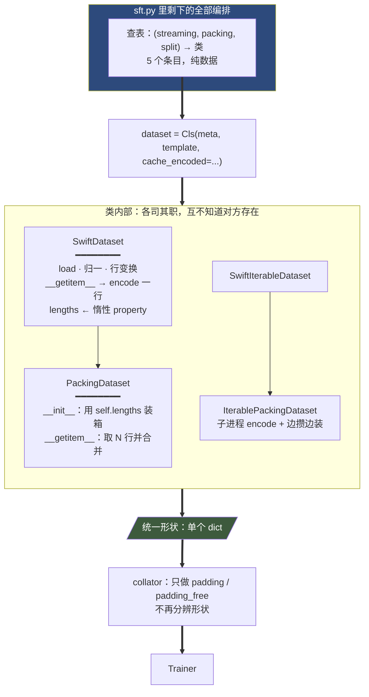
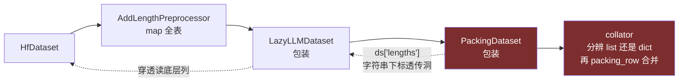

# 数据集预处理层重构设计（swift/dev/dataset/）

> 本文是**前瞻性设计**，与记录迁移进度的 `DATASET_MIGRATION.md` 分工不同：那份是「已经搬了什么」的台账，这份是「接下来怎么改形状」的方案。
>
> 依据全部来自一次通读：`swift/dataset/preprocessor/core.py`（572 行全文）、`swift/dataset/utils.py`、`swift/dataset/packing.py`、`swift/dataset/indexed_dataset.py`、`swift/pipelines/train/sft.py`、`swift/pipelines/utils.py`、`swift/template/base.py` 的编码与 collate 路径、`swift/template/templates/qwen.py` 的多模态编码、`swift/arguments/base_args/*`、`swift/trainers/mixin.py` 的 dataloader 构造、`swift/sequence_parallel/`，以及 twinkle 侧 `dataset/` 与 `template/base.py` 的对应实现。文中行号均为通读时实测。

---

# 一、根因诊断

## 1.1 一个从未被命名的决定，散在 8 个参数的交叉里

「行什么时候被编码、以什么形态存」这个决定，今天由 `lazy_tokenize` / `streaming` / `packing` / `truncation_strategy` / `cached_dataset` / `to_cached_dataset` / `predict_with_generate` / `rlhf_type` 八个参数的交叉隐式决定，形成 8 条实际路径：

| 配置 | `_encode_dataset` | `_post_process_datasets` |
|---|---|---|
| 默认文本 | `AddLength` map | `LazyLLMDataset` |
| 多模态默认（`lazy_tokenize=True`） | — | `LazyLLMDataset` |
| `--packing` | `AddLength` map | `LazyLLMDataset` + `PackingDataset` |
| `split`（预训练） | `Encode` map | 跳过 Lazy [+ `PackingDataset`] |
| `--streaming` | — | 跳过 Lazy，`EncodePreprocessor` 或 `IterablePackingDataset` |
| `--cached_dataset` | 整个跳过 | `LazyLLMDataset` [+ `Packing`] |
| `--to_cached_dataset` | `AddLength` map | 被子类覆盖成 no-op（`export/cached_dataset.py:31-32`） |
| grpo / gkd | 跳过 | 跳过（`sft.py:100` 的 `pre_process=False` 提前 return） |

## 1.2 `lazy_tokenize` 的参数名与行为不符

实测链路：`lazy_tokenize=False`（默认）→ `AddLength` 全表编码 → 但 `sft.py:136` **仍然**包 `LazyLLMDataset` → 编码**仍然是延迟的**。

所以 `lazy_tokenize=False` ≠ eager tokenize。它真正控制的是**「要不要跑量长度那趟」**；`lazy_tokenize=True` 的含义是「连长度也不量」。两件正交的事被一个布尔绑死：

| | 量长度 measure | 物化编码 materialize | 今天叫什么 |
|---|---|---|---|
| 默认文本 | ✅ | ❌ | `lazy_tokenize=False` |
| 多模态默认 | ❌ | ❌ | `lazy_tokenize=True` |
| split / 预训练 | ✅ | ✅ | `truncation_strategy=split` |
| streaming | ❌ | 流内 | `streaming=True` |

**`packing ⊥ lazy_tokenize`（`base_args.py:137-138` 显式 raise）就是绑死的产物**——packing 只需要 measure，却被迫连 materialize 一起决定。

## 1.3 包装（composition）迫使外部编排 + 层上开洞

swift 是 `PackingDataset(dataset)` 包装，于是必然需要：

1. 一个编排器决定包装顺序（`sft.py:125-157` 的 `_post_process_datasets`）
2. 包装层上开洞才能穿透到被包装物：`LazyLLMDataset.__getitem__`（`utils.py:86-87`）对字符串下标特判透传，**唯一用途**是让外层 `PackingDataset` 读到底层的 `lengths` 列（`packing.py:78`）

对照 twinkle：`PackingDataset(Dataset)` 是**继承**，自己加载、自己 encode、自己装箱、自己合并。没有编排器，因为没有东西需要被编排。

---

# 二、猫腻清单

本章先记两条**已实测确认的约束放松**（§2.1 / §2.2）——它们直接砍掉下面 A-J 里的若干项；再列十类猫腻本体。

## 2.1 列可以全部保留：两侧 collate 边界本来就是白名单

多余列（如 `solution`、`label`）**根本到不了模型**，因为两边的 collate 层都是从零 gather 的白名单：

| 侧 | 位置 | 机制 |
|---|---|---|
| twinkle | `processor/base.py:698-716` | 显式 `_keys` 列表 + `VLM_CONCAT_FIELDS`，`if key not in _keys: continue` |
| swift | `template/base.py:1883-1906` + `:1973` | `res = {}` 后只按名字取（`input_ids` / `inputs_embeds` / `channel` / `gather_keys`），再 `res.update(_data_collator_mm_data(batch))` |

> 注：**不是 TwinkleModel 自己丢字段**——`model/transformers/transformers.py:541` 是裸的 `self.model(**inputs)`，不过滤。过滤发生在 `:520` 的 `InputProcessor`。

两张白名单的差集（**互不为超集**）：

| | 键 |
|---|---|
| 共有 | `input_ids` `inputs_embeds` `attention_mask` `position_ids` `labels` |
| 仅 swift | `loss_scale` `token_type_ids` `mm_token_type_ids` `channel` `attention_mask_2d` `seq_lens` |
| 仅 twinkle | `completion_mask` `cu_seq_lens_q/k` `cu_seqlens_q/kv` `max_length_q/k` `packed_seq_params` `routed_experts` |

**行动**：不是让 swift 抄 twinkle，而是把两张表**提成一处单一定义（取并集）**，两侧都引用它。因为两边本来就同构、都在 collate 边界，风险很低。

**直接砍掉的**：

| 原机制 | 结论 |
|---|---|
| `remove_useless_columns`（`core.py:243-249`） | 删掉，面向模型的对齐理由消失 |
| `__#` 前缀（§C） | **整体蒸发**。它唯一用途就是保护 `solution` 不被 `remove_columns` 删掉 |
| JSON 里 `'-'` / `'_'` 那 2 条（§D） | **删 hack，不需要替代品**。列留着就留着，比「换成显式 `drop_columns`」更简单 |

这条放松**无需等阶段 6**，两侧同构意味着当下就成立。

## 2.2 固定 schema 取代 `_patch_arrow_writer`

所有数据集带上**同一张固定字段表**，并在 `map` 时显式传入：

```python
STANDARD_FEATURES = Features({...})           # 8 键 + 固定嵌套结构，定义一次
dataset.map(fn, features=STANDARD_FEATURES)   # 不推断 → 不冲突 → patch 删掉
```

**成本可忽略**：Arrow 里全 null 列只占 validity bitmap，100 万行 × 1 bit ≈ 125 KB/列。换来 concat、`cached_dataset` 复用、streaming interleave 三件事**构造上安全**（而不是“只钉真有的列”那种——列集不同的两个数据集依旧无法 concat）。

**一个待定子问题**：`messages` 里的 `loss_scale` 是嵌套字段，嵌套结构变异是 schema 对齐最难的部分。

- **(a)** 固定 struct 总带 `loss_scale`（每条 message 多一个 null 字段）——**当前倾向**，纯内部 schema 声明，不动用户可见格式
- **(b)** 把 `loss_scale` 提成顶层并列列（`List[float]`）——彻底消除嵌套变异，但改变用户可见的数据格式约定（影响自定义数据集与 `dataset_info.json`）

---

## A. `encode` 返回类型不统一 —— 一切复杂度的根源

`template/base.py:1456-1473` 的 `split` 分支 `return batched`（**list of dict**），`:1483` 的其余路径 `return encoded`（**单个 dict**）。同一方法两种返回类型。连锁反应：

| 后果 | 位置 |
|---|---|
| preprocessor 必须分两类 | `sft.py:323` |
| 两类产出的行形状不同（原始行 vs 编码行） | `utils.py:122` vs `:129` |
| 下游必须**条件性**包 `LazyLLMDataset` | `sft.py:136` |
| `LazyLLMDataset` 必须开字符串下标透传洞 | `utils.py:86-87` |
| pack 的合并被迫挪到 collator | `template/base.py:1668` |

**twinkle 的对照**：`template/base.py:296-328` 的 `_check_max_length` **一律返回 `List[InputFeature]`**——`split` 返回 N 个、`delete` 返回 0 个、其余返回 1 个，五种策略全在一个方法里，0/1/N 用同一个类型表达。

## B. 用异常跨三个文件做控制流

`delete` 是**默认值**（`template_args.py:164-165`），但 `swift/template` 里根本没有 `delete` 这个概念：

```
template_args.py:179-180   delete → 翻译成 'raise'
template/base.py:1453      抛 MaxLengthError
core.py:199-200            except + ignore_max_length_error → pass（丢行）
```

`core.py:351` 的 `ignore_max_length_error = True` 是**硬编码的局部变量**，唯一作用是喂给 3 行后的 `fn_kwargs`——一个只有一个取值的参数，却穿过了 `map` 的序列化边界。

对照 twinkle：`if strategy == 'delete': return []`，一行，同方法内。且默认值是 `'raise'`（显式失败）而非静默丢行。

## C. 魔法列名前缀：加和减在不同地方

| 前缀 | 加 | 减 | 为什么 | 新设计下 |
|---|---|---|---|---|
| `__@` | `core.py:347` | `core.py:178` | 绕 HF datasets issue 6408，仅 streaming | 保留，但 scope 化 |
| `__#` | `core.py:338` | `core.py:209` | GRPO 要保住 `solution` 列不被 `remove_columns` 删掉 | **整体删除**（见 §2.1） |

两者都跨越 `map` 边界：加在 map 之前，减在 map 回调**内部**（`batched_preprocess` 的第一行和最后一行）。读 `batched_preprocess` 时看到 `_remove_prefix_keys(batched_row, '__@')` 完全无法反推它为何存在。

## D. JSON 里靠副作用生效的惯用法

`dataset_info.json` 有 2 条用 `'-'` / `'_'` 作为 rename 目标：

```
swift/Infinity-Instruct           → {'label': '_'}
AI-ModelScope/lawyer_llama_data   → {'history': '-'}
```

**代码里没有任何一处处理这两个值**（grep `== '-'` / `== '_'` 零命中）。它们能工作纯靠副作用：rename 成非标准列名 → `remove_useless_columns`（`core.py:243-249`）发现不在 `standard_keys` 里 → 顺带删掉。「想删一列就把它改名成垃圾名」是口头传承的惯用法，不是特性。

新设计下：**删掉 hack，不需要替代品**（见 §2.1）。

## E. 隐式全局状态

| 项 | 位置 | 状态 |
|---|---|---|
| 给**所有** preprocessor 无条件塞 `image`/`audio`/`video` 别名 | `core.py:50-56` | dev 已修（`FormatConverter.MEDIA_ALIASES`） |
| `_dataset_meta_mapping` 反查缓存无失效钩子 | `dataset_syntax.py` | dev 已修（`_ID_MAPPING.clear()`） |
| `MediaResource.cache_dir` / `URL_PREFIX` 类属性 | `media.py:16-24` | dev 已修（实例化 + 注册表） |
| monkey patch `datasets.fingerprint` / `arrow_dataset`，且 import 时即 `register_dataset_info()` | `dataset/__init__.py:16-18` | **待修** |

## F. 顺序依赖（换行就变行为）

- `core.py:340-342`：先 `safe_rename_columns(origin_columns)` 再 `safe_rename_columns(columns)`——用**调用顺序**表达优先级（dev 已改为显式 `priority` + 第一个赢）
- `core.py:511-515` `_to_std_key`：**最后一个赢**，结果取决于 `['role', 'from']` 的书写顺序（dev 已修）
- `core.py:552-559` `AutoPreprocessor._get_preprocessor`：格式探测优先级 = if-chain 书写顺序（dev 已改为 `register_format(priority=...)`）
- `core.py:340→343→344→356`：rename → `prepare_dataset` → `_cast_pil_image` → `map`，四步顺序都不能换，且无任何声明

## G. 静默行为

| 行为 | 位置 |
|---|---|
| 两个源列映射到同一目标时**静默放弃两者** | `core.py:228-233` |
| `rows_to_batched` 用 `None` 补齐缺失键 | `core.py:136-138` |
| 全部行被丢弃时硬塞 `res['messages'] = []`（否则 HF 报 schema 错） | `core.py:210-211` |
| **非 master rank 强制忽略用户的 `--load_from_cache_file false`** | `core.py:325-326` |
| `response` 是 list 时取随机还是取首个，由环境变量 `RANDOM_DATASET_RESPONSE` 决定 | `core.py:394-397` |

## H. 一个操作劈在两层

- packing：分组在 `PackingDataset.__init__`，取行在 `__getitem__`，**合并在 `template.packing_row`**（`base.py:675-696`）
- `template.packing` + `template.padding_free` 双标志，`packing.py:66-67` 和 `:152-153` 同时设两个，且都带 `# TODO: remove`
- sequence parallel 在 **model forward pre-hook** 介入（`sequence_parallel.py:270-296`），不碰 dataset 也不碰 collator

> 注：`template.packing` 有 4 个运行时读者（`base.py:1668` 形状分辨、`seq2seq_trainer.py:47-54` 临时关闭、`mixin.py:1150`、`dpo_trainer.py:96`），**只有形状分辨那处能消掉**，标志本身要留。

## I. `_patch_arrow_writer` 存在的原因是「从未传 `features=`」

`core.py:258-289` monkey patch `ArrowWriter`，无条件给 `features` 赋 8 个键。它要解决的问题真存在（跨子集拼接时，子集 A 的 `messages` 带 `loss_scale`、子集 B 不带 → `concatenate_datasets` schema 冲突），但**手段错了**。

根因：`Dataset.map()` 本来就接受 `features=` 参数。不传 → 走类型推断 → 推断结果随数据内容而变 → 只能回头 patch writer 去覆盖推断。swift 从未传过 `features=`，所以需要这个 patch。

**新设计：固定 schema，patch 整体删除**（见 §2.2）。

注意这一项**不能**靠 §2.1 的白名单放松解决——它是 Arrow 库的约束，与模型容忍度无关；而且保留更多列会让对齐的列变多，略微变难而不是变简单。

## J. 缓存与陈旧数据

- `load_from_cache_file` 默认 `False`（`data_args.py:83`；文档建议实跑设 `true`，默认值没跟上）→ 量长度那趟默认每次启动重跑
- `cached_dataset` 重载时 `_select_dataset`（`pipelines/utils.py:50-67`）**不校验也不重算** `lengths`。开 `--packing` 时：装箱用陈旧长度规划 → `__getitem__` 用当前 template 重新编码 → **真实 token 数可能超过 `packing_length`，链路上无任何重校**
- `LazyLLMDataset` 的坏行随机替换（最多 `n_try_fetch` 次）使**装箱规划用的行集合与实际服务的行集合可以不同**

---

# 三、目标设计

## 3.1 核心：让类吸收决定，而不是声明决定

> 曾考虑过一个 `EncodePlan` 数据类把 8 条路径声明化。**已否决**：5 个字段 = 还是那 5 个决定，只是从 `if` 搬进 dataclass，复杂度守恒。

三个动作：

### 动作 1：继承代替包装

```
SwiftDataset(torch.utils.data.Dataset)      ← 加载 + 归一 + 行变换 + 惰性编码，全在类里
├── PackingDataset(SwiftDataset)            ← 只覆写 __init__/__getitem__/__len__
└── SwiftIterableDataset
    └── IterablePackingDataset
```

**`source` 不再是一个轴**——它是构造参数（`DatasetMeta` 或 cached 路径），这正是 twinkle 用 `DatasetMeta` 的原因。`source × view` 的矩阵塌成一维。

**`materialize` 也不是子类**，而是基类的构造参数。否则 `PackingDataset` 会分裂成「包装 lazy 的」和「包装物化的」两个版本，矩阵又回来。

### 动作 2：`lengths` 从管线阶段变成惰性 property

```python
class SwiftDataset:
    @property
    def lengths(self):
        if self._lengths is None:
            self._lengths = self._measure()   # 首次访问才跑，跑完缓存
        return self._lengths
```

- `PackingDataset.__init__` 访问 `self.lengths` → 触发
- `group_by_length` 的 sampler 访问 `dataset.lengths`（今天是 `mixin.py:1309` 的 `train_dataset['lengths']`）→ 触发
- 普通 SFT 谁都不访问 → **一次都不跑**

`measure` 这个轴整体消失，且顺手修掉一个真浪费：今天 `--truncation_strategy right` + 不开 packing + 不开 group_by_length 时，`AddLength` 仍全表编码一遍（`sft.py:321` 的条件里没有这三者）——纯白干。

> `delete` 是默认值，它本身需要一趟全表 encode（语义如此，躲不掉），那趟顺便填 `lengths` 缓存。所以默认路径开销不变，但**它现在是因为 delete 要丢行才跑的，名正言顺**。

### 动作 3：`__getitem__` 返回 collator-ready 的单个 dict

`PackingDataset.__getitem__` 自己合并（像 twinkle 的 `packing_dataset.py:113-126`），不返回 list。于是 `template/base.py:1668` 的 `if self.packing and isinstance(batch[0], list)` 消失——**collator 永远只见一种形状**。

## 3.2 类职责表

| 类 | 数据来源 | 编码时机 | 长度 | 产出形状 |
|---|---|---|---|---|
| `SwiftDataset` | meta / cached | `__getitem__`（或 `cache_encoded` 时离线） | 惰性 property | 单个 dict |
| `PackingDataset` | 同上（继承） | 同上 | `__init__` 时触发 | 单个 dict（自己合并） |
| `SwiftIterableDataset` | meta（流式） | `__iter__` | 无（不支持 packing 规划） | 单个 dict |
| `IterablePackingDataset` | 同上（继承） | 子进程 encode，边攒边装 | 流内即时 | 单个 dict |

`sft.py` 里剩下的全部编排：按 `(streaming, packing, split)` 查表拿类，**一行**。`_encode_dataset` 与 `_post_process_datasets` 两个方法整体删除。

grpo / gkd → `SwiftDataset(template=None)`，`__getitem__` 返回标准行，类内一个分支。
`--to_cached_dataset` → `SwiftDataset` + 访问 `.lengths` + `save_to_disk`，不需要子类覆盖成 no-op。

## 3.3 流程图

### 目标



### 现状（对照）



## 3.4 `cache_encoded`：文本落盘 + 媒体运行时

这是把 encode 从两次降到一次的机制，**两个前提都已实测确认**：

1. `smart_resize(height, width, factor, min_pixels, max_pixels)` 在 transformers 里是**纯尺寸函数**，不需要像素
2. `input_ids` 的展开只用 `grid_thw`（`qwen.py:412` 的 `media_grid_thw[i].prod() // merge_length`），`pixel_values` 直到 `:417` 的 `encoded.update(media_inputs)` 才并进来——**一行接缝**

```
【离线一趟】
  从图片 header 读原图 (H,W)          ← 不解码像素
    → 复现 rescale_image + smart_resize → grid_thw
    → 展开 placeholder → input_ids / labels / loss_scale
  存：input_ids, labels, loss_scale, grid_thw, 媒体路径, length
  不存：pixel_values

【运行时 __getitem__】
  按路径 load → resize → patchify → pixel_values
  assert 算出的 grid == 存下的 grid_thw     ← drift 立刻暴露
```

收益：

| | |
|---|---|
| 文本编码 | **一次**，离线 |
| `lengths` | **精确且免费**，packing 不再需要单独的 measure 趟 |
| 有风险的 `measure()` 近似 | **不需要**，离线趟算的就是真值 |
| 存储量 | ≈ 原文本量级（`pixel_values` 不落盘） |
| 运行时开销 | 只剩图像处理，在 dataloader worker 里与 GPU 重叠 |
| §J 的陈旧长度隐患 | `assert` 兜底，drift 立即报错而非静默 pack 超长 |

因此 `cache_encoded` 是**布尔**，`True` 统一表示「存除媒体张量之外的一切」。纯文本数据集下「除媒体张量之外」就是全部，两种情况**共用同一套代码**。

### 落盘介质：复活 `IndexedDataset`

`swift/dataset/indexed_dataset.py`（133 行，当前 dead code）正是一次编码设计的遗骸：

| 组件 | 作用 |
|---|---|
| `IndexedDatasetBuilder.add_items(items)` | items 是**已编码的行**（取 `item['length']`），pickle 后写进分片 `.bin` |
| `data.idx` | 存 `idx`（偏移表）+ **`length`（每行长度）** + 分片信息 |
| `IndexedDataset.__getitem__` | **mmap** + `pickle.loads` → 直接返回编码结果 |
| `PACKING_CACHE` 环境变量 | 缓存目录，名字直接写着 packing |

mmap 而非 Arrow 全表进内存，所以不占 RAM，且 `length_list` 天然可用。**它不该当 dead code 删掉，而是待修复复活**——但必须先补两个洞：

1. **DDP 安全**：现在单线程写、无锁、无 rank 协调
2. **配置指纹**：缓存键只有 `dataset_name`，换 `max_length` / 系统提示词 / `max_pixels` / `IMAGE_MAX_TOKEN_NUM` / `FPS_MAX_FRAMES` 会静默复用陈旧数据（这大概正是它当年被弃用的原因，也是 §J 同一类缺陷）

## 3.5 encode 次数

| 配置 | 次数 |
|---|---|
| `cache_encoded=True`（含 `split`） | **1**：离线一趟，`__getitem__` 只补媒体张量 |
| `IterablePackingDataset` | **1**：流式，边编边装 |
| `cache_encoded=False` + 需要长度（delete / packing / group_by_length） | **2**：一趟量长度 + 每 epoch 一次 |
| `cache_encoded=False` + 不需要长度 | **1**：`lengths` 没人访问，那趟根本不跑 |

最后一行今天是 **2 次**（见 §3.2 动作 2）。

关键在于：次数变成**显式可选的取舍**，而今天这个开关不存在——它被焊死在 `truncation_strategy == 'split'` 上，而 split 又被限制只能预训练用（`sft.py:311-313` 要求 `causal_lm` 且 `not use_chat_template`）。今天你没法说「我是纯文本 SFT，愿意用磁盘换掉那趟重复编码」。

---

# 四、下游硬约束（任何重构不可违反）

| 约束 | 依据 |
|---|---|
| 必须产出 `input_ids` | `template/base.py:1893, 1899` |
| 训练时必须产出 `labels` | `template/base.py:1884, 1904` |
| packing 或 `group_by_length` 时必须有逐样本长度 | `packing.py:78`、`mixin.py:1309` |
| `padding_free` 或 SP 时必须有 `position_ids` | `template/base.py:1875`（`assert`）、`:1881` |
| `use_megatron` 或 `sequence_parallel_size > 1` 时 `padding_side` 必须为 `right` | `template/base.py:1877-1878`（`assert`） |
| ring-attention（`rp_world_size > 1`）要求 `padding_free=True` | `sequence_parallel.py:365-367` |
| `channel` 列若存在，不可被合并 | `template/base.py:1887, 1890` |
| streaming 时必须是 `IterableDataset`（走 `DataLoaderDispatcher`） | `mixin.py:1319-1324` |
| 跨子集拼接时 `messages` / `objects` 等列类型必须钉住 | `core.py:258-289` |
| Megatron 后端用自己的 sampler，但对预处理层的列要求相同 | `megatron/trainers/base.py` |

---

# 五、阶段计划

| 阶段 | 内容 | 风险 | 验证 |
|---|---|---|---|
| **1** | `SwiftDataset` 基类 + `lengths` 惰性 property。dev 侧**纯新增**，与现有 4 个组件并存 | 零 | 与 legacy 逐样本 parity |
| **2** | `PackingDataset` 改继承、自己合并 | 中 | `packed_idx` 逐字 + 合并后 `input_ids` 逐字对账 |
| **3** | `SwiftIterableDataset` / `IterablePackingDataset` 吸收 streaming；`split` 归入 `cache_encoded=True` | 中 | 流式 12 packs / 空流 / cyclic 用例 |
| **4** | `cache_encoded` 落盘：先纯文本 + 固定分辨率视觉（离线趟不碰图片），建立 `assert` 兜底与指纹机制 | 中 | 抽样断言 `stored_grid == runtime_grid` |
| **5** | 动态分辨率图像（`grep image_grid_thw` 命中 **7 个模板文件**，复现 `smart_resize`） | 中高 | 逐模型 `input_ids` 逐字对账 |
| **6** | 接线 `sft.py`：删 `_encode_dataset` + `_post_process_datasets`，换成查表一行 | **高（真刀口）** | 8 条路径全量回归 |
| **7** | 收尾独立缺陷：§B `delete` 收回 template、§C `__@` scope 化、§G4 DDP cache、§J 指纹校验 | 低 | 各自专项用例 |

> **§2.1 / §2.2 可提前到阶段 0**：两者都不依赖新类层次。前者（删 `remove_useless_columns` + `__#` + JSON hack）因为两侧 collate 本来同构，当下就成立；后者（固定 schema + `map(features=)`）是局部替换，与重构正交。建议先做这两项，把猫腻数量降下来再动类层次。

**video 暂不做**：`video_grid_thw` 依赖帧采样（`FPS_MAX_FRAMES` 等），`second_per_grid_ts` 依赖 `fps`；容器元数据理论上够，但采样逻辑必须精确复现。先退回 `cache_encoded=False`。

## 落地进度

| 阶段 | 状态 | 产物 |
|---|---|---|
| 0 共享白名单 | 未开始 | —（template / processor 层，暂不归本次范围） |
| **1 `SwiftDataset` 基类** | **已完成** | `swift_dataset.py`、`measure_preprocessor.py` |
| **1b `EncodedDataset`** | **已完成** | `encoded_dataset.py`——已编码行（`split` / 落盘后重载） |
| **2 `PackingDataset` 改继承** | **上半已完成** | `packing.py` 原地改；下半（自己合并）需改 template，阻塞 |
| 3 流式两个类 | **无需做** | `IterablePackingDataset` 本来就是目标形态（见下） |
| 4-5 `cache_encoded` 落盘 | **阻塞** | 需拆 `template._encode` 为 text / media 两个接缝 |
| 6 接线 `sft.py` | 未开始 | — |
| 7 收尾独立缺陷 | 部分阻塞 | `__@` scope 化 / DDP cache / 指纹校验 ✅；`delete` 收回 template ❌ |

### 为何流式那条无需重写

`IterablePackingDataset`（`packing.py:200+`）**已经是自包含的**：自己持有 template 和 dataset、自己起 worker 进程编码、自己滑窗装箱。它不包装别人、不需要 `lengths`（流无法预先规划）、也没有字符串下标透传洞。原计划里的「阶段 3」是基于错误前提提出的。

### 阶段 2 上半改了什么

`PackingDataset` 从 `Dataset` 改为继承 `SwiftDataset`：

| | 改前 | 改后 |
|---|---|---|
| 入参 `dataset` | 已包装的 `LazyLLMDataset`（行已编码） | **标准行**，自己编码 |
| 长度来源 | `self.dataset['lengths']`——穿两层读列 | `self.lengths`——自己的惰性 property |
| 底层是否需要 `LazyLLMDataset` | 是 | **不需要** |
| `__getitem__` | `[self.dataset[i] for i in pack]` | `[super().__getitem__(i) for i in pack]`（含替代） |
| 零长度行 | 无此概念 | 装箱时跳过 |

字符串下标透传洞（`lazy_dataset.py:66-67`）到此**失去唯一用途**。

下半（`__getitem__` 返回合并好的单个 dict）阻塞，因为合并在 `template/base.py:1874` 的 `batch[:] = [self.packing_row(batch)]`；不同时去掉它和 `:1668` 的形状判断，已合并的行会**被合并两次**。

### 实测口径

`swift/dev/tests/test_swift_dataset.py`，**15/15 通过**（真 tokenizer，非 mock）。上一版 7 个用例之外新增：

| 用例 | 断言 |
|---|---|
| `test_substitution_matches_lazy_llm_dataset` | `max_length=48`（实测分布 40-60，故部分行被拒）下替代结果与 `LazyLLMDataset` 逐行相等；惰性建排列不改变选中哪一行 |
| `test_encoded_dataset_serves_stored_rows` | `EncodedDataset[0] == encoded[0]`，原样返回 |
| `test_encoded_dataset_reads_stored_lengths_without_encoding` | 读 `lengths` 期间 `template.encode` **调用次数为 0** |
| `test_encoded_dataset_rejects_standard_rows` | 对标准行构造直接 `ValueError`（legacy 是静默的 `KeyError: 'messages'`） |
| `test_packing_plans_from_its_own_lengths` | `isinstance(ds, SwiftDataset)`；每个可用行恰好属于一个 pack |
| `test_packing_serves_encoded_rows_per_group` | 产出是 `List[Dict]` 且每个带 `input_ids` |
| `test_packing_respects_packing_length` | 逐 pack：规划长度 ≤ `packing_length`，**且实际服务的 token 数 == 规划数** |
| `test_packing_leaves_out_unusable_rows` | 零长度行不进 pack；且断言 pack 非空、并集覆盖全部行（避开「全部被拒所以交集为空」的弱断言） |

惰性效果实测（2000 行纯文本）：服务 50 行 0.06s 且 `_lengths is None`；首次读 `lengths` 1.83s；再读 0.0000s。

### 阶段 1 相对 legacy 的一处行为变更

**不可编码的行不再被删除，而是标记为 0。** legacy 的 `AddLengthPreprocessor` 依赖 `Preprocessor` 的 except 丢行，于是 `len(dataset)` 取决于量长度那趟跑没跑。改成标记后：

- `len()` 不再随「有没有人读过 `lengths`」变化，惰性 property 才成立
- `lengths[i]` 对应行 `i`，而不是第 `i` 个幸存行
- 不可用的行仍然不会被服务：`__getitem__` 的替代机制已经管这事

**代价**：阶段 2 的 `PackingDataset` 必须在装箱时跳过零长度项，否则会把一个必将被替代的行算进 pack 计划。

### 阶段 1 未验证的部分

- **多模态 template 的 grounding 完整链路**：本机无 VL 模型，上述 grounding 用例验的是数据集层能验的部分（`objects` 过 Arrow 不失真、encode 不污染入参）；`normalize_bbox` 对 bbox 的实际改写、以及多模态下 `lengths` 的数值对账，**待有 VL 模型的环境重跑**
- `num_proc > 1` 的量长度趟（子进程 pickle `MeasurePreprocessor`）
- DDP 下多 rank 同时首次读 `lengths`

---

# 六、明确不做的事

| 不做 | 原因 |
|---|---|
| 抄 twinkle 的显式调用序列（`map` → `set_template` → `encode` → `pack_dataset`） | swift 是 CLI 驱动，用户不写 Python，参数组合必须由框架解析 |
| 抄 twinkle 的 actor 模型 | 已有决策记录：swift 是本地 ETL，26 个消费者全是本地，继承会白付远程执行的代价 |
| 放弃格式自动探测 | `AutoPreprocessor` 是 swift 的真优势，twinkle 要求用户手选 Processor |
| 放弃中间检查点 | `cached_dataset` 是 swift 有而 twinkle 没有的能力（twinkle 每次都要重编码） |
| 把 `map` / `filter` 变成 `SwiftDataset` 的方法 | twinkle 那么做是 actor 模型的必要耦合；swift 本地无此约束，而独立 `Preprocessor` 让 163 个注册条目各自声明自己的 preprocessor 类 |
| 默认改成存 `input_ids` | 多模态 `pixel_values` 体积不可接受（单图约 2.4 MB vs 原 JPEG 一两百 KB），且 `cached_dataset` 会失去跨 `template_mode` 复用（sft 出 `['input_ids','labels']`，rlhf 出 `['chosen_input_ids','rejected_input_ids',...]`，结构不同） |

---

# 七、待决问题

1. **阶段 6 的切换方式**：一次性替换 `sft.py`，还是加开关灰度？切换会改变实际训练路径吃到的代码。
2. **`template._encode` 拆接缝的改造面**：需要逐个评估 template 子类。动态分辨率族 7 个文件已定位；固定分辨率族（token 数为常量，离线趟连图片都不用碰）与 cross-attention 族（不展开 placeholder）更简单，但总数需清点。
3. **`IndexedDataset` 复活 vs 直接用 Arrow**：mmap 侧存不受 `_patch_arrow_writer` 那套 schema 约束、不占 RAM，但要自己补 DDP 与指纹；Arrow 路径简单但受 schema 约束。倾向前者，待定。

---

# 附：与 `DATASET_MIGRATION.md` 的关系

`DATASET_MIGRATION.md` 记录 legacy → dev 的**搬迁进度**，其批次 6 已完成 `PackingDataset` / `IterablePackingDataset` / `LazyLLMDataset` / `EncodePreprocessor` / `AddLengthPreprocessor` 的**逐字 parity 移植**。

本文的重构建立在那份 parity 之上：**先保证行为等价，才有资格谈重排形状**。因此本文的阶段 1-5 全部是 dev 侧新增，可与已迁组件并行对账；阶段 6 才是切换。
